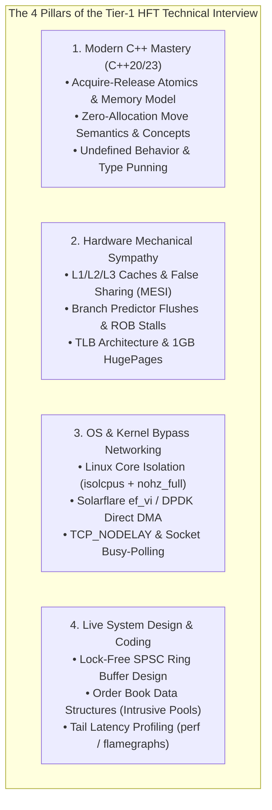

> [!summary]
> The technical interview bar for Tier-1 low-latency trading firms (Citadel Securities, Jane Street, HRT, Jump, Optiver, IMC) goes far beyond standard algorithmic problem-solving. Candidates are evaluated on hardware mechanical sympathy, C++20 memory models, lock-free concurrency, Linux kernel internals, and live sub-microsecond system optimization.

---

## Why it matters
In high-frequency trading, a single naive memory allocation, unaligned struct field, or cache line false sharing hazard in production can cause thousands of dollars in adverse selection losses every second.

Interviewers at top market makers do not evaluate candidates on generic software engineering or high-level abstractions:
- They test your ability to trace an optical network packet **from the physical SFP28 transceiver through SerDes, DMA rings, L1 cache lines, and CPU execution pipelines**.
- They test whether you can write clean, thread-safe, **allocation-free modern C++** that emits optimal machine assembly with zero undefined behavior.



---

## Mechanism

### 1. The 4 Evaluation Pillars

| Evaluation Dimension | Core Technical Focus Areas | Expected Depth & Candidate Bar |
| :--- | :--- | :--- |
| **1. C++ Language Rigor** | C++20 memory model, atomics, templates, Concepts, SFINAE, RAII, type punning. | Must explain *why* `std::memory_order_seq_cst` generates a `MFENCE` on x86 while `acquire/release` are free at the hardware level. |
| **2. Hardware Sympathy** | Cache lines (64 bytes), false sharing, NUMA, TLBs, HugePages, branch prediction. | Must explain the exact MESI state transitions and cache-line bouncing penalty (40–80ns) during cross-core queue handoffs. |
| **3. OS & Networking** | Kernel bypass (`ef_vi`, DPDK), core pinning, `SO_BUSY_POLL`, hardware timestamping. | Must explain how to eliminate kernel interrupts (`nohz_full`) and bypass context switches completely. |
| **4. Low-Latency System Design**| Intrusive Limit Order Books, SPSC queues, zero-copy protocol decoders. | Must code an allocation-free data structure live in C++ with optimal cache alignment and zero UB. |

### 2. Candidate Evaluation Rubric: Green Flags vs Red Flags

```text
+-----------------------------------------------------------------------------------+
|                        HFT INTERVIEW EVALUATION RUBRIC                            |
+-----------------------------------------------------------------------------------+
| GREEN FLAGS (Top 1% Candidate):                                                   |
|  [+] Instantly uses alignas(64) to prevent false sharing on concurrent atomics.   |
|  [+] Uses std::memory_order_acquire / release instead of naive std::mutex locks.  |
|  [+] Pre-allocates fixed-size circular pools; achieves zero heap allocation.     |
|  [+] Reasons in nanoseconds and CPU clock cycles; knows hardware latency numbers. |
|  [+] Understands compiler assembly output (e.g. knowing BSWAP and CMOV opcodes).  |
|                                                                                   |
| RED FLAGS (Immediate Rejection):                                                  |
|  [-] Uses std::endl instead of '\n' (forcing an expensive unbuffered flush).      |
|  [-] Instantiates std::string or dynamic vectors inside the hot execution loop.   |
|  [-] Confuses virtual memory paging with CPU cache hierarchies.                   |
|  [-] Writes reinterpret_cast type punning violating C++ Strict Aliasing rules.    |
|  [-] Suggests using a mutex or sleep() inside a high-frequency polling loop.     |
+-----------------------------------------------------------------------------------+
```

---

## In Practice

### Canonical Technical Interview Question: Code Review a Lock-Free Ring Buffer

**Interview Prompt**:
*"The following C++ SPSC queue was written by a junior engineer for our tick-to-trade path. Identify the concurrency bugs, performance hazards, and undefined behavior, and rewrite it to be production-ready."*

#### Flawed Candidate Code:
```cpp
// FLAWED JUNIOR CODE
template <typename T>
class BrokenQueue {
    T buffer[1024];
    int head = 0;
    int tail = 0;
public:
    void push(T val) {
        buffer[tail % 1024] = val;
        tail++;
    }
    T pop() {
        T val = buffer[head % 1024];
        head++;
        return val;
    }
};
```

#### Expected Senior / Principal Code Solution:
```cpp
#include <atomic>
#include <array>
#include <new>

template <typename T, size_t Capacity = 1024>
class ProductionSpscQueue {
    static_assert((Capacity & (Capacity - 1)) == 0, "Capacity must be a power of 2!");
    static constexpr size_t MASK = Capacity - 1;

private:
    // 1. Aligned to separate 64-byte cache lines to eliminate False Sharing!
    alignas(64) std::array<T, Capacity> buffer_;
    alignas(64) std::atomic<size_t> write_head_{0};
    alignas(64) std::atomic<size_t> read_tail_{0};

public:
    // Zero-allocation, lock-free, single-producer push with release semantics
    inline bool try_push(const T& item) noexcept {
        size_t current_head = write_head_.load(std::memory_order_relaxed);
        size_t current_tail = read_tail_.load(std::memory_order_acquire);

        if (current_head - current_tail >= Capacity) {
            return false; // Queue is Full
        }

        buffer_[current_head & MASK] = item;
        write_head_.store(current_head + 1, std::memory_order_release);
        return true;
    }

    // Zero-allocation, lock-free, single-consumer pop with acquire semantics
    inline bool try_pop(T& item) noexcept {
        size_t current_tail = read_tail_.load(std::memory_order_relaxed);
        size_t current_head = write_head_.load(std::memory_order_acquire);

        if (current_tail == current_head) {
            return false; // Queue is Empty
        }

        item = buffer_[current_tail & MASK];
        read_tail_.store(current_tail + 1, std::memory_order_release);
        return true;
    }
};
```

---

## Numbers

*The Latency Numbers Every HFT Candidate Must Know by Heart.*

| Hardware / Subsystem Operation | Latency (ns) | CPU Clock Cycles (@ 4.0 GHz) |
| :--- | :--- | :--- |
| **CPU Register Read / Bitwise ALU Op** | **0.25 ns** | **1 cycle** |
| **L1d Data Cache Hit** | **~1.0 ns** | **4 cycles** |
| **L2 Cache Hit** | **~3.5 ns** | **14 cycles** |
| **L3 Shared Cache Hit (Same Socket)** | **~12–15 ns** | **48–60 cycles** |
| **Cross-Core L3 Invalidation / RFO Bounce** | **~40–75 ns** | **160–300 cycles** |
| **Main Memory (DRAM) Access** | **~60–80 ns** | **240–320 cycles** |
| **NUMA Remote Socket Memory Fetch** | **~100–140 ns** | **400–560 cycles** |
| **Branch Misprediction Penalty (ROB Flush)**| **~4–5 ns** | **15–20 cycles** |
| **Optical Propagation Delay (Silica Fiber)**| **4.89 ns per meter** | N/A ($c / 1.47$) |
| **Optical Propagation Delay (Air / Microwave)**| **3.33 ns per meter** | N/A ($c / 1.00$) |

---

## Trade-offs

| Interview Style | What It Measures | What It Misses |
| :--- | :--- | :--- |
| **Live Systems Debugging / Profiling** | Real-world problem solving; tool mastery (`perf`, GDB). | Requires dedicated bare-metal interview environment. |
| **Lock-Free Concurrency Coding** | Deep understanding of memory models & race conditions. | Can become overly theoretical if disconnected from hardware. |
| **Architecture System Design** | Holistic reasoning across network, FPGA, and OS layers. | Difficult to evaluate candidate's exact C++ syntax rigor. |

---

> [!warning] Gotchas
> 1. **Over-Optimizing Before Algorithmic Correctness**: Writing assembly intrinsics or complex lock-free queues that contain subtle race conditions will result in immediate rejection. *Always write clean, correct, verifiable C++ first, then optimize memory layout and cache alignment.*
> 2. **Assuming `std::atomic` is Slow**: `std::atomic` operations with `memory_order_relaxed`, `acquire`, and `release` compile down to standard `MOV` load/store instructions on x86 with **zero CPU instruction overhead** compared to non-atomic reads/writes. Only `memory_order_seq_cst` generates a bus-locking `MFENCE` instruction!

---

## Lab
**Objective**: Complete a timed 45-minute live coding challenge: implement a thread-safe, allocation-free C++20 Order Book Depth Cache supporting $O(1)$ price level inserts and sub-5ns Top-of-Book (BBO) reads using hardware bit-scans.

**Success Criteria**:
1. Implement the LOB cache in valid C++20 with zero dynamic allocations.
2. Verify thread-safety and cache line alignment (`alignas(64)`).
3. Demonstrate that BBO reads execute in **under 2.0 nanoseconds**.

---

> [!question]- Self-test
> 1. **Why does `std::memory_order_seq_cst` introduce a significant latency penalty on x86 CPUs compared to `std::memory_order_release`?**
>    *Answer*: x86-64 hardware enforces Total Store Order (TSO), which natively provides acquire-release semantics on all regular load and store instructions (`MOV`) with zero extra CPU cycles. `std::memory_order_seq_cst` requires a globally consistent total ordering across all cores, forcing the compiler to emit an expensive `MFENCE` or `LOCK XADD` instruction that stalls the CPU store buffer for 15 to 30 nanoseconds.
> 2. **What is False Sharing and how is it eliminated in high-performance C++?**
>    *Answer*: False Sharing occurs when two independent variables accessed by different CPU threads reside on the same 64-byte cache line. When Thread 1 modifies its variable, the CPU's MESI cache coherence protocol invalidates the entire 64-byte cache line in Thread 2's L1/L2 cache, forcing Thread 2 to stall and re-fetch the data from L3 (a 40–80ns penalty). It is eliminated by using `alignas(64)` to force variables onto separate, dedicated 64-byte cache lines.
> 3. **Why is `reinterpret_cast` type punning between `char*` and a domain struct technically Undefined Behavior in C++, and how should it be avoided?**
>    *Answer*: In C++, the Strict Aliasing Rule states that reading an object of type `T` through a pointer of unrelated type `U*` is undefined behavior, allowing the compiler optimizer to assume pointers never alias and eliminate essential memory reads. In C++20, type punning should be performed using `std::bit_cast` or `std::memcpy`, which compilers optimize into a direct zero-cost register move without violating language semantics.

---

## Related
- [[14 - Industry Map & Canon/The Quantitative Trading Firm Landscape]]
- [[14 - Industry Map & Canon/Core Engineering Roles in Low-Latency Trading]]
- [[08 - Low-Latency Programming/C++ Memory Model and Memory Orders]]
- [[04 - Hardware Mechanical Sympathy/Latency Numbers Every Trading Engineer Knows]]
- [[14 - Industry Map & Canon/MOC - 14 Industry Map & Canon]]

## Sources
- [[Sources/Intel 64 and IA-32 Architectures Software Developer's Manual]]
- [[Sources/C++ Concurrency in Action by Anthony Williams]]
- [[Sources/How to Build an Exchange by Jane Street]]
