# Staff & Principal Trading System Design Blueprint: The 5-Phase Framework

> [!summary]
> The definitive architectural framework for Staff and Principal Low-Latency System Design Interviews at Tier-1 high-frequency trading firms (Citadel Securities, Jane Street, HRT, Jump, Optiver). This blueprint provides a structured, nanosecond-budgeted methodology to design ultra-low-latency execution engines, exchange matching engines, and hybrid CPU-FPGA pipelines.

---

## The 5-Phase System Design Framework

```mermaid
flowchart TD
    P1["Phase 1: Requirements & Latency Budgeting (5 Mins)\n• Define Wire-to-Wire Target (e.g. <180ns FPGA / <650ns CPU)\n• Establish Throughput: Peak 100K msgs/sec @ 10G/25G line rate\n• Regulatory Pre-Trade Controls (SEC 15c3-5 / MiFID II)"]
    P2["Phase 2: High-Level Architecture & Domain Partitioning (10 Mins)\n• Fast Path (FPGA / Kernel Bypass) vs Slow Path (Async Logger / Risk)\n• Deterministic Sequencer & Replicated State Machine (RSM)\n• Memory Topology: HugePages, NUMA Nodes, Cache Alignment"]
    P3["Phase 3: Deep-Dive Critical Path Engineering (20 Mins)\n• Ingress: SFP28 -> GTY SerDes -> LL-MAC -> Zero-Copy Bit-Slice Parser\n• State: Intrusive Flat-Array Limit Order Book (LOB) Depth Engine\n• Alpha: Branchless Stoikov Micro-Price & OFI Fixed-Point Math\n• Risk: Bump-in-the-Wire Single-Cycle DSP Price Collars & CRC Poisoning\n• Egress: Binary OUCH / SBE Fixed-Offset Serializer -> TX Transceiver"]
    P4["Phase 4: Fault Tolerance, HA & Zero-Loss Recovery (10 Mins)\n• Active-Active Lockstep Replication with Optical Heartbeat Leases\n• Hardware STONITH Fencing to Prevent Split-Brain\n• Exchange Cancel-on-Disconnect (COD) Integration"]
    P5["Phase 5: Observability, CI & Tail Latency Triage (10 Mins)\n• Passive Optical Taps (70/30) & Sub-3ns In-Memory Flight Recorders\n• Bare-Metal Latency CI (<10ns Regression Gates)\n• Triage Methodology: perf, flamegraphs, ethtool drop counters"]

    P1 --> P2 --> P3 --> P4 --> P5
```



---

## Phase 1: Requirements Clarification & Nanosecond Budgeting

When given an ambiguous prompt (e.g. *"Design an ultra-low-latency market maker for NASDAQ equities"*), immediately establish the physical and quantitative constraints:

### 1. The Quantitative Constraints Matrix
1. **Asset Class & Protocol**: US Equities via NASDAQ ITCH 5.0 (market data) and OUCH 4.2 (order entry).
2. **Colocation Physical Location**: Equinix NY4 (Secaucus) or Carteret (NJ) direct cross-connect.
3. **Latency Target**:
   - Software-only critical path: **$<65\text{ ns}$**.
   - Total wire-to-wire (optical in to optical out): **$<650\text{ ns}$ (CPU) / $<180\text{ ns}$ (FPGA)**.
4. **Throughput & Microbursts**:
   - Steady state: 50,000 msgs/sec.
   - Peak market open microburst: **>500,000 msgs/sec concentrated in a 5-millisecond window**.
5. **Regulatory Compliance**: Zero-bypass SEC Rule 15c3-5 pre-trade capital and price collar verification.

---

## Phase 2: High-Level Architecture & Domain Partitioning

Partition the architecture into **three strictly isolated execution domains**:

```text
+-----------------------------------------------------------------------------------+
|                        THREE-TIER SYSTEM DOMAIN PARTITIONING                      |
+-----------------------------------------------------------------------------------+
| 1. CRITICAL HOT PATH (Isolated CPU Core 2 / FPGA Fabric):                         |
|    - Single-threaded, non-blocking, zero-allocation event loop.                   |
|    - Direct DMA kernel bypass (Solarflare ef_vi / DPDK PMD).                      |
|    - Zero OS context switches (isolcpus, nohz_full, rcu_nocbs).                   |
|    - Direct L1d-resident intrusive Limit Order Book & branchless alpha.           |
|                                                                                   |
| 2. ASYNCHRONOUS LOCAL PATH (Worker Core 3 on Same NUMA Node):                      |
|    - Consumes execution events via Lock-Free SPSC Ring Buffer (alignas(64)).      |
|    - Real-time PnL drawdown monitoring & supervisory circuit breakers.            |
|    - Drop copy parsing and trade database updates.                                |
|                                                                                   |
| 3. OFFLINE BATCH & LOGGING PATH (General Cores 0-1):                              |
|    - Drains background logging ring buffer to NVMe SSD (Async I/O / io_uring).    |
|    - Historical tick PCAP compression and quantitative model recalibration.       |
+-----------------------------------------------------------------------------------+
```

---

## Phase 3: Deep-Dive Critical Path Engineering

Walk the interviewer through the exact journey of a packet through hardware and software:

### 1. Ingress & Zero-Copy Bit-Slice Parsing
- **Hardware Layer**: Optical light hits SFP28 photodiode ($2\text{ ns}$) $\to$ GTY SerDes PMA/PCS deserialization ($22\text{ ns}$) $\to$ Cut-through Low-Latency MAC ($8\text{ ns}$).
- **Software Layer**: Solarflare `ef_vi` writes packet into a 2MB HugePage DMA buffer. The CPU core spin-polls the RX ring descriptor (`ef_eventq_poll`).
- **Bit-Slice Parsing**: Avoid `std::string` or dynamic allocation; cast pointer directly to packed struct with hardware single-cycle byte swaps (`__builtin_bswap64` / `__builtin_bswap32`):
```cpp
const auto* msg = reinterpret_cast<const ItchAddOrderMsg*>(dma_pkt_ptr);
uint64_t order_id = __builtin_bswap64(msg->order_ref_id);
uint32_t price = __builtin_bswap32(msg->price);
```

### 2. Intrusive Limit Order Book Depth Engine
- **Data Structure**: Flat array of price levels combined with a pre-allocated intrusive doubly-linked list for FIFO queue tracking.
- **Top-of-Book (BBO) Bit-Scan**: Maintain a 64-bit bitmap of populated price levels. Finding the best bid requires **1 CPU cycle via `_tzcnt_u64()`**:
```cpp
inline uint32_t get_best_bid_index(uint64_t bid_bitmap) noexcept {
    return _tzcnt_u64(bid_bitmap); // Sub-1ns BBO discovery!
}
```

### 3. Branchless Alpha Generation
- Compute Stoikov Volume-Weighted Micro-Price and Order Flow Imbalance (OFI) using fixed-point arithmetic (`int64_t` shifted by 16 bits), completely avoiding 64-bit floating-point divisions (`vdivsd` stalls).

### 4. Non-Bypassable Pre-Trade Risk Gate
- Verify price collars ($|P_{\text{order}} - P_{\text{NBBO}}| \le \text{Collar}$) and max order size.
- If illegal: abort immediately.
- In FPGA silicon: assert `m_axis_tuser_err` to **poison the Ethernet CRC32 checksum**, causing the exchange switch to physically drop the malformed frame.

### 5. Outbound Order Egress Serialization
- Pre-format the static fields of the 48-byte NASDAQ OUCH `Enter Order` frame in L1 cache during warmup.
- On trigger, write only the dynamic fields (Token, Price, Qty) and push to the TX DMA descriptor ring in **<15 nanoseconds**.

---

## Phase 4: Fault Tolerance, High Availability & Disaster Recovery

Explain how the system achieves **zero-data-loss resiliency without adding consensus delays**:

1. **Active-Active Replicated State Machine (RSM)**:
   - Primary (Rack A) and Standby (Rack B) both ingest the exact same market data stream in parallel.
   - Standby maintains an identical mirror of the order book in memory, but **masks its outbound SFP28 network transmitter**.
2. **Hardware Heartbeat Lease & Fencing (STONITH)**:
   - Primary transmits a continuous hardware heartbeat lease every 10 microseconds over a direct optical cross-connect.
   - If the Primary fails, the Standby issues an out-of-band power-cut command via Switched PDU (STONITH) to **physically power off the Primary** before unmasking its transmitter, permanently eliminating Split-Brain double trading.
3. **Exchange Cancel-on-Disconnect (COD)**:
   - All gateway sessions enforce a 2-second heartbeat timeout on exchange matching engines. If the physical link drops, the exchange matching engine automatically purges all resting open quotes.

---

## Phase 5: Observability, Continuous Integration & Tail Latency Triage

Demonstrate operational excellence and performance hygiene:

1. **Zero-Perturbation Observability**:
   - Install **70/30 passive optical splitters** on incoming and outgoing fiber cables, copying 100% of packets to an out-of-band capture appliance (Endace / Napatech) with **0.00 ns of trading host CPU overhead**.
   - Hot path writes 16-byte binary trace events into an in-memory circular ring buffer in **<3 nanoseconds**.
2. **Bare-Metal Continuous Integration Performance Gates**:
   - Every pull request runs on an isolated bare-metal testbed (`isolcpus`, fixed 4.0 GHz clock, ASLR disabled, 500K warmup runs).
   - Automated statistical gates (Mann-Whitney U and HdrHistogram tail tracking) block any merge introducing a **$>10\text{ ns}$ latency regression**.
3. **Forensic Triage Protocol**:
   - Profile using `perf stat` (PMU counters: cache misses, branch misses, context switches), `perf record` flamegraphs, and `ethtool -S` NIC hardware drop counters (`rx_nodesc_drops`).

---

## Interview Evaluation Rubric: What Separates Senior from Principal

| Dimension | Senior Engineer Answer | Principal / Staff Engineer Answer |
| :--- | :--- | :--- |
| **Latency Budgeting** | Mentions "a few microseconds". | **Provides exact cycle-by-cycle nanosecond budget (optical, SerDes, L1d, BSWAP, DMA).** |
| **Data Structures** | Uses `std::map` or `std::unordered_map`. | **Uses intrusive flat price-level arrays with `_tzcnt_u64` bit-scans and zero heap allocation.** |
| **Concurrency** | Suggests `std::mutex` or condition variables. | **Uses allocation-free lock-free SPSC queues with acquire-release atomics and `alignas(64)`.** |
| **High Availability** | Proposes 3-node Raft consensus. | **Explains why Raft is too slow; implements Replicated State Machines (RSM) with hardware STONITH.** |
| **Risk & Compliance** | Checks risk asynchronously in software. | **Inlines SEC 15c3-5 risk checks; describes hardware CRC32 frame poisoning on SmartNICs.** |

---

## Related Notes
- [[14 - Industry Map & Canon/The Low-Latency C++ Technical Interview Bar]]
- [[11 - Participant-Side Systems/Tick-to-Trade Critical Path Optimization]]
- [[12 - FPGAs & Hardware Acceleration/FPGA vs CPU in Low-Latency Trading]]
- [[13 - Reliability, Ops & Testing/Disaster Recovery and High Availability Topologies]]
- [[14 - Industry Map & Canon/MOC - 14 Industry Map & Canon]]
