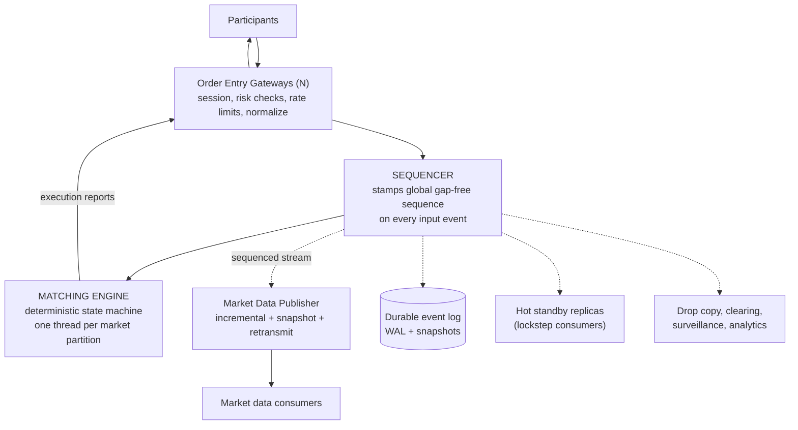
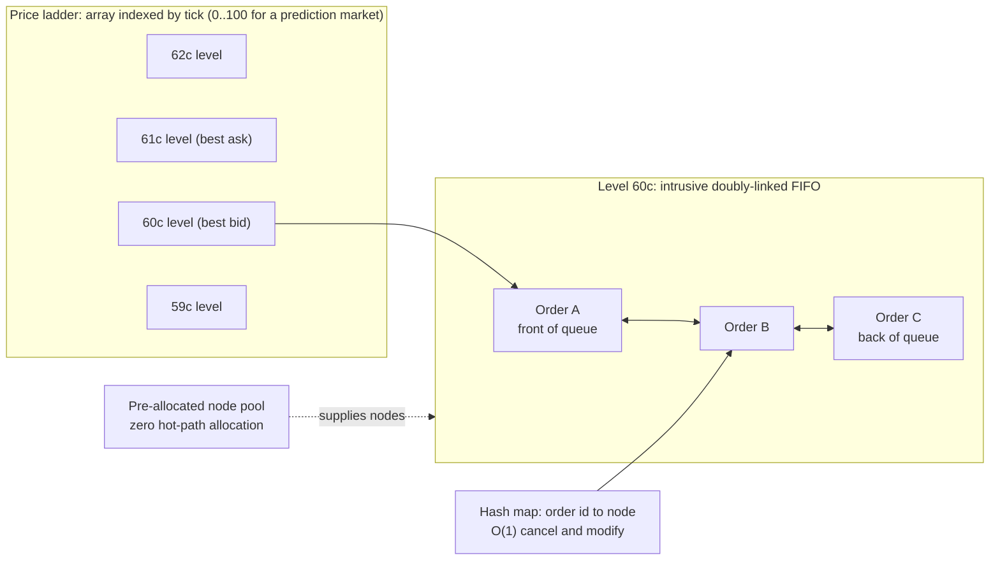
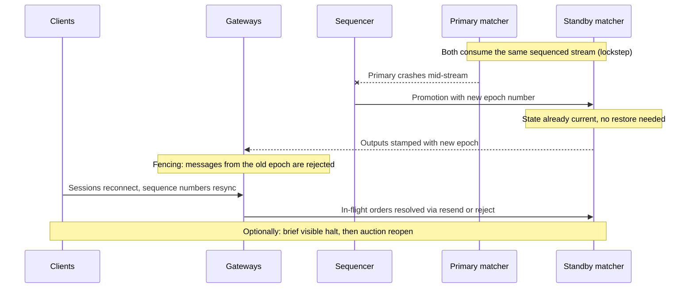
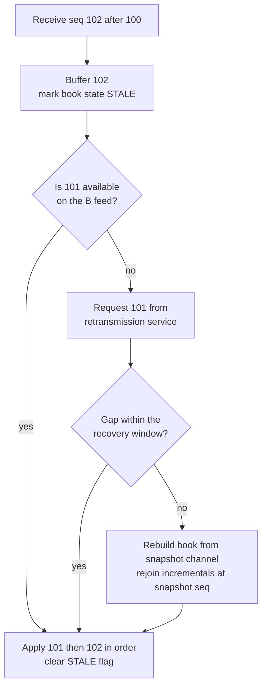
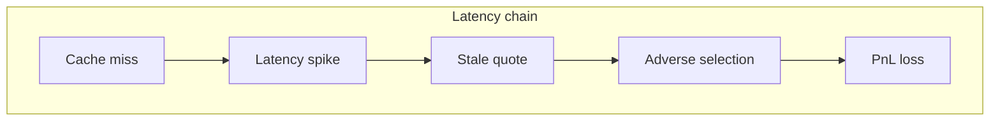
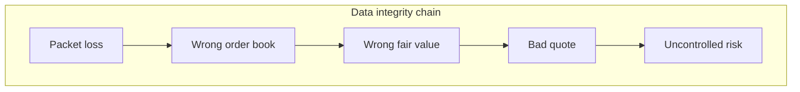
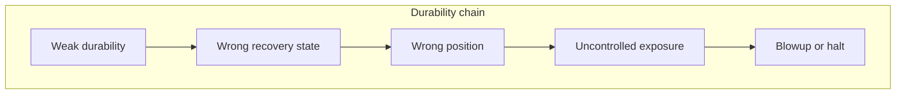

# Prediction Co Interview Prep: Principal Low-Latency Exchange Systems Engineer

**Interview:** Wednesday 8/19, 5:00 PM ET.
**Panel:** Steven Bolton (CEO), Craig (CTO), George Ma (Head of Engineering).
**Format signal:** background walkthrough plus deep technical discussion, not a coding round.

**Stated coverage:** systems engineering and network programming, CPU memory models and atomics, broader systems architecture, durability design, market knowledge and market making.

---

## Progress tracker

Check items off as you complete them; the ordering matches the day-before plan (section 17).

**Core reading (tonight)**

- [ ] Sections 1-2: the exchange-side reframe and role analysis
- [ ] Section 4: exchange architecture, read twice
- [ ] Section 4B: bad exchange behaviors (stale feeds, gap storms, slow cancels, ambiguous recovery)
- [ ] Section 5: matching engine deep dive
- [ ] Section 6: determinism, replay, recovery, durability
- [ ] Redraw the section 4 diagram from memory, closed book
- [ ] Retell the failover story (section 6) from memory
- [ ] Section 7: memory model and concurrency refresher
- [ ] `question-bank-answers.md` parts A-D read through
- [ ] `question-bank-answers.md` parts E-G (depth insurance, if energy allows)

**Thesis defense (tonight)**

- [ ] `thesis-deep-dive.md` sections 1-5 (pitch, packet walk, chapters, equations, numbers)
- [ ] `thesis-deep-dive.md` sections 6-8 (consistency ledger, cross-exam bank, reframes)
- [ ] Verification checklist in `thesis-deep-dive.md` section 10 (repo check, ISA check, ledger resolutions)
- [ ] `thesis-deep-dive.md` section 11: thirteen concept explainers (multicast, zero-copy, barrel shifter, PCIe/DMA, Kintex, systolic array, BRAM, DSP, hugepage rings, PPO)
- [ ] Say the 60-second thesis pitch out loud, twice
- [ ] Do the packet walk out loud, once

**Rehearsal (tomorrow, before 5 PM)**

- [ ] 60-second intro (section 3) out loud, three times
- [ ] The 10-minute architecture story checklist (section 17, all nine prompts)
- [ ] Question bank rapid-fire (section 15), weak spots flagged
- [ ] Flagged answers checked against `question-bank-answers.md`
- [ ] Sections 11-12 (domain + market making) skim, 30 minutes before the call
- [ ] Resume defense: credit-RFQ-vs-CLOB reframe, Principal evidence, "why four programs", 20 seconds each
- [ ] Part I behavioral sketches personalized; part J numbers table reviewed
- [ ] Questions to ask them (section 16): three or four chosen and memorized
- [ ] Logistics answers ready (availability, location, authorization)

---

## Table of contents

1. [The critical reframe: you are building the exchange, not trading on it](#1-the-critical-reframe)
2. [Role analysis and how to weight your prep](#2-role-analysis)
3. [Your positioning and "tell me about yourself"](#3-your-positioning)
3B. [Thesis defense brief](#3b-thesis-defense)
4. [Exchange architecture: the master picture](#4-exchange-architecture)
4B. [Bad exchange behaviors: how they happen, prevention, and cure](#4b-bad-exchange-behaviors)
5. [Matching engine deep dive](#5-matching-engine-deep-dive)
6. [Determinism, replay, recovery, and durability](#6-determinism-replay-recovery-durability)
7. [CPU memory model, atomics, and lock-free concurrency](#7-cpu-memory-model)
8. [Networking and kernel bypass](#8-networking-and-kernel-bypass)
9. [Linux systems tuning for low latency](#9-linux-systems-tuning)
10. [Exchange protocols and market connectivity](#10-protocols-and-connectivity)
11. [Prediction markets: domain knowledge](#11-prediction-markets-domain)
12. [Market making, adapted to prediction markets](#12-market-making)
13. [Latency measurement and debugging](#13-latency-measurement)
14. [Principal-level and behavioral](#14-principal-level)
15. [Question bank: rapid-fire self-test](#15-question-bank)
16. [Questions to ask them](#16-questions-to-ask)
17. [Day-before plan](#17-day-before-plan)

---

<a name="1-the-critical-reframe"></a>
## 1. The critical reframe: you are building the exchange, not trading on it

Read the JD again: "low-latency order processing, market data distribution, matching technology, replay/recovery systems."
This is an **exchange-side** role, not a trading-firm participant role.
That changes what "good" looks like in almost every answer.

| Dimension | Trading firm (participant) | Exchange (this role) |
|---|---|---|
| Latency goal | Be faster than competitors | Low **and predictable** latency for everyone; fairness matters |
| Correctness | Your own P&L at risk | Every participant's money at risk; regulator watching |
| Losing a message | Bad trade, your loss | Broken market; possibly a lawsuit or regulatory event |
| Determinism | Nice to have for research replay | **Foundational**: replay, recovery, failover, and audit all depend on it |
| Durability | Position/risk state | Every order, trade, and book state; the exchange is the source of truth |
| Throughput profile | Bursty, you control your flow | You absorb everyone's bursts, especially at event resolution |

The one-sentence mindset to carry into the room:

> "An exchange is a deterministic state machine that must never lose a message, never produce two different answers to the same input, and must do all of that in microseconds under bursty load."

Every technical answer you give should connect back to **correctness, determinism, fairness, and recoverability**, with latency as the constraint you achieve them under.
A participant-side engineer says "faster is better."
An exchange-side engineer says "fast, but never at the cost of a wrong fill or an unrecoverable state."

The market-making knowledge still matters for two reasons.
First, the CEO wants to know you understand who your users are and what they need from the platform (queue fairness, deterministic cancel latency, reliable data).
Second, prediction market exchanges live or die by liquidity, and liquidity comes from market makers; understanding their economics means you understand the product requirements.

---

<a name="2-role-analysis"></a>
## 2. Role analysis and how to weight your prep

From the recruiter email, the focus areas map to prep weight roughly as follows.

| Area | Weight | Why |
|---|---|---|
| Exchange architecture (matching, gateways, market data, replay) | Highest | It is literally what they are building |
| CPU memory model, atomics, concurrency | Highest | Explicitly called out; classic deep-probe territory |
| Networking and kernel bypass (DPDK, AF_XDP) | Highest | Explicitly called out; your strongest card |
| Durability and recovery design | High | Explicitly called out; where exchange-side thinking shows |
| Linux systems programming and tuning | High | Explicitly called out |
| Market knowledge / market making | High | Explicitly called out; CEO conversation territory |
| Principal-level judgment (tradeoffs, mentoring, greenfield) | Medium-high | It is a Principal role at a startup |
| Prediction market domain | Medium | Shows product sense and genuine interest |

They are hiring a **Principal** engineer for a **greenfield** platform backed by a mature parent (BetCloud).
So they are not just testing whether you know facts.
They are testing whether they can hand you an ambiguous, performance-critical subsystem and trust your architectural judgment.
Expect "how would you design X" and "why" chains more than trivia.

A note on the company: "Prediction Co" has essentially no public footprint, and note that the historical "Prediction Company" (the 1990s quant firm founded by Farmer and Packard) is almost certainly unrelated.
Do not assume any company facts beyond the recruiter email: regulated prediction market exchange, $15M+ raised, spun out of BetCloud, greenfield build with access to mature betting-exchange infrastructure and expertise.

---

<a name="3-your-positioning"></a>
## 3. Your positioning and "tell me about yourself"

### The angle

Your combination is rare and almost perfectly shaped for this: quant finance background, C++ low-latency trading systems, market making, kernel bypass and FPGA exposure, market microstructure.
But position it exchange-side:

> Not "a quant who knows C++," and not even "a low-latency trading engineer," but "an engineer who has lived on the participant side of exchanges, knows exactly what participants need from an exchange, and wants to build the exchange itself."

The participant-to-exchange move is a genuinely strong story: you have felt the pain of bad exchange behavior (stale feeds, gap storms, slow cancels, ambiguous recovery states) from the consuming side, so you know what to build and what to never do.
Section 4B works each of these four failure modes in detail: mechanism, prevention, and cure; being able to go deep on any one of them is exactly the evidence that makes this story land.

### The story arc (memorize the arc, not the words)

1. Deliberate dual foundation: MS Financial Engineering at Stevens (market microstructure, algorithmic trading) run in parallel with MS Computer Science at Georgia Tech specialized in computing systems (advanced OS, networks, distributed computing); the combination was intentional, not accidental.
2. Trading systems in production: C++ quantitative developer at BNP Paribas on the automated market-making stack for Prime Credit (~$500M daily market-making volume): market data ingestion, tick analytics, pricing/execution paths, profiling the hot path feeding FPGA-accelerated handlers and quoting engines.
3. Full-path systems depth, built solo: MS thesis engineered a sub-10 microsecond trading system end to end: custom limit order book, DPDK kernel bypass, FPGA market data handlers, hardware timestamping, lock-free data structures.
4. Exchange-adjacent roots: at Bank of America FICC, built trade storage, processing, and matching pipelines on QUARTZ; post-trade matching and persistence is durability engineering.
5. The turn: having built and operated the participant side, the most interesting problems now are on the exchange side, where determinism, fairness, and recoverability are the product.
6. Why here: greenfield regulated exchange, prediction markets as a genuinely new asset class, small senior team where architecture decisions are yours to make and live with.

A polished 60-second version:

> "My background is a deliberate combination of quantitative finance and computing systems. I did a financial engineering master's at Stevens focused on market microstructure and algorithmic trading, and in parallel a computer science master's at Georgia Tech specialized in computing systems: operating systems, networks, distributed computing. Most recently I was at BNP Paribas as a C++ quantitative developer on the automated market-making stack for prime credit, which does around five hundred million dollars of daily market-making volume; I worked on real-time market data ingestion, tick analytics, and the pricing and execution path, including profiling the software hot path that feeds FPGA-accelerated market data handlers and quoting engines. My thesis pushed that further: I built a complete sub-10-microsecond trading system myself, with a custom limit order book, DPDK kernel bypass, FPGA feed handlers, hardware timestamping, and lock-free structures, so I have touched every layer from the NIC to the strategy. Earlier, at Bank of America in FICC, I built trade processing and matching pipelines, which is where I first cared about durability and recovery. What excites me about this role is switching sides of the wire: I know what a participant needs an exchange to be, deterministic, fair, recoverable, and fast, and building that from a clean sheet for a new asset class is exactly the problem I want."

### Resume defense map: line by line

Every noun and every bolded number on your resume is a drill target.
For each, know the metric definition, the baseline, and how it was measured; if a number was estimated or inherited, say so before they catch it.
Never inflate; with this panel, one wobbly number damages every other claim.

**BNP Paribas, Automated Market Making (Feb-May 2026, co-op)**

- Own the co-op framing before they do: "a four-month co-op with production scope; here is exactly what I owned versus what I integrated with."
  Specificity is the antidote to the short tenure.
- Expect: what did you build versus what existed; what did profiling actually reveal and what did you change; what were the latencies before and after; what crossed the CPU/FPGA boundary and in what format; how was the hot path measured.
- **Credit market structure trap, prepare this cold:** corporate credit trades OTC and largely via RFQ (MarketAxess, Tradeweb), not a central limit order book.
  If they ask "how does credit market making translate to a CLOB exchange," the answer is: the systems problems (feed handling, tick-to-quote latency, hot-path determinism, risk checks) are identical, while your CLOB depth comes from the thesis order book and market microstructure coursework; volunteering the RFQ-vs-CLOB distinction yourself turns the trap into a credibility point.

**MS Thesis: AI-Integrated FPGA for Market Making (sub-10 us system)**

- Highest-risk, highest-reward line on the page; this is your proof of low-latency depth, so expect the deepest drilling here, and it is on GitHub, so anything you claim must match the repo.
- A full defense brief built from the actual thesis text is in section 3B below: exact numbers, the honesty ledger of what was measured versus simulated, the landmines, and how to turn the thesis into exchange-side evidence.

**Bank of America, FICC (2020-2021)**

- Frame QUARTZ work as exchange-adjacent: trade storage, processing, and matching is post-trade infrastructure, i.e., the durability and recovery half of this job's skillset.
- "Reduced trade processing latency by 50%": know from-what to-what, and what the C++/SANDRA integration actually changed.
- The 1M+ LOC Python migration is a good systems-discipline story: how you tested it, staged it, and did not break production.

**Versor Investments (2022)**

- Merger arb signals market knowledge beyond execution; "29% execution efficiency" and "15% alpha capture" both need one-line metric definitions.

**LogiNext (2023-2024): your Principal evidence**

- Led a 12-engineer team and architected the platform: this is the leadership half of the Principal case; prepare one concrete story of a technical decision you made for the team, the tradeoff, and the outcome.
- The NP-hard optimization work (CP-SAT, routing) also signals algorithmic depth outside finance.

**Anticipated hard questions about the profile itself**

1. "This is a Principal role; where have you operated at that level?"
   Answer with the two halves: architectural ownership (thesis system end to end, LogiNext platform architecture, BofA migration) and people leverage (12-engineer team, 2500+ trained at BofA); then be honest that the title is a step up and that what they are buying is judgment plus trajectory, demonstrated by having built the whole path yourself.
2. "Your low-latency experience is recent: a co-op and a thesis. Why trust you with the matching core?"
   Do not get defensive; agree with the premise and reframe: depth was compressed, not skipped; you built and measured the entire wire-to-strategy path yourself rather than maintaining one slice of someone else's for years, and the fundamentals (memory model, kernel, networking) come from the computing-systems degree, not folklore.
3. "Why four master's programs?"
   Have a 20-second non-defensive answer: deliberate dual-track (quant finance + computing systems), with the CMU program withdrawn for your father's illness; state it plainly and move on.
4. Logistics: Stevens completed May 2026, Georgia Tech is online through Dec 2026 and does not constrain full-time work; have your availability and work-authorization answers ready and unhesitating.

**Assets to weave in deliberately**

- Poker and chess (from your interests): probabilistic thinking under uncertainty is literally the product of a prediction market; if rapport allows, one sentence connecting poker odds to event-contract pricing lands well with a prediction-market CEO.
- President of the Stevens Graduate Financial Association and the Vanguard ETF challenge win: initiative and markets enthusiasm, useful for the CEO segment.

---

<a name="3b-thesis-defense"></a>
## 3B. Thesis defense brief (built from the actual thesis)

This section is compiled from your thesis text itself, so the numbers and claims below are exactly what an interviewer who skims the PDF or repo will see.
Two goals: answer any drill with precision, and never let them discover a gap between the headline and the fine print before you frame it yourself.

For the full chapter-by-chapter dossier, the end-to-end packet walk, the equations, the internal-consistency ledger, and the cross-examination bank with model answers, see `thesis-deep-dive.md` in this directory.

### What the system actually is (the 60-second technical summary)

> "The thesis is a hybrid architecture with two domains. The ultra-low-latency data path is pure RTL: an FSM-based Ethernet/IP/UDP parser, a NASDAQ ITCH 5.0 decoder using a barrel shifter for unaligned messages, a BRAM-backed order book maintaining BBO and imbalance, a fully unrolled fixed-point systolic array running a 3-layer RL policy, a hardware pre-trade risk gate, and an OUCH 5.0 order encoder, all pipelined at 322 MHz on a Kintex UltraScale+ target. The software control plane is a thread-per-core C++ engine: SPSC lock-free queues with acquire/release ordering and cache-line padding, hugepage-backed ring buffers with zero-copy semantics, a flat-array L2 book, branchless ITCH parsing, and an async logger off the critical path, with isolcpus and nohz_full for core isolation. The RL policy is PPO with a 12-dimensional state including book imbalance, VPIN flow toxicity, and inventory, and the reward penalizes inventory variance and adverse selection."

### The numbers, exactly as the thesis states them

Memorize these; do not improvise different ones in the room.

| Claim | Value | Source of the number |
|---|---|---|
| FPGA tick-to-trade | < 200 ns (about 90 ns logic + about 100 ns PHY) | Cycle counts per module (parser 4, decoder 6, book 2, RL 12, encoder 5) at 322.26 MHz; analytical, verified in RTL simulation |
| RL inference | about 15 ns target (12 cycles) | Fully unrolled pipelined systolic array, 16-bit fixed point, 32 DSP slices per hidden layer |
| Software path T2T | p50 822 ns, p99 1180 ns | Measured in the simulation environment under Hawkes-process load |
| Throughput | linear to 7.5M msg/s, saturation about 8M (PCIe/DMA backpressure), sustained 1.21M under bursts | Simulation benchmark, 100M events |
| Saturation behavior | latency spikes from about 860 ns to about 400 us at the PCIe/DMA bound | The thesis's own stated breaking point |
| Jitter | std dev < 500 ns under 100k logs/sec telemetry load | Stability benchmark |
| Strategy results | Sharpe 1.85, Sortino 2.10, max drawdown 4.2%, 50 seeds, 252 simulated days | Synthetic Hawkes/jump-diffusion scenarios |

Reconcile the resume headline once, cleanly: "the resume says sub-10 microseconds as a conservative umbrella; measured, the software path is about 0.8 to 1.2 microseconds tick-to-trade in the evaluation environment, and the FPGA path is sub-200 nanoseconds by cycle-accurate analysis."

### The honesty ledger: real versus simulated (own this proactively)

The thesis openly discloses these in its methodology note; the fatal mistake would be letting an interviewer extract them from you as if hidden.
Volunteer the caveat the moment a number comes up, in one breath, then pivot to what the work actually demonstrates.

1. **Data is synthetic:** Hawkes-process and jump-diffusion scenarios calibrated to historical tick data, not live exchange feeds.
   Framing: "deliberate choice to cover regimes a fixed historical sample cannot, including flash-crash dynamics; the disclosed tradeoff is no validation against real feed idiosyncrasies."
2. **Kernel bypass is emulated:** the software plane simulates DPDK/Onload-style semantics with a hugepage-backed DMA-style ring buffer; it is not real DPDK against a physical NIC.
   Framing: "I implemented the semantics that matter architecturally, zero-copy hugepage rings, polling, and busy-wait consumption, rather than binding a PMD to hardware; I know the real DPDK API surface and the delta is the driver binding and mempool plumbing, not the design."
   Do not claim production DPDK API experience beyond what is true; if asked "which DPDK APIs did you call," the honest answer is the emulation plus your BNP-adjacent exposure, stated plainly.
3. **FPGA numbers are from RTL simulation and synthesis, not a deployed board:** timing closure at 322.26 MHz with positive slack is a synthesis result; the sub-200 ns figure is cycle counts plus nominal PHY latency; verification was UVM constrained-random plus golden-model bit-accurate comparison against the C++ reference, with SVA formal properties proving the risk gate cannot be bypassed.
   Framing: "cycle-accurate, not wire-measured; the next step would be a board with hardware timestamps at the PHY, and I can describe exactly how I would measure it."
4. **Benchmarks ran on Apple M3** as a stated proxy for x86 servers, while parts of the text reference AVX2 intrinsics and Intel MKL.
   Before the interview, check the repo for what actually compiled and ran on which ISA, and be ready to say it precisely (e.g., which paths were x86-targeted design versus what executed on ARM); this is the kind of inconsistency a CTO reading closely will catch, and "here is exactly what ran where" defuses it completely.

The meta-line that converts the whole ledger into a strength:

> "I was careful in the thesis to label what was measured, what was simulated, and what was analytical, because in trading infrastructure the difference between a measured number and a modeled number is the difference between engineering and marketing."

That sentence is worth more with this panel than the latencies themselves.

### Landmines in the thesis text (prepare these before they find them)

- **"Quote-Stuffing Logic" appears as an example strategy block** in one architecture figure.
  Quote stuffing is market manipulation, and you are interviewing with exchange operators whose job includes preventing it.
  If raised: acknowledge the figure's wording was a poor choice for an enumerated example block, and point out that the system itself implements the opposite: a hardware token-bucket message rate limiter explicitly described as preventing quote stuffing, plus a Bloom-filter duplicate-order suppressor for runaway algorithms.
  Better: preempt it by citing the rate limiter as an exchange-relevant feature you built.
- **"Front-run software competitors" phrasing** in the architecture chapter: the intended meaning is "react faster than," not trading ahead of client orders; if it comes up, correct the terminology yourself without being defensive.
- **The AI-on-the-hot-path question:** "does an RL model really belong at 15 ns?"
  Your answer is layered: inference is deliberately tiny (3 layers, fixed point, pruned), it is gated by a deterministic hardware risk envelope that formal verification proves cannot be bypassed, weights are trained offline and hot-swapped via AXI-Lite MMIO without stopping the pipeline, and the honest research question was whether adaptivity pays for its complexity versus a static rule, which the comparative chapter tests explicitly.

### Turning the thesis into exchange-side evidence (the offensive move)

The thesis is closer to Prediction Co's problem than your resume line suggests; make these mappings explicitly in the room:

- You decoded **ITCH** and encoded **OUCH**: those are the canonical exchange market data and order entry protocols, i.e., the exact interfaces Prediction Co must publish and accept (section 10).
- Your architecture has a **replicated in-memory order book (Replica A/B) with failover** and a **lock-free pub-sub event stream feeding all consumers**: that is the sequenced-stream exchange pattern of section 4 in miniature, and you can say so.
- The **hardware pre-trade risk gate** (notional limits, token-bucket rate limiting, fat-finger bands, duplicate suppression, kill switch, framed around SEC 15c3-5) is precisely the gateway risk-check layer an exchange runs; the formal-verification angle (SVA proof that no order can bypass the gate) is a story a regulated venue will love.
- **WCET equals average-case** in a fully pipelined design is the strongest determinism statement you can make; contrast it with software jitter and connect it to fair, predictable venue latency.
- **Golden-model bit-accurate verification** (RTL versus C++ reference, cycle by cycle) is the same discipline as deterministic replay testing for a matching engine (section 6); name the parallel.
- **You know your system's breaking point** (PCIe/DMA saturation near 8M msg/s with a 400 us latency spike, cold-start cache warm-up effects): volunteering a system's failure modes unprompted is a Principal-level tell, and it maps directly to the burst-at-event-resolution discussion in section 4.

---

<a name="4-exchange-architecture"></a>
## 4. Exchange architecture: the master picture

This is the 10-minute whiteboard story to have absolutely fluent.
If they ask one big question, it will be a variant of "design our exchange."

Rendered view of the architecture (solid arrows are the latency-critical path; dashed arrows are asynchronous consumers of the sequenced stream):



The ASCII version below is the one to practice reproducing on a whiteboard:

```text
                         Participants
                              |
              +---------------+---------------+
              |                               |
        Order Entry                     Market Data
        Gateways  (N)                   Consumers
              |                               ^
              v                               |
      [validate session,              Market Data Publisher
       risk checks, rate              (incremental + snapshot
       limits, normalize]              + retransmit/gap-fill)
              |                               ^
              v                               |
        SEQUENCER  ----------------->  sequenced event stream
        (single choke point:                  |
         assigns global order          +------+------+
         to every input event)         |             |
              |                        v             v
              v                   Drop Copy /   Surveillance,
        MATCHING ENGINE           Clearing /    Risk, Analytics
        (deterministic state      Settlement    (async consumers)
         machine per market)           |
              |                        v
              v                  Durable event log
        Execution reports        (WAL + snapshots)
        back through gateways          |
                                       v
                                 Replay / Recovery /
                                 Hot standby replicas
```

### The core architectural ideas to articulate

**1. The sequencer pattern.**
All inputs (new order, cancel, modify, admin actions, timer events) flow through a single sequencing point that stamps a global, gap-free sequence number.
Once sequenced, the event stream **is** the truth.
Everything downstream (matching, market data, clearing, surveillance, replicas) is a deterministic consumer of that stream.
This is how real exchanges and exchange-like systems (LMAX, modern crypto venues, Aeron-based designs) get determinism, recoverability, and horizontal fan-out at the same time.

**2. Single-threaded deterministic matching core.**
The matching engine for a given market/partition is a single-threaded state machine: no locks, no wall-clock reads, no randomness, no iteration-order hazards.
Input: sequenced events.
Output: deterministic events (acks, fills, book updates).
Concurrency comes from **partitioning by market**, not from threading inside a book.
Say this explicitly: "one book, one thread; scale across markets, not within a book."
It is faster (no synchronization on the hot path), and it makes replay and failover trivial.

**3. Durability via the log, not via a database.**
Persist the sequenced input stream (write-ahead) and periodic state snapshots.
Recovery = load latest snapshot + replay the log tail.
Failover = a hot standby that consumes the same sequenced stream and is therefore always a deterministic replica; promote it by switching the sequencer output.
No synchronous database on the matching path, ever.

**4. Fairness as a design requirement.**
Gateways must not create accidental advantage: consistent normalization cost, per-session rate limits, no fast path for favored participants.
For a regulated venue, "deterministic and auditable" is a compliance requirement, not just an engineering preference.
Timestamping at the network edge (hardware timestamps) supports both fairness analysis and latency measurement.

**5. Market data as a first-class product.**
Incremental feed (every book change, sequence-numbered) + periodic snapshot channel (late joiners, gap recovery) + retransmission service.
Publish from the sequenced stream so market data can never contradict the matching engine.
Design question they may probe: do you publish the ack to the aggressor before or after the public market data update, and why (information leakage vs latency)?
Know that real venues think hard about this ordering.

### Where latency lives in this design

Order-to-ack critical path: NIC -> gateway (parse, validate, risk) -> sequencer -> matcher -> execution report -> NIC.
A well-built software exchange path is single-digit to low-tens of microseconds wire-to-wire.
Everything else (persistence, market data fan-out, clearing, surveillance) hangs off the sequenced stream **asynchronously** and must never block the path.

### Bursts

Exchange load is violently bursty: an event resolves, news lands, everyone reprices at once.
Talk about: bounded queues with explicit overflow policy, backpressure at gateways (reject/throttle per session, never silently drop), pre-allocated memory so bursts do not trigger allocation, and measuring p99.9 under replayed burst load rather than average throughput.

---

<a name="4b-bad-exchange-behaviors"></a>
## 4B. Bad exchange behaviors: how they happen, prevention, and cure

These are the four failure modes from your positioning story (section 3), worked in depth.
Each one follows the same shape: what the participant experiences, the mechanism that produces it, why it happens anyway, how an exchange prevents it by design, and what the cure is when it happens in production.
The interview move: any time one of these comes up, connect it back to a section 4 architecture choice; each of these failure modes is the direct consequence of skipping one of those choices.

### Stale feeds

**What the participant experiences.**
The market data feed shows a book that no longer matches the matching engine.
You quote against prices that do not exist, you get filled at levels you never saw, and adverse selection eats you until you detect the staleness and pull quotes.
The worst version is silent staleness: the feed keeps ticking plausibly, so nothing obviously looks wrong.

**Mechanism: how it happens.**
- The market data publisher is decoupled from matching (correctly, to keep it off the hot path) but falls behind: a slow consumer, an unbounded queue absorbing a burst, a GC or allocation pause, or a saturated NIC.
  The engine keeps matching while the feed lags seconds behind.
- The feed is built from a **separate book reconstruction** rather than from the sequenced event stream, so a bug in the reconstruction diverges from the engine and never self-corrects.
- After a failover, the feed handler resumes from stale state or replays from the wrong point, publishing an old book with fresh-looking sequence numbers.
- Conflation applied wrongly: intermediate updates are dropped in a way that loses a level delete, leaving a phantom level on every subscriber's book forever.
- No heartbeats on idle channels, so a dead publisher is indistinguishable from a quiet market; participants keep trusting a frozen book.

**Why it happens.**
Market data is treated as a byproduct of matching instead of a first-class product with its own correctness contract.
Nobody defines what "fresh" means, so nobody measures or alerts on staleness.

**Prevention (design).**
- Publish from the sequenced stream (section 4, idea 5), so the feed is a deterministic projection of the same events the engine consumed and can never structurally contradict it.
- Sequence numbers on every message plus heartbeats on idle, so silence is always distinguishable from a stall, and every consumer can detect gaps.
- Publisher lag versus the sequencer is a first-class metric with tight alerting; bounded queues between engine and publisher that fail loudly instead of silently growing.
- If conflation is needed, conflate consciously (latest state per price level, deletes always preserved), never by dropping arbitrary queued messages.

**Cure (operations).**
- Detect via heartbeat gap or lag alert, then declare the feed unhealthy **explicitly** with a feed-status message so participants can pull quotes on a known signal instead of guessing.
- Restart the publisher from snapshot plus log-tail replay, exactly like engine recovery; a feed that cannot be rebuilt from the log is a design smell.
- Never let a known-degraded feed keep publishing without a staleness flag; a wrong feed marked healthy is worse than no feed.

### Gap storms

**What the participant experiences.**
Sequence gaps on the multicast feed, and not one at a time: a burst of them, hitting everyone simultaneously.
Every participant's feed handler drops into recovery at once, the retransmission service melts, snapshot recovery takes seconds, and during that window nobody trusts their book.

**Mechanism: how it happens.**
- Incremental market data rides UDP multicast: no retransmission, no flow control.
  A burst (event resolution, news, mass repricing) overruns a switch buffer, the sender's NIC ring, or receivers' socket buffers, and packets drop.
- The failure is **common-mode**: the burst that causes the drop hits all receivers at the same moment, so the entire subscriber population detects a gap simultaneously.
- All of them hammer the retransmission and snapshot service at once; that service was sized for one struggling consumer, not the whole floor, so it saturates, recovery slows, more buffers overflow, and the storm feeds itself.
- Microbursts make this worse: average bandwidth looks fine while microsecond-scale peaks are far over line rate, so standard monitoring shows nothing wrong.

**Why it happens.**
Exchange load is violently correlated (section 4, bursts), but recovery infrastructure gets sized against average load and independent failures.
The retransmit path is also itself load-bearing during the worst possible moment, which is exactly when it gets its first real test.

**Prevention (design).**
- Pace and shape the sender: batch book updates per matching cycle, smooth output bursts at the publisher rather than letting the switch do it by dropping.
- Dual feeds (A/B) on disjoint network paths; receivers arbitrate and fill most gaps from the other feed without ever touching the retransmission service.
- Frequent snapshots, so worst-case recovery is snapshot-plus-short-tail rather than replaying a huge gap.
- Size the retransmission service for the correlated worst case (every subscriber requesting at once), and rate-limit per consumer so one broken handler cannot starve the rest.
- Push large gaps to the snapshot channel by policy: past a threshold, refuse retransmit and answer "recover from snapshot."
- Buffer tuning end to end (switch, NIC rings, socket buffers) validated by replaying recorded burst traffic, and drop counters monitored at every layer.

**Cure (operations).**
- During a storm, throttle retransmission and direct everyone to snapshots; slow-but-bounded recovery beats a retransmit death spiral.
- Publish feed status so participants know the venue knows.
- Post-incident: measure the microburst peak from packet captures, then fix the layer that dropped, not the symptom.

### Slow cancels

**What the participant experiences.**
Cancel latency degrades exactly when cancels matter most.
An event resolves, the market gaps, you send cancels for your resting quotes, and they queue behind the flood of aggressive orders coming in to hit those same quotes.
You get run over on stale prices; after a few such episodes you quote wider or leave, and venue liquidity dies.

**Mechanism: how it happens.**
- Cancels share one FIFO path with new orders through gateway, sequencer, and engine.
  Under burst load the queue ahead of your cancel is precisely the flow trying to trade against you: a structural priority inversion where the most latency-critical message type gets the worst latency at the worst time.
- Mass cancels serialize: pulling 500 quotes as 500 messages through a per-session FIFO takes 500 message-times while the market moves.
- Gateway risk checks and parsing cost is paid per message, so a defensive mass cancel pays the full toll exactly when the path is most congested.

**Why it happens.**
Strict FIFO ordering is the fair and deterministic default, and no one measured cancel-to-ack latency **separately, under replayed burst load** until market makers started complaining.
Average-load cancel latency tells you nothing; this failure only exists at p99.9 under stress.

**Prevention (design).**
- First-order fix: make the whole path fast and bounded (section 4 burst handling), and publish cancel-latency SLOs measured at p99.9 under burst replay, as a product commitment.
- Mass cancel as a **single O(1)-ish engine operation**: one message that cancels all of a session's orders in a market, instead of N messages; likewise cancel-on-disconnect so a dead participant's quotes do not sit there getting picked off.
- Per-session rate limits at the gateway, so one participant's order flood cannot arbitrarily delay everyone else's cancels.
- Know the industry debate: some venues offer dedicated cancel-only ports (CME and Cboe purge ports) or prioritize cancels.
  Tradeoff to articulate: a cancel fast lane protects liquidity providers but breaks strict time-priority fairness and complicates determinism; a regulated venue must be able to defend the choice either way.
  A defensible position: keep strict FIFO within the sequencer, but give cancels their own cheap admission path (minimal validation, no risk-check cost) and provide mass-cancel primitives, so protection comes from message economics rather than queue-jumping.

**Cure (operations).**
- If the engine saturates, shed load in the right order: reject **new** orders first, honor cancels; an exchange that drops cancels under stress converts its own overload into participant losses.
- Kill switch and mass cancel must keep working when everything else is degraded; they are the last-resort safety path and get tested under load like one.

### Ambiguous recovery states

**What the participant experiences.**
The exchange fails over or restarts, and afterwards you cannot answer the only questions that matter: are my orders still live, and what did I trade?
Acked orders vanish, fills arrive twice or never, sequence numbers reset, and the venue's answer is "we are investigating."
Every participant carries unknown position risk until reconciliation finishes; this is the failure mode that ends relationships with a venue.

**Mechanism: how it happens.**
- The engine acked an order before it was durably sequenced, then crashed; recovery replays the log, and the acked order does not exist in the recovered state.
  The participant holds an ack for an order the exchange has never heard of.
- The inverse: a fill happened and was logged, but the execution report was lost in the crash; the participant has a position they do not know about.
- Recovery reconstructs "approximately" the pre-crash state: non-deterministic replay (iteration order, wall-clock reads, config drift on the standby) yields a state that is *almost* right, which is worse than obviously wrong.
- Gateway session state (sequence numbers, in-flight windows) is lost, so resends duplicate orders or gap-fill delivers execution reports twice with no idempotency key to dedupe on.
- This is exactly the durability chain in section 17's diagrams: weak durability, wrong recovery state, wrong position, uncontrolled exposure.

**Why it happens.**
The ack's meaning was never precisely defined, so durability policy (section 6, the acknowledgment tradeoff) was decided implicitly by whatever the code happens to do.
Recovery was tested for "does it come back up," not for "is the recovered state bit-identical and does every participant converge to it."

**Prevention (design).**
- Define ack semantics **precisely and contractually**: an ack means the order is sequenced and durable, full stop; if a lower-latency soft-ack tier exists, its weaker guarantee is documented and priced in by participants.
- Deterministic replay (sections 4 and 6), so the recovered state is exactly, not approximately, the pre-crash state; verify with checksummed state comparisons between primary and replica in production, continuously.
- Exactly-once execution report delivery via per-session sequence numbers and a resend/gap-fill protocol, with client order IDs as idempotency keys so duplicates are detectable and harmless.
- A defined reconnect protocol: on session recovery the participant can issue a mass status request and receive an authoritative snapshot of every live order and every fill in the window; the participant never has to *infer* state.
- Drop copy: an independent channel carrying all of a participant's executions, so reconciliation has a second source of truth that does not depend on the trading session that just died.
- Cancel-on-disconnect as the default, so a dead session fails to a known-flat quote state instead of an unknown one.

**Cure (operations).**
- After any failover, the exchange proactively publishes the authoritative state: per-session order status snapshots and execution report replays, before participants have to ask.
- If the durability window genuinely lost orders (the soft-ack tier), say exactly which sequence range is affected; a precise loss statement is recoverable, an ambiguous one is not.
- Trade bust and adjust policy is written in the rulebook **before** the incident; discretionary after-the-fact busts destroy trust in a way clean rules do not.

### The connecting thesis (say this in the interview)

All four failure modes have the same root: state that exists in more than one place with no single authority, plus load that is correlated at the worst moment.
The sequenced-log architecture in section 4 is the answer to all four at once: the feed cannot go structurally stale because it is a projection of the log; recovery is unambiguous because the log is the state; and burst behavior is a measurable, testable property of one pipeline instead of emergent behavior of many.
Gap storms and slow cancels remain physics problems (UDP drops, shared queues), but they become sizing and policy decisions you can make explicitly instead of failures you discover live.

---

<a name="5-matching-engine-deep-dive"></a>
## 5. Matching engine deep dive

### Semantics first

- **Price-time priority (FIFO):** better price wins; at the same price, earlier arrival wins.
  This is the default for a CLOB and almost certainly what a prediction market exchange uses.
  Know that pro-rata allocation exists (some futures/options markets) and changes incentives (size posting vs speed).
- **Matching a new order:** walk the opposite side from best price while marketable; fill against resting orders in priority order; rest any remainder (limit) or cancel it (IOC).
- **Order types to speak fluently:** limit, market, IOC, FOK, post-only (reject or reprice if it would cross), good-till-cancel/date.
- **Modify semantics:** price change or size increase loses time priority (it is a cancel/replace); size decrease typically retains priority.
  This detail signals real exchange knowledge.
- **Self-match prevention:** cancel-newest, cancel-oldest, or decrement-and-cancel; exchanges offer it because wash trades are a regulatory problem.
- **Determinism rule:** the same sequenced input stream must always produce byte-identical outputs.
  No hash-map iteration on the match path, no floating-point where equality matters (prices as scaled integers/ticks), no clock reads inside the matcher (time arrives as sequenced timer events).

### Data structures (they will ask)

Visual of the canonical structure (a dense tick-indexed ladder, FIFO queues per level, O(1) id lookup):



The canonical high-performance order book:

```text
Per market:
  Price ladder: contiguous array of price levels indexed by tick
                (prediction markets are perfect for this: prices are
                 bounded 0..100 cents, so the ladder is tiny and dense)
  Per level:    intrusive doubly-linked FIFO list of resting orders
  Order lookup: open-addressing hash map (or direct array) from
                order id -> order node, for O(1) cancel/modify
  Best bid/ask: cached indices, updated incrementally
  Memory:       all order nodes from a pre-allocated pool; zero
                allocation on the hot path
```

Points to make:

- Bounded price range makes the array-indexed ladder trivially the right choice: O(1) to find a level, no tree, no comparator, perfect cache behavior.
  Make this observation unprompted; it connects data-structure choice to their actual product.
- Intrusive lists avoid separate node allocations and keep cancel O(1) given the node pointer.
- Cancels typically outnumber trades by a large factor (often 10:1 or more); the book must be optimized for cancel/replace, not just for fills.
- Typical achievable numbers: hundreds of nanoseconds to low microseconds per operation, millions of ops/sec/core; quote your own measured numbers if you have them and label estimates as estimates.

### Worth knowing conceptually

- **Auctions/crosses:** opening or resolution-time auctions batch orders and compute a single equilibrium price maximizing matched volume; useful when continuous trading would be chaotic (e.g., market open, or reopening after a halt on a news event).
- **Halts:** a regulated venue needs the ability to halt a market instantly (e.g., ambiguity about event resolution); the halt itself is just another sequenced event.
- **Binary complement matching (prediction-market specific):** YES at price p is economically a NO at 100 - p.
  A venue can either run one book per outcome and synthesize (match a YES buy at 60 with a NO buy at 40 by minting a new contract pair), or keep separate books.
  Kalshi-style venues do complement matching; being able to discuss it shows you have thought about their specific product.
  It also creates an internal consistency invariant the matcher must maintain atomically across the two views of the same book.

---

<a name="6-determinism-replay-recovery-durability"></a>
## 6. Determinism, replay, recovery, and durability

They explicitly listed "durability design" and "replay/recovery systems."
This section is where exchange-side engineering differs most from participant-side, so expect real depth here.

### The core design statement

> "I would make the sequenced input log the single source of truth, keep the matching engine a pure deterministic function of that log, and derive everything else: recovery is snapshot plus log replay, failover is a replica that has been consuming the same log all along, and audit is reading the log. Durability work happens off the critical path, but acknowledgment policy decides how much risk we tolerate."

### The acknowledgment-policy tradeoff (know this cold)

When do you tell the participant "your order is accepted"?

1. **Ack after matching, before persistence (fastest, weakest):** a crash can lose acknowledged state; generally unacceptable for an exchange of record.
2. **Ack after local durable write (fsync WAL):** adds storage latency to the path; NVMe fsync is ~10-100 us, which may dominate the budget.
3. **Ack after replication to K in-memory replicas (the modern answer):** the sequencer streams inputs to replicas; ack when a quorum has the event in memory on independent failure domains.
   Sub-10-microsecond replication is achievable on a fast LAN (this is the Aeron/Raft-style cluster model).
   Disk persistence still happens, but asynchronously, for restart and audit rather than for the ack.
4. State the RPO/RTO framing: replication answers "how much can we lose" (zero, given quorum survives); snapshots + log answer "how fast can we come back from cold."

Present option 3 as your default for the matching core, with the caveat that the regulator and the business define what "acknowledged" must mean.

### Snapshots + replay mechanics

- Periodic snapshots of matcher state (books, open orders, sequence position), taken without stalling: either from a replica, or copy-on-write style, or during a quiet micro-window; snapshot must record the exact sequence number it reflects.
- Recovery: load snapshot, replay log from that sequence number, rejoin the stream.
- Determinism makes replay a **testing superpower**, not just recovery: replay production logs against new builds to verify identical outputs before deploying; fuzz the matcher with generated sequences and check invariants.
  Mentioning replay-as-regression-testing is a strong senior signal.

### Crash consistency details (be ready for probing)

- A successful `write()` means nothing durable happened; you need `fsync`/`fdatasync` (and know `O_DIRECT` + alignment as the high-performance variant; `io_uring` for async submission).
- Torn writes: length-prefix + checksum (CRC) per record; on recovery, truncate at the first corrupt record.
- The log needs monotonic sequence numbers so gaps and duplicates are detectable.
- Idempotency: replaying or re-receiving event N twice must be harmless; consumers track last-applied sequence.
- Exactly-once delivery does not exist on the wire; you build **at-least-once + idempotent apply**, which yields exactly-once *effect*.

### Failover story

The sequence to be able to narrate without notes:



- Hot standby consumes the same sequenced stream, stays in lockstep, and can take over in milliseconds.
- The hard part is fencing: ensuring the old primary cannot keep emitting after the new one takes over (leases, epoch numbers stamped in the stream, or leader election via the replication protocol itself).
- Clients reconnect to gateways, which resynchronize session sequence numbers; cancel-on-disconnect policy decides what happens to their resting orders (participants care deeply; you know this from the other side).

### What happens when a gateway crashes vs when the matcher crashes

Have both stories ready.
Gateway crash: sessions drop, cancel-on-disconnect fires (if configured), matcher unaffected, participants reconnect and recover session state via sequence-number resync.
Matcher crash: standby promotes via the fencing mechanism; because the standby was in lockstep, no acknowledged event is lost; in-flight unacknowledged orders are rejected/resent by clients on resync; a brief halt-and-reopen may be cleaner than pretending nothing happened.

---

<a name="7-cpu-memory-model"></a>
## 7. CPU memory model, atomics, and lock-free concurrency

Explicitly listed by the recruiter.
Craig or George will very likely go deep here.
This section is your existing strength; here it is in tight form with the level of precision they will probe for.

### The problem statement

Compilers reorder, CPUs reorder (store buffers, out-of-order execution), and each core has private caches.
Without synchronization, this canonical pair is broken:

```cpp
// Thread 1              // Thread 2
data = 42;               if (ready.load())
ready = true;                use(data);   // may see stale data
```

The C++ memory model gives you the vocabulary (happens-before, synchronizes-with) to make it correct, and any data race on non-atomics is undefined behavior, full stop.

### Orderings, precisely

- `relaxed`: atomicity and per-variable modification-order coherence only; no cross-variable ordering.
  Use: counters, stats, sequence observation where ordering is established elsewhere.
- `release` (store): earlier memory operations cannot move after it; pairs with...
- `acquire` (load): later memory operations cannot move before it.
  A release store observed by an acquire load creates happens-before; everything written before the release is visible after the acquire.
- `acq_rel`: for RMW operations that both read and publish.
- `seq_cst`: acquire/release plus a single total order over all seq_cst ops; needed only when multiple threads must agree on the interleaving of **independent** atomic variables (e.g., Dekker-style patterns); on x86 it costs a full fence on stores.

Crisp distinctions they may fish for:

- **Atomicity vs ordering:** atomicity means indivisible; ordering means visibility relationships between *other* operations around it; an atomic op does not synchronize surrounding non-atomic memory unless orderings create happens-before.
- **`volatile` vs `atomic`:** `volatile` prevents compiler elision/reordering of that access for observable-side-effect purposes; it provides no atomicity, no CPU fences, no inter-thread ordering; using it for threading is UB in C++.
- **x86 mapping (bonus depth):** x86-TSO means loads are not reordered with loads, stores not with stores; acquire loads and release stores are plain `mov`; only seq_cst stores need `mfence`/`xchg`; store buffer forwarding is why even x86 can violate naive expectations (store-load reordering).
  ARM is weaker and needs real barriers; if their infra is on ARM (e.g., Graviton), this matters.

### CAS and lock-free

- `compare_exchange_strong` vs `weak`: weak may fail spuriously (LL/SC architectures), so use weak in retry loops, strong when a single attempt matters.
- ABA: value returned to A between your read and CAS; fixes: tagged/generation counters, epoch reclamation, hazard pointers; memory reclamation is *the* hard problem of lock-free structures in C++.
- Progress guarantees: lock-free = system-wide progress (some thread completes); wait-free = per-thread bounded steps; blocking with a mutex risks priority inversion and unbounded tail latency if the holder is preempted.
- Senior framing: "I reach for lock-free where a mutex creates tail risk on the hot path (e.g., producer-consumer handoff), and I prefer *sharing-free* over lock-free: partition state so each thread owns its data and communicates via queues. The matching core itself is single-threaded precisely to avoid this entire class of problems."

### The SPSC ring buffer (be ready to sketch it)

This is the standard low-latency inter-thread transport, and a favorite interview ask:

```cpp
// Power-of-2 capacity; head written only by consumer, tail only by producer.
struct alignas(64) Spsc {
    std::atomic<uint64_t> tail{0};   // producer-owned cache line
    char pad1[56];
    std::atomic<uint64_t> head{0};   // consumer-owned cache line
    char pad2[56];
    Slot slots[N];
};
// Producer: write slot; tail.store(t+1, release).
// Consumer: t = tail.load(acquire); if (t != head) read slot; head.store(h+1, release).
```

Talking points: why release/acquire suffices (publication), why head/tail live on separate cache lines (false sharing), cached-index optimization to avoid reading the other side's index every op, and why SPSC beats MPMC (no CAS loops, no contention) so architectures should be shaped into SPSC pipelines where possible.

### Caches, false sharing, NUMA

- Hierarchy and rough numbers: L1 ~4 cycles / ~1 ns, L2 ~12 cycles, L3 ~40+ cycles, DRAM ~60-100 ns, cross-NUMA worse; a pointer chase is a serialized chain of these.
- Cache line = 64 bytes; false sharing = independent hot variables on one line ping-ponging in the coherence protocol (MESI: lines move between Modified/Exclusive/Shared/Invalid; a write needs exclusive ownership, invalidating other cores' copies).
  Fix: `alignas(64)` / padding / per-thread state.
- Data-oriented design: prefer flat contiguous arrays and indices over pointer-linked structures; predictable access patterns let the prefetcher work.
- NUMA: pin threads, allocate memory on the thread's node (first-touch), keep the NIC, its IRQs/polling core, and the consuming threads on the NIC's socket.
- Why no dynamic allocation on the hot path: unbounded latency (locks in the allocator, page faults, madvise), plus fragmentation; use pools and pre-touch/lock pages at startup.

---

<a name="8-networking-and-kernel-bypass"></a>
## 8. Networking and kernel bypass

Your strongest area; the JD names DPDK and AF_XDP explicitly.
Note the exchange-side twist at the end.

### Why the kernel path is slow

Per packet: interrupt, context switches, `sk_buff` allocation, protocol stack traversal, copy to userspace, syscall to read.
Cost is both average latency (microseconds) and **jitter** (interrupt timing, softirq scheduling).

### The bypass spectrum (compare them, do not just name-drop)

| Technology | Model | Tradeoff |
|---|---|---|
| Busy-polled sockets (`SO_BUSY_POLL`) | Kernel stack, no interrupt wait | Easy, modest gain |
| Onload/Solarflare (ef_vi/TCPDirect) | User-space stack, socket-compatible | Great latency, vendor NICs, minimal code change |
| **AF_XDP** | XDP redirects to user-space rings; kernel still owns the NIC | Near-DPDK speed with kernel integration kept (driver, some tooling); zero-copy mode; no full TCP stack for you |
| **DPDK** | Poll-mode drivers, NIC fully in userspace, hugepage mempools, burst RX/TX | Fastest and most control; you own everything (no kernel stack, dedicated spinning cores, ops complexity) |
| RDMA | NIC-to-NIC memory semantics | Internal fabric (e.g., replication), not participant-facing |

Being able to say *when AF_XDP is preferable to DPDK* (want kernel coexistence, standard driver model, container friendliness, only some queues bypassed) shows current, practical knowledge; the JD listing both suggests they weighed exactly this.

- Polling vs interrupts: polling burns a core to convert "unpredictable wakeup" into "bounded loop latency"; that trade is the essence of low-latency design.
- Zero-copy: fewer copies help, but the honest statement is "bypass wins mostly by eliminating kernel transitions, wakeup latency, and jitter; the exact benefit depends on the workload," not "zero-copy makes it fast."
- NIC mechanics: RSS to spread flows across queues, flow steering to pin a market's traffic to the core that owns it, hardware timestamping at the PHY for honest measurement.

### Multicast market data (both sides of the wire)

You know the consumer side; now describe the publisher side:

- UDP multicast: one send, N receivers, no per-consumer state; the only way to give everyone the data at (nearly) the same time, which for an exchange is also a **fairness** property.
- Reliability layered on top: per-channel sequence numbers; consumers detect gaps; recovery via (a) retransmission requests to a recovery service, (b) A/B redundant feeds (duplicate streams on independent paths, arbitrate and dedupe), (c) periodic snapshot channel for late join and disaster recovery.
  This is the standard exchange pattern (CME/Nasdaq-style); name A/B feed arbitration, it is a strong tell of real feed experience.
- The gap question ("you get 100 then 102"): buffer 102, request/await 101 (or grab it from the B feed), apply in order; if the gap exceeds the recovery window, rebuild from snapshot; never apply out of order, and mark the book stale while gapped so downstream logic knows not to trust it.


- Publisher-side concerns you now own: pacing so a book storm does not overrun slow receivers' NIC buffers, conflation policies for slower tiers, and never letting market data publication back-pressure the matcher.

### Order entry transport

- Participant-facing order entry is typically TCP (or TCP+TLS in modern regulated venues) with session-level sequence numbers and heartbeats; low-latency native protocols use a compact binary encoding.
- Know the failure semantics: TCP delivers no application-level acknowledgment guarantee; the session layer (sequence numbers, resend requests, gap fill) provides recoverable, exactly-once-effect semantics on top; cancel-on-disconnect is a critical safety feature for participants.

---

<a name="9-linux-systems-tuning"></a>
## 9. Linux systems tuning for low latency

"Linux systems programming" is in the JD.
Have a coherent checklist and, more importantly, the *why* for each item.

**CPU isolation and scheduling**

- `isolcpus` (or cpusets) to keep the scheduler off hot cores; pin threads with `pthread_setaffinity_np`.
- `nohz_full` to stop the scheduler tick on isolated cores; `rcu_nocbs` to move RCU callbacks off them; the goal is that the hot core executes *only* your loop.
- IRQ affinity: steer NIC interrupts to housekeeping cores (or run pure poll mode); kill `irqbalance`.
- SMT: usually disable on latency-critical cores (sibling steals ports and L1/L2).
- Real-time scheduling (SCHED_FIFO) where appropriate, with awareness of what can then starve.

**Memory**

- Hugepages (2 MB/1 GB): fewer TLB misses, no page-fault jitter; DPDK requires them.
- `mlockall` + pre-touch to avoid faults and swap; disable THP's background compaction (it causes multi-ms stalls) in favor of explicit hugepages.
- NUMA-local allocation (first-touch, `numactl`).

**Frequency and power**

- Performance governor, C-states limited (`max_cstate`, `cpuidle`), because wake-from-deep-idle costs tens of microseconds; watch turbo/AVX frequency interactions.

**Time**

- TSC as clocksource; hardware NIC timestamps for wire truth; PTP for cross-host sync (nanosecond-class), which an exchange needs for regulatory timestamping and cross-component latency accounting.

**Observability of jitter sources**

- Page faults, context switches, softirqs, thermal throttling; tools: `perf`, ftrace/BPF, `/proc/interrupts`, hwlatdetect-style measurement.
- The senior line: "every millisecond-scale outlier has a nameable cause; you find it with tracing, you do not guess."

---

<a name="10-protocols-and-connectivity"></a>
## 10. Exchange protocols and market connectivity

- **FIX:** the lingua franca for order entry (tag=value, verbose, session layer with sequence numbers, resend, gap fill); fine for institutional connectivity, too slow/verbose for the latency tier.
- **Binary native protocols:** Nasdaq **OUCH** (order entry: fixed-size binary messages, dumb-fast parsing) and **ITCH** (market data: full order-by-order feed) are the models everyone copies; CME uses FIX/SBE.
- **SBE (Simple Binary Encoding):** schema-defined, fixed-offset fields, zero-copy decode into structs; the standard modern choice for a greenfield venue's native protocol; contrast with Protobuf (variable-length, allocating, slower) and JSON (retail/API tier only).
- A likely design question: "design our order entry protocol."
  Answer shape: fixed-size little-endian packed structs (SBE-style), version field, session layer with sequence numbers + heartbeats + resend, idempotent client order IDs, explicit reject codes, cancel-on-disconnect flag at logon; then a WebSocket/JSON tier for retail, terminating into the same internal representation at the gateway.
- Retail reality of a prediction market: most flow arrives via API/WebSocket from ordinary users, with a latency-sensitive tier for market makers; the gateway design must serve both without letting the retail tier interfere with the deterministic core.

---

<a name="11-prediction-markets-domain"></a>
## 11. Prediction markets: domain knowledge

This earns points with the CEO and shows the interest is genuine, not generic.

### The instrument

- Binary event contract: pays $1 (or 100 units) if the event resolves YES, else $0; price in (0, 100) cents reads directly as implied probability.
- YES/NO complementarity: buying NO at 40 = selling YES at 60; the venue can match complements by minting a contract pair (collateral 100 = 60 + 40), which means **open interest is created by matching**, not by a central issuer.
- Fully collateralized: max loss is bounded, so no margin calls in the equity sense; risk checks are simpler (funds check) than futures margining, a genuine architectural simplification worth mentioning.
- Settlement: on event resolution, an oracle/resolution source determines the outcome; resolution ambiguity is the product's unique risk (disputes, unclear criteria), so market halts and a resolution/dispute process are core infrastructure, not edge cases.
- Market structure quirks: prices bounded 0-100 with fixed ticks (dense array book, as noted in section 5); volatility and volume cluster violently around event time and resolution; many markets are illiquid long-tail books, so the platform must be cheap per idle market and robust per hot market.

### The landscape (as of mid-2026)

- The sector is in a boom: prediction market volume overtook traditional gambling comparisons in early 2026 (roughly $36-37B in Q1 2026), and the large majority of US regulated volume (~87% on Kalshi over the past year) is **sports** related.
  That last fact matters here: a company spun out of a betting-exchange technology firm (BetCloud) is almost certainly aiming at sports-heavy event markets, where betting-exchange DNA (Betfair-style back/lay matching, which is structurally the same as YES/NO complement matching) is directly reusable.
- Key players: Kalshi (CFTC-regulated DCM, the regulatory trailblazer via its 2024 court win on election markets), Polymarket (crypto-native, re-entering the US via acquiring a CFTC-regulated exchange), plus brokers (Robinhood, Crypto.com, DraftKings) distributing event contracts.
- Regulatory state: active CFTC rulemaking on event contracts (proposed rule mid-2026), ongoing federal-vs-state turf fights over whether sports event contracts are "gaming" (state gambling regulators) or "swaps/contracts" (CFTC preemption).
  You do not need positions on any of this; knowing it is contested is enough, and it explains why "regulated" is the hard part of their pitch and why determinism/auditability is a first-class engineering requirement.
- Being "regulated" concretely means: a DCM (the exchange) and usually a DCO (the clearinghouse) under CFTC rules, with obligations like fair access, system safeguards (think Reg SCI-style expectations), full audit trails, and demonstrable recovery capabilities; this is why replay/recovery is in the JD.

### Why an exchange spun out of a betting company is technically credible

Betting exchanges (Betfair model) are real CLOBs: back/lay = bid/ask, odds = price, matched bets = trades.
BetCloud presumably brings matching, wallet/settlement, and high-fan-out data distribution experience; the greenfield build is presumably about doing it to regulated-exchange standards and lower latency.
This is a good topic to ask *them* about (see section 16).

---

<a name="12-market-making"></a>
## 12. Market making, adapted to prediction markets

Keep all your participant-side fluency; frame it as (a) understanding the exchange's most important customers and (b) understanding markets deeply.
Core concepts, tight:

- **The business:** quote bid and ask, earn spread, subject to adverse selection (informed flow picks you off), inventory risk (accumulating a directional position), and queue position (fill probability at a price level depends on where you stand in FIFO).
- **Adverse selection is the concept to lead with:** whoever hits your quote may know more; the market maker's real problem is deciding when providing liquidity is +EV, not maximizing spread capture.
- **Inventory management:** skew quotes against your position (long -> lower both bid and ask) to mean-revert inventory.
- **Avellaneda-Stoikov intuition (one line):** reservation price = mid - q * gamma * sigma^2 * (T - t); inventory and risk aversion shift your effective fair value, horizon shrinks it toward mid.
- **Microprice / imbalance:** size-weighted mid (P_bid * Q_ask + P_ask * Q_bid) / (Q_bid + Q_ask) as a short-horizon fair value; book imbalance as a signal, with the caveat that displayed size is not commitment (cancels, spoofing).
- **Latency connection:** slow reaction = stale quotes = adverse selection; that is *why* market makers care about deterministic cancel latency and fast, gap-free data.

**Prediction-market twists (differentiating material):**

- Prices are probabilities, so fair value = probability estimate; near 0 or 100 the gamma-like risk explodes (a 2c contract that flips on news goes to 0 or 100, not down 5%), so quoting near the extremes is where market makers get destroyed; expect wide/empty books there.
- Binary payoff means inventory risk is bounded but lumpy: max loss known, but realized at resolution as a jump, and you usually cannot hedge continuously (often no underlying to trade); inventory skew and position limits do the work hedging would normally do.
- News is the volatility event: quotes must be pulled or widened around scheduled information (game moments, announcements); as the *exchange*, this shapes your requirements: cancel latency and mass-cancel/kill-switch functionality are the features market makers will demand of the platform.
- Cross-market structure: related markets (e.g., team wins game / wins championship, or mutually exclusive outcome sets that must sum to ~100) create arbitrage relationships; sophisticated venues eventually think about multi-outcome markets and combinatorial consistency.
- Exchange-side view of it all: liquidity is the product; fee structure (maker rebates), MM programs with quoting obligations, and platform guarantees (deterministic cancels, honest data) are how a new venue bootstraps liquidity; volunteering this framing to the CEO connects engineering to business.

---

<a name="13-latency-measurement"></a>
## 13. Latency measurement and debugging

### Answer template for "how do you debug a latency regression"

1. **Quantify the distribution first:** p50/p90/p99/p99.9, not the mean; find *which* percentile moved and when.
2. **Bisect the pipeline with timestamps:** hardware timestamp at the NIC on both edges, plus internal stage timestamps (cheap TSC reads written to a ring, analyzed offline); locate the stage that regressed.
3. **Diff the environment:** deploys, config, kernel, BIOS/microcode, NIC firmware, traffic mix (did message rate or burst shape change?).
4. **Inspect the usual jitter suspects:** allocations on the hot path, page faults, context switches (`/proc/<pid>/status` voluntary/involuntary), IRQs landing on hot cores, C-state/frequency changes, false sharing (perf c2c), lock contention, log flushes.
5. **Reproduce deterministically:** replay captured input at controlled rate against the suspect build; determinism (section 6) makes this possible and is one of its biggest payoffs.
6. Fix, then verify against the same replay and in production percentiles.

### Tail latency talking points

- The tail is where the money and the risk are: bursts (everyone reacting to the same event) are exactly when queues build, and for an exchange, when participants most need you to be fast and fair.
- Little's law intuition: latency spikes are usually queueing; find the queue.
- Coordinated omission: naive load generators under-measure the tail; measure from intended send time, not actual.
- Percentile math: to deliver p99 end-to-end across N serial stages, each stage needs far better than p99; budgets must be set per stage.

---

<a name="14-principal-level"></a>
## 14. Principal-level and behavioral

They are hiring judgment, not just knowledge.
Prepare short, concrete stories (STAR-shaped, 90 seconds each) for:

1. **An architecture you designed and lived with:** what you chose, the tradeoff you accepted, what you got wrong, what you would change.
2. **A production incident** in a trading/latency system: detection, diagnosis, fix, and the systemic prevention that followed (the prevention is the senior part).
3. **A performance win with numbers:** baseline, hypothesis, measurement, result; never claim numbers you cannot defend.
4. **A disagreement resolved well:** ideally where you were wrong and updated, or where you converted an argument into an experiment.
5. **Mentoring/leverage:** how you raised a team's bar (reviews, replay-based testing, perf discipline), since Principal at a startup means multiplying others.

Greenfield-specific judgment questions to have opinions on:

- **Build vs buy vs inherit:** what to take from BetCloud vs rebuild; your answer should be "define the deterministic core boundary tightly, rebuild that to exchange standards, be pragmatic about everything outside it (admin, UI, back office)."
- **Sequencing of a greenfield exchange build:** get the sequenced-log architecture and replay/testing harness in place *first* (it is nearly impossible to retrofit determinism), keep v1 simple (FIFO matching, few order types), design protocols for versioning from day one.
- **When NOT to optimize:** premature kernel bypass or lock-free cleverness before the architecture is right is a classic failure; measurement infrastructure comes before optimization.

---

<a name="15-question-bank"></a>
## 15. Question bank: rapid-fire self-test

Answer each out loud in under 60 seconds; anything shaky, revisit its section.
Full model answers to 130+ questions are in `question-bank-answers.md` in this directory: the classic drills (C++/systems, networking, markets), plus exchange/matching-engine design, C++ beyond concurrency, Linux internals, distributed systems and durability, prediction-market product, Principal behavioral sketches, and a quick-fire numbers table for estimation curveballs.

**Exchange systems**

1. Design a matching engine: data structures, complexity, determinism rules.
2. Why single-threaded matching cores; how do you scale them?
3. What is a sequencer and why is it the heart of the architecture?
4. When do you acknowledge an order: after match, after fsync, or after replication; tradeoffs?
5. How do snapshots + log replay interact; how do you snapshot without stalling?
6. Primary fails mid-stream: walk through failover, including fencing.
7. Design the market data system: incremental, snapshot, retransmit, A/B feeds.
8. You receive sequence 100 then 102: exactly what happens?
9. How does modify affect time priority, and why does it matter to participants?
10. Self-match prevention: why and how?
11. How do you regression-test a matching engine? (Replay + invariant fuzzing.)
12. What breaks under a 100x burst at event resolution, and how did the design prepare for it?

**Memory model / concurrency**

13. Atomicity vs ordering; what does acquire/release actually guarantee?
14. Why is volatile wrong for synchronization?
15. When is seq_cst genuinely required?
16. Sketch an SPSC ring buffer: which loads/stores need which orderings, and where does padding go?
17. ABA problem and two mitigations; why is reclamation the hard part of lock-free?
18. Lock-free vs wait-free; why can a mutex be a tail-latency hazard?
19. False sharing: mechanism (MESI) and fix.
20. Why is dynamic allocation banned on the hot path?

**Networking / Linux**

21. Kernel path costs per packet; where do latency and jitter come from?
22. DPDK vs AF_XDP vs Onload: when each?
23. Polling vs interrupts as a fundamental trade.
24. Why multicast for market data; why is it also a fairness property?
25. Hardware vs software timestamps; what is PTP for?
26. Your top five Linux tunings for a hot core and the why of each.
27. What causes a 5 ms outlier on an otherwise 5 us path; how do you find it?

**Markets**

28. Why does market making make money, and what limits it? (Adverse selection.)
29. Inventory skew: mechanism and intuition; Avellaneda-Stoikov in one sentence.
30. Microprice and imbalance; caveats.
31. What changes when the instrument is a binary contract near 5 cents?
32. Why do market makers care about cancel latency and mass-cancel, and what does that imply for the exchange you build?
33. How does a new venue bootstrap liquidity?
34. What is complement matching (YES/NO) and what invariant does it impose on the book?

---

<a name="16-questions-to-ask"></a>
## 16. Questions to ask them

Pick 3-4; tailor per person.

**For Steven (CEO):**

- "What is the core insight about markets or prediction that you believe this company understands differently from everyone else building in this space?"
- "What is the fundamental prediction problem you are trying to solve, and where does systems engineering create the most leverage against it?" (This one combines their business, quant, and engineering in a single question; strong closer.)
- "Prediction markets in the US are in a land-grab moment, and most regulated volume today is sports. Where does Prediction Co aim to win: sports depth, event breadth, institutional-grade market structure, or something else?"
- "What does 'regulated' mean concretely for the launch: DCM/DCO path, partnership, or another route? It shapes the engineering requirements significantly, especially audit and recovery."
- "Liquidity is the cold-start problem for any new venue. What is the strategy for the first market makers, and what platform guarantees do they need from us?"

**For Craig (CTO):**

- "Which parts of BetCloud's stack are you keeping, and where did you decide greenfield was non-negotiable? I am curious where you drew the boundary around the deterministic core."
- "What is the current latency and throughput target for order-to-ack, and what is the acknowledgment policy: replication quorum, local durability, or something else?"
- "Where is the biggest technical risk today: the matching core, the data distribution layer, recovery/failover, or operational maturity around all of it?"

**For George (Head of Engineering):**

- "How is the team structured around the latency-critical path versus the surrounding platform, and where would this role concentrate first?"
- "How do you test the deterministic core today: replay-based regression, fuzzing against invariants, chaos testing on failover?"
- "What differentiates the engineers who become exceptional here from the merely good ones?"

The BetCloud boundary question and the acknowledgment-policy question are the two that will most clearly signal you already think like an exchange engineer.

---

<a name="17-day-before-plan"></a>
## 17. Day-before plan

The interview is tomorrow at 5 PM ET; do not try to learn everything.
Priorities, in order (the progress tracker at the top of this file mirrors these).

**Tonight (2-3 hours)**

- [ ] Sections 4-6 (exchange architecture, matching, determinism/durability): read twice, then close the file and redraw the section 4 diagram and retell the failover story from memory; this is the material most likely to be new muscle and most central to the role.
- [ ] Say your 60-second intro (section 3) out loud three times; lock the arc.
- [ ] Run the question bank (section 15), out loud, flagging weak spots only; check flagged answers against the model answers in `question-bank-answers.md` and mark the ones where your version missed the mechanism or the trading consequence.

**Tomorrow, before 5 PM (60-90 minutes)**

- [ ] Revisit flagged weak spots only.
- [ ] Skim section 7 (memory model) for precision of wording: acquire/release definitions, volatile, ABA; these are the questions where precision is graded.
- [ ] Skim sections 11-12 (domain + market making) 30 minutes before the call so it is fresh for the CEO conversation.
- [ ] Work through the resume defense map (section 3), the thesis defense brief (section 3B), and `thesis-deep-dive.md`: do the deep-dive's pre-interview verification checklist (section 10 there), rehearse the packet walk and the 60-second pitch out loud, memorize the numbers table, and run its rapid-fire self-test; then rehearse the credit-RFQ-vs-CLOB reframe, the Principal-evidence answer, and the "why four programs" answer, 20 seconds each.
- [ ] The 10-minute architecture story rehearsal below, once through, out loud.

**The 10-minute architecture story rehearsal**

Your strongest asset is one fluent end-to-end story: the thesis system (or the BNP stack where you can speak concretely), told wire to wire.
Tell it once out loud, and for each prompt below make sure the story answers it; any prompt you stumble on is tomorrow's first fix.

- [ ] Why each component exists (no component justified by "performance" alone; each has a correctness or economic reason)
- [ ] Where latency occurs, with numbers (which stages dominate, what the p50/p99 split looks like)
- [ ] Where concurrency exists (which threads, which queues, what is deliberately single-threaded and why)
- [ ] Where atomics are needed (exactly which orderings, and why not stronger or weaker)
- [ ] What state must be durable (and what deliberately is not, and who decided)
- [ ] What happens when packets are lost (gap detection, stale marking, recovery path)
- [ ] What happens when the process crashes (what is reconstructed, from what source of truth, how fast)
- [ ] What happens when the market goes crazy (burst behavior, backpressure, the measured breaking point)
- [ ] How you measure the system (wire truth vs internal stages, distributions vs averages, replay)

**The signature move: chain every systems fact to a market consequence**

Do not stop an answer at the mechanism; walk it to the P&L or to participant trust.
The three chains to have ready as reflexes:







Exchange-side versions of the same chains end at "participant trust" and "regulatory standing" instead of P&L; use whichever endpoint fits the question.

**During the interview**

- Lead every design answer with the invariant (determinism, no lost messages, fairness), then the mechanism, then the latency technique; that ordering is what marks you exchange-side.
- Connect systems choices to consequences: cache miss -> jitter -> unfair or stale outcomes -> participant trust; that chain is your signature move, keep it.
- When you do not know, say so and reason from first principles out loud; with a CEO/CTO/HoE panel, honest reasoning beats bluffed facts by a mile.
- Never name-drop (DPDK, lock-free, FPGA) without being ready for the "why" chain two levels deep.

**The closing mindset**

You are not a candidate hoping to pass a quiz.
You are a participant-side veteran who knows exactly what a good exchange must feel like from the outside, interviewing to build it from the inside.
That is a story none of the three interviewers will hear from many candidates.
