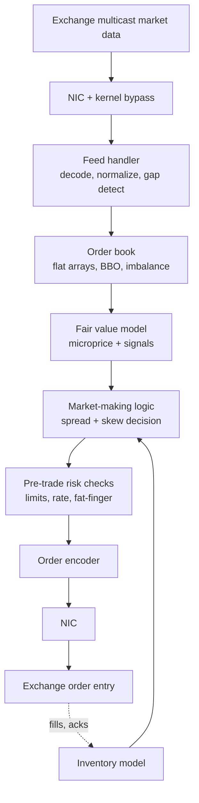

# Question Bank with Model Answers

Companion to `interview.md` (section 15) and `thesis-deep-dive.md`.
130+ likely questions, each with an answer calibrated for the Prediction Co panel: precise, honest about tradeoffs, and connected to trading or exchange consequences where that differentiates.
Parts A-C are the classic drills; parts D-J extend to exchange design, C++ beyond concurrency, Linux internals, distributed systems, prediction-market product, Principal behavioral, and quick-fire numbers.
Practice saying each answer out loud in 30-60 seconds; the written versions here are the ceiling, not a script.

## Progress tracker

- [ ] Part A: C++ / systems (20)
- [ ] Part B: Networking (18)
- [ ] Part C: Markets and market making (20)
- [ ] Part D: Exchange and matching engine design (17)
- [ ] Part E: C++ beyond concurrency (14)
- [ ] Part F: Linux and OS internals (12)
- [ ] Part G: Distributed systems and durability (12)
- [ ] Part H: Prediction markets and product (10)
- [ ] Part I: Principal-level and behavioral (8)
- [ ] Part J: Quick-fire numbers and curveballs

Mark weak questions inline as you go (prefix the bold question line with `WEAK:` or highlight it); the final pass re-reads only those plus the shortlist at the bottom.

Answer style rules that apply to every question:

- Lead with the direct answer, then the mechanism, then the trading/exchange consequence.
- Never name-drop a technology without being ready for "why" two levels deep.
- When a question has a naive-but-wrong popular answer, briefly show you know the trap.
- Where an answer has a concrete artifact, a "Real world" block follows with the actual code or commands; you will not type these in the interview, but having implemented or run each one is what makes the verbal answer land as experience rather than reading.

---

## Part A: C++ / systems (20)

**A1. Explain the C++ memory model.**
The model defines when the effects of one thread's memory operations become visible to another, via the happens-before relation.
Within a thread, sequencing gives ordering; across threads, ordering exists only where synchronization creates it: a release store that an acquire load observes, mutex unlock/lock pairs, thread creation/join.
Conflicting accesses (same location, at least one write) not ordered by happens-before are a data race, and a data race on non-atomic objects is undefined behavior, not just "stale values."
The practical contract is sequential consistency for data-race-free programs: keep the program race-free and you may reason in interleavings; the orderings on atomics let you pay for exactly as much synchronization as you need.

**A2. What is a data race?**
Two or more threads access the same memory location, at least one access is a write, at least one is non-atomic, and no happens-before relation orders them.
It is defined at the language level, not the hardware level: even on x86, where the hardware is strongly ordered, the compiler may cache values in registers, hoist loads out of loops, or tear wide writes, because it is entitled to assume no race exists.
That is why "it works on my machine" is not evidence of correctness for concurrent C++.

Real world: races are found mechanically, not by staring.

```bash
# ThreadSanitizer build of the test suite; reports both racing stacks with line numbers
g++ -std=c++23 -O1 -g -fsanitize=thread -o md_tests market_data_tests.cpp
TSAN_OPTIONS="halt_on_error=1" ./md_tests    # CI: any report fails the build
```

**A3. What is undefined behavior in multithreaded C++?**
Any data race is UB: the standard places no requirements on the program's behavior.
The dangerous consequence is that the optimizer transforms code under the assumption that races do not exist: a `while (!stop_flag)` loop over a non-atomic bool can legally become an infinite loop because the compiler proves no in-thread write occurs.
Other multithreaded UB sources: destroying an object while another thread uses it (lifetime), double-unlocking a mutex, and unsynchronized access during construction.
In a trading system, UB is worse than a crash: it can silently produce a wrong position or a wrong price, so I treat race-freedom as a first-class design invariant, not a debugging concern.

**A4. Atomic vs mutex: when do you use which?**
A mutex protects a multi-step critical section and blocks on contention; blocking means possible syscalls, context switches, priority inversion, and unbounded tail latency if the holder is preempted.
An atomic protects a single memory word with a guaranteed-indivisible operation and never blocks, but composing multiple atomics into a larger invariant is where lock-free bugs live.
My rule: on the latency-critical path, prefer designs that need neither, single-writer ownership and SPSC queues; use atomics for simple flags, counters, and queue indices; use a mutex off the hot path where correctness of a complex invariant matters more than nanoseconds.

**A5. Acquire vs release?**
A release store prevents prior memory operations from moving after it; an acquire load prevents subsequent operations from moving before it.
When an acquire load reads the value written by a release store, everything the producer did before the store is visible to the consumer after the load: that pair creates happens-before.
Canonical use: producer fills a message buffer, then release-stores the ready index; consumer acquire-loads the index, then safely reads the buffer.
This is exactly the pattern in my SPSC queue: publication of data through a single atomic index, with no fences stronger than needed.

Real world: the publication pattern, exactly as it appears in a feed handler.

```cpp
Slot slots[N];
std::atomic<uint32_t> ready{0};

// Producer thread
slots[i].order = decode(pkt);                    // plain writes to the slot
ready.store(i + 1, std::memory_order_release);   // publish: nothing above sinks below

// Consumer thread
uint32_t r = ready.load(std::memory_order_acquire);  // nothing below hoists above
if (r > consumed) process(slots[r - 1].order);       // slot contents guaranteed visible
```

**A6. Relaxed atomics: what do they guarantee and when are they safe?**
Atomicity (no torn reads/writes) and a coherent per-object modification order, but no ordering with respect to other memory locations.
Safe uses: statistics counters, sequence observation where another mechanism provides ordering, and the first load of a double-checked pattern that is re-checked under stronger ordering.
Unsafe use: guarding non-atomic data with a relaxed flag, because nothing orders the data writes with the flag.
I default to acquire/release and downgrade to relaxed only with a written argument for why ordering is provided elsewhere.

Real world:

```cpp
std::atomic<uint64_t> msgs_seen{0};
msgs_seen.fetch_add(1, std::memory_order_relaxed);       // hot path: count only, no ordering
uint64_t n = msgs_seen.load(std::memory_order_relaxed);  // monitoring thread: staleness is fine
```

**A7. What does sequential consistency give you that acquire/release does not?**
A single total order over all seq_cst operations that every thread agrees on.
Acquire/release only orders pairs that actually synchronize; two independent release/acquire chains on different variables can be observed in different orders by different threads.
The classic case needing seq_cst is Dekker-style mutual exclusion: two threads each store their own flag then load the other's; with acquire/release both can load-before-store and both enter; seq_cst forbids it.
Cost: on x86 a seq_cst store compiles to an xchg or mfence, a full store-buffer drain, so I use it only when the algorithm genuinely needs a global order.

Real world: the Dekker pattern that breaks under acquire/release.

```cpp
std::atomic<bool> flag_a{false}, flag_b{false};
// Thread A                                 // Thread B
flag_a.store(true, seq_cst);                flag_b.store(true, seq_cst);
if (!flag_b.load(seq_cst)) enter_a();       if (!flag_a.load(seq_cst)) enter_b();
// With acquire/release both loads may hoist above the stores (store-load reordering):
// both threads see false and both enter. seq_cst forbids that interleaving.
```

**A8. Explain CAS.**
Compare-and-swap atomically checks that a location still holds an expected value and, only then, writes a new one, returning success and the observed value.
It is the universal primitive for lock-free algorithms: read state, compute a new state, CAS it in, retry on failure.
`compare_exchange_weak` may fail spuriously (LL/SC architectures) so it belongs in retry loops; `strong` does not, for single-shot attempts.
Under heavy contention CAS loops degrade (coherence traffic, retries), which is one reason I prefer partitioning state so contention never arises over cleverness that tolerates it.

Real world: the canonical CAS retry loop (Treiber stack push).

```cpp
void push(Node* n) {
    n->next = head.load(std::memory_order_relaxed);
    while (!head.compare_exchange_weak(n->next, n,
               std::memory_order_release,      // success: publish the node
               std::memory_order_relaxed)) {   // failure: n->next was refreshed, just retry
    }
}
```

**A9. The ABA problem?**
A CAS succeeds because the value matches, but the location changed A to B and back to A in between, so the match no longer proves "nothing happened."
Classic failure: a lock-free stack where a node is popped, freed, reallocated at the same address, and pushed back; the stale CAS corrupts the list.
Mitigations: tag the pointer with a generation counter (CAS on pointer+tag), or solve the underlying memory-reclamation problem with epochs or hazard pointers.
The honest senior point: safe memory reclamation is the actual hard part of lock-free C++, and it is a reason to prefer bounded pre-allocated structures where nodes are never returned to a general allocator.

Real world: generation-tagged head defeats ABA in one 64-bit CAS.

```cpp
struct Head { uint32_t idx; uint32_t gen; };      // 8 bytes: lock-free atomic
std::atomic<Head> head;

Head h = head.load(std::memory_order_acquire);
Head next{ node_after(h.idx), h.gen + 1 };        // gen changes even if idx recurs
while (!head.compare_exchange_weak(h, next)) next = { node_after(h.idx), h.gen + 1 };
static_assert(std::atomic<Head>::is_always_lock_free);
```

**A10. Lock-free vs wait-free?**
Lock-free: the system as a whole makes progress; some thread completes in a bounded number of steps, but an individual thread can starve retrying.
Wait-free: every thread completes every operation in a bounded number of steps; strictly stronger.
An SPSC ring buffer is wait-free (each side does constant work); a CAS retry loop is typically only lock-free.
For trading, the reason to care is tails: blocking can produce unbounded waits, lock-free bounds system progress, wait-free bounds per-operation latency, which is the property that actually maps to a latency budget.

**A11. False sharing?**
Independently written variables that share a 64-byte cache line force the line to bounce between cores: each write needs exclusive ownership, invalidating the other core's copy, so logically independent threads serialize on coherence traffic.
Symptoms: throughput collapses when threads scale, perf shows heavy cache-to-cache transfers (perf c2c finds it directly).
Fix: `alignas(64)` on per-thread or per-role hot fields, as with the head and tail indices of an SPSC queue.
Trading consequence: false sharing is a jitter source, and jitter is stale quotes; it is one of the first things I audit in shared-state layouts.

Real world: the fix and the detector.

```cpp
struct QueueIndices {
    alignas(64) std::atomic<uint64_t> head{0};   // consumer-owned cache line
    alignas(64) std::atomic<uint64_t> tail{0};   // producer-owned cache line
};
static_assert(offsetof(QueueIndices, tail) - offsetof(QueueIndices, head) >= 64);
```

```bash
# perf c2c samples cross-core cacheline contention and names the offending lines of code
perf c2c record -a -- sleep 10
perf c2c report --stats            # look at HITM counts per cacheline
```

**A12. What is cache coherence?**
The guarantee that all cores observe a single consistent value history per cache line, maintained by a protocol that tracks each line's state and moves ownership between private caches.
Important distinction: coherence orders accesses to a single location; it does not order accesses across locations, which is the memory model's job.
Coherence is invisible when data is well partitioned and expensive when it is not: every cross-core write to shared data is a protocol transaction.

**A13. MESI?**
The canonical invalidation-based coherence protocol; each line in each cache is Modified, Exclusive, Shared, or Invalid.
A core writing a line must hold it in M or E; if others hold it Shared, they are invalidated first (an RFO, read-for-ownership).
A core reading a line another core holds Modified triggers a writeback/transfer.
This is the mechanism behind false sharing costs and behind why single-writer designs are fast: a line owned by one writer stays in M and never generates traffic.

**A14. CPU cache hierarchy?**
Roughly: L1 about 4-5 cycles (about 1 ns), L2 about 12-14 cycles, shared L3 about 40-70 cycles, DRAM 60-100 ns, remote-socket memory worse still.
Two consequences drive design: a pointer chase is a serialized chain of these latencies (each load depends on the last, so out-of-order execution cannot hide them), and sequential access lets the prefetcher hide almost everything.
Hence data-oriented design on hot paths: flat contiguous arrays, indices instead of pointers, structures sized and aligned to lines.
That is exactly why my order books are flat arrays indexed by price tick rather than node-based trees.

**A15. NUMA?**
Multi-socket machines attach memory to each socket; local access is fast, remote access crosses the interconnect and costs substantially more, with lower bandwidth.
Memory lands on the node that first touches it, so allocation-time discipline matters: pin the thread first, then touch the memory it will use.
For networking, the NIC hangs off one socket's PCIe root, so its descriptor rings, its polling core, and its consumers should all live on that socket.
The failure mode is silent: everything works, just 30-50% slower with fatter tails, which is why I verify placement (numactl, hardware counters) rather than assume it.

Real world:

```bash
numactl --hardware                               # nodes, sizes, distances
numactl --cpunodebind=0 --membind=0 ./engine     # pin process and memory to node 0
numastat -p $(pidof engine)                      # verify: numa_miss stays ~0
```

```cpp
// First-touch discipline: fault pages in from the thread that will use them
pin_to_core(4);                                   // a core on the NIC's node
auto* buf = static_cast<char*>(std::aligned_alloc(64, SZ));
std::memset(buf, 0, SZ);                          // touch now: pages land on this node
```

**A16. Memory barriers?**
Fences constrain reordering when ordering is not attached to a specific atomic operation: `atomic_thread_fence(release)` orders prior writes against a subsequent relaxed store, acquire fences mirror that for loads, and a full fence (mfence on x86) drains the store buffer, forbidding store-load reordering.
There is also the compiler-only barrier (`atomic_signal_fence`) preventing compile-time motion.
In practice I prefer orderings on the atomics themselves because they document intent at the synchronization point; standalone fences appear when one fence can cover a batch of relaxed operations, a real technique in ring-buffer batch publication.

**A17. Why is dynamic allocation bad on a latency-sensitive path?**
It is unbounded work at an unbounded time: allocators take locks or hit slow paths, may syscall (mmap/brk), and a fresh page costs a page fault plus zeroing on first touch; deallocation can trigger consolidation.
It also fragments and pollutes cache with allocator metadata.
The fix is to move all allocation to startup: pre-sized pools, ring buffers, mlock plus pre-touch so pages are resident, then a hot path that only recycles fixed-size objects.
My rule for a matching or quoting core: after warm-up, zero calls to the allocator, verifiable with an interposed counter in tests.

Real world: the pool, the lock-in, and the tripwire.

```cpp
template <class T, size_t N>
class Pool {                                     // fixed slots, index freelist, zero malloc after startup
    alignas(64) std::array<T, N> slots_;
    std::vector<uint32_t> free_;
public:
    Pool() { free_.resize(N); std::iota(free_.rbegin(), free_.rend(), 0u); }
    T* alloc() {
        if (free_.empty()) return nullptr;       // explicit reject, never fall back to malloc
        uint32_t i = free_.back(); free_.pop_back(); return &slots_[i];
    }
    void release(T* p) { free_.push_back(uint32_t(p - slots_.data())); }
};

mlockall(MCL_CURRENT | MCL_FUTURE);              // startup: no page ever swaps or faults later
```

```cpp
// Test-build tripwire: the build fails if the hot path ever allocates after warm-up
void* operator new(std::size_t n) {
    if (g_hot_path_armed.load(std::memory_order_relaxed)) std::abort();
    return std::malloc(n);
}
```

**A18. How would you profile latency?**
First measure, then attribute.
Measure at the boundaries: hardware timestamps at the NIC for wire truth, cheap TSC reads at stage boundaries internally, recorded into a lock-free ring and analyzed offline as full distributions, p50/p99/p99.9, never averages.
Attribute with the right tool per hypothesis: perf for cache misses and branch behavior, ftrace/eBPF for scheduler and syscall interference, /proc counters for context switches and page faults, perf c2c for false sharing.
Two disciplines: replay identical input against builds so comparisons are apples-to-apples, and beware coordinated omission, measure from intended send time under load, not from when the sender got around to it.

Real world: cheap stage stamps plus attribution tooling.

```cpp
static inline uint64_t ts() { unsigned aux; return __rdtscp(&aux); }  // serialized TSC read
stamps.push(Stage::BookUpdate, ts());     // into a lock-free ring, drained off-core, analyzed offline
```

```bash
perf stat -e cache-misses,branch-misses,context-switches -p $(pidof engine) -- sleep 10
perf record -F 999 -g -p $(pidof engine) -- sleep 30 && perf report   # where cycles actually go
```

**A19. What causes tail latency?**
Queueing first: bursts arrive faster than service rate and delay compounds; Little's law makes the queue the amplifier, and bursts are exactly when trading systems matter most.
Then the platform: interrupts and softirqs landing on hot cores, context switches, page faults, TLB misses, allocator slow paths, lock contention and priority inversion, C-state wakeups and frequency transitions, coherence storms from false sharing, and downstream network buffering.
Each has a signature and a tool; the senior stance is that a millisecond outlier on a microsecond path always has a nameable cause, and you trace it rather than shrug.

**A20. How would you make a C++ system deterministic?**
Make the core a pure function of a sequenced input log.
Single-threaded state machine per partition; all inputs, including time (as timer events) and any randomness (as logged seeds), arrive through one ordered stream; no wall-clock reads, no iteration over unordered containers where order matters, no floating point where cross-platform bit-equality matters (scaled integers for prices).
Concurrency lives outside the core: gateways and publishers feed and drain it through queues.
The payoff is compounding: identical replay gives you recovery, hot-standby failover, regression testing against production logs, and debugging by re-execution; determinism is not an optimization, it is the architecture.

Real world: the entire deterministic core fits in a dozen lines.

```cpp
void run(SpscQueue<SeqEvent>& in, SpscQueue<OutEvent>& out, Book& book) {
    SeqEvent ev;
    while (running.load(std::memory_order_relaxed)) {
        if (!in.pop(ev)) continue;              // busy poll
        assert(ev.seq == last_seq + 1);         // a gap is a bug: halt loudly, never guess
        apply(book, ev, out);                   // pure transition: no clock, no rand, no I/O
        last_seq = ev.seq;
    }
}
// Time arrives as data: the sequencer injects TimerEvent{seq, ns},
// so replaying the log reproduces "time-based" behavior bit for bit.
```

---

## Part B: Networking (18)

**B1. TCP vs UDP?**
TCP: connection-oriented, reliable, ordered, congestion- and flow-controlled; the cost is retransmission delays, head-of-line blocking, and buffering you do not control.
UDP: connectionless datagrams, no delivery or ordering guarantee, minimal overhead, and the application owns reliability.
Trading usage follows the guarantees: market data fan-out is UDP multicast with sequence numbers and recovery layered on top; order entry is typically TCP (or a reliable session protocol) because per-order delivery certainty matters and the flow is point-to-point.
The key insight is that TCP's reliability is not free reliability: a retransmit is milliseconds, so for market data you would rather detect the gap and recover deliberately than stall behind head-of-line blocking.

**B2. Why multicast for market data?**
The exchange writes each update to the wire once and the network replicates it to all subscribers: constant publisher cost regardless of subscriber count, and near-simultaneous delivery to everyone.
That simultaneity is a fairness property, which matters to me on the exchange side: nobody gets the update meaningfully earlier because of the distribution mechanism itself.
The cost is UDP semantics, so the feed carries per-channel sequence numbers, and the venue provides recovery paths; unicast TCP per consumer would make the publisher's cost scale with subscribers and let one slow consumer's backpressure interfere.

Real world: joining a feed group is three syscalls.

```cpp
int fd = socket(AF_INET, SOCK_DGRAM, 0);
sockaddr_in addr{AF_INET, htons(26400), {htonl(INADDR_ANY)}};
bind(fd, reinterpret_cast<sockaddr*>(&addr), sizeof addr);

ip_mreq m{};
m.imr_multiaddr.s_addr = inet_addr("233.54.12.111");   // the feed group
m.imr_interface.s_addr = inet_addr("10.0.0.5");        // the receiving interface
setsockopt(fd, IPPROTO_IP, IP_ADD_MEMBERSHIP, &m, sizeof m);
```

**B3. What happens when UDP packets are dropped?**
Nothing, by design: no retransmission, no notification; the receiver sees a sequence gap or silence.
The consequences cascade if unhandled: a missed incremental update means the order book is silently wrong, fair value is wrong, and quotes are wrong.
So the receiver's contract is: detect the gap immediately, mark affected state stale so downstream logic stops trusting it, and enter recovery; trading on a book you know is broken is worse than not trading.

**B4. How do you detect packet loss?**
Per-channel monotonic sequence numbers on every message: receiving n+2 after n proves a gap.
Silence is detected with heartbeats/idle messages so "no data" is distinguishable from "lost data."
With redundant A/B feeds, arbitration gives earlier detection: a message present on one feed and missing on the other flags the loss before any sequence gap is even confirmed.
Detection latency matters as much as detection itself, because the stale-book window is the risk window.

**B5. How do you recover from packet loss?**
In preference order: fill the hole from the redundant A/B feed (fastest, usually sufficient for single-packet loss); request the range from the retransmission service; if the gap exceeds the retransmission window, resubscribe state from the snapshot channel and rejoin the incremental stream at the snapshot's sequence number.
Rules that hold regardless of path: never apply updates out of order, buffer post-gap messages while recovering, keep state marked stale until continuity is proven.
On the exchange side, this defines what I must build: sequenced incrementals, a retransmit server, periodic snapshots, and A/B publication on independent paths.

Real world: the receiver's gap state machine, which also arbitrates A/B feeds for free.

```cpp
void on_packet(const Msg& m) {
    if (m.seq == next_seq)      { apply(m); ++next_seq; drain_buffered(); }
    else if (m.seq > next_seq)  {                       // gap detected
        book.mark_stale();
        buffered.insert(m);
        request_retransmit(next_seq, m.seq - 1);        // or wait for the B feed copy
    }
    // m.seq < next_seq: duplicate (e.g. from the B feed), drop silently
}
void drain_buffered() {
    while (auto* m = buffered.find(next_seq)) { apply(*m); buffered.erase(next_seq); ++next_seq; }
    if (buffered.empty()) book.clear_stale();
}
```

**B6. What is kernel bypass?**
Moving packet processing out of the kernel's interrupt-driven stack into user space: the application polls NIC rings mapped into its address space, eliminating interrupts, syscalls, context switches, and kernel buffer management from the per-packet cost.
The win is partly average latency but mostly jitter: the kernel path's variance (interrupt timing, softirq scheduling) disappears into a bounded polling loop.
The honest caveat: the benefit depends on the architecture around it; bypass with a sloppy application design buys little, and it costs you the kernel's tooling, so it belongs on the few paths that justify it.

**B7. What is DPDK?**
A user-space framework with poll-mode drivers that take the NIC away from the kernel entirely: hugepage-backed memory pools of pre-allocated packet buffers (mbufs), burst RX/TX APIs (rte_eth_rx_burst) that amortize per-packet costs, and dedicated lcores spinning on queues.
It is the maximum-control option: no interrupts, no kernel stack, and consequently no kernel TCP, so you bring your own protocol handling.
Tradeoffs: burned cores, operational complexity, and losing standard tooling; the alternatives on the spectrum are Onload (socket-compatible user-space stack) and AF_XDP (bypass-speed rings while the kernel keeps the driver), and I would choose per deployment constraint rather than by default.

Real world: taking a NIC out of the kernel and polling it.

```bash
echo 1024 > /sys/kernel/mm/hugepages/hugepages-2048kB/nr_hugepages
modprobe vfio-pci
dpdk-devbind.py --status                              # find the NIC's PCI address
dpdk-devbind.py --bind=vfio-pci 0000:3b:00.0          # NIC leaves the kernel
./feed_handler -l 4,5 -n 4 -a 0000:3b:00.0            # EAL: lcores 4,5 own the queues
```

```cpp
rte_mbuf* bufs[32];
for (;;) {                                            // the poll loop that replaces interrupts
    uint16_t n = rte_eth_rx_burst(port, queue, bufs, 32);
    for (uint16_t i = 0; i < n; ++i) {
        handle(rte_pktmbuf_mtod(bufs[i], const uint8_t*), rte_pktmbuf_pkt_len(bufs[i]));
        rte_pktmbuf_free(bufs[i]);                    // back to the hugepage mempool
    }
}
```

**B8. What is zero-copy?**
Eliminating CPU copies between the wire and the application: the NIC DMAs into buffers the application reads directly, instead of kernel-buffer-to-user-buffer copies.
The precise claim matters: copies cost CPU cycles and cache pollution roughly linear in bytes, so zero-copy helps most at high throughput and large messages; for 100-byte ticks, the syscall and context-switch elimination usually matters more than the copy itself.
So I present zero-copy as one ingredient of bypass, not the headline.

**B9. What is busy polling?**
Spinning a core in a loop checking for work (NIC ring, queue index) instead of sleeping and being woken.
It converts "unpredictable wakeup latency" (interrupt delivery, scheduler decisions, cache/C-state warmup) into "bounded loop iteration," trading a fully burned core for latency determinism.
That trade is the essence of low-latency engineering: spend a cheap abundant resource (a core) to buy a scarce one (tail predictability).
Design detail: the polling core is isolated (isolcpus, nohz_full) or the spin buys nothing because the kernel still interrupts it.

Real world: two rungs of the same ladder.

```cpp
// Mild: keep the kernel stack but poll instead of sleeping in the driver
int usec = 50;
setsockopt(fd, SOL_SOCKET, SO_BUSY_POLL, &usec, sizeof usec);

// Full: user-space spin on bypass rings (DPDK shown; AF_XDP ring polling is analogous)
while (running) {
    if (uint16_t n = rte_eth_rx_burst(port, q, bufs, 32)) process(bufs, n);
    // no sleep, no yield: the core's only job is reacting in bounded time
}
```

**B10. Interrupts vs polling?**
Interrupts are efficient at low rates (core sleeps until work) but each delivery costs microseconds and arrives at unpredictable times; coalescing helps throughput while adding latency.
Polling wastes cycles when idle but has constant reaction time and no per-packet interrupt cost, and it degrades gracefully under load, exactly when interrupt storms would fall apart.
Latency-critical receive paths poll; housekeeping and low-rate control paths keep interrupts; hybrid modes (NAPI, adaptive coalescing) exist but reintroduce variance, so the hot path stays pure poll.

**B11. What is RSS?**
Receive Side Scaling: the NIC hashes packet headers (typically the 5-tuple) to spread flows across multiple hardware RX queues, each servable by a different core.
It gives parallelism with per-flow ordering preserved, since one flow always hashes to one queue.
For trading I usually want the stronger form: explicit flow steering (ethtool n-tuple rules or DPDK flow API) pinning each market data group to the exact core that owns that instrument's state, so data lands where it is consumed with no cross-core handoff.

Real world:

```bash
ethtool -l eth0                        # current queue counts
ethtool -L eth0 combined 8             # configure 8 queues
ethtool -X eth0 equal 8                # RSS: spread flows across all 8
# Steering: this market data group lands on queue 3, owned by its consuming core
ethtool -N eth0 flow-type udp4 dst-ip 233.54.12.111 dst-port 26400 action 3
ethtool -n eth0                        # verify the rules took
```

**B12. NIC queues?**
Independent descriptor rings for RX and TX, each with its own head/tail and interrupt/poll context; multiple queues enable parallelism (RSS or steering) and isolation (separating market data from order entry from management traffic onto different queues and cores).
Sizing is a latency/loss tradeoff: deeper rings absorb bursts but add worst-case queueing delay; shallow rings bound delay but drop under microbursts.
I set them from measured burst profiles, and on the exchange side burst tolerance is a hard requirement, because event-resolution bursts are the moments that define the venue.

**B13. CPU affinity?**
Binding threads to specific cores so the scheduler cannot migrate them, preserving L1/L2 working sets and enabling a stable pipeline layout: this core polls the NIC, this one runs the book, this one publishes.
Affinity alone is half the job; the other half is keeping everything else off those cores: isolcpus/cpusets, IRQ affinity pointed at housekeeping cores, nohz_full to silence the tick.
The result is that a hot core runs exactly one loop, which is the precondition for every latency number you quote being reproducible.

Real world:

```cpp
cpu_set_t set;
CPU_ZERO(&set);
CPU_SET(4, &set);                                          // this thread lives on core 4
pthread_setaffinity_np(pthread_self(), sizeof set, &set);
```

```bash
taskset -cp 4 <pid>                                # or pin from outside
grep ctxt /proc/<pid>/task/<tid>/status            # verify: nonvoluntary_ctxt_switches ~0
```

**B14. NUMA-aware networking?**
The NIC is attached to one socket's PCIe; its DMA lands in that socket's memory.
So the rule is co-location: descriptor rings and packet buffers allocated on the NIC's node, the polling thread pinned to that node, and the consuming pipeline kept there too; a cross-socket hop adds latency to every single packet.
Verify, do not assume: check the NIC's node in sysfs, allocate with numactl or first-touch on a pinned thread, and confirm with counters that remote-node traffic is near zero.

Real world:

```bash
cat /sys/class/net/eth0/device/numa_node       # which socket owns the NIC
lstopo --of txt                                # the whole topology in one picture
NODE=$(cat /sys/class/net/eth0/device/numa_node)
numactl --cpunodebind=$NODE --membind=$NODE ./feed_handler
numastat -p $(pidof feed_handler)              # numa_foreign / numa_miss should stay ~0
```

**B15. What causes network jitter?**
On the host: interrupt timing, coalescing settings, scheduler interference, C-state wakeups.
In the network: switch queueing during microbursts (many sources synchronize on the same trigger, exactly what markets do), oversubscribed uplinks, buffer bloat adding delay instead of dropping, and occasionally route changes or PFC pauses.
Diagnosis needs hardware timestamps at both ends of each segment to localize which hop contributes the variance; without wire timestamps you are guessing.
For an exchange, managing fabric jitter is a fairness obligation, not just a performance concern.

**B16. How would you timestamp packets?**
At the NIC PHY in hardware, on both ingress and egress, so the timestamp reflects the wire, not the software stack's mood.
Software timestamps (even early-in-driver) include scheduling and queueing noise on exactly the packets you most care about, busy-period ones.
Internally, cheap TSC stamps at stage boundaries correlate against the wire stamps to decompose the pipeline.
The wire timestamp is the only number I would publish or accept in an SLA.

**B17. Hardware vs software timestamps?**
Hardware: taken by the NIC at the PHY, nanosecond-class, disciplined to a global clock via PTP; immune to host-side variance.
Software: taken by the kernel or application after (or before) traversal of some of the stack; convenient, but biased and noisy under load, and the bias correlates with load, which corrupts exactly the tail measurements that matter.
Use hardware stamps for truth and cross-host comparison; use software stamps only for internal relative decomposition where their noise is acceptable.
For a regulated exchange, PTP-disciplined hardware timestamping is also a compliance requirement (audit-grade event times), not just engineering hygiene.

Real world: enabling hardware stamps and disciplining the NIC clock.

```bash
ethtool -T eth0                     # what the NIC supports (hardware-receive, PHC index)
ptp4l -i eth0 -m &                  # discipline the NIC's PHC to the grandmaster
phc2sys -s eth0 -O 0 -m &           # slave the system clock to the NIC clock
pmc -u -b 0 'GET CURRENT_DATA_SET'  # verify offset from master (nanoseconds)
```

```cpp
int flags = SOF_TIMESTAMPING_RX_HARDWARE | SOF_TIMESTAMPING_RAW_HARDWARE;
setsockopt(fd, SOL_SOCKET, SO_TIMESTAMPING, &flags, sizeof flags);
// each recvmsg() then carries the NIC timestamp in a SCM_TIMESTAMPING control message
```

**B18. How would you measure end-to-end latency?**
Define the endpoints on the wire: first bit of the inbound packet at the NIC to last bit of the response leaving it, measured by hardware timestamps, ideally from an independent capture device or switch mirror so the system does not grade its own homework.
Cross-host measurement requires PTP-synchronized clocks or a single capture point that sees both directions.
Report distributions under realistic replayed load, including burst profiles, and account for coordinated omission by measuring from intended event time.
Then instrument stage timestamps internally so any regression in the wire-to-wire number decomposes immediately into the offending stage.

---

## Part C: Markets and market making (20)

**C1. What is a market maker?**
A participant who continuously quotes both a bid and an ask, earning the spread for bearing two risks: inventory risk (holding a position while prices move) and adverse selection (trading against better-informed flow).
Economically they sell immediacy: takers pay the spread to trade now instead of waiting.
For a venue, market makers are the product's foundation: without their resting quotes there is no liquidity for anyone else, which is why exchanges court them with rebates, obligations programs, and the platform guarantees they need.

**C2. Why does market making make money, and what limits it?**
The gross edge is capturing the spread on balanced two-way flow: buy at bid, sell at ask, repeat.
The limits are the costs: adverse selection (informed flow picks you off exactly when the price is about to move), inventory risk (unbalanced fills accumulate a directional position), fees, and competition compressing the spread toward those costs.
So the real skill is not quoting tightly, it is classifying flow: quote tight and large when flow is uninformed, widen or step away when it is toxic; profitability is a filtering problem wearing a pricing costume.

**C3. What is adverse selection?**
The counterparty who chooses to trade with you may know something you do not, so your fills are biased toward bad moments: your ask gets lifted just before the price rises.
It is the winner's curse: winning the fill is correlated with the fill being a mistake.
Measured in practice with markouts: average mid-price move after your fills at horizons from milliseconds to minutes; persistent negative markouts mean the flow is informed.
It is the reason the spread exists at all, and the reason latency matters: a stale quote is free money for whoever sees the new price first.

**C4. What is inventory risk?**
The risk from holding a net position between fills: a market maker long 10,000 units is exposed to every downtick regardless of spread capture.
Managed by skewing quotes against the position (long: lower both bid and ask, discouraging more buying, encouraging selling), reducing size, hedging in correlated instruments where they exist, and hard position limits as the backstop.
In prediction markets it has a special character: the payoff is binary, so inventory risk realizes as a jump at resolution rather than a continuous drift, and often there is no hedging instrument, so skew and limits do all the work hedging normally would.

**C5. What is queue position?**
Where your order stands in the FIFO at its price level; fills consume from the front, so a quote at the front of a level is worth far more than the same price at the back.
It changes behavior: replacing an order (price or size up) sends you to the back, so market makers hold queue position as an asset and shade decisions to protect it.
Exchange-side consequence: the venue's modify semantics and matching determinism define this asset, so participants will demand precise, documented, deterministic priority rules, and the matching engine must guarantee them under replay.

**C6. What is market impact?**
The price move your own trading causes: consuming book depth mechanically moves the touch, and your visible activity moves others' expectations.
Impact makes naive backtests lie (fills at displayed prices you would actually have moved) and shapes execution: slicing, passivity, venue choice.
For a market maker, impact appears in reverse: unwinding accumulated inventory in an illiquid book costs impact, so position limits should scale with how much the book can absorb, not with capital alone.
Thin prediction-market books make this binding at small sizes.

**C7. What is latency arbitrage?**
Profiting from being faster to react to public information: when a correlated market moves (the underlying, a related venue, a news feed), the fast participant trades against quotes that have not updated yet.
The victim is whoever's quotes are stale; that is the direct link between engineering and P&L, and why market makers invest in speed defensively.
Venue design can damp it: speed bumps, batch auctions, or in prediction markets, halting around scheduled information events; as an exchange builder I care because a venue where slow participants are systematically farmed loses its liquidity providers.

**C8. What determines the bid/ask spread?**
The spread prices the market maker's costs: expected adverse selection per fill, inventory holding cost (volatility times expected holding time), fees minus rebates, plus a competition-limited margin.
Structural floors: the tick size (spread cannot be below one tick) and, in prediction markets, the bounded 0-100 price space compressing everything.
Empirically the spread widens with volatility and information asymmetry (news pending) and tightens with competition and uninformed volume share; the Avellaneda-Stoikov spread formula captures the volatility and risk-aversion terms cleanly.

**C9. What happens when volatility increases?**
Every market-making cost rises: inventory risk grows with sigma squared, quotes go stale faster (more adverse selection per unit latency), and fill flow becomes more one-sided.
Rational response: widen spreads, cut quote size, tighten inventory penalties and limits, and speed up fair-value updates; in the limit, pull quotes entirely around discrete events.
The exchange-side mirror: volatility spikes are message-rate spikes (everyone repricing at once), so the venue's burst capacity and cancel latency are being stress-tested at exactly the moment participants most depend on them.

**C10. How would you widen quotes?**
Symmetrically, driven by a live volatility estimate: the A-S structure makes the spread linear in gamma sigma squared times remaining horizon, so a doubling of short-horizon variance mechanically widens the spread.
Also widen on toxicity signals (one-sided aggressive flow), around scheduled information events, and when book depth thins (higher unwind cost).
Operationally it must be fast: widening after the toxic fill is charity; the widen-decision path deserves the same latency budget as the quote path.

**C11. How would you skew quotes?**
Two independent reasons, one mechanism: shift the quote midpoint away from fair value.
Inventory skew: long position, shift both quotes down (reservation price r = S - q gamma sigma squared (T - t)), making further buys less likely and sells more likely, mean-reverting the position.
Signal skew: order-book imbalance or short-horizon alpha says price is about to rise, shift quotes up so the about-to-be-stale side is protected and the favorable side is more aggressive.
In my thesis the RL policy outputs exactly this pair, a spread and a skew, as the discretized action space.

**C12. How do you estimate fair value?**
Layered: start from the book (microprice, weighted by displayed size), adjust with short-horizon flow signals (imbalance, trade direction, recent aggressor patterns), and anchor to related instruments where they exist (futures for an ETF, the complement and related outcomes for a prediction market).
In a prediction market fair value is literally a probability, which adds a model layer: an event model (from sports data, polls, or news) alongside the market's own information; near resolution the market itself is usually the best forecaster, and the quoting question becomes who knows the news first.
The engineering point: fair value must update in the same latency class as quoting, or the strategy trades on stale beliefs.

**C13. What is microprice?**
A size-weighted fair value: P = (P_bid times Q_ask + P_ask times Q_bid) / (Q_bid + Q_ask); note the cross-weighting, heavy bid size pushes the estimate toward the ask.
Intuition: a thin ask means less needs to trade to move the price up, so the "true" price sits closer to it.
It is a better short-horizon predictor than the mid and costs four loads and an add-multiply, so it is the standard first-layer fair value; caveat, it reads displayed size as commitment, which spoofing and hidden liquidity violate, so it is one input, not truth.

**C14. What is order-book imbalance?**
I = (Q_bid - Q_ask) / (Q_bid + Q_ask), in [-1, 1]; positive values mean more resting buy interest and mildly predict upward moves at short horizons.
Variants use multiple levels with distance decay, or flow imbalance (signed aggressor volume) which is harder to fake than resting size.
Caveats as with microprice: cancellable, spoofable, and blind to hidden orders; I treat it as a feature with measured predictive power at a measured horizon, not a rule; in my thesis it is one of the core state features the RL policy consumes.

**C15. What is toxicity?**
Flow that is informed: fills from it have systematically negative markouts for the liquidity provider.
Proxies: VPIN-style volume-synchronized imbalance of buyer- vs seller-initiated flow, and direct per-counterparty or per-horizon markout accounting where the venue's data allows.
Response is graded: widen, shrink, then step away as toxicity estimates rise.
Exchange-side view: toxicity distribution across a venue's flow determines whether market makers can profitably quote there, so product decisions that attract uninformed flow (retail-friendly markets) directly subsidize tighter spreads for everyone.

**C16. How do fees and rebates affect market making?**
They shift the economics per fill: with a maker rebate, the effective captured spread is quoted spread plus rebate, so rebates let makers quote tighter than the gross-edge breakeven; taker fees do the reverse for aggressors.
Consequences: fee structure changes optimal quoting (sometimes a one-tick-wide market exists only because of rebates), and queue position gains value since a rebate-paying fill at the front is profitable even at zero gross spread.
For a new venue, the fee schedule is a liquidity bootstrapping lever: maker rebates or fee holidays early, converging to sustainable economics as volume arrives.

**C17. What is maker-taker?**
The dominant fee model: liquidity providers (resting orders that get filled) receive a rebate, liquidity takers (aggressors) pay a fee, with the exchange keeping the difference.
Inverted venues flip it (taker rebate) to attract aggressive flow.
It shapes microstructure: rebates thicken queues at the touch, affect routing decisions (brokers chase rebates, a known conflict), and regulators scrutinize it; as a venue designer I would treat the fee model as a market-quality instrument, tuned with data, not a fixed revenue setting.

**C18. What happens when your market-data feed becomes stale, and what do you do?**
Staleness means quoting on beliefs the market has already invalidated: maximum adverse-selection exposure.
Detection: sequence gaps, heartbeat timeouts, cross-checks against a second feed or correlated venue, and sanity monitors (no updates during a period when trades are printing).
Response, in order and fast: widen immediately, then pull quotes (mass cancel), then halt the strategy until continuity is re-proven; the pull path must be pre-armed and low-latency.
Exchange-side mirror: participants will do exactly this to my venue, so feed reliability and honest staleness signaling (explicit gap/health messages) directly determine how tightly they dare to quote.

**C19. How do you protect against bad market data?**
Layered validation, because bad data upstream of an automated strategy is how firms blow up in minutes.
Syntactic: checksums, sequence continuity, protocol validation.
Semantic: price bands versus last-known state (a tick 40% away is suspect), crossed-book detection, staleness checks, cross-source comparison where a second feed exists.
Systemic: the strategy consumes a validated view with explicit quality flags, quoting size scales down as confidence drops, and a kill switch stops order flow when validation fails hard; the same philosophy as my thesis risk gate, a deterministic envelope that bounds what any upstream error can do.

**C20. How do you manage inventory across correlated instruments?**
At the portfolio level, not per-instrument: net exposures against the common risk factors, so a long in one instrument and a short in a correlated one partially offset, and skew quotes based on marginal contribution to portfolio risk rather than raw position.
Estimate correlations carefully; they are regime-dependent and spike toward one in stress, exactly when you rely on them.
Prediction-market specifics make this concrete: mutually exclusive outcomes must sum to about one (an internal consistency constraint and an arbitrage monitor), nested events (wins-game vs wins-championship) are structurally correlated, and the same real-world event may price on multiple venues; a market maker nets inventory across all of these, and a venue should expect and support that behavior in its risk and data design.

---

## Part D: Exchange and matching engine design (17)

This is the part most specific to the role; where interview.md sections 4-6 explain the concepts, these are the spoken-form answers.

**D1. Design a matching engine for us, end to end.**
Start with the invariant, then the shape: "the core requirement is that the engine is a deterministic function of an ordered input stream, because recovery, failover, market data consistency, and audit all fall out of that one property."
Shape: gateways validate and risk-check, a sequencer stamps a global gap-free sequence number on every input (orders, cancels, admin, timer events), and a single-threaded matching core per market partition consumes the stream and emits acks, fills, and book deltas.
Everything else (persistence, market data publication, clearing, surveillance, replicas) consumes the same sequenced stream asynchronously and can never block the core.
Then latency: pre-allocated memory, flat array book, no locks in the core because there is no sharing; wire-to-wire in single-digit microseconds is achievable in software.
Close with what you would ask them: acknowledgment policy and burst profile, because those two requirements drive the rest.

**D2. What data structures for the order book, and why?**
Price ladder as a contiguous array indexed by tick, and for a prediction market this is a gift: prices live in (0, 100) with fixed ticks, so the ladder is small, dense, and O(1) with perfect cache behavior; no trees, no comparators.
Each level holds an intrusive doubly-linked FIFO of resting orders, so matching walks priority order naturally and cancel is O(1) once you have the node.
An open-addressing hash map (or direct-indexed array) from order id to node makes cancel/modify O(1), which matters because cancels outnumber trades by roughly ten to one; the book must be optimized for the cancel, not the fill.
All nodes come from a pre-allocated pool; the hot path never allocates.

Real world: the whole structure in code.

```cpp
struct Order {                                   // intrusive node from the pool
    uint32_t qty;
    uint32_t id;
    Order*   prev;
    Order*   next;
};
struct Level {
    Order*   head = nullptr;                     // front of the FIFO = highest priority
    Order*   tail = nullptr;
    uint64_t total_qty = 0;
};
struct Book {
    std::array<Level, 101> bids, asks;           // ticks 0..100: the entire ladder
    int best_bid = -1, best_ask = 101;           // cached, updated incrementally
    FlatHashMap<uint32_t, Order*> by_id;         // O(1) cancel/modify
    Pool<Order, 1 << 20> pool;                   // sized at startup, never grows
};

void cancel(Book& b, uint32_t id) {              // O(1): unlink and release
    Order* o = b.by_id.take(id);
    unlink(level_of(b, o), o);
    b.pool.release(o);
}
```

**D3. Why single-threaded matching, and how do you scale it?**
A book is a serialization point by definition: price-time priority means order of processing is the product, so parallelism inside one book buys nothing but locks, and locks buy tail latency and non-determinism.
One thread per partition eliminates synchronization entirely, makes WCET tight, and makes the core trivially replayable.
Scale across markets, not within one: partition by instrument, one core per partition group, and a prediction market venue with thousands of independent event markets partitions beautifully.
The one hard case is instruments that must match atomically together (complement matching of YES/NO), which is why those share a partition.

**D4. What is the sequencer, and why is it central?**
The single point that converts concurrent, racing inputs into one authoritative total order; after sequencing, "what happened" has exactly one answer.
It is the smallest possible kernel of the system: stamp, log, fan out; everything else is a deterministic consumer.
This is how you get replicas that are always consistent (they consume the same stream), recovery that is exact (replay the stream), and an audit trail regulators accept (the stream is the ground truth).
The tradeoff to name before they do: it is a serialization point and a single point of failure, so it must be tiny, fast, and paired with a fencing-protected standby.

**D5. When do you acknowledge an order?**
Three policies, in increasing safety: ack after matching but before durability (fastest, but a crash loses acknowledged state, generally unacceptable for a venue of record); ack after local fsync (NVMe fsync is tens of microseconds, usually dominating the budget); ack after the event is replicated in memory to a quorum of independent replicas, which is the modern answer: microsecond-class replication on a fast LAN, disk persistence trailing asynchronously for restart and audit.
Frame it as an RPO decision the business and regulator make, which engineering then implements; my default for a regulated venue is quorum replication.

**D6. How do you snapshot without stalling the matcher?**
Options in preference order: take the snapshot from a replica that is in lockstep anyway, so the primary never pauses; copy-on-write techniques on the state so the matcher keeps running while a consistent image drains; or micro-stalls in quiet windows if the state is small.
The non-negotiable detail is that the snapshot records the exact sequence number it reflects, so recovery is snapshot plus replay of the tail, and correctness is provable by replaying into a second instance and comparing.

**D7. The primary matcher dies mid-stream; walk me through failover.**
The standby has been consuming the same sequenced stream, so its state is identical up to the last event it received.
The hard problem is not state, it is fencing: guaranteeing the old primary cannot come back and emit; solved with epoch numbers stamped into the stream, leases, or leader election in the replication protocol, so downstream consumers reject messages from a stale epoch.
Promotion: standby takes write ownership, gateways reconnect sessions and resynchronize sequence numbers, clients learn the fate of in-flight orders through session-level resend/reject semantics, and cancel-on-disconnect policy handles resting orders of dropped sessions.
Depending on the market, a brief halt-and-reopen may be cleaner than a seamless mask; for a prediction market mid-event, I would argue for the visible halt, participants prefer honest pauses to ambiguity.

**D8. Design the market data distribution system.**
Three channels: an incremental feed (every book change, per-channel sequence numbers, UDP multicast, published from the sequenced stream so it can never contradict the matcher), a periodic snapshot channel (late joiners and disaster recovery, each snapshot tagged with its sequence number), and a retransmission service for gap fills.
Publish A and B copies on independent network paths; consumers arbitrate and dedupe.
Two policies to volunteer: pacing/conflation for slower tiers so a book storm cannot flatten retail consumers, and strict non-blocking publication so market data can never backpressure the matching core.

**D9. Do you publish the fill to the aggressor before or after the public feed?**
This is a real venue design decision about information leakage versus latency.
If the private ack systematically beats the public print, the aggressor and the resting counterparty know before the market does, which advantages them in correlated markets; if the public print leads, participants learn their own fills from the tape, which is operationally ugly.
Most venues aim for effectively simultaneous release with the private execution report marginally first, and document it; the honest answer is that I would measure and publish the gap, because pretending it is zero is how venues get embarrassed.

**D10. How does modify affect priority, and why does it matter?**
Price change or size increase is economically a new order, so it goes to the back of the queue (implemented as cancel/replace); size decrease keeps priority because it takes nothing from anyone behind.
It matters because queue position is an asset participants manage deliberately; ambiguous or buggy priority semantics destroy market-maker trust faster than latency ever will, and the rules must hold exactly under replay and failover.

**D11. Self-match prevention?**
Prevents one participant's orders from trading with each other, which would print wash-trade-like volume, a regulatory problem, and usually reflects a participant-side race.
Policies offered per session: cancel the resting order, cancel the incoming, or decrement both; implemented in the matcher at match time by comparing participant/group identifiers.
As a venue I offer it because sophisticated participants running multiple strategies will demand it, and because the surveillance obligation is mine.

**D12. Design the order entry gateway.**
Per-session TCP (TLS for a modern retail-facing venue) with a session layer: logon, heartbeats, monotonic sequence numbers both directions, resend/gap-fill, and cancel-on-disconnect as a per-session option.
The gateway owns pre-matching checks: authentication, instrument validity, price bands, size and notional limits, per-session token-bucket rate limits, and funds/collateral checks, which for fully collateralized prediction contracts are a simple balance check.
Normalize to the internal binary format there, so the sequencer and matcher see one representation regardless of whether the order arrived via the low-latency binary protocol or the retail WebSocket tier; and the two tiers are isolated so retail load cannot add jitter to the deterministic core.

**D13. How do you test a matching engine?**
Three layers on top of unit tests.
Deterministic replay: capture production (or generated) input streams, replay against a candidate build, require byte-identical output; this converts every production day into a regression test and catches unintended behavior changes nothing else will.
Invariant fuzzing: generate random order flow and continuously assert invariants: no crossed book, quantity conservation, priority correctness, complement-pair consistency; property-based testing finds the weird interleavings humans do not write.
Failure injection: kill primaries mid-burst, drop and reorder gateway inputs pre-sequencer, corrupt log tails, and verify recovery reproduces exact state; chaos testing for the recovery paths, because untested failover is fiction.

Real world: the replay gate is one CI job; the fuzz is one property test.

```bash
# Byte-identical replay gate: any behavior change fails the build
./matcher --replay captures/2026-08-14.evlog --out /tmp/candidate.out
cmp /tmp/candidate.out captures/2026-08-14.expected || { echo "determinism broken"; exit 1; }
```

```cpp
TEST(Book, FuzzInvariants) {
    Rng rng(FLAGS_seed);                          // seed logged: every failure reproduces
    Book b;
    for (int i = 0; i < 1'000'000; ++i) {
        apply(b, random_event(rng));
        ASSERT_TRUE(b.best_bid < b.best_ask);     // book never crossed
        ASSERT_EQ(b.total_open_qty(), ledger.open_qty());  // quantity conserved
        ASSERT_TRUE(fifo_priority_holds(b));      // earlier arrival ahead at every level
    }
}
```

**D14. What happens to your design at 100x load when a big event resolves?**
Design for the burst as the normal case: everything pre-allocated so bursts trigger zero allocation, bounded queues everywhere with explicit overflow policy, per-session rate limits at the gateway so one runaway participant cannot consume the venue's capacity, and admission control that rejects with a clear error rather than silently queueing into seconds of delay.
Know the numbers: measure saturation with replayed burst shapes, keep p99.9 under the target at the design load, and know exactly where the first bottleneck is, in my thesis system it was the PCIe drain rate, and I could name it with a number; a venue must be able to do the same.
The event-resolution moment is also a product answer: pre-scheduled halts or auctions around known resolution times convert the worst burst into an orderly batch.

**D15. Why and how would you run an auction instead of continuous trading?**
When information arrives discretely and violently, continuous trading rewards pure speed and produces chaotic prints; a batch auction collects orders over a window and computes one crossing price maximizing matched volume, which aggregates information and neutralizes the latency race for that moment.
Uses for a prediction market: market open, reopen after a halt, and possibly around scheduled information events (game start, announcement times).
Mechanically it is simple in a deterministic core: the auction is just another sequenced event that triggers a batch match, and its determinism requirements are identical.

**D16. Explain complement matching and its invariants.**
A YES buy at 60 and a NO buy at 40 are the same trade: the venue mints a contract pair, holding 100 in collateral, and each side holds its leg; open interest is created by matching, not by an issuer.
So one economic book has two views, and the matcher must treat them atomically: a YES bid at p is a NO ask at 100 minus p, crossing logic must consider both representations, and the invariant is that the two views never disagree even transiently in published data.
This is also why YES and NO of one market must live in the same matching partition, and why the tick grid must be symmetric under the p to 100 minus p mapping.
Betfair-style back/lay matching is the same structure, which is presumably part of what BetCloud's experience brings.

**D17. Design a low-latency market-making system (participant side).**
They may ask this version instead of the exchange version, since it is your lived experience; the shape:



Narrate it in one breath: market data in through kernel bypass, feed handler decodes and gap-detects, the book maintains state and derives signals, fair value plus inventory drive a spread-and-skew quoting decision, a deterministic risk gate validates, and the encoder puts the order on the wire.
Then the design principles, which are what they are grading: the critical path is small and deterministic (no allocation, no locks, cache-friendly flat structures), threads are pinned with NUMA locality managed, everything is measured with hardware timestamps at the NIC and stage timestamps inside, durable state (positions, open orders) lives in an async event log with snapshot recovery, and the system has explicit behavior for packet loss (stale-mark and recover), crashes (replay), and market chaos (widen, shrink, pull, kill switch).
Close by connecting to the room: "and having built this side, I know exactly what this system needs from the exchange: deterministic cancel latency, honest feed sequencing and health, and clean recovery semantics, which is what I would now build from your side of the wire."

---

## Part E: C++ beyond concurrency (14)

**E1. What does a virtual call cost, and what are the alternatives?**
Direct costs: a vtable pointer load, then an indirect call, maybe 2-5 cycles when predicted; the real costs are the missed inlining (the optimizer cannot see through the call, losing constant propagation and vectorization) and indirect-branch mispredictions when call sites are polymorphic in practice.
Alternatives when the type set is closed: templates/CRTP for compile-time polymorphism with full inlining, `std::variant` plus `visit` for value-semantic closed sets, or plain branching on an enum, which is often fastest and clearest.
The senior nuance: virtual dispatch is fine at low frequency (a per-connection protocol object); it is per-message hot loops where it is banned, and I decide by call frequency, not ideology.

Real world: the closed-set alternatives.

```cpp
// variant/visit: value semantics, closed type set, no vtable, no heap
using Event = std::variant<AddOrder, Cancel, Modify>;
std::visit([&](const auto& e) { book.apply(e); }, event);   // overload resolved at compile time

// CRTP: compile-time polymorphism with full inlining
template <class Derived>
struct StrategyBase {
    void on_tick(const Tick& t) { static_cast<Derived*>(this)->on_tick_impl(t); }
};
struct MMStrategy : StrategyBase<MMStrategy> {
    void on_tick_impl(const Tick& t);   // inlined into the caller, unlike a virtual
};
```

**E2. Explain move semantics; when do moves not help?**
A move transfers ownership of remote resources by stealing pointers and leaving the source valid-but-unspecified; it turns deep copies into pointer swaps for heap-owning types.
Where it does not help: types without remote state (an array-embedded struct moves exactly as fast as it copies), small string optimization (an SSO string's move is a copy), and const sources (cannot steal from const, silently copies, a classic performance bug).
On a real hot path the goal is stronger than moving: no ownership transfers at all, pre-allocated slots written in place; moves are for the warm path.

**E3. Why does RAII matter in a trading system?**
Deterministic cleanup on every exit path, including error paths, without programmer discipline: sockets, file descriptors, pool slots, and locks release exactly when scope ends.
In long-running latency-critical services, resource leaks are latency bugs (fd exhaustion, pool depletion) and correctness bugs (a lock held across an error path is a deadlock).
The caveat I add: RAII says nothing about when destruction runs, so on the hot path I still care that destructors are trivial or deferred; a vector of vectors destructing inside the critical loop is RAII working correctly and killing the latency budget anyway.

**E4. Templates versus runtime polymorphism on the hot path?**
Templates monomorphize: each instantiation is separately optimized, inlined, and branch-free with respect to the type decision; that is why hot-path frameworks are template-heavy.
The costs are compile time and code bloat, and bloat is not free at runtime: instruction cache pressure from many instantiations can cost more than the virtual call you avoided, so I instantiate narrowly and measure i-cache misses, not just cycles.
Practical split: templates for the per-message path, virtual interfaces at module boundaries where flexibility and compile-time firewalls matter.

**E5. Exceptions on the hot path?**
Zero-cost exception models are zero-cost only when not thrown; a throw is a multi-microsecond unwinding operation through cold code, catastrophic mid-quote.
Policy: exceptions are acceptable for startup/config/control plane; the hot path uses status returns or expected-style types, is compiled with noexcept discipline so the optimizer drops unwind paths, and treats a genuinely impossible state as a controlled halt rather than a throw, because trading on after an invariant break is worse than stopping.
Also: noexcept on move constructors matters concretely, containers copy instead of moving without it.

**E6. Branch prediction and branchless techniques?**
Modern predictors are excellent on stable patterns and useless on data-dependent 50/50 branches; a mispredict costs 15-20 cycles of flushed pipeline.
Techniques where it matters: express selection as arithmetic (cmov via ternary), tables instead of if-chains, sort or partition data so branches become predictable, hoist the unpredictable decision out of the loop, and use likely/unlikely attributes to shape layout for the common path.
The discipline is to measure first (perf branch-miss counters); branchless code is often uglier and sometimes slower, since a cmov serializes where a predicted branch was free.

Real world:

```cpp
// Branchy: mispredict-prone when side is 50/50
if (side == Side::Buy) position += qty; else position -= qty;

// Branchless: compiles to neg/cmov, no branch to mispredict
position += (side == Side::Buy) ? int64_t(qty) : -int64_t(qty);

// Table dispatch instead of an if-else ladder over message types:
using Handler = void(*)(Book&, const uint8_t*);
static constexpr std::array<Handler, 256> dispatch = build_table();
dispatch[msg_type](book, payload);
```

```bash
perf stat -e branches,branch-misses ./bench_before ./bench_after   # prove it mattered
```

**E7. Why might the compiler not inline, and what do you do?**
Reasons: function too large by heuristic, call through a function pointer or virtual, definition not visible in the TU, recursion, or mismatched optimization contexts.
Levers: put hot functions in headers (or use LTO so cross-TU inlining works), flatten indirect calls on hot paths, force judiciously with always_inline where measurement justifies, and use PGO so the compiler's heuristics see real hot paths.
Verification, not faith: read the disassembly of the hot loop (godbolt or objdump); I treat "I assume it inlined" as an unverified claim.

**E8. Design a memory pool for a trading system.**
Fixed-size slots for the dominant object type (order nodes), a lock-free or single-owner free list, all memory allocated and touched at startup (hugepages, mlock), and indices instead of pointers so serialization and compactness come free.
Per-thread or per-partition pools so there is no cross-thread contention or false sharing on the free list.
Exhaustion policy is a business decision made explicit: reject new orders with a clear error when the pool is full, never fall back to malloc silently, and size from measured peak plus margin.
Debug builds poison freed slots and check double-frees; the pool is where use-after-free bugs concentrate, so it carries its own diagnostics.

**E9. How do you lay out structs for performance?**
Order fields by access pattern, not by meaning: hot fields (price, quantity, side, next/prev links) packed together in the first cache line; cold fields (timestamps for audit, user tags) segregated behind, or in a parallel cold array.
Respect alignment to avoid straddling lines, kill padding waste by ordering members by size, and keep per-thread mutable state on separate lines (alignas 64).
Then verify with static_assert on sizeof and offsetof, so layout is a checked invariant, not an accident of edit history.

Real world:

```cpp
struct OrderHot {                       // everything the match loop touches, one line
    int32_t  price;
    uint32_t qty;
    uint32_t id;
    uint8_t  side;
    uint8_t  _pad[3];
    OrderHot* prev;
    OrderHot* next;
};
static_assert(sizeof(OrderHot) <= 64, "hot node must fit one cache line");
static_assert(offsetof(OrderHot, prev) == 16, "layout drifted");
// Cold fields (audit timestamps, user tags) live in a parallel array indexed by slot id.
```

**E10. Strict aliasing and type punning: how do you reinterpret wire bytes safely?**
The compiler assumes differently-typed pointers do not alias, so casting a byte buffer to a message struct and dereferencing is UB and can actually miscompile under optimization.
Safe forms: memcpy into the typed object (compilers optimize it to nothing), std::bit_cast for value reinterpretation, and byte-wise access via char/std::byte pointers which are allowed to alias.
For protocol decode I define packed layouts with static_asserted offsets and memcpy fields out, endian-swapping explicitly; it compiles to the same loads as the cast, without the UB.

Real world: decoding a fixed-offset wire message without UB.

```cpp
// WRONG (strict aliasing UB, can miscompile under -O2):
// auto* msg = reinterpret_cast<const AddOrder*>(buf); use(msg->price);

// RIGHT: memcpy per field compiles to single loads
uint64_t oid;  uint32_t px, qty;
std::memcpy(&oid, buf + 11, sizeof oid);
std::memcpy(&px,  buf + 32, sizeof px);
std::memcpy(&qty, buf + 36, sizeof qty);
px  = __builtin_bswap32(px);            // wire is big-endian; make it explicit
qty = __builtin_bswap32(qty);
static_assert(PRICE_OFFSET == 32, "protocol layout is a checked constant");
```

**E11. What do you use constexpr for?**
Moving work from runtime to compile time and making invariants checkable: lookup tables (price tick tables, CRC tables) computed at build, protocol constants and layouts validated with static_assert, and configuration baked into instantiations for hot paths.
It also documents intent: constexpr functions are pure by construction.
Limit: compile-time computation trades build time and can hide complexity; I use it for tables and invariants, not for cleverness.

**E12. What is wrong with std::function on a hot path?**
Type erasure: possible heap allocation on capture, indirect dispatch through a vtable-like mechanism, and no inlining through the erased boundary.
Alternatives: templates taking callables directly (zero cost, full inlining), function_ref-style non-owning views for call boundaries, or plain function pointers when there is no state.
std::function is fine as a stored callback in the control plane; in the per-message path it is a hidden malloc and a hidden indirect call, both banned.

**E13. Which undefined behaviors actually bite in production C++?**
Data races (silent wrong values under optimization), use-after-free and iterator/reference invalidation (vector growth invalidating references held across a call is the classic), signed integer overflow (the compiler deletes your overflow check because it "cannot happen"), out-of-bounds access, and strict aliasing violations in decode paths.
Defense in depth: sanitizers (ASan, UBSan, TSan) in CI on the full test suite, fuzzing on decoders, warnings-as-errors, and design that removes the opportunity, indices over pointers, pools with poisoning, single-writer ownership.
The stance to convey: UB is not a style concern; each of these has caused real trading incidents somewhere.

Real world: the CI defense stack.

```bash
# Address + UB sanitizers on the full test suite (one build)
g++ -std=c++23 -O1 -g -fsanitize=address,undefined -fno-omit-frame-pointer -o t tests.cpp && ./t
# ThreadSanitizer is a separate build (incompatible with ASan)
g++ -std=c++23 -O1 -g -fsanitize=thread -o tt tests.cpp && ./tt
# Fuzz the decoder: protocol parsers are where wire input meets UB
clang++ -fsanitize=fuzzer,address itch_decode_fuzz.cpp -o fuzz && ./fuzz corpus/ -max_total_time=300
```

**E14. How do you enforce hot-path discipline on a team?**
Make the rules checkable: an allocation counter interposed in tests that fails the build if the hot path allocates after warm-up; microbenchmarks with pinned CPUs tracked over time so regressions bisect; latency budgets per stage in the design doc, revisited when measurements move; disassembly review for the few functions that matter.
Culturally: the rules live in the repo with their rationale, and violations in review get a "here is the measurement" conversation, not an appeal to authority; people follow latency discipline when they have seen the histograms.

---

## Part F: Linux and OS internals (12)

**F1. What happens during a context switch, and what does it cost?**
Kernel saves the register state, switches the address space (or not, for threads of one process), updates scheduler bookkeeping, and restores the next task; direct cost is roughly 1-3 microseconds.
The indirect cost is bigger: the new task finds caches, TLB, and branch predictors cold, so the following microseconds run slow; for a latency-critical thread, being switched out at the wrong moment is a full latency spike.
Hence the design goal is zero involuntary switches on hot cores: pinning, isolation, and no blocking calls; I verify with the involuntary context switch counters per thread.

**F2. Page faults: minor versus major, and why they matter?**
A minor fault maps a page already in memory (first touch of an allocated page, copy-on-write); costs microseconds.
A major fault goes to storage; costs milliseconds, a catastrophic outlier on a microsecond path.
Prevention: allocate and pre-touch everything at startup, mlockall so pages cannot be evicted or swapped, and no file-backed mmap reads on the hot path.
The subtle one is the first-touch minor fault storm after startup, which is why warm-up (streaming synthetic load through the pipeline before go-live) is part of deployment, not superstition.

**F3. Hugepages and the TLB; why is THP dangerous?**
The TLB caches virtual-to-physical translations; a miss costs a multi-level page-walk, tens to hundreds of cycles.
2MB or 1GB hugepages cover the same memory with far fewer entries, collapsing miss rates for large heaps, order books, and packet buffers; DPDK requires them.
Transparent Huge Pages achieves this opportunistically but its background compaction and page collapsing can stall a process for milliseconds at unpredictable times, exactly the jitter we exist to remove; so THP off (or madvise-only) and explicit hugepages reserved at boot.

Real world:

```bash
# Boot cmdline (GRUB): default_hugepagesz=1G hugepagesz=1G hugepages=16
echo never > /sys/kernel/mm/transparent_hugepage/enabled     # no THP stalls
echo never > /sys/kernel/mm/transparent_hugepage/defrag
grep Huge /proc/meminfo                                      # verify the reservation
```

```cpp
void* p = mmap(nullptr, SZ, PROT_READ | PROT_WRITE,
               MAP_PRIVATE | MAP_ANONYMOUS | MAP_HUGETLB, -1, 0);   // explicit hugepage backing
```

**F4. What do fsync, fdatasync, and O_DIRECT actually guarantee?**
write() returns when data reaches the page cache: no durability at all; a crash loses it.
fsync flushes data and metadata to the device and does not return until the device acknowledges; fdatasync skips non-essential metadata (cheaper, sufficient for a pre-sized log file); the device's own volatile cache must also be handled (the kernel issues flush/FUA for that).
O_DIRECT bypasses the page cache with aligned IO, giving predictable latency and no double-buffering, the natural mode for a WAL you fsync anyway.
Numbers to hold: NVMe fsync in the tens of microseconds, which is exactly why the exchange's ack policy question (D5) exists.

Real world: the durable-append pattern.

```cpp
int fd = open("wal.log", O_WRONLY | O_APPEND | O_DIRECT, 0644);
void* buf;
posix_memalign(&buf, 4096, BUF_SZ);          // O_DIRECT requires aligned buffers
// ... fill an aligned block with framed records (group commit) ...
ssize_t n = write(fd, buf, BUF_SZ);
if (n != BUF_SZ || fdatasync(fd) != 0) halt_and_alert();   // durable only after fdatasync returns
```

**F5. io_uring versus epoll versus blocking IO?**
Blocking IO: a thread per operation, syscall per operation; simple, unpredictable latency under contention.
epoll: readiness notification, still one syscall per actual read/write, the classic model for network servers.
io_uring: shared submission and completion rings between user and kernel, batching many operations per syscall or even syscall-free with kernel-side polling; brings async file IO (which epoll never had) and much lower per-op overhead.
Placement in a trading system: io_uring is excellent for the durability path (async WAL writes) and management plane; the market-data hot path still prefers full kernel bypass because even ring-based syscalls are jitter compared to a user-space poll loop.

**F6. What is a futex; how is a mutex actually implemented?**
Fast userspace mutex: the uncontended path is a single atomic CAS in user space, roughly 15-25 nanoseconds, no kernel involvement; only on contention does the futex syscall put the thread to sleep on a kernel wait queue keyed by the address.
So mutex cost is bimodal: nanoseconds uncontended, microseconds-plus when contended (syscall, sleep, wakeup, cache refill), and that bimodality is precisely why mutexes are a tail-latency hazard on hot paths even when the average looks fine.
This also explains the design rule: it is not "mutexes are slow," it is "contention is slow and unpredictable"; the fix is removing sharing, not heroic lock implementations.

**F7. SCHED_FIFO and real-time scheduling: when and what are the risks?**
SCHED_FIFO runs a thread until it blocks or a higher-priority RT thread preempts; no timeslicing, which removes scheduler-induced jitter for the hot thread.
Risks: a spinning FIFO thread can starve everything on that core including kernel housekeeping (throttling via RT runtime limits exists but adds its own stall), and priority inversion needs PI-aware locks.
On fully isolated cores, SCHED_FIFO adds little over pinning plus isolation; I use isolation as the primary tool and RT priority as a belt-and-suspenders for the few threads that must never wait.

**F8. How do you read time cheaply and correctly?**
clock_gettime on Linux goes through the vDSO: no syscall, reading the TSC with scaling, roughly 20-30 nanoseconds; raw rdtsc is a few nanoseconds when you need cycle granularity and are willing to convert.
Preconditions: invariant TSC (constant rate across frequency changes, standard on modern x86) and awareness that TSC is per-socket-synchronized but cross-machine meaningless.
Ordering caveat: rdtsc can be reordered by the CPU, so fenced variants (rdtscp) for measurement boundaries.
Cross-machine time is PTP's job, not the TSC's; internal latency decomposition uses TSC, wire truth and cross-host comparison use NIC hardware clocks.

Real world:

```cpp
timespec t;
clock_gettime(CLOCK_MONOTONIC, &t);       // vDSO: no syscall, ~20-30 ns

static inline uint64_t rdtsc_ordered() {  // measurement boundary: serialize first
    unsigned aux;
    return __rdtscp(&aux);                // ~10 ns, cycle granularity
}
```

```bash
grep -o 'constant_tsc\|nonstop_tsc' /proc/cpuinfo | sort -u   # invariant TSC present?
cat /sys/devices/system/clocksource/clocksource0/current_clocksource   # should be tsc
```

**F9. isolcpus, nohz_full, rcu_nocbs: what does each actually remove?**
isolcpus (or cpuset isolation) removes the scheduler's right to place arbitrary tasks on the core: only explicitly pinned threads run there.
nohz_full removes the periodic scheduler tick on cores running a single task, eliminating a ~microsecond interruption up to 1000 times per second, but it only engages when exactly one runnable task owns the core.
rcu_nocbs moves RCU callback processing (kernel housekeeping that otherwise runs in softirq on the core that queued it) to housekeeping cores.
Together with IRQ affinity pointed away, the hot core's timeline contains your loop and nothing else, which is the precondition for believing your own latency histograms.

Real world: cores 4-7 as trading cores, 0-3 as housekeeping.

```bash
# Kernel cmdline (GRUB):
#   isolcpus=nohz,domain,4-7 nohz_full=4-7 rcu_nocbs=4-7 irqaffinity=0-3
systemctl stop irqbalance && systemctl disable irqbalance
for irq in $(grep eth0 /proc/interrupts | cut -d: -f1); do
    echo 0f > /proc/irq/$irq/smp_affinity          # NIC IRQs onto cores 0-3 only
done
watch -d 'cat /proc/interrupts | head -30'         # verify: hot-core columns stay flat
```

**F10. C-states, P-states, turbo: how do they create latency?**
C-states are idle depths: waking from deep idle costs tens to hundreds of microseconds, so an idle-then-bursty trading thread pays the wakeup exactly when the market moves; fix is limiting C-state depth or busy-polling so the core never idles.
P-states/turbo change frequency: transitions stall briefly, and turbo budgets mean your throughput-mode benchmark ran at a frequency your steady-state cannot hold; also AVX-heavy code can clock down the core.
Policy for latency boxes: performance governor, C-states capped, frequency pinned and verified under load; determinism beats peak throughput.

Real world:

```bash
cpupower frequency-set -g performance          # governor: no on-demand scaling
cpupower idle-set -D 2                         # disable C-states deeper than ~C1
# Extreme variant via cmdline: intel_idle.max_cstate=1 processor.max_cstate=1 idle=poll
turbostat --interval 5                         # verify residency and actual frequency under load
```

**F11. Walk me through what happens when a NIC receives a packet (interrupt path).**
NIC DMAs the packet into a ring buffer descriptor in host memory, then raises an interrupt (possibly coalesced with others).
The top half acknowledges and schedules NAPI; the softirq context then polls the ring, builds sk_buffs, and runs the protocol stack (IP, UDP), landing data in a socket buffer; the application wakes from epoll/read, context-switches in, and copies the data out.
Every stage adds latency and, worse, variance: interrupt moderation, softirq scheduling, wakeup latency, cache misses.
Kernel bypass replaces the entire chain after DMA with a user-space poll of the same rings, which is why its biggest win is the variance, not just the mean.

**F12. How do you find OS-induced jitter on a supposedly quiet core?**
Baseline first: cyclictest or a hand-rolled loop timestamping every iteration on the isolated core, run for hours, histogram the gaps; every spike above the loop cost is an interruption with a cause.
Attribute with tracing: ftrace/trace-cmd or BPF on sched_switch, irq handlers, softirq entry, timer expirations on that core; /proc/interrupts deltas show IRQs landing where they should not.
Common finds: a leftover timer tick (nohz_full not engaged), an IRQ missed by affinity, RCU callbacks, THP compaction, a cron-launched task in the wrong cpuset, SMIs (visible as unexplained gaps, checked via SMI counters).
The discipline: the quiet core is a claim you re-verify continuously in production, with the same histogram, because config drifts.

Real world:

```bash
# The histogram: one RT thread on core 5, gaps above loop cost = interruptions
cyclictest -t1 -a 5 -p 99 -i 200 -h 400 -D 1h

# The attribution: trace every scheduler and IRQ event touching that core
trace-cmd record -e sched_switch -e irq_handler_entry -e softirq_entry -M 20 sleep 60
trace-cmd report | grep 'cpus=5'

# Quick IRQ check
watch -d 'cat /proc/interrupts'
```

---

## Part G: Distributed systems and durability (12)

**G1. Explain Raft to the depth an interview needs.**
Raft gets a cluster to agree on one ordered log.
A leader is elected by majority vote with randomized timeouts; terms (epochs) make stale leaders detectable.
The leader appends client commands to its log and replicates to followers; an entry is committed once a majority holds it, then applied to each node's state machine in log order.
Safety comes from two rules: only up-to-date candidates can win election, and leaders never overwrite committed entries.
For an exchange: the sequencer's stream is exactly such a replicated log, and "ack after quorum" (D5) is Raft-style commitment; the practical latency question is one network round trip to a majority, single-digit microseconds on a good LAN with kernel bypass.

**G2. Why is exactly-once delivery impossible, and what do you build instead?**
Delivery cannot be exactly-once because acknowledgment loss is indistinguishable from processing loss: the sender must retry (risking duplicates) or not (risking loss).
So you build at-least-once delivery with idempotent application: every message carries a unique id or sequence number, receivers track what they have applied, duplicates are no-ops.
The composed system has exactly-once effect, which is what anyone actually wants.
In exchange terms: client order ids dedupe order entry retries, and sequence numbers dedupe replayed stream events; the idempotency lives in the application protocol, deliberately.

**G3. Fencing and split-brain?**
Split-brain: a partition leaves two nodes both believing they are primary; in an exchange that means two matchers emitting conflicting fills, an unacceptable outcome.
Fencing makes stale leadership harmless rather than trying to make it impossible: every output carries an epoch/fencing token issued at election; consumers accept only the highest epoch they have seen, so the old primary's messages are rejected mechanically no matter what it believes.
The complementary rule is majority quorums for election so two simultaneous leaders of the same epoch cannot exist.
The senior framing: you cannot prevent a node from thinking it is leader; you can prevent anyone from listening to it.

**G4. Synchronous versus asynchronous replication; RPO and RTO?**
Synchronous: the operation completes only after replicas confirm; zero data loss on single failure (RPO zero) at the cost of a round trip in the latency path.
Asynchronous: complete locally, replicate behind; fast, but a crash loses the unreplicated tail (RPO greater than zero).
Quorum designs interpolate: wait for K of N.
RTO is the separate question of how fast you are serving again: hot standby in lockstep gives milliseconds; restore-from-snapshot gives minutes.
For an exchange the acknowledged state must be RPO zero (quorum in memory across failure domains), while disk archival can trail asynchronously; and I would state the failure domains explicitly, separate hosts, racks, power.

**G5. Event sourcing versus state storage?**
Event sourcing stores the ordered facts (orders, fills, cancels) and derives state by folding them; state storage keeps only current values.
For an exchange the log is not an architectural taste, it is the product: the audit trail is the log, recovery is replay, replication is log shipping, and debugging is re-execution.
Costs and mitigations: unbounded replay time is solved with periodic snapshots plus tail replay; schema evolution needs versioned events and upcasting discipline; and deriving state must be deterministic or the whole edifice fails, which loops back to the deterministic-core rules (A20).

**G6. Design the write-ahead log itself.**
Append-only, pre-allocated files (so appends never wait on metadata), records framed as length, sequence number, payload, CRC.
Write with O_DIRECT and aligned buffers, group-commit batches under load, fdatasync policy per the ack decision.
Recovery: scan forward validating CRCs and sequence continuity, truncate at the first invalid record, the torn tail is the expected crash artifact, then rejoin the stream from that point.
Rotation with snapshot coordination so old segments are archivable; and the log format carries a version field from day one because it will outlive the code that wrote it.

Real world: framing, append, and the recovery scan.

```cpp
struct RecHeader {                       // fixed frame around every record
    uint32_t len;
    uint64_t seq;
    uint32_t crc;                        // crc32c over the payload
};

void append(const void* payload, uint32_t len) {
    RecHeader h{len, ++last_seq_, crc32c(payload, len)};
    commit_buf_.add(h, payload, len);    // group-commit buffer, aligned for O_DIRECT
}

uint64_t recover(int fd) {               // scan forward; the torn tail is expected, not fatal
    RecHeader h; uint64_t last = 0; off_t good_end = 0;
    while (read_frame(fd, &h, payload_buf)) {
        if (h.crc != crc32c(payload_buf, h.len)) break;   // torn write: stop here
        if (h.seq != last + 1) break;                     // gap: stop here
        last = h.seq; good_end = lseek(fd, 0, SEEK_CUR);
    }
    ftruncate(fd, good_end);             // drop the invalid tail; state = snapshot + replay to `last`
    return last;
}
```

**G7. Clocks in distributed systems: what can you trust?**
Wall clocks drift and step; NTP gives millisecond-class sync with occasional jumps, so never use wall time for ordering or intervals.
Monotonic clocks order events within one machine only.
PTP with hardware timestamping gives sub-microsecond cross-machine sync, good enough for latency measurement and regulatory timestamping, still not for correctness-critical ordering.
Correct ordering across machines comes from the system itself: sequence numbers assigned at a serialization point, which is another reason the sequencer exists; timestamps annotate the record, sequence numbers define it.

**G8. How does CAP apply to an exchange?**
During a partition you choose consistency over availability, without hesitation: an exchange that serves two inconsistent views of the book is not degraded, it is broken, with financial and legal consequences.
Concretely: quorum loss halts matching rather than diverging; the halt is visible and honest.
The nuance worth adding: CAP describes partition behavior only; the day-to-day tradeoff is latency versus consistency (how much confirmation before ack), which is the D5 spectrum, and that one is tunable per business requirement.

**G9. Design idempotent order entry end to end.**
Client generates a unique client order id per logical order; gateway dedupes per session (retry with the same id returns the original outcome, not a second order); sequence numbers on the session detect and repair message loss in both directions; cancel/replace references the client id so retried modifies are also safe.
After reconnect, the client reconciles with an order-status snapshot rather than blind resends.
The principle: the wire may deliver anything zero, one, or two times; the application protocol is where exactly-once effect is manufactured (G2), and the exchange must design it because clients will get it wrong otherwise.

Real world: gateway-side dedupe in a dozen lines.

```cpp
// Same client order id => return the original outcome; a retry can never create a second order
Result on_new_order(Session& s, const NewOrder& o) {
    if (auto it = s.seen.find(o.client_order_id); it != s.seen.end())
        return it->second;                          // duplicate: replay the original result
    Result r = forward_to_sequencer(o);
    s.seen.emplace(o.client_order_id, r);           // bounded map, evicted past the session horizon
    return r;
}
```

**G10. State-machine replication versus primary/backup state shipping?**
SMR replicates inputs: every replica runs the same deterministic code over the same ordered stream, so state agrees by construction; failover is instant because the standby is always current, and the bandwidth is one input stream.
State shipping replicates outputs: the primary computes, then sends state deltas; replicas need no determinism, but shipping is bandwidth-heavy, laggy, and the backup's state is only as fresh as the last delta.
For a matching engine SMR wins decisively, and it is why determinism is the load-bearing property of the whole design; state shipping remains right for components that are not deterministic or whose state is small and slow-changing.

**G11. How do you handle backpressure in a pipeline?**
First decide the policy per link, explicitly: block the producer (correct inside the deterministic core, where the sequencer must not outrun the matcher), drop with accounting (market data conflation for slow consumers: coalesce to the latest book state, never silently), or reject at admission (gateway rate limits returning explicit errors).
Bounded queues everywhere so overload is visible at the boundary you chose, not as unbounded memory growth three stages downstream.
The design smell to name: an unbounded queue is a decision to fail later and mysteriously instead of now and clearly.

**G12. How do you test failover and recovery?**
Continuously and adversarially, not annually.
Kill the primary at the worst moments (mid-burst, mid-snapshot), verify the standby's state matches a replay-derived reference exactly, and measure RTO against target.
Inject the ugly failures: partitions that isolate the primary but not its clients (split-brain drill, verifying fencing holds), disk-full and torn-write on the log, slow-but-not-dead nodes (the hardest class), clock steps.
Run it in production-like environments on schedule, gamedays, with the on-call team driving; and treat every drill finding as a bug with the same priority as a matching bug, because for a venue, recovery is a correctness feature.

---

## Part H: Prediction markets and product (10)

**H1. Technically, how does a prediction market exchange differ from an equities exchange?**
Same skeleton (CLOB, price-time priority, gateways, market data), different parameters: prices bounded 0-100 with a small tick grid, so books are dense arrays; contracts are fully collateralized, so pre-trade risk is a funds check rather than margin models; open interest is minted by matching complements (D16); settlement is event resolution, a discrete oracle-driven jump, rather than continuous mark-to-market; and the instrument universe is thousands of short-lived markets created and retired daily, so instrument lifecycle management is a first-class system, not an admin task.
Load is event-synchronized: quiet books that explode at game moments, so burst engineering dominates average-rate engineering.

**H2. Where does the risk engine get simpler, and where harder, than futures margining?**
Simpler: max loss is known at order time (price times quantity for the worst outcome), so the funds check is exact and local, no SPAN-style scenario margining, no margin calls, no forced liquidation machinery.
Harder: portfolio netting across complements and mutually exclusive outcomes (a YES plus a NO of the same market is riskless and should not double-consume collateral; a full set of exclusive outcomes sums to a known payout), so the collateral engine needs the market-structure graph to avoid over-locking user funds, and getting that graph wrong either leaks risk or strangles capital efficiency.

**H3. How would you design resolution and disputes?**
Resolution is the venue's oracle problem: define the source of truth per market in advance (official league feeds, government data), with precise resolution criteria written before trading opens, because ambiguity is the product's deepest risk.
Mechanically: a resolution event enters through the sequencer like everything else (halt, resolve, settle as ordered events), settlement credits are derived deterministically, and the whole thing replays.
Disputes: a documented window and process, with settlement finality rules that are clear in advance; and market design avoids inherently ambiguous propositions, product and engineering jointly own that filter.

**H4. When and how do you halt a market?**
Triggers: resolution-source ambiguity, suspected data error, extraordinary external events, or scheduled information moments where the venue chooses auction-style handling (D15).
Mechanics are easy in this architecture: a halt is a sequenced admin event, the matcher stops matching that partition, resting orders are preserved or purged per documented policy, market data announces state explicitly.
The important part is policy legibility: participants must know in advance what halts, what happens to their orders, and how reopening works (auction), because surprise discretion is what destroys trust in a young venue.

**H5. How does a new venue bootstrap liquidity?**
Liquidity begets liquidity, so you subsidize the cold start: designated market maker programs with obligations (max spread, min size, min uptime) paid in rebates or fees, a fee schedule tilted maker-positive early, and platform guarantees that reduce MM risk, deterministic cancel latency, mass-cancel and kill-switch endpoints, honest feed health signaling.
Concentrate liquidity rather than diluting it: launch few markets and make them deep, not thousands and shallow.
On the demand side, distribution partnerships bring uninformed flow, which is what makes market making profitable enough to tighten spreads, a flywheel the CEO thinks about daily, and where the engineering guarantees are the venue's side of the bargain.

**H6. What is special about quoting near 0 and 100?**
Convexity: a 3-cent contract can only lose 3 going to zero but gains 97 on a flip, so sellers of cheap tails carry violently asymmetric risk; spreads widen and books thin at the extremes rationally.
Design responses: the tick grid may need to be finer near the extremes (a 1-cent tick is a 33% spread on a 3-cent contract), fee structures should not tax tail quoting into nonexistence, and price bands and fat-finger checks must be probability-aware.
It is a nice example of product parameters (tick, fees) being microstructure decisions, which is exactly the intersection this role owns.

**H7. Multi-outcome and combinatorial markets?**
A set of mutually exclusive exhaustive outcomes should price to a sum of about 100; deviations are arbitrage, and sophisticated participants will trade the basket against the legs.
Venue choices: list only the binary legs and let arbitrageurs enforce consistency (simple, capital-inefficient), or support basket orders and netting natively (harder matching, better capital efficiency, tighter pricing).
Full combinatorial markets (arbitrary boolean combinations) are academically attractive and operationally hard (pricing and matching become optimization problems); my v1 answer is binary legs plus collateral netting across the exclusive set (H2), with basket support as a fast follow.

**H8. What do you know about the regulatory landscape?**
As of mid-2026: event contracts in the US trade on CFTC-regulated DCMs, Kalshi being the trailblazer including the court fight that opened election markets; the CFTC has an active proposed rulemaking on event contracts from June 2026; there is a live federal-versus-state fight over whether sports event contracts are CFTC-preempted derivatives or state-regulated gaming; and volume has exploded, with the large majority of regulated US volume in sports, Polymarket re-entering the US through acquiring a regulated exchange.
Engineering consequences, which is my angle: DCM obligations mean auditable order trails, demonstrable system safeguards, recovery capabilities, and fair access, which is why determinism and replay are compliance features, not just elegance.

**H9. What transfers from betting-exchange technology, and what does not?**
Betfair-model betting exchanges are genuine CLOBs: back/lay is bid/ask, odds are prices, and complement matching of back and lay is structurally identical to YES/NO minting, so matching logic, wallet and settlement systems, market lifecycle management for thousands of event markets, and high-fan-out data distribution all transfer.
What likely needs rebuilding to regulated-exchange standard: latency class (betting exchanges are typically milliseconds, not microseconds), formal determinism and replay guarantees, regulatory audit and surveillance infrastructure, and the market-maker-grade protocol tier.
That split, keep the domain systems, rebuild the deterministic core, is presumably the greenfield-with-a-parent thesis, and it is a great question to ask Craig rather than assert.

**H10. What would you build first?**
The sequenced-log spine and the replay harness, before any feature: determinism cannot be retrofitted, and the replay harness makes every subsequent component testable to byte-equivalence.
Then a deliberately minimal matching core (limit, cancel, IOC, price-time, complement matching), one binary gateway protocol plus a WebSocket tier, incremental-plus-snapshot market data, and quorum-replicated durability with rehearsed failover.
Defer: exotic order types, pro-rata variants, basket orders, cross-market netting sophistication.
Ship the invariant-bearing skeleton early and grow features inside it; the opposite order, features first and determinism later, is the standard way exchange projects fail.

---

## Part I: Principal-level and behavioral (8, tailored answer sketches)

These are sketches to personalize, not scripts; each should land in about 90 seconds with one concrete detail only you could say.

**I1. Why this role, why now?**
Arc: participant side mastered end to end (BNP market making, thesis system built solo), and the most interesting unsolved problems you have touched are exchange-side: determinism, fairness, recovery.
Prediction markets specifically: a new asset class in its land-grab moment, where the exchange is being invented rather than cloned, and your quant background makes the product legible to you in a way pure infrastructure roles are not.
Startup with a mature parent: greenfield decisions with real domain assets behind them.
Avoid: anything that sounds like fleeing something.

**I2. This is a Principal title; make the case.**
Two pillars with evidence: architectural ownership (the thesis system, every layer, with measured breaking points; LogiNext platform architecture; the BofA million-line migration executed safely) and leverage on others (12-engineer team leadership, 2500+ trained at BofA, and the discipline artifacts you build, replay harnesses, invariant checks, that raise a whole team's floor).
Then the honest close: the title is a step up, what they are buying is judgment plus trajectory, and judgment shows in how you handle exactly this question, no bluster, evidence and candor.

**I3. A technical decision you got wrong.**
Pick one with a real cost and a changed behavior; a strong candidate from the thesis: benchmarking on a proxy platform (M3) while the design targeted x86, which left an ISA inconsistency in the document, cost you cleanliness in the evaluation, and taught you that the measurement environment is part of the claim; you now state what ran where in every result you publish.
The structure interviewers grade: mistake named plainly, cost quantified, behavior changed, no deflection.

**I4. A disagreement you handled well.**
Choose a technical disagreement where you converted argument into measurement (a benchmark, a prototype, a replay comparison) and where you can honestly say the other person improved the outcome; the moral that lands at Principal level: the goal is the decision being right, not being yours, and measurement is how senior engineers disagree.

**I5. Your first 90 days here.**
First: learn before touching, read the existing BetCloud systems, the regulatory commitments, and the latency and burst requirements, and interview the participants (market makers) about what they need from the venue.
Second: pressure-test the core architectural decisions while change is cheap, sequencing model, ack policy, determinism discipline, replay testing, using this interview's frameworks.
Third: ship one load-bearing piece end to end with the team, establishing the engineering disciplines (replay regression, latency budgets, chaos drills) by demonstration rather than decree.
The message: humility about context, conviction about invariants.

**I6. A production incident story.**
Structure: detection (how you knew, how fast), diagnosis (the discriminating evidence, not the first hypothesis), fix, then the part that makes it Principal-grade, the systemic prevention: the class of bug eliminated, the monitor added, the process changed; pick your best real one from BNP/BofA/LogiNext and rehearse it to 90 seconds with one number in it.

**I7. How do you raise a team's engineering bar?**
By making quality the path of least resistance: checkable rules (CI-enforced allocation and latency budgets, replay regression suites) over review-time nagging; artifacts over lectures (a good harness teaches more than a wiki page); and review culture where "show me the measurement" replaces status games.
One concrete story: the LLM debugging tool at LogiNext cut resolution time 80%, an example of building leverage for others rather than being the hero bottleneck.

**I8. Logistics readiness.**
Have crisp, unhesitating answers ready for availability (Stevens complete May 2026; Georgia Tech online, does not constrain full-time work), location/remote expectations, and work authorization; hesitation on logistics reads as risk to a startup, so rehearse these like technical answers.

---

## Part J: Quick-fire numbers and curveballs

Back-of-envelope questions test whether your mental model has real units in it.
Memorize this table; when estimating aloud, state assumptions first, then arithmetic.

| Quantity | Number to hold |
|---|---|
| Light in fiber | about 5 ns per meter; 1 km about 5 us; 100 km about 0.5 ms one way |
| Cross-country (NY-Chicago) | about 1,150 km straight line; about 4 ms one way by microwave, about 6-7 ms by fiber (route longer plus refractive index), which is why microwave networks exist |
| L1 / L2 / L3 / DRAM | about 1 ns / 4 ns / 15-40 ns / 60-100 ns |
| Cache line / page / hugepage | 64 B / 4 KB / 2 MB or 1 GB |
| Branch mispredict | about 15-20 cycles, about 5 ns |
| Uncontended atomic CAS | about 10-20 ns; uncontended mutex lock/unlock about 15-25 ns; contended mutex: microseconds |
| Syscall (trivial, mitigations on) | about 100-300 ns |
| Context switch | about 1-3 us direct, more in cache pollution |
| Minor / major page fault | about 1 us / about 100 us to ms |
| 10GbE serialization | 64 B frame about 67 ns; 1500 B about 1.2 us; a byte is about 0.8 ns |
| Cut-through switch hop | about 300-500 ns; store-and-forward adds full serialization |
| Kernel UDP round trip (same DC) | tens of microseconds; kernel-bypass wire-to-app: about 1-2 us; FPGA: about 100-500 ns |
| NVMe write / fsync | about 10-20 us / about 20-100 us |
| ITCH-style message | about 30-50 bytes; major equity feeds peak in millions of msgs/sec |
| A trading day | 6.5 hours is about 23,400 s; 1M msgs/s sustained is about 23 B messages/day |

**Estimation curveball example: "How many messages per second should our exchange handle at peak?"**
Reason aloud: peak is event-driven, so size a hot market's burst, not a daily average.
A hot sports market at a scoring moment: thousands of active participants repricing within a second, each with cancels plus replacements across a handful of price levels, so order-of-100k messages per second on one market for a burst; a big slate has tens of simultaneously hot markets, so design the ingress for order-of-1M msgs/s bursts with headroom, and verify the tail under exactly that replayed shape.
The answer's quality is in the structure and the explicit assumptions, not the number.

**Curveball: "What would you do in your first week if our p99 doubled yesterday?"**
Treat it as a regression bisection, not an optimization project: what changed (deploy, config, kernel, traffic mix), which stage (per-stage timestamps localize it), which percentile and when (continuous or bursty).
Say the discipline out loud: reproduce with replayed load before touching code, and resist fixing anything until the evidence names the stage.

**Curveball: "Convince me NOT to use an FPGA for our matching engine."**
Take the bait gladly, it tests judgment against your own resume: a matching engine's bottleneck is rarely raw compute, it is ordered state mutation, and a well-built software core does single-digit microseconds wire-to-wire, well inside a venue's needs; FPGA development velocity, auditability, and team scaling costs are real, and a regulated venue values modifiability and provability (replay a software core against its log) enormously.
Where hardware does earn its place: the network edge, timestamping, risk gating, feed fan-out, exactly where my thesis put it.
The meta-message: you recommend the boring right thing over the exciting thing you personally built, which is the Principal signal.

---

## How to use this file

- [ ] First pass: read parts A-D straight through tonight, after `interview.md` sections 4-6; parts E-G before bed if energy allows, they are depth insurance.
- [ ] Second pass: cover the answers, say your own out loud, compare; mark the ones where your version missed the mechanism or the trading consequence.
- [ ] Interview day: re-read marked items, all of part D, part I sketches (personalize them), and the part J table.
- [ ] Final shortlist run-through, out loud: D1, D5, D7, D13, D17, C3, C5, A5, A11, A20, B5, B9, B17, H1, H10, and J's FPGA curveball.
