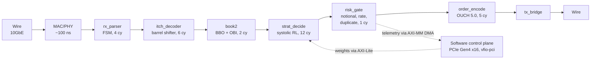

# Thesis Deep Dive: Defense Dossier

**Thesis:** AI-Integrated FPGA for Market Making in Volatile Environments (Stevens, FE900).
**Repo cited in the thesis:** github.com/shreejitverma/trishul-ultra-hft-project (verify it is current and consistent before the interview).
**Purpose of this document:** explain the thesis fluently at any depth, and survive cross-examination, including on the thesis's own internal inconsistencies.

Companion to `interview.md` section 3B (the honesty ledger and landmines live there; this file is the full technical dossier).

---

## 1. The layered pitch

Have three depths ready and let the interviewer choose how deep to go.

**10 seconds:**

> "I built a hybrid FPGA plus C++ market-making system: the entire tick-to-trade path runs in RTL at about 90 nanoseconds of logic latency, with a reinforcement-learned quoting policy compiled into a fixed-point systolic array, gated by a hardware risk engine."

**60 seconds:**

> "The thesis attacks the tension between adaptive intelligence and deterministic latency. The critical path is pure hardware: an FSM parser strips Ethernet/IP/UDP at line rate, an ITCH 5.0 decoder with a barrel shifter handles unaligned messages, a BRAM-backed module maintains best bid and offer plus book imbalance, a quantized 3-layer policy network runs as a fully unrolled systolic array on DSP slices, a formally verified risk gate enforces notional, rate, and duplicate checks, and an OUCH 5.0 encoder puts the order back on the wire. Everything is pipelined at 322 MHz, so worst-case latency equals average-case. The policy itself is trained offline with PPO against a synthetic multi-regime market simulator, Hawkes order flow plus regime-switching jump-diffusion prices, then quantization-aware trained to 16-bit fixed point and hot-swapped into the FPGA over PCIe without stopping the pipeline. The software control plane is a thread-per-core C++ engine with lock-free SPSC queues, hugepage ring buffers, and an async logger, used for training, backtesting, and telemetry."

**Five minutes:** walk the packet narrative in section 2, then the RL formulation in section 4, then the results in section 5, volunteering the synthetic-data caveat at the results step.

---

## 2. The end-to-end narrative: follow one packet

Be able to tell this story on a whiteboard without notes.
Numbers in cycles are at 322.26 MHz, where one cycle is about 3.1 ns.

Rendered view of the pipeline (29 logic cycles, about 90 ns, plus about 100 ns PHY):



```text
Wire (10GbE) -> MAC/PHY (~100 ns fixed)
  -> rx_parser      (4 cycles)  FSM peels Ethernet (EtherType 0x0800),
                                IPv4 (protocol 17, checksum validated),
                                UDP (dest-port whitelist filters multicast feeds);
                                AXI-Stream handshake (TVALID/TREADY/TLAST)
  -> itch_decoder   (6 cycles)  512-bit barrel shifter / sliding window aligns
                                unaligned ITCH 5.0 messages across 64-bit words;
                                decodes Add Order ('A') and Order Executed ('E');
                                big-to-little endian swap in combinatorial wiring;
                                emits normalized 128-bit tick {price, qty, side, order id}
  -> book2          (2 cycles)  dual-port BRAM / registers hold price levels;
                                updates Best Bid/Offer and computes Order Book
                                Imbalance (OBI); streams BBO state to the RL core
  -> strat_decide  (12 cycles)  4-stage pipelined systolic array:
                                1. feature normalization to [-1,1] via bit shifts
                                2. hidden layer 1: parallel MACs on 32 DSP48 slices
                                3. hidden layer 2: pruned weight matrix
                                4. softmax/threshold -> action
                                16-bit fixed-point weights (QAT), PWL activation in LUTs
  -> risk_gate                  single-cycle checks: notional exposure limit,
                                token-bucket message rate limit, fat-finger price/qty
                                bands, Bloom-filter duplicate suppression, kill switch;
                                SVA formal properties prove no order bypasses it
  -> order_encode   (5 cycles)  packs NASDAQ OUCH 5.0 Enter Order, endian conversion
  -> tx_bridge                  inserts inter-frame gap, feeds XGMII/MAC
-> Wire
```

Internal logic is 29 cycles, about 90 ns; with PHY both ways the thesis states tick-to-trade under 200 ns.

The action emitted maps to one of three quoting behaviors: skew quotes toward anticipated momentum (OBI signal), widen the symmetric spread under volatility bursts (Hawkes detection), or quote one-sided to passively unwind inventory near limits.

**Control plane around it:** PCIe Gen4 x16 via `vfio-pci`; AXI-Lite MMIO writes model weights and risk parameters (hot-swap without pipeline stop); AXI-MM DMA into hugepage host RAM carries 1 ns-precision timestamps and execution telemetry out.
PTP servo core syncs the FPGA clock to a grandmaster; a PI loop corrects thermal drift.

**Verification:** UVM constrained-random testbench; golden-model comparison, cycle-by-cycle, of the systolic array against the bit-accurate C++ reference (LSB mismatch fails the run); SVA formal properties on the risk gate; timing closure with positive slack > 0.2 ns across PVT corners on a Kintex UltraScale+ target.

---

## 3. Chapter-by-chapter summary

### Ch 1-2: Introduction and literature review

Problem: RL-based market making adapts well but is too slow in software; FPGAs are fast but traditionally run static logic.
Gap claimed: little rigorous work on AI-FPGA integration under extreme volatility and flash-crash conditions.
Contribution: an integrated RL-FPGA framework evaluated across volatility regimes.
The intro also sketches the full platform vision: kernel-bypass ingestion, in-memory order book with Replica A/B failover, a lock-free pub-sub event stream feeding trading logic, FPGA engines and smart router, pre-trade risk, OMS, monitoring with a latency dashboard.

### Ch 3: Market microstructure and stochastic foundations

- LOB as a set of (price, qty, arrival time, side); events: limit arrivals, cancels, market orders; price-time priority formalized, with queue position driving fill probability, which motivates the latency work.
- Order arrivals as a point process; upgraded from Poisson to a self-exciting **Hawkes process**: lambda(t) = lambda0 + sum over past events of alpha * exp(-beta * (t - t_i)); branching ratio alpha/beta < 1 for stationarity.
- **Avellaneda-Stoikov with the full derivation** (the "masterclass" section): mid-price as arithmetic Brownian motion; wealth SDE with fill indicators; exponential (CARA) utility; HJB equation; exponential ansatz separates cash; fill intensity lambda(delta) = A * exp(-k * delta); Taylor expansion linearizes; result:
  - Reservation price: r = S - q * gamma * sigma^2 * (T - t).
  - Optimal spread: psi* = (2/gamma) * ln(1 + gamma/k) + gamma * sigma^2 * (T - t).
  - Long inventory lowers both quotes; volatility widens the spread.
- Microstructural signals: **OBI** rho = (Vb - Va) / (Vb + Va) as a short-horizon direction proxy; **VPIN-style toxicity** for informed-flow detection; the **winner's curse** framing of adverse selection: you get filled exactly when it is worst.
- The RL agent's job is to refine the A-S baseline using these non-Gaussian signals.

### Ch 4: Volatility dynamics and synthetic data generation

- Four market profiles used for training and evaluation:

| Profile | Price model | sigma | Jump intensity | Order flow |
|---|---|---|---|---|
| Low vol | GBM | 0.15 | 0 | Poisson |
| Medium vol | Heston | 0.35 | 0 | Hawkes (alpha 0.3) |
| High vol | Merton jump-diffusion | 0.65 | 5 | Hawkes (alpha 0.6) |
| Extreme stress | Jump-diffusion | 1.25 | 20 | Toxic Hawkes (alpha 0.9) |

- Regime transitions via a continuous-time Markov chain (3x3 rate matrix).
- Hawkes events generated with **Ogata's thinning algorithm** (sample from a homogeneous bound, accept with ratio lambda(t)/lambda_max).
- Model selection via AIC/BIC: GBM too thin-tailed (missed 94% of extreme innovations), Heston good for clustering but 2.4x DSP cost, Hawkes-Merton hybrid won.
- Synthetic OBI is generated so imbalance leads price innovation, giving the agent a learnable lead-lag signal.
- Rationale for synthetic data: scenario coverage beyond one realized path, anti-overfitting, and the ability to push message rates to line-rate saturation for hardware stress testing; calibration of base parameters via MLE on tick-level profiles.

### Ch 5: Reinforcement learning formulation

- MDP: state includes OBI, rolling volatility, inventory, previous spread, mid-price innovation, time-to-horizon, and VPIN toxicity.
- Action: discretized pair (spread psi from a finite ladder, skew theta shifting the whole quote envelope); discretization is deliberate so the output layer stays small enough for hardware.
- Reward: R = delta PnL - eta * q^2 (inventory penalty) - zeta * adverse-selection/instability cost.
- Algorithm: **PPO** (actor-critic, clipped surrogate objective with epsilon 0.1-0.2, GAE for advantage estimation); trained with Stable Baselines3 (MlpPolicy, lr 3e-4, n_steps 2048, batch 64, gamma 0.99).
- Hardware-aware compression: **quantization-aware training** to 16-bit fixed point (straight-through estimator), plus **iterative magnitude pruning** for structured sparsity so the FPGA skips dead multiplies.

### Ch 6: FPGA matching-engine architecture

The pipeline of section 2, plus: deeply pipelined design makes WCET equal average-case; latency decomposition formula (sum of per-module cycles over clock frequency plus PHY); hardware timestamping at ingress/egress builds the empirical latency PDF; hybrid co-design via vfio-pci and a cycle-accurate C++ simulator for pre-synthesis validation.

### Ch 7: FPGA implementation detail

FSM cycle-by-cycle parsing with inline IPv4 checksum validation and programmable port whitelist; 512-bit barrel shifter in the decoder; systolic array on DSP48 slices with PWL activations in LUTs; the three strategy behaviors (skew, widen, passive liquidation); hardware risk management (notional multiplier check, token-bucket rate limiter explicitly framed as preventing quote stuffing, inventory hard limits with liquidation-only mode); SEC 15c3-5 compliance gate at egress (credit limit with kill switch, fat-finger volatility bands, Bloom-filter duplicate detection); floorplanning (P-blocks) for timing closure; UVM plus golden-model plus SVA formal verification.

### Ch 8: Software control plane

Thread-per-core with `pthread_setaffinity_np`, `isolcpus`, `nohz_full`; SPSC lock-free queues (acquire/release, cache-line-padded head/tail, power-of-2 capacity, bitwise AND indexing); hugepage ring buffer with zero-copy pointer arithmetic emulating DPDK/Onload-style bypass; branchless ITCH decode via dispatch table; flat-array L2 book with O(1) updates and a diff generator that only wakes the strategy on BBO innovation; MKL-backed software inference path; pre-trade checker mirroring the hardware gate; async logger on a background core; AVX2 vectorized signal engine; smart order router steering symbols between FPGA and CPU paths by adverse-selection sensitivity; co-location and PTP discussion.

### Ch 9: Results

Environment: Apple M3 as stated proxy for x86 servers; 100M synthetic events via Hawkes.
Software-path tick-to-trade: p50 822 ns, p99 1180 ns (stage breakdown: ingress 150, ITCH parse 240, book 160, inference 122, risk and order gen 150 at p50).
Throughput: linear to 7.5M msg/s, saturation about 8M from PCIe/DMA backpressure, sustained 1.21M under bursty Hawkes load; software baseline saturates at 1.4M.
Jitter: std dev under 500 ns with 100k logs/sec telemetry load.
Strategy (50 seeds, 252 simulated days, risk-free 4.25%): Sharpe 1.85, Sortino 2.10, Calmar 2.98, CAGR 12.5%, max drawdown 4.2%, win rate 55.3%.

### Ch 10: Comparative benchmarking

Three-way comparison: traditional software stack (with kernel bypass and pinning), static-logic FPGA, and the adaptive hybrid.
Consolidated table: median T2T 50,000 ns / 950 ns / 850 ns; p99 250,000 / 1,100 / 910 ns; Sharpe 0.45 / 1.10 / 1.85; drawdown 12.4% / 8.2% / 4.2%; capital utilization 65 / 78 / 92%.
Little's law explanation of software queue collapse under bursts; flash-crash PnL comparison (traditional takes toxic fills, static hardware is fast but does not widen, adaptive widens proactively).
Stated limitations: PCIe/DMA saturation spikes latency from about 860 ns to about 400 us; DSP/BRAM budget caps model size at 3 layers (bigger nets break 322 MHz timing or force MAC reuse and higher latency); cold-start jitter until caches and branch predictors warm, motivating a pre-session warm-up stream.

### Ch 11: Conclusion

Three claimed contributions: the MDP plus A-S synthesis with OBI/VPIN features; the hardware-software architecture with QAT-quantized systolic inference; empirical validation (also states 400% cumulative PnL improvement over the software baseline and "13.3 ns" inference).
Future work: cross-asset correlation in hardware for statistical arbitrage, on-chip SGD for online learning, and DeFi/CLOB-on-chain integration.

---

## 4. Equations and concepts to know cold

Write these from memory the night before.

1. **Reservation price:** r = S - q * gamma * sigma^2 * (T - t).
   Long inventory pushes your indifference price down, so you quote lower on both sides to shed risk.
2. **Optimal A-S spread:** psi* = (2/gamma) * ln(1 + gamma/k) + gamma * sigma^2 * (T - t).
   First term: fill-probability economics (k is book density in the fill-intensity model lambda(delta) = A * e^(-k delta)); second term: volatility risk premium.
3. **Hawkes intensity:** lambda(t) = lambda0 + sum_i alpha * e^(-beta (t - t_i)); branching ratio alpha/beta < 1 for stationarity; generated via Ogata thinning.
4. **OBI:** rho = (Vb - Va) / (Vb + Va) in [-1, 1]; positive rho signals buy pressure; used to shift the reservation price beyond inventory skew.
5. **VPIN intuition:** persistent one-sided aggressive volume implies informed flow; high toxicity means widen or pull quotes.
6. **Reward:** R = delta PnL - eta * q^2 - zeta * cost(action).
7. **PPO clipped objective:** L = E[min(w * A, clip(w, 1 - eps, 1 + eps) * A)] with w the new/old policy probability ratio; the clip prevents destructive policy jumps in noisy financial data; GAE for low-variance advantages.
8. **Quantization:** Q(x) = clip(round(x/s + z), qmin, qmax); QAT trains through the quantizer with a straight-through estimator so the fixed-point network keeps accuracy.
9. **Latency identity:** total = sum(cycles_i) / f_clk + PHY; at 322.26 MHz one cycle is about 3.1 ns; 29 logic cycles is about 90 ns.
10. **Little's law (used in ch 10):** L = lambda * W; when arrival rate rises and per-item latency degrades, queue depth explodes, which is why software stacks lose observability in bursts.
11. **Why 322.26 MHz:** it is the 10GbE line-rate clock for a 32-bit datapath (10.3125 Gbps / 32); know this in case someone asks where the number comes from.

---

## 5. Master numbers table

| Quantity | Value | Where it comes from |
|---|---|---|
| Clock | 322.26 MHz (about 3.1 ns/cycle) | 10GbE line rate |
| Module cycles | parser 4, decoder 6, book 2, RL 12, encoder 5 (29 total) | Ch 6 |
| Internal logic latency | about 90 ns | 29 cycles x 3.1 ns |
| PHY latency | about 100 ns | PMA/PCS fixed |
| FPGA tick-to-trade | < 200 ns | Analytical + RTL simulation |
| Software T2T | p50 822 ns / p99 1180 ns (ch 9); 850 / 910 ns in ch 10 table | Simulation on M3 |
| Throughput | linear to 7.5M msg/s; saturation about 8M; sustained 1.21M under bursts | Ch 9 |
| Saturation failure mode | about 860 ns to about 400 us latency spike (PCIe/DMA backpressure) | Ch 10 |
| Jitter | std < 500 ns under 100k logs/s | Ch 9 |
| Network | 10GbE, ITCH 5.0 in, OUCH 5.0 out, UDP multicast ingress | Ch 6-7 |
| NN | 3 layers, 32 DSP slices/hidden layer, 16-bit fixed point, PWL activations | Ch 5, 7 |
| PPO training | SB3, lr 3e-4, n_steps 2048, batch 64, gamma 0.99 | Appendix |
| Strategy results | Sharpe 1.85, Sortino 2.10, Calmar 2.98, MDD 4.2%, win 55.3%, 50 seeds, 252 days | Ch 9 |
| PCIe | Gen4 x16, about 31.5 GB/s, vfio-pci, AXI-Lite config + AXI-MM DMA telemetry | Ch 7 |
| FPGA target | Kintex UltraScale+, positive slack > 0.2 ns across PVT | Ch 7 |

---

## 6. Internal-consistency ledger

These are discrepancies inside the thesis itself.
An interviewer who reads closely can use any of them; decide your one-line resolution for each in advance, and where possible lead with the ground-truth number so the discrepancy never comes up.

1. **RL inference latency: 12 cycles (about 37 ns) in ch 6, "15 ns target" in ch 7, "13.3 ns" in ch 11.**
   Ground truth to lead with: the cycle counts; the full inference stage is 12 cycles, about 37 ns.
   If pressed on the smaller figures: the smaller numbers refer to the MAC array core rather than the full stage including normalization and thresholding, and the editorial inconsistency is yours to own in one sentence, not defend.
2. **State dimension: "12-dimensional feature vector" in ch 9 versus 7 features enumerated in ch 5.**
   Resolution: the enumerated seven are the core features; the implementation carried additional derived features (e.g., multi-window volatility or lagged imbalances); check the repo and say precisely which, or own the discrepancy.
3. **Two different software p50s: 822 ns (ch 9) versus 850 ns (ch 10 table).**
   Resolution: different runs/configurations; quote 822/1180 as the primary measured pair and treat ch 10's as the comparative-run numbers.
4. **The hardware "order book" (`book2`) is effectively a BBO register update from an already-normalized record**, while the fuller L2 book with flat-array price levels lives in software.
   If asked "where is book building actually done": the hardware maintains BBO plus imbalance state needed by the policy at wire speed; full L2 depth aggregation is the software book; do not claim a full matching book in gates.
5. **Appendix listings are simplified relative to the prose** (the appendix parser assumes aligned headers; `strat_decide` in the appendix is a 2-feature single-MAC illustration versus the 3-layer systolic array described in the text).
   Resolution to state proactively if code comes up: the listings are minimal illustrative versions; the repo carries the fuller versions; make sure that is actually true before saying it.
6. **The risk gate's notional accumulator only ever increases** (no decrement on fills, cancels, or position reduction) in both the Verilog and C++ shown.
   If probed: it tracks gross submitted notional as a conservative session bound, not net exposure; a production version would decrement on cancels and net on fills; volunteering this improvement unprompted turns a gap into judgment.
7. **"400% cumulative PnL improvement" (ch 11) is a synthetic-benchmark artifact.**
   Never quote it as a real-world claim; if raised, immediately anchor it to the simulated three-way comparison and pivot to the risk-adjusted metrics with confidence intervals.
8. **AVX2/MKL text versus Apple M3 benchmark host** (also in interview.md 3B): check the repo for what compiled where (x86 paths versus ARM/NEON or scalar fallbacks) and have the exact answer.
9. **"Sub-10 us" on the resume versus sub-microsecond claims here:** one sentence, once: the resume is a conservative umbrella; measured software path is about 0.8-1.2 us in simulation; FPGA path sub-200 ns analytically.

---

## 7. Cross-examination bank

Organized by the angle of attack.
Practice answering out loud; each answer should be 30-60 seconds, lead with the direct answer, and volunteer the honest caveat before it is extracted.

### A. Systems and hardware drills (Craig / George territory)

**"Why 322.26 MHz?"**
It is the 10GbE line-rate clock for a 32-bit datapath; the design keeps the whole pipeline synchronous to the MAC clock so there are no clock-domain crossings on the critical path.

**"Walk me through what happens when an ITCH message straddles two bus words."**
The decoder keeps a sliding-window shift register and a barrel shifter aligns the message head to a fixed position, so field extraction is single-cycle regardless of arrival alignment; this is the standard hardware answer to variable-length, unaligned protocols.

**"Why is WCET equal to average case, and why does that matter?"**
Every stage is a fixed-cycle pipeline with no stalls, no caches, no arbitration on the critical path, so latency is a constant, not a distribution; in trading terms, the p99 equals the p50, which is exactly the property software cannot give you, and it matters most in bursts, when software tails blow out and quotes go stale.

**"Where does your design break?"**
Two places, and I measured both: the PCIe/DMA drain rate saturates around 8M msg/s, at which point hardware backpressure spikes latency from about 860 ns to about 400 us; and the DSP/BRAM budget caps the policy at 3 layers at this clock; a wider net either fails timing or forces MAC reuse, linearly increasing inference latency.
(Volunteering these unprompted is the strongest senior signal available from this thesis.)

**"Why a systolic array and not just sequential MACs?"**
Full unrolling turns inference into a fixed-depth pipeline: one new inference can enter per cycle and the answer emerges N cycles later, deterministically; sequential MAC reuse would cut resource use but multiply latency and introduce schedule-dependent timing.

**"How do you know the hardware model matches the trained model?"**
Bit-accurate golden-model verification: the RTL output is compared cycle-by-cycle against the C++ reference; any LSB mismatch fails; quantization effects are handled during training via QAT rather than post-hoc conversion.

**"What is formally verified, exactly?"**
Safety properties in SVA proving the execution path is logically gated by the risk module, i.e., no order can reach the encoder without passing the checks; formal covers the gate's bypass-impossibility, not the whole design.

**"How would you deploy this on a real board? What changes?"**
Real MAC/PHY IP and pin constraints, real hardware timestamping at the PHY for wire-truth measurement, A/B feed arbitration for redundant multicast, session-layer logic for the order port (OUCH over SoupBinTCP), and a much larger verification campaign against recorded pcaps; the architecture does not change, the periphery does.

**"Your SPSC queue: why acquire/release and not seq_cst? Why does the pop side load head with acquire?"**
Release on the producer's head store publishes the slot write; acquire on the consumer's head load ensures the slot read cannot be hoisted before it observes the index; seq_cst would add a total-order guarantee nothing in a two-thread ring needs, at the cost of full fences on x86 stores; head and tail are alignas(64) so the two sides do not false-share.

### B. Financial engineering drills (could come from anyone; Steven for intuition, George for math)

**"Derive or explain the reservation price."**
From A-S: CARA utility plus arithmetic Brownian mid-price; the ansatz separates cash; a second-order Taylor expansion of the inventory adjustment yields r = S - q gamma sigma^2 (T - t); intuition: each unit of inventory costs you variance for the remaining horizon, scaled by risk aversion, so your indifference price shifts against your position.

**"Why does the spread widen with volatility?"**
The gamma sigma^2 (T - t) term: holding inventory across a fill is riskier when variance is higher, so you charge more for liquidity; the other term, (2/gamma) ln(1 + gamma/k), prices the fill-intensity tradeoff: a denser book (higher k) means quoting further out kills fill probability faster.

**"Why RL at all if A-S has a closed form?"**
A-S assumes constant parameters and state-independent Poisson arrivals; real flow is self-exciting and state-dependent, and signals like imbalance and toxicity are non-linear; the agent is initialized around the A-S baseline and learns residual structure, e.g., widening before Hawkes bursts and skewing on imbalance, which is precisely what the comparative chapter tests against a static-rule FPGA.

**"What is VPIN actually measuring, and what are its problems?"**
Volume-synchronized imbalance of buyer- versus seller-initiated flow as a proxy for informed trading; criticisms include bucket-size sensitivity and debates over its flash-crash predictive power; in the thesis it is a feature, not an oracle, and the honest statement is that it proxies one-sidedness of aggression, which correlates with adverse fills.

**"Your Sharpe of 1.85: do you believe it?"**
As a statement about the synthetic environment, yes, with the confidence intervals from 50 seeds; as a statement about live markets, no, and the thesis says so: the simulator's fill model and lead-lag imbalance signal are constructions; what I believe transfers is the ordering, adaptive beats static beats slow, and the mechanism, spread widening before toxicity arrives.

**"Why discretize the action space?"**
Hardware: a small discrete output layer keeps the systolic array shallow and the argmax a threshold circuit; finance: discrete spread/skew ladders are also how real quoting engines parameterize, and it regularizes the policy.

**"Your reward penalizes q squared: why quadratic?"**
It approximates the variance cost of inventory (consistent with the gamma sigma^2 term in A-S), keeps the penalty smooth and symmetric, and empirically forces mean-reverting inventory; the zeta term separately penalizes being picked off, so the agent distinguishes inventory risk from adverse selection.

### C. Honesty and methodology drills (highest stakes; answers must be instant and non-defensive)

**"Was this ever connected to a real exchange feed?"**
No; evaluation is fully synthetic by design, disclosed in the thesis; the generator is calibrated to tick-level statistical profiles and deliberately extends beyond them for stress coverage; the ITCH/OUCH interfaces are real protocol implementations, so connecting to a recorded or live feed is periphery work, not architecture work.

**"Did the FPGA numbers come from real hardware?"**
RTL simulation plus synthesis timing closure on a Kintex UltraScale+ target; the sub-200 ns figure is cycle counts plus nominal PHY latency; not wire-measured on a physical board, and I will say exactly how I would measure it: hardware timestamps at ingress and egress PHY, PDF over millions of events.

**"So what did you actually run, and where?"**
The C++ control plane and the full simulation pipeline ran end-to-end (that produced the 822/1180 ns and throughput numbers, on an M3 host as a stated proxy); the RTL ran in simulation with UVM; training ran in Python/SB3.
(Verify against the repo and adjust this answer to exactly what is true.)

**"Why should we believe simulation-derived latency at all?"**
For the FPGA path, cycle counts at a closed clock are not estimates, they are the design; the uncertainty lives in the PHY figure and in board-level effects like PCIe interactions, which is why I bound rather than point-claim it, and why the stated next step is board measurement.

### D. Exchange-side reframes (Prediction Co specific)

**"How does any of this transfer to building an exchange rather than trading on one?"**
Directly, in four ways: I implemented both canonical exchange protocols (ITCH out of an exchange, OUCH into one), so I have been on the consuming and producing end of exchange interface design; the risk gate is a gateway-style pre-trade check layer, including rate limiting and duplicate suppression, which is exactly what an exchange runs per session; the replicated in-memory book with an event-stream backbone is the sequenced-log pattern an exchange core uses; and the determinism discipline, WCET equals average, golden-model verification, is what a matching engine needs for replay and failover.

**"Your token bucket prevents quote stuffing; as an exchange, how would you think about that?"**
As the venue, rate limits become a fairness and stability tool: per-session token buckets at the gateway, priced or tiered message quotas, and surveillance for manipulative patterns; my thesis implements the participant-side version of the same primitive in hardware, one clock cycle per check.

---

## 8. Weakness-to-strength reframes (memorize the moves)

| Attack | Move |
|---|---|
| "It is all simulation" | Own it in one breath, then: "the design decisions it validates, pipelining, quantization, risk gating, backpressure behavior, are exactly the ones that survive contact with real hardware; and I measured my system's breaking points, which most prototypes never do" |
| "The AI is a gimmick" | "The honest research question was whether adaptivity pays for its complexity; ch 10 tests it against a static-rule FPGA, same latency class, and the delta is the answer; and the deterministic risk gate means the probabilistic component can never emit an unchecked order" |
| "This is a student project" | Never argue the label; enumerate the discipline instead: UVM, golden-model bit-accuracy, SVA formal on the safety path, PVT-corner timing closure, 50-seed confidence intervals, documented failure modes |
| "You did everything solo; can you work in a team?" | BNP (production stack integration), LogiNext (led 12), and the thesis proves end-to-end ownership; the combination is the Principal profile: can own a subsystem alone and can lead people |
| Any caught inconsistency | One sentence of ownership, zero defensiveness, immediate pivot to the ground-truth number; the meta-message "I know exactly what is solid and what is editorial" is worth more than a clean record |

---

## 9. Rapid-fire self-test (30 seconds each, out loud)

- [ ] Walk the packet: every module, its job, its cycle count.
- [ ] Why does WCET equal average-case, and what breaks that property?
- [ ] Reservation price formula and its intuition.
- [ ] Optimal spread formula: what does each term price?
- [ ] Hawkes process: formula, branching ratio, why it fits order flow, how Ogata thinning works.
- [ ] The four synthetic regimes and what each stresses.
- [ ] PPO in three sentences: ratio, clip, GAE.
- [ ] QAT: what problem, what mechanism.
- [ ] The SPSC queue: orderings and why, padding and why.
- [ ] The two breaking points of the system with numbers.
- [ ] What was measured, what was simulated, what was analytical: the three-bucket answer.
- [ ] The 12-cycle versus 13.3 ns resolution.
- [ ] Where the "order book" really lives (hardware BBO versus software L2).
- [ ] Why the risk gate's gross-notional design is conservative and what production would change.
- [ ] The four exchange-side transfers of the thesis.
- [ ] Your one-breath synthetic-data disclosure.

---

## 10. Pre-interview verification checklist (do tonight)

- [ ] Open the repo the thesis cites (trishul-ultra-hft-project): confirm it is public, the README matches the thesis story, and the fuller module versions the "illustrative listings" answer relies on actually exist.
- [ ] Confirm what compiled and ran on the M3 versus what is x86-only (AVX2/MKL paths); write the one-sentence answer down.
- [ ] Decide your resolutions for ledger items 1-3 (inference latency, state dimension, dual p50s) after checking the code, so your answers are facts rather than reconstructions.
- [ ] Re-derive reservation price and optimal spread once on paper.
- [ ] Say the 60-second pitch and the packet walk out loud, twice each.

---

## 11. Concept explainers: thirteen questions, answered in depth

Every term in the pitch is a potential "explain that" follow-up.
Each answer below has three layers: what the thing is, how it works mechanically, and why the thesis uses it.
Lead with the direct definition, then go as deep as the interviewer pulls.

### Q1. How do you establish and connect to a multicast feed, with code

**What it is.**
Exchange market data (Nasdaq TotalView-ITCH included) is published over UDP multicast: the exchange sends each packet once to a group address (Nasdaq uses the 233.54.12.0/24 range), and the network replicates it to every subscribed host.
Subscribing means telling the kernel to join the group, which makes the NIC accept the group MAC address and makes the kernel emit an IGMP membership report so upstream switches (via IGMP snooping) and routers forward the stream to your port.

**The code (POSIX sockets, the software baseline).**

```cpp
#include <arpa/inet.h>
#include <netinet/in.h>
#include <sys/socket.h>
#include <unistd.h>
#include <cstring>

int join_multicast_feed(const char* group_ip,    // e.g. "233.54.12.111"
                        uint16_t   port,         // e.g. 26477
                        const char* local_if_ip) // IP of the NIC facing the feed
{
    int fd = socket(AF_INET, SOCK_DGRAM, 0);

    // Allow multiple processes (e.g. A/B arbiters, capture) on the same group/port.
    int reuse = 1;
    setsockopt(fd, SOL_SOCKET, SO_REUSEADDR, &reuse, sizeof(reuse));

    // Large receive buffer: multicast has no flow control, so the socket buffer
    // is the only slack between a burst and packet loss.
    int rcvbuf = 64 * 1024 * 1024;
    setsockopt(fd, SOL_SOCKET, SO_RCVBUF, &rcvbuf, sizeof(rcvbuf));

    // Bind to the GROUP address, not INADDR_ANY, so this socket only ever
    // receives this group's traffic (avoids cross-feed delivery on shared ports).
    sockaddr_in addr{};
    addr.sin_family      = AF_INET;
    addr.sin_addr.s_addr = inet_addr(group_ip);
    addr.sin_port        = htons(port);
    bind(fd, reinterpret_cast<sockaddr*>(&addr), sizeof(addr));

    // The join: kernel programs the NIC filter and sends the IGMP report.
    ip_mreq mreq{};
    mreq.imr_multiaddr.s_addr = inet_addr(group_ip);
    mreq.imr_interface.s_addr = inet_addr(local_if_ip); // pin to the feed NIC
    setsockopt(fd, IPPROTO_IP, IP_ADD_MEMBERSHIP, &mreq, sizeof(mreq));

    return fd;
}

// Receive loop: recvfrom() per datagram; each datagram carries a MoldUDP64
// header (session, sequence number, message count) followed by ITCH messages.
```

**Details worth volunteering.**
- Pinning `imr_interface` (or using `ip_mreqn` with an interface index) matters on multi-NIC hosts; otherwise the join lands on the default route interface and you silently receive nothing.
- ITCH rides inside MoldUDP64, which adds sequence numbers; gap detection and A/B feed arbitration happen at that layer, and a gap beyond the arbiter's reorder window triggers the retransmission or snapshot path.
- Multicast is unreliable by construction, which is exactly why section 4B of `interview.md` (gap storms) exists.

**How the thesis does it instead.**
The kernel path above costs microseconds (interrupt, sk_buff allocation, protocol stack, copy to user space).
The thesis's hardware path replaces the whole thing: the NIC-facing `rx_parser` FSM validates Ethernet/IPv4/UDP inline and filters by a programmable destination-port whitelist, which is the hardware analogue of the group join plus socket filter, at a fixed 4 cycles.
In a DPDK variant, the equivalent is a flow rule steering the group's 5-tuple to a dedicated RX queue polled from user space; the socket code remains the correct answer for "how do you join a feed" and the control-plane baseline.

### Q2. What is zero-copy, and how do you achieve it

**What it is.**
Zero-copy means payload bytes are written once into memory and every subsequent stage works on that same memory, passing ownership or pointers instead of duplicating bytes.
The enemy is the standard kernel path, which copies at least twice per packet: NIC DMA into a kernel sk_buff, then `copy_to_user` into the application buffer, plus the cache pollution both copies cause.

**Why copies hurt at this latency scale.**
A copy costs memory bandwidth, evicts hot cache lines, and adds latency proportional to message size; at millions of messages per second the copy path also saturates memory controllers long before the NIC saturates.
Worse for tails: copies interact with allocation, and allocation interacts with page faults and the allocator lock, so copy-heavy paths have fat p99s.

**The standard techniques.**
- Map the NIC's descriptor rings and packet buffers directly into user space (DPDK, Solarflare Onload/ef_vi, AF_XDP): the NIC DMAs into user-visible hugepage memory, and the application reads the frame in place; zero kernel involvement per packet.
- Within the application, pass fixed-size slots or indices through queues, never message bodies: a producer writes a tick into a pre-allocated slot, publishes the index through an SPSC queue, and the consumer reads the same cache lines.
- `mmap`, `sendfile`, and `MSG_ZEROCOPY` are the general-purpose kernel variants; they matter for throughput systems, less for this latency class.

**How the thesis achieves it.**
Chapter 8's hugepage ring buffer (Q12) emulates the DPDK/Onload model: packets land in a pre-allocated, pre-faulted hugepage arena; parsing produces a normalized tick record written in place; SPSC queues carry indices between pinned threads; nothing is copied between ingest and strategy.
On the hardware side zero-copy is trivially true by construction: data flows through AXI-Stream register stages, and the only "copy" is the DMA writing telemetry into host hugepage memory, once.
One-sentence version: "zero-copy means the payload is written once and referenced thereafter; I got it with hugepage-backed pre-allocated buffers and index-passing SPSC queues in software, and by construction in RTL."

### Q3. The sliding-window shift register and the barrel shifter

**The problem they solve.**
ITCH 5.0 messages are variable length (an Add Order is a different size from an Order Executed), and the wire delivers fixed-width bus words (64-bit words into a 512-bit window in this design).
So a message boundary can land anywhere inside a word, and a single message can straddle two words; a naive byte-by-byte state machine would take a variable number of cycles per message, destroying the fixed-latency property.

**The sliding-window shift register.**
A wide register (512 bits here) that accumulates consecutive incoming bus words, holding enough history that any message currently being decoded is fully present in the window regardless of where it started.
As messages are consumed, a byte-offset pointer advances by each message's length; when the offset passes a word boundary, the window shifts a word out and shifts the next word in.
It is the hardware equivalent of a lookahead buffer over a byte stream.

**The barrel shifter.**
A combinational circuit that shifts or rotates an N-bit word by any amount in a single cycle, built as log2(N) stages of 2-to-1 multiplexers: stage 1 optionally shifts by 1, stage 2 by 2, then 4, 8, and so on, with the shift amount's binary digits selecting each stage.
For a 512-bit window that is 9 mux stages, pure combinational logic with no clocked iteration.
Contrast with a serial shifter, which would need up to N cycles: the barrel shifter buys constant time for the cost of mux area.

**How they work together, and why it matters here.**
The byte-offset pointer feeds the barrel shifter's shift amount; the shifter rotates the window so the current message's first byte always lands at bit 0.
Downstream field extraction (message type, price, quantity, order id) then reads from fixed bit positions with plain wire taps, single cycle, no per-alignment logic.
This is why `itch_decoder` is a fixed 6 cycles for every message regardless of arrival alignment, which is a load-bearing fact for the WCET-equals-average-case claim: without it, decode latency would depend on where the packet boundary happened to fall.
This is also the standard interview answer for "how does hardware parse variable-length protocols," so know it cold.

### Q4. PCIe and DMA backpressure

**The setup.**
The FPGA produces telemetry (timestamps, execution records) that must reach host memory, and it does so via DMA over PCIe: the FPGA is a bus master writing directly into pinned hugepage buffers in host RAM, no CPU copy involved.
PCIe transfers move through a chain of finite resources: the DMA engine's internal FIFO, PCIe credit-based flow control (the receiver advertises credits per virtual channel; a sender without credits stalls), the root complex, and the host memory controller.

**What backpressure is.**
When the producer rate exceeds the drain rate of any link in that chain, the intermediate FIFOs fill; full FIFOs deassert their ready signals (TREADY in AXI terms), and the stall propagates backward stage by stage until it reaches the producer.
That is backpressure: the downstream bottleneck reaching upstream and forcing the source to slow down.
The design choice is what happens when it arrives: stall the pipeline (latency spikes), drop telemetry (data loss), or buffer more (delays the problem, adds memory).

**How it shows up in the thesis, with numbers.**
Throughput scales linearly to about 7.5M msg/s and saturates near 8M, and the saturation mechanism is exactly this: the PCIe/DMA drain path cannot keep up, hardware FIFOs fill, backpressure reaches the pipeline, and observed latency spikes from about 860 ns to about 400 us.
This is one of the two documented breaking points (the other is the DSP/BRAM budget), and volunteering it unprompted is the strongest senior signal in the whole defense.
The production-grade mitigations to name: decouple telemetry from the trading path with a dedicated FIFO that drops-with-counter rather than stalls (never let observability block orders), conflate telemetry under pressure, size the DMA ring for burst duration, and monitor FIFO high-water marks as a first-class metric.
Note the parallel: this is the participant-side version of the same lesson as exchange market data (interview.md 4B): the auxiliary data path must never be able to stall the critical path.

### Q5. Gen4 x16, vfio-pci, AXI-Lite, AXI-MM DMA

**PCIe Gen4 x16.**
PCIe generation 4 runs 16 GT/s per lane with 128b/130b encoding, giving roughly 1.97 GB/s of usable bandwidth per lane per direction; x16 means sixteen lanes bonded, so about 31.5 GB/s each way.
It is the host-to-FPGA interconnect for everything that is not the 10GbE wire: weight uploads, risk parameter writes, telemetry DMA.
Know the scaling: each generation doubles the per-lane rate (Gen3 8 GT/s, Gen4 16, Gen5 32).

**vfio-pci.**
A Linux kernel driver framework that detaches a PCIe device from any native kernel driver and exposes its BARs (register regions), interrupts, and DMA capability directly to a user-space process through `/dev/vfio`, with the IOMMU enforcing that the device can only DMA into memory the process explicitly mapped for it.
It is how you write a user-space device driver safely: DPDK uses it for NICs, and the thesis uses it for the FPGA, so the C++ control plane maps the card's registers and rings with no custom kernel module.
The contrast to name if probed: `uio_pci_generic` does the same exposure without IOMMU protection, so a buggy DMA address can scribble over arbitrary host memory; vfio is the production answer.

**AXI-Lite.**
AXI is ARM's on-chip bus standard (AMBA), the lingua franca of FPGA IP; AXI-Lite is its minimal memory-mapped profile: single 32-bit register reads and writes, no bursts.
It is the control plane inside the chip: the PCIe bridge translates host MMIO writes into AXI-Lite transactions that hit configuration registers, which is how model weights and risk parameters are written, enabling hot-swap of the policy without stopping the pipeline.
Low bandwidth is fine because configuration is rare and small.

**AXI-MM DMA.**
AXI Memory-Mapped is the full-fat profile: burst transfers, wide data buses, out-of-order capable; an AXI-MM DMA engine autonomously moves buffers between FPGA memory and host RAM across PCIe.
It is the data plane for telemetry: nanosecond-precision timestamps and execution records stream out to hugepage host buffers in large bursts without CPU involvement.
The third family member, AXI-Stream (TVALID/TREADY/TLAST handshake, no addresses), is what the packet pipeline itself uses; being able to say "Stream for the datapath, Lite for control, MM DMA for bulk movement" shows you know why each exists.

### Q6. Kintex UltraScale+: the hardware and why it matters for performance

**What it is.**
Xilinx (now AMD) FPGA family on a 16nm FinFET process; UltraScale+ is the architecture generation, Kintex is the mid-range tier: Virtex above it (maximum capacity and transceiver count), Artix/Spartan below (cost-optimized), Kintex at the price-performance sweet spot, which is why it is a realistic single-card trading platform target.

**The on-chip resources the design leans on.**
- **DSP48E2 slices**: hardened multiply-accumulate blocks rated well above 600 MHz on this process; they carry the systolic array (Q11).
- **Block RAM**: 36 Kb dual-port SRAM blocks with single-cycle access; they back the book state (Q10); the family also offers UltraRAM (288 Kb blocks) for bigger tables.
- **GTH/GTY serial transceivers** (16.3 and up to 32.75 Gbps): a 10GbE MAC/PHY needs one transceiver lane at 10.3125 Gbps, so line-rate market data ingest is native, no external PHY chip.
- Hardened PCIe Gen3/Gen4 blocks for the host link, and abundant LUT/FF fabric for the parsers, FSMs, and PWL activation tables.

**Why it matters for performance, concretely.**
First, timing closure: the whole latency story rests on the pipeline closing at 322.26 MHz, and the thesis states positive slack above 0.2 ns across PVT (process, voltage, temperature) corners on this target; on an older or smaller part, the same RTL might close at 200 MHz and every cycle count would be worth 5 ns instead of 3.1.
Second, the resource budget is a stated design constraint, not a footnote: the DSP and BRAM inventory is exactly what caps the policy at 3 layers; a wider network either fails timing or forces MAC reuse, trading latency for capacity (documented breaking point number two).
Third, determinism: BRAM and DSP are fixed-latency hardened blocks, so using them keeps the WCET-equals-average property that is the design's core claim.
Honesty caveat, ready in one sentence: the target was used for synthesis and timing closure, not a physical board bring-up; the numbers are design-level, and the board-measurement plan (PHY hardware timestamps at ingress/egress) is the stated next step.

### Q7. The 12-dimension feature vector

**Careful: this is internal-consistency ledger item 2.**
Chapter 9 says "12-dimensional feature vector," but chapter 5 enumerates seven features; before the interview, check the repo and pin down the exact twelve, so this answer is fact rather than reconstruction.

**The seven core features the thesis enumerates (ch 5).**

1. Order book imbalance, rho = (Vb - Va) / (Vb + Va): short-horizon direction proxy.
2. Rolling realized volatility: drives the spread through the A-S sigma-squared term.
3. Current inventory q (normalized by the hard limit): drives skew and the q-squared reward penalty.
4. Previous quoted spread: gives the policy state about its own last action.
5. Mid-price innovation: the most recent price change, momentum and mean-reversion signal.
6. Time-to-horizon (T - t): the A-S terms decay with it, so the policy needs it.
7. VPIN-style toxicity: informed-flow proxy; high toxicity means widen or pull.

**The plausible remaining five (verify against the repo before quoting as fact).**
Derived variants of the above are the natural candidates and what the ledger suggests: a second volatility window (short versus long, so the agent sees vol-of-vol and regime shift), one or two lagged OBI values (making the imbalance signal a short time series rather than a point), a lagged mid-price innovation, an estimate of current Hawkes intensity or message arrival rate (burst detector), and the previous skew alongside the previous spread.
Each is computable in hardware with shifts and adds, which is the constraint that shaped the feature set in the first place.

**Why these features, structurally.**
They are exactly the inputs the A-S-plus-microstructure story needs: inventory and horizon reproduce the closed-form baseline, volatility widens, OBI skews, VPIN defends, and the lags let the network learn short dynamics; normalization to [-1, 1] happens in hardware via bit shifts as systolic stage 1.
The interview-safe framing: "seven core features are enumerated in the text; the implementation carried twelve including derived lags and multi-window volatility; the discrepancy between the two counts is editorial and I will own it in one sentence."

### Q8. Systolic arrays, and fixed-point systolic arrays

**What a systolic array is.**
A grid of small processing elements (PEs) where data flows rhythmically between neighbors on each clock, like a heartbeat (hence the name, from Kung and Leiserson): each PE does one small operation (here multiply-accumulate) and passes operands to the next PE.
The two defining properties: only local, register-to-register communication (no long wires, no shared memory bottleneck), and perfect overlap of computation with data movement, so after the pipeline fills, a new result emerges every cycle.
Matrix multiplication is the canonical fit, which is why the same structure powers Google's TPU; a neural network layer is a matrix-vector product, so it maps directly.

**How it is used here.**
`strat_decide` unrolls the 3-layer policy network into a 4-stage pipeline: normalization, hidden layer 1 as parallel MACs on 32 DSP48 slices, hidden layer 2 against a pruned weight matrix, then softmax/threshold to the discrete action.
Fully unrolled means every weight has its own multiplier: no weight fetching, no scheduling, no memory port contention; inference is a fixed 12-cycle path, and a new inference can enter every cycle behind the previous one.
The rejected alternative, sequential MAC reuse, would cut DSP count but multiply latency by the reuse factor and make timing schedule-dependent, which breaks the determinism claim; this is cross-exam answer material, phrase it as a conscious tradeoff.

**Why fixed-point.**
Floating point in FPGA fabric is expensive (a single FP32 multiply-add consumes multiple DSPs plus fabric and pipelines deeper) and unnecessary at this precision requirement.
The DSP48E2 natively multiplies 27x18-bit integers, so 16-bit fixed-point weights and activations ride the hardened silicon at full clock, one DSP per MAC.
The accuracy question is answered by quantization-aware training: Q(x) = clip(round(x/s + z), qmin, qmax) is applied during training with a straight-through estimator, so the network learns weights that are already robust to 16-bit truncation, rather than being damaged by post-hoc conversion.
Verification closes the loop: the RTL array is compared cycle-by-cycle against a bit-accurate C++ golden model, and any LSB mismatch fails the run.

### Q9. What is RTL

**Definition.**
Register Transfer Level: the abstraction at which digital hardware is designed as a set of registers (state that updates on a clock edge) and the combinational logic (pure functions of current register values) computing each register's next value.
You are not writing instructions to execute; you are describing a circuit: everything in an `always_ff` block becomes flip-flops, everything between registers becomes gates, and all of it exists and operates simultaneously.

**The toolchain.**
RTL is written in a hardware description language (Verilog/SystemVerilog here; VHDL is the other); synthesis maps it to a netlist of the target's primitives (LUTs, flip-flops, DSPs, BRAMs); place-and-route assigns physical locations and wires; static timing analysis proves every register-to-register path fits within the clock period (the "positive slack > 0.2 ns at 322 MHz" claim is exactly this proof); the result is a bitstream that configures the FPGA.
The mental model shift from software, worth saying explicitly: sequential code describes time-ordered steps, RTL describes space; parallelism is the default and sequencing is what you must construct (with FSMs and pipelines).

**Why it matters for this design.**
Cycle counts are design properties at RTL, not measurements: "the decoder takes 6 cycles" is a statement about circuit structure, verifiable in simulation and enforced by timing closure, which is why the FPGA latency figures are analytical-plus-simulation rather than estimates.
The credible-alternative question to expect: why RTL instead of HLS (compiling C++ to hardware)?
Answer: HLS is faster to write but generates schedules you do not fully control; for a design whose entire value proposition is a known-constant cycle count on the critical path, hand-written RTL is the defensible choice.

### Q10. What is a BRAM-backed module

**Block RAM.**
FPGAs contain dedicated SRAM blocks embedded in the fabric: on UltraScale+, 36 Kb per block, true dual-port (two independent read/write ports), with synchronous single-cycle access at full fabric clock.
The alternatives frame why it matters: distributed LUT RAM is tiny (64-bit chunks) and eats logic resources; UltraRAM is bigger (288 Kb) but single-clock-domain and less flexible; off-chip DRAM is milliseconds away in relative terms (tens to hundreds of cycles, variable).
BRAM is the only storage class that is simultaneously large enough for a book and deterministic at one cycle.

**"BRAM-backed" in this design.**
`book2` is the module whose state lives in BRAM: price-level records addressed by price index, plus registered best-bid/offer state and the running order book imbalance.
Dual-porting is load-bearing: one port serves the decoder's update (an Add or Execute mutating a level) while the other serves the strategy's read of BBO and OBI, same cycle, no arbitration, no stall.
That is how the book stage costs a fixed 2 cycles.

**The contrast to make, and the honesty point.**
Against software: a software book walks pointers or probes a hash map through a cache hierarchy, so its latency is a distribution (L1 hit 4 cycles, DRAM miss 200+); BRAM access is a constant, which is another pillar of WCET-equals-average.
Ledger item 4, volunteer it before they find it: the hardware `book2` maintains BBO plus imbalance, the state the policy actually consumes at wire speed; the full L2 depth book with flat-array levels lives in the software plane; do not claim a full matching book in gates.

### Q11. DSP slices: what they are and why they matter here

**What a DSP48E2 slice is.**
A hardened arithmetic block etched into the FPGA silicon (not built from LUTs): a 27x18-bit signed multiplier, a pre-adder, and a 48-bit ALU/accumulator, with internal pipeline registers, cascade paths to neighboring slices, and optional SIMD modes.
"Hardened" is the key word: it is a custom-designed circuit, so it runs at clock rates (600+ MHz on this family) and area efficiencies that the same math built from general-purpose LUTs could never reach; a LUT-fabric 16x16 multiplier would be slower, larger, and would likely be the timing-critical path that breaks 322 MHz.

**Why they are used here.**
The policy network is almost entirely multiply-accumulate: each neuron computes sum(w_i * x_i) + b.
Mapping each MAC onto one DSP slice (32 per hidden layer, per the thesis) gives three things at once: speed (the multiply meets timing with margin), density (the fabric stays free for parsers, FSMs, and the risk gate), and determinism (a DSP has fixed, characterized latency, so the 12-cycle inference figure is a hardware constant).
The cascade paths matter too: DSP slices chain accumulations to their neighbors over dedicated wiring, which is exactly the local-communication pattern the systolic array (Q8) wants; the array is, physically, a column of cascaded DSPs.
The 16-bit QAT quantization (Q8) exists precisely to fit the DSP's native integer width: format follows silicon, not the other way around.

**Their importance as a constraint.**
DSP count is a hard budget, and it is the stated reason the network is capped at 3 layers: more layers or wider layers than the DSP inventory supports would force either MAC reuse (latency multiplies, determinism degrades) or timing failure.
Framing for the interview: "the DSP budget is my model-size ceiling, and I documented it as a breaking point rather than hiding it"; and the PWL (piecewise-linear) activations in LUTs are the complementary trick, since activations are cheap comparisons and the DSPs are saved for the multiplies.

### Q12. Hugepage ring buffers, in extreme detail

Two independent ideas compose here; take them one at a time, then the composition.

**Part 1: hugepages, from first principles.**
Virtual memory maps virtual addresses to physical frames in units of pages, default 4 KB on x86-64.
Every memory access must translate its address; the TLB (translation lookaside buffer) caches recent translations, and a TLB miss triggers a hardware page-table walk: four dependent memory reads on x86-64, easily 50-100+ ns if the page-table levels are themselves cold.
Now size the problem: a 1 GB buffer in 4 KB pages is 262,144 pages, while a typical L1 data TLB holds around 64 entries; streaming through that buffer thrashes the TLB continuously, sprinkling page-walk latency across the hot path as jitter, which is exactly what a tail-latency-sensitive system cannot absorb.
A 2 MB hugepage covers 512 4-KB-pages' worth of address space in one TLB entry (1 GB hugepages exist too); the same 1 GB buffer becomes 512 entries, close to fitting in the TLB's hugepage entries entirely, so translations effectively stop missing.
Secondary benefits, each worth naming: hugepages are allocated from a reserved pool and pinned (no swapping, no lazy fault on first touch, provided you pre-fault at startup), so there are no page faults at runtime; page-table depth shrinks by one level for the walk that does happen; and pinned physically-contiguous memory is what a DMA engine needs anyway, so the same arena serves as the FPGA telemetry target (Q4, Q5).
Mechanics in Linux: reserve via `vm.nr_hugepages` or boot parameters, obtain via `mmap(MAP_HUGETLB)` or hugetlbfs, touch every page at startup, and never `malloc` on the hot path again.

**Part 2: the ring buffer.**
A fixed-size array used as a circular queue: a producer writes at `head`, a consumer reads at `tail`, both indices increase forever, and the physical slot is `index & (capacity - 1)`, with capacity a power of two so the wrap is a single AND instead of a modulo division.
Emptiness is `head == tail`; fullness is `head - tail == capacity`; using monotonically increasing indices (rather than wrapped ones) makes both checks trivial and unambiguous.
The SPSC (single-producer single-consumer) discipline makes it lock-free with only two atomics: the producer writes the slot, then stores `head` with release ordering (publishing the slot's contents); the consumer loads `head` with acquire ordering (guaranteeing it sees those contents), reads the slot, then advances `tail`.
No CAS, no locks, no syscalls; cost per message is a handful of nanoseconds.
Two mandatory refinements: `head` and `tail` live on separate cache lines (`alignas(64)`) because otherwise every producer write invalidates the consumer's cached line and vice versa (false sharing, a coherence ping-pong that dominates the queue's cost); and each side keeps a cached copy of the other's index, refreshing it only when the queue looks full or empty, which removes most cross-core traffic entirely.
Overflow policy is a design decision, not an accident: a full ring must reject or overwrite by explicit choice, with a counter, never silently.

**The composition, and why it is here.**
Back the ring's slot array with hugepage memory and both problems die at once: the queue algorithm eliminates locks, syscalls, and allocation from the message path, and the hugepage backing eliminates TLB misses and page faults from the memory path; what remains is pure cache-line traffic between two pinned cores, which is as close to the hardware floor as user-space software gets.
In the thesis it appears twice: as the software feed path (chapter 8's zero-copy arena emulating DPDK/Onload-style bypass, where packet data is written once and referenced by index thereafter, Q2), and as the DMA landing zone for FPGA telemetry (pinned, contiguous, IOMMU-mapped through vfio, Q5).
It is also the answer to the cross-exam question "why not just use a mutex-protected std::deque": every element of that alternative (lock, allocation, 4 KB pages, cache-oblivious layout) injects variance, and this design's entire thesis is that variance, not mean, is the enemy.

### Q13. PPO in extreme detail, and the whole mechanism around it

**The problem PPO solves.**
Policy-gradient methods adjust a parameterized policy pi_theta(a|s) in the direction that makes profitable actions more likely: the gradient is E[grad log pi_theta(a|s) * A(s,a)], where the advantage A says how much better an action was than the policy's average.
Vanilla policy gradients (REINFORCE) are on-policy and fragile: one noisy batch can push the policy far enough that it collapses, and financial reward streams are extremely noisy, so unconstrained steps are destructive.
TRPO fixed this with a hard KL-divergence trust region but requires second-order optimization; PPO (Schulman et al., 2017) gets the same effect with a first-order trick, which is why it became the default.

**The clipped surrogate objective, term by term.**
Define the probability ratio w_t(theta) = pi_theta(a_t|s_t) / pi_theta_old(a_t|s_t): how much more (or less) likely the new policy makes the action actually taken.
The objective is L_CLIP = E_t[min(w_t * A_t, clip(w_t, 1 - eps, 1 + eps) * A_t)], with eps = 0.1 to 0.2 in the thesis.
Read it as a pessimistic bound: for a good action (A > 0), the payoff for raising its probability is capped once w exceeds 1 + eps, so there is no incentive to over-commit to one lucky batch; for a bad action (A < 0), the penalty stops shrinking below 1 - eps, so the policy cannot "escape" a correction by jumping far away; the min takes the worse of the clipped and unclipped values, so clipping only ever removes incentive, never adds it.
Result: each update stays in a soft trust region around the data-collecting policy, using nothing but gradient descent.

**GAE: where the advantage comes from.**
A critic network V_phi(s) estimates state value; the one-step TD error is delta_t = r_t + gamma * V(s_{t+1}) - V(s_t).
Generalized Advantage Estimation blends all n-step estimators: A_t = sum over l of (gamma * lambda)^l * delta_{t+l}.
Lambda trades bias against variance: lambda = 0 is the one-step estimate (low variance, biased by the critic's errors), lambda = 1 is full Monte Carlo (unbiased, high variance); values near 0.95 are standard.
This matters double in market making, where the reward stream (PnL ticks minus penalties) is dominated by noise; without variance reduction the gradient signal drowns.

**The full training loop, as implemented (Stable Baselines3, MlpPolicy).**
1. Roll out the current policy for n_steps = 2048 environment steps, storing states, actions, log-probabilities, rewards, and value estimates.
2. Compute GAE advantages and value targets over the rollout; normalize advantages per batch.
3. For several epochs, iterate minibatches of 64 over the rollout, ascending L_CLIP, descending the value loss (V_phi versus targets, squared error), plus an entropy bonus that keeps exploration alive by penalizing premature determinism; Adam with lr 3e-4, gamma 0.99.
4. The just-trained policy becomes pi_old; collect the next rollout; repeat.
Actor and critic share the MLP trunk with separate heads; the critic exists only for training and never ships to hardware.

**The mechanism around it: environment, reward, and the path into silicon.**
The environment is the chapter 4 synthetic market: regime-switching (CTMC) between the four profiles, Hawkes order flow via Ogata thinning, jump-diffusion prices, and an OBI series constructed to lead price innovation so there is a learnable signal.
State is the feature vector of Q7; the action is a discrete (spread, skew) pair from finite ladders, discretized deliberately so the output layer stays small enough for the systolic array and the argmax reduces to a threshold circuit.
Reward is R = delta PnL - eta * q^2 - zeta * cost: mark-to-market profit, minus a quadratic inventory penalty (the RL echo of the A-S gamma-sigma-squared variance cost), minus an adverse-selection/instability term, so the agent learns to distinguish inventory risk from being picked off.
Conceptually the agent refines the Avellaneda-Stoikov closed form: A-S assumes constant parameters and memoryless Poisson arrivals, and the learned policy captures the residuals, widening before Hawkes bursts and skewing on imbalance, which is exactly what the chapter 10 comparison against a static-rule FPGA tests.
After training, the compression pipeline makes it hardware-shaped: quantization-aware fine-tuning to 16-bit fixed point (the forward pass quantizes, the backward pass uses the straight-through estimator so gradients flow), then iterative magnitude pruning for structured sparsity so the array skips dead multiplies.
The frozen weights are written to the FPGA over PCIe via AXI-Lite registers, hot-swapped without stopping the pipeline; the deployed network is verified cycle-by-cycle against a bit-accurate C++ golden model, and every action it emits still passes through the formally verified risk gate, so the learned component can never place an unchecked order.
One-breath summary for the interview: "PPO is an actor-critic policy gradient whose clipped objective bounds each update to a trust region around the current policy, with GAE for low-variance advantages; I train it offline against a regime-switching Hawkes simulator, compress it with QAT and pruning, and deploy the frozen fixed-point weights into the systolic array behind a deterministic risk gate."
