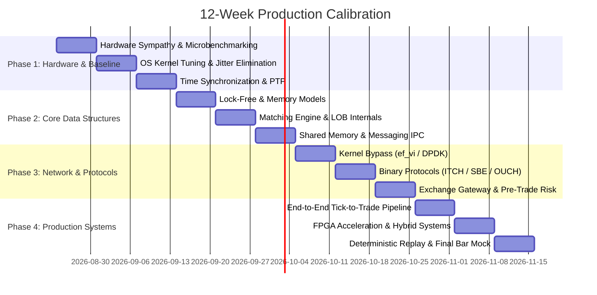

# 12-Week Production Calibration Roadmap

> [!summary]
> A structured, hardware-up calibration curriculum taking an engineer with solid C++, networking, and financial engineering foundations to production-grade, exchange-ready low-latency trading expertise.

---

## Phase 1: Hardware-Up Foundations & Measurement Rigor (Weeks 1–3)

### Week 1: Hardware Sympathy & Nanosecond Profiling
- **Topics**: [[Latency Numbers Every Trading Engineer Knows]], [[CPU Cache Hierarchy and Line Alignment]], [[False Sharing and Cache Contention]], [[CPU Timestamp Counter RDTSC Mechanics]].
- **Lab**: Implement an allocation-free C++ microbenchmarking harness using `rdtsc` + `lfence`, generating HDR histograms for cache and branch penalties.
- **Milestone Drill**: Calculate and experimentally verify the nanosecond cost of cache misses vs. cross-thread cache-line invalidation.

### Week 2: OS Tuning, Core Isolation & Jitter Elimination
- **Topics**: [[Kernel Boot Parameters for Core Isolation]], [[Linux Thread Pinning and Core Affinity]], [[Interrupt Routing and MSI-X Tuning]], [[CPU Power States and Jitter Sources]].
- **Lab**: Configure Linux boot parameters (`isolcpus`, `nohz_full`, `rcu_nocbs`, `intel_idle.max_cstate=0`) and measure latency distribution using `cyclictest`.
- **Milestone Drill**: Eliminate all >1µs spikes from an isolated core executing a tight polling loop.

### Week 3: High-Precision Time, Timestamping & Coordinated Omission
- **Topics**: [[Clock Sources and Hardware Timestamping]], [[Precision Time Protocol and White Rabbit]], [[Coordinated Omission in Low Latency Systems]], [[One-Way Latency vs Round-Trip Time Measurement]].
- **Lab**: Measure one-way packet latency across two physical machines using hardware NIC timestamps and detect Coordinated Omission in synthetic load generators.
- **Milestone Drill**: Explain mathematically and architecturally why averaging latency numbers is invalid in low-latency systems.

---

## Phase 2: Lock-Free Engines & Order Book Architecture (Weeks 4–6)

### Week 4: C++ Memory Model & Lock-Free Data Structures
- **Topics**: [[C++ Memory Model and Memory Orders]], [[Lock-Free SPSC Ring Buffer Design]], [[Allocation-Free Steady State Patterns]], [[Branchless Programming Idioms]].
- **Lab**: Build a cache-aligned, wait-free SPSC ring buffer achieving >50M messages/sec with sustained sub-15ns latency.
- **Milestone Drill**: Given an x86 assembly dump of an atomic store loop, prove why `memory_order_seq_cst` emits a costly `MFENCE` or `XCHG` while `release` is a free compile-time constraint.

### Week 5: Matching Engine Internals & Allocation-Free LOB
- **Topics**: [[Order Book Data Structures]], [[Matching Algorithms]], [[Self-Match Prevention Mechanisms]], [[Deterministic Matching Engine State Recovery]].
- **Lab**: Implement an intrusive double-linked list Limit Order Book with contiguous memory arenas, achieving <20ns order insert/cancel.
- **Milestone Drill**: Design an order book that maintains $O(1)$ price-level lookup and $O(1)$ order cancellation without heap allocation or pointer invalidation.

### Week 6: Shared Memory IPC & Deterministic Messaging
- **Topics**: [[Shared Memory IPC Topologies]], [[The LMAX Disruptor Architecture]], [[Aeron Messaging Transport]], [[The Sequenced-Stream Architecture]].
- **Lab**: Implement a high-performance POSIX shared-memory single-writer ring buffer with sequence barriers between independent processes.
- **Milestone Drill**: Design a zero-copy fan-out IPC bus where slow consumers do not stall the matching engine producer.

---

## Phase 3: Kernel Bypass, Wire Protocols & Exchange Gateways (Weeks 7–9)

### Week 7: Kernel Bypass Networking (ef_vi / DPDK)
- **Topics**: [[Network Interface Card Architecture]], [[Solarflare ef_vi Zero-Copy API]], [[DPDK Architecture for Trading]], [[UDP Multicast Market Data and A-B Feed Arbitration]].
- **Lab**: Implement an A/B feed arbitration engine reading raw Ethernet frames via DPDK/`ef_vi`, dropping duplicate sequence numbers on the fly.
- **Milestone Drill**: Trace the exact memory and PCIe pathway of an incoming packet from physical PHY to user-space L1 cache.

### Week 8: Binary Financial Protocols & Zero-Copy Codecs
- **Topics**: [[NASDAQ ITCH 5.0 Protocol Specification]], [[NASDAQ OUCH 4.2 Protocol Specification]], [[CME MDP 3.0 and Simple Binary Encoding SBE]], [[SIMD-Accelerated Text Parsing]].
- **Lab**: Write an allocation-free, in-place ITCH 5.0 parser processing raw PCAP streams at >25M messages/sec.
- **Milestone Drill**: Bitwise decode a raw hexadecimal ITCH packet buffer by hand without using struct helpers.

### Week 9: Exchange Gateways & Nanosecond Pre-Trade Risk
- **Topics**: [[Exchange Gateway Architecture]], [[Pre-Trade Risk Checks at Wire Speed]], [[Low-Latency TCP for Order Entry]], [[Drop Copy and Clearing Feeds]].
- **Lab**: Build a pre-trade risk filter executing credit, position, price collar, and leaky-bucket rate checks in <25ns.
- **Milestone Drill**: Design a multi-session order gateway sustaining 1M orders/sec with deterministic audit logging.

---

## Phase 4: End-to-End Systems, FPGAs & Production Mastery (Weeks 10–12)

### Week 10: Complete Tick-to-Trade Pipeline Integration
- **Topics**: [[Tick-to-Trade Critical Path Optimization]], [[Participant-Side Order Book Reconstructors]], [[Signal Generation and Low-Latency Pricing]], [[Order State Management and Position Tracking]].
- **Lab**: Assemble a complete software tick-to-trade pipeline (Feed Handler -> LOB -> Signal -> Risk -> Outbound Order Generator) achieving wire-to-wire latency <500ns.
- **Milestone Drill**: Conduct a latency-budget breakdown drill: account for every single nanosecond from ingress NIC to egress NIC.

### Week 11: FPGA Acceleration & Hybrid CPU-FPGA Architectures
- **Topics**: [[FPGA vs CPU in Low-Latency Trading]], [[FPGA Architecture Fundamentals for Trading]], [[FPGA Feed Handlers and Parsing Pipelines]], [[Hardware Pre-Trade Risk Checks on SmartNICs]].
- **Lab**: Design a Verilog/HLS module for line-rate packet parsing and pre-trade risk validation.
- **Milestone Drill**: Architect a hybrid trading system: explain which exact sub-tasks belong in FPGA gates vs. user-space CPU cores.

### Week 12: Production Reliability, Failover & Staff Mock Bar
- **Topics**: [[Deterministic Replay and Packet Injection Testing]], [[Latency Regression Testing in Continuous Integration]], [[Automated Kill Switches and Risk Circuit Breakers]], [[The Low-Latency C++ Technical Interview Bar]].
- **Lab**: Build an offline deterministic replay harness that proves bitwise state equality between live runs and historical replays.
- **Milestone Drill**: Comprehensive, ruthless 60-minute Staff-level systems design and C++ deep-dive interview simulation.
