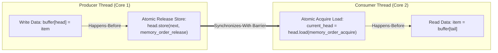

# Source Summary — C++ Concurrency in Action (2nd Edition)
**Author**: Anthony Williams (Primary Author of `boost::thread`, ISO C++ Standards Committee Member)  
**Publication**: Manning Publications  
**Category**: C++ Systems Programming & Lock-Free Concurrency

---

## Executive Summary & Core Thesis
*C++ Concurrency in Action* is the definitive, authoritative reference on multi-threaded programming in modern C++ (C++11 through C++20). Williams provides the mathematical and architectural foundations of the **C++ Memory Model**, explaining the formal definitions of *happens-before*, *synchronizes-with*, and *memory ordering semantics*.

For an ultra-low-latency C++ trading systems engineer, Williams provides the exact rules required to design lock-free Single-Producer Single-Consumer (SPSC) and Multi-Producer Multi-Consumer (MPMC) circular ring buffers, eliminate expensive mutex locks, and avoid undefined behavior and data races.

---

## Key Concepts & Formal Definitions

### 1. The C++ Memory Ordering Continuum

| Memory Order | Operations Permitted | Synchronization Guarantee | x86-64 Hardware Cost |
| :--- | :--- | :--- | :--- |
| **`memory_order_relaxed`** | Load / Store / RMW | Guarantees atomicity of the single variable only; zero ordering constraints. | Plain `MOV` (0 ns) |
| **`memory_order_acquire`** | Load | Subsequent reads/writes cannot be reordered *before* this load. | Plain `MOV` (0 ns) |
| **`memory_order_release`** | Store | Prior reads/writes cannot be reordered *after* this store. | Plain `MOV` (0 ns) |
| **`memory_order_acq_rel`** | Read-Modify-Write (RMW) | Acts as both Acquire on the load and Release on the store. | Plain / `LOCK` (0–10 ns) |
| **`memory_order_seq_cst`** | All | Globally consistent total order enforced across all CPU cores. | **`MFENCE` / `LOCK` (15–35 ns)** |

### 2. The Happens-Before and Synchronizes-With Relationship
- If Thread A performs an atomic store with `memory_order_release` on variable `X`, and Thread B subsequently performs an atomic load with `memory_order_acquire` on variable `X` reading the value written by Thread A:
  1. The store in Thread A **synchronizes-with** the load in Thread B.
  2. All memory writes performed by Thread A *prior* to the release store are guaranteed to be visible to Thread B *after* the acquire load (**Inter-thread Happens-Before**).

### 3. Lock-Free Data Structure Design Rules
1. **Never allocate dynamic memory (`new`/`malloc`) inside lock-free loops**.
2. **Handle the ABA Problem**: In CAS-based lock-free structures (e.g. Treiber Stack), use version counters or hazard pointers to prevent recycling node memory while a thread is executing a CAS.
3. **Prefer `compare_exchange_weak` in loops**: On architectures like ARM (and for performance optimization on x86), `weak` can fail spuriously but avoids the extra double-check loop overhead of `strong`.

---

## Engineering Implications for Low-Latency Systems

1. **Eliminating `std::mutex` from Critical Path**: Mutexes invoke OS futex system calls on contention, causing context switches and microsecond latency spikes. Replace cross-thread queues with single-producer single-consumer (SPSC) ring buffers utilizing acquire-release atomics.
2. **Avoiding Default `memory_order_seq_cst`**: By default, `std::atomic<T>` operations use `seq_cst`. On x86, every `seq_cst` store emits an expensive `LOCK XADD` or `MFENCE` instruction that stalls the CPU store buffer. Replacing them with `memory_order_release` loads the store into the hardware store buffer with zero CPU cycle penalty.
3. **Thread-Pinning and SPSC Alignment**: An SPSC queue must place the `write_head` and `read_tail` atomic variables on separate 64-byte cache lines using `alignas(64)` to eliminate false sharing between the producer and consumer threads.

---

## Related Notes
- [[08 - Low-Latency Programming/C++ Memory Model and Memory Orders]]
- [[08 - Low-Latency Programming/Lock-Free SPSC and MPMC Queues]]
- [[08 - Low-Latency Programming/Atomic Operations and Lock-Free Primitives]]
- [[04 - Hardware Mechanical Sympathy/False Sharing and Cache Line Alignment]]
- [[14 - Industry Map & Canon/MOC - 14 Industry Map & Canon]]
