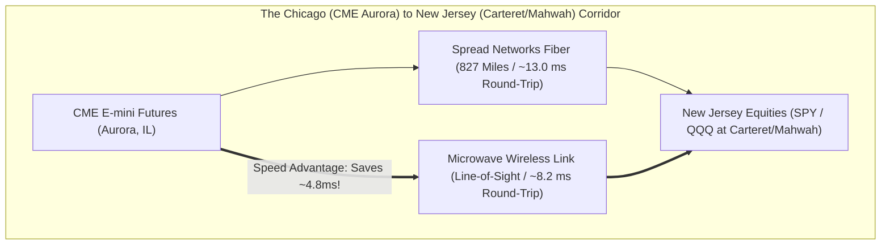

# Source Summary — Flash Boys: A Wall Street Revolt
**Author**: Michael Lewis  
**Publication**: W. W. Norton & Company (2014)  
**Category**: Financial History, Market Structure & Latency Infrastructure

---

## Executive Summary & Core Thesis
*Flash Boys* is a narrative history that brought high-frequency trading (HFT) and physical low-latency telecommunications infrastructure into global public awareness. Lewis chronicles the construction of the **Spread Networks fiber-optic project**, the mechanics of **SIP latency arbitrage**, the rise of **Dark Pools and Payment for Order Flow (PFOF)**, and the creation of the **Investors Exchange (IEX)** and its patented 350-microsecond optical "Speed Bump".

While written as a narrative for general audiences, *Flash Boys* serves as an essential case study for low-latency systems engineers on the physical reality of light propagation in silica glass ($4.89\text{ ns/m}$) versus air ($3.33\text{ ns/m}$), the mechanics of multi-venue fragmentation, and how exchange market design directly shapes algorithmic trading strategies.

---

## Key Technical Concepts & Historical Case Studies

### 1. The Physical Layer Telecommunications Race
- **Spread Networks (2010)**: Dug an 827-mile ultra-straight fiber-optic trench through mountains and rivers from Chicago to Carteret, NJ, reducing round-trip latency from $17.0\text{ ms}$ to $13.1\text{ ms}$ (a 3.9ms advantage).
- **The Microwave Revolution (2012–Present)**: Light travels through air at the speed of light in a vacuum ($c \approx 300,000\text{ km/s} \implies 3.33\text{ ns/m}$), whereas light travels through standard silica glass fiber at $\frac{c}{n} \approx 204,000\text{ km/s} \implies 4.89\text{ ns/m}$ (refractive index $n \approx 1.47$).
  - Microwave radio networks reduced the Chicago-to-New Jersey round-trip to **under 8.2 milliseconds**, completely obsolescing fiber for tick-level price signals.

### 2. SIP Latency Arbitrage
- **Mechanism**: The consolidated Securities Information Processor (SIP) aggregates quotes from all 16 US equity exchanges and computes the National Best Bid and Offer (NBBO).
- In 2010–2014, software and network queuing delays caused the public SIP feed to lag direct proprietary feeds (e.g. direct NASDAQ ITCH + direct NYSE Integrated) by **1 to 25 milliseconds**.
- Fast market participants used direct feeds to detect price changes first and trade against stale orders resting on venues whose routing engines relied on the slow SIP.

### 3. The IEX 350-Microsecond "Speed Bump"
- **Mechanism**: IEX introduced a **38-mile continuous coil of fiber optic cable (a "magic shoebox")** through which all inbound orders must travel before reaching the matching engine.
- **Purpose**: A 38-mile fiber coil imposes an exact physical delay of **350 microseconds** ($38\text{ miles} \times 1.609\text{ km/mi} \times 4.89\text{ µs/km} \approx 300\text{ µs} + \text{switch delay} = 350\text{ µs}$).
- This 350µs delay allows IEX to update its internal pegged order prices using direct feeds before fast latency-arbitrage orders from Carteret or Mahwah can arrive and snipe stale resting quotes.

---

## Engineering Implications for Low-Latency Systems

1. **Physical Propagation Delay Dominance**: Over long distances, no amount of C++ software optimization can overcome the fundamental physical speed limit of light in media. Hardware engineers must choose the lowest-refractive-index medium (Microwave $\approx 1.0$, Hollow-Core Fiber $\approx 1.05$, Standard Silica Fiber $\approx 1.47$).
2. **Direct Market Data vs Consolidated Feeds**: Production trading engines must **never consume consolidated feeds (SIP)** for execution decisions; they must connect directly to raw exchange multicast feeds (ITCH/MDP3) via kernel bypass.
3. **Market Fragmentation & Multi-Venue Routing**: Because the US market is fragmented across multiple New Jersey data centers (Carteret, Mahwah, Secaucus NY4), a Smart Order Router (SOR) must calculate precise cross-colo fiber delays to ensure parent orders arrive simultaneously at all venues.

---

## Related Notes
- [[06 - Networking/Colocation and Physical Layer Infrastructure]]
- [[01 - Market & Microstructure Fundamentals/SIP vs Direct Market Data Feeds]]
- [[11 - Participant-Side Systems/Smart Order Routing and Execution Algorithms]]
- [[14 - Industry Map & Canon/The Quantitative Trading Firm Landscape]]
- [[14 - Industry Map & Canon/MOC - 14 Industry Map & Canon]]
