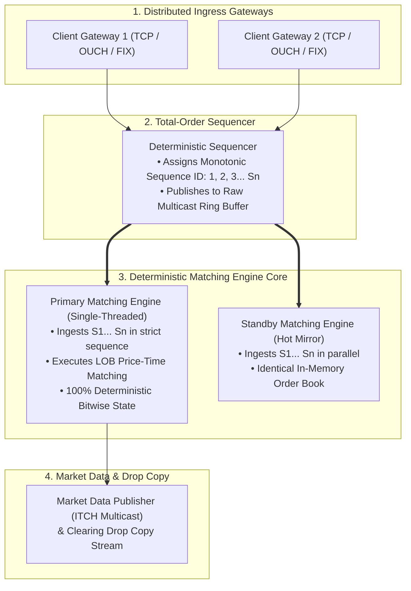

# Source Summary — How to Build an Exchange: Systems Architecture
**Author**: Jane Street Engineering (Yaron Minsky, Ron Minsky, and Core Infrastructure Leads)  
**Publication**: Jane Street *Signals & Threads* & Public Technical Publications  
**Category**: Exchange Architecture & Deterministic Distributed Systems

---

## Executive Summary & Core Thesis
Jane Street's technical engineering series provides one of the most transparent, deep architectural breakdowns of how an institutional financial exchange operates. The core thesis is that an exchange is fundamentally **a deterministic single-threaded state machine fronted by a high-throughput total-order sequencer and distributed gateway network**.

For a low-latency exchange or market-maker systems engineer, Jane Street articulates why multi-threaded matching engines fail due to non-deterministic race conditions, how to implement zero-overhead replicated state machines (RSM), and how to structure robust failover without consensus delays.

---

## Key Architectural Principles

### 1. The Single-Threaded Sequenced State Machine
- **Why Multi-Threading Fails in Matching Engines**: If an exchange attempts to process orders concurrently using multi-threaded locks or atomic queues on the same book, CPU thread scheduling non-determinism makes it impossible to guarantee fair Price-Time priority or reproduce crash states.
- **The Sequenced-Stream Solution**:
  1. Ingress Gateways perform syntax validation, authentication, and pre-trade credit checks.
  2. Gateways push valid orders into a **Total-Order Sequencer**.
  3. The Sequencer timestamps each message and assigns a monotonic sequence number ($1, 2, 3 \dots N$).
  4. The **Matching Engine Core runs on a single isolated CPU core**, consuming the sequenced stream with zero locks, zero context switches, and zero dynamic memory allocations.

### 2. Fault Tolerance via Replicated State Machines (RSM)
- Instead of using slow multi-node distributed consensus (e.g. Raft/Paxos) on every match, both Primary and Standby matching engines ingest the exact same pre-sequenced multicast feed in parallel.
- Because the matching engine logic is **100% deterministic**, both engines maintain identical internal state at all times.
- If the Primary crashes, the Standby assumes active transmission in under 50 microseconds with zero state reconstruction delay.

### 3. Separation of Concerns: Pre-Trade vs Post-Trade
- **Pre-Trade (Hot Path)**: Kept maximally lean—only immediate balance checks and sequence stamping.
- **Post-Trade (Async Path)**: Clearing, regulatory reporting, drop copy distribution, and trade billing are completely offloaded to asynchronous downstream consumers reading the execution event log.

---

## Engineering Implications for Low-Latency Systems

1. **Deterministic Testing**: Because the matching engine is a pure state machine ($S_{t+1} = f(S_t, \text{Event}_{t+1})$), testing is conducted by replaying historical binary event logs into the engine and verifying that the output matches expected execution logs bit-for-bit.
2. **Eliminating Allocation from the Matching Loop**: The matching core pre-allocates flat order pools, using integer index handles rather than pointers to eliminate memory fragmentation and avoid cache-polluting `malloc()` calls.
3. **Hardware-Software Boundary**: FPGAs are ideal for the boundary layers (transceivers, packet filtering, pre-trade credit checks, and network serialization), while high-clock-rate single-threaded CPUs handle complex business logic, complex order type crossing, and continuous auction pricing.

---

## Related Notes
- [[02 - Exchange Architecture/The Sequenced-Stream Architecture]]
- [[02 - Exchange Architecture/Replicated State Machine Pattern in Exchanges]]
- [[03 - Matching Engine Internals/Matching Engine Architecture Overview]]
- [[13 - Reliability, Ops & Testing/Deterministic Replay and Packet Injection Testing]]
- [[14 - Industry Map & Canon/MOC - 14 Industry Map & Canon]]
