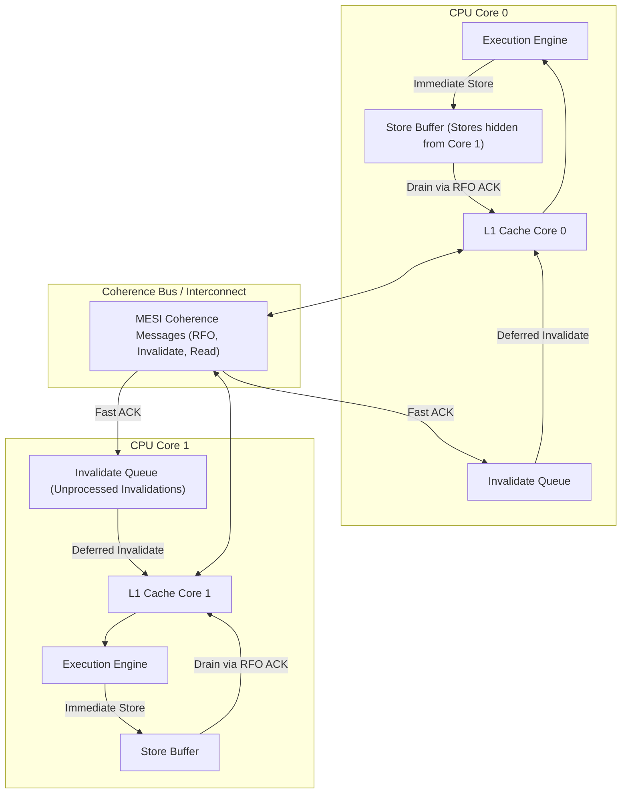

# Source Summary - Memory Barriers: A Hardware View for Software Hackers
**Author**: Paul E. McKenney (Distinguished Engineer, Linux Kernel RCU Maintainer)  
**Publication**: Linux Kernel Documentation & Technical Whitepaper (2010)  
**Category**: Microarchitecture, Cache Coherence, Memory Models, Kernel Engineering

---

## Executive Summary & Core Thesis
Paul McKenney's whitepaper is the definitive hardware-level explanation of why memory barriers and memory orderings exist. High-level programmers often conceptualize memory barriers as arbitrary compiler rules. McKenney demystifies this by tracing the actual physical electronics of modern multi-core microprocessors: specifically **Store Buffers** and **Invalidate Queues**.

CPUs added Store Buffers so that store instructions wouldn't stall the CPU pipeline for dozens of nanoseconds while waiting for cache line ownership (MESI Read-For-Ownership / RFO). Later, they added Invalidate Queues so cores receiving invalidation requests wouldn't stall acknowledging them. McKenney demonstrates how these two hardware performance optimizations inevitably lead to out-of-order store and load visibility across cores, requiring explicit hardware memory barriers (`smp_mb`, `smp_wmb`, `smp_rmb`, and atomic fences) to enforce causality.

---

## The Two Hardware Microarchitectural Culprits

### 1. Store Buffers & Store-Load Reordering
- **The Problem**: When Core 0 writes to a variable `a` residing in Core 1's cache in Shared (`S`) state, Core 0 must send an Invalidate message across the bus. Waiting for the ACK would stall Core 0 for 50–100 cycles.
- **The Solution**: Core 0 writes directly to its local **Store Buffer** and proceeds with subsequent instructions immediately.
- **The Bug for Software**: If Core 0 writes `a = 1; b = 1;` where `b` is already Exclusive (`E`) in Core 0's cache, `b` updates in L1 immediately while `a` sits queued in the Store Buffer. Core 1 reads `b == 1`, but reads stale `a == 0`!
- **Hardware Fix**: A **Write Memory Barrier (`smp_wmb()` / Store Barrier)** forces the CPU to drain its store buffer before committing any subsequent stores to cache.

### 2. Invalidate Queues & Load-Load Reordering
- **The Problem**: An Invalidate message arrives at Core 1's L1 cache, but Core 1 is executing a heavy burst of L1 reads. Core 1 cannot stall its pipeline to immediately invalidate the line.
- **The Solution**: Core 1 places the invalidation message into an **Invalidate Queue**, immediately sends an ACK back across the bus, and defers the actual cache invalidation.
- **The Bug for Software**: Because the ACK was sent, Core 0 assumes Core 1 has invalidated its cache and releases its data. But Core 1's execution unit reads from its local cache before processing its Invalidate Queue, observing stale data even after seeing a synchronized flag!
- **Hardware Fix**: A **Read Memory Barrier (`smp_rmb()` / Invalidate Barrier)** forces the CPU to flush its invalidate queue before proceeding with subsequent reads.

---

## Memory Consistency Across Architectures

| Architecture | Loads Reordered After Loads? | Loads Reordered After Stores? | Stores Reordered After Stores? | Stores Reordered After Loads? | Atomic RMW Reordered? |
| :--- | :---: | :---: | :---: | :---: | :---: |
| **x86-64 / AMD64 (TSO)** | **No** | **No** | **No** | **Yes (Store Buffer)** | **No** |
| **ARMv8 / AArch64** | **Yes** | **Yes** | **Yes** | **Yes** | **Yes** |
| **IBM POWER** | **Yes** | **Yes** | **Yes** | **Yes** | **Yes** |

- **Total Store Order (TSO) on x86-64**: x86 guarantees that stores become visible in program order and loads are never reordered with respect to other loads. The **only** reordering x86 hardware performs is that older stores can be delayed past younger loads due to the store buffer (Store-Load reordering). Hence, on x86, Acquire loads and Release stores require $0\text{ ns}$ fence instructions (pure compiler barriers)!

---

## Engineering Implications for Low-Latency Systems

1. **Lock-Free Queues without Expensive Full Fences**: On x86-64, an Acquire load is a plain `mov`, and a Release store is a plain `mov`. Costly full barriers (`mfence` or `lock addl`) are only required when a store must be immediately visible before a subsequent load (Store-Load synchronization).
2. **Sequential Consistency (`std::memory_order_seq_cst`) Overhead**: In C++11, default atomics use `seq_cst`, generating `mfence` or `xchg` instructions that drain the store buffer and stall the CPU pipeline for 15–30 nanoseconds. Using `std::memory_order_acquire` and `std::memory_order_release` eliminates hardware bus locks while maintaining complete causal safety.
3. **Read-Copy Update (RCU)**: McKenney's RCU allows ultra-fast lock-free reads ($0\text{ ns}$ synchronization overhead) for critical market data reference tables by leveraging quiescent-state tracking across memory barriers.

---

## Related Notes
- [[15-Technical-Whitepapers/10-Seminal-Low-Latency-Systems-Papers/01-Memory-Models-and-Hardware-Coherence]]
- [[CPU Cache Hierarchy and Line Alignment]]
- [[04 - Hardware Mechanical Sympathy/Cache Coherence Protocols MESI MOESI]]
- [[C++ Memory Model and Memory Orders]]
- [[Memory Fences and Compiler Barriers]]
- [[14 - Industry Map & Canon/MOC - 14 Industry Map & Canon]]
