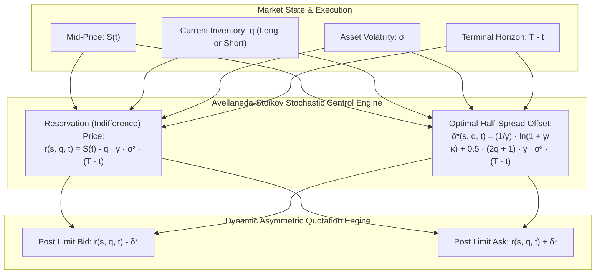

# Source Summary — High-Frequency Trading in a Limit Order Book
**Authors**: Marco Avellaneda (Courant Institute of Mathematical Sciences, NYU) and Sasha Stoikov (Cornell Financial Engineering)  
**Publication**: Quantitative Finance, Vol. 8, No. 3, 217–224 (2008)  
**Category**: Quantitative Finance, Market Microstructure, Stochastic Control, Market Making

---

## Executive Summary & Core Thesis
The 2008 Avellaneda-Stoikov paper is the foundational quantitative benchmark for modern algorithmic market making. Building on the classical continuous-time utility framework of Ho and Stoll (1981), Avellaneda and Stoikov formulated market making as an optimal stochastic control problem solved via Hamilton-Jacobi-Bellman (HJB) equations.

The central insight of the model is that a market maker quoting two-sided limit orders faces a fundamental tension between **earning the bid-ask spread** and **accumulating unwanted inventory risk**. As inventory deviates from zero, the market maker must dynamically shift their quotes away from the mid-price using an explicit **Reservation (Indifference) Price** and asymmetric half-spreads, inducing incoming order flow to naturally rebalance their position.



---

## Key Mathematical Models & Formalisms

### 1. Mid-Price Dynamics & Utility Function
The mid-price $S_t$ follows arithmetic Brownian motion:
$$dS_t = \sigma dW_t$$
The market maker maximizes expected terminal utility of wealth $X_T$ and inventory $q_T$:
$$\max_{\delta_a, \delta_b} \mathbb{E}\left[ -e^{-\gamma (X_T + q_T S_T)} \right]$$
where $\gamma > 0$ is the trader's absolute risk aversion parameter.

### 2. Order Arrival Intensity
Limit orders posted at distance $\delta$ from the mid-price are filled according to a Poisson process with intensity $\lambda(\delta)$:
$$\lambda(\delta) = A e^{-\kappa \delta}$$
where $A$ represents overall market liquidity arrival rate, and $\kappa$ represents order book depth / price sensitivity.

### 3. The Reservation (Indifference) Price
The reservation price $r(s, q, t)$ represents the subjective price at which the market maker is indifferent between keeping their current inventory $q$ or holding zero inventory:
$$r(s, q, t) = s - q \cdot \gamma \sigma^2 (T - t)$$

- **Inventory Skew Intuition**:
  - If long inventory ($q > 0$): $r(s, q, t) < s$. The market maker values the asset *below* the mid-price. They shade their quotes downward: posting an aggressive Ask (closer to mid to unload inventory) and a passive Bid (farther from mid to deter further buying).
  - If short inventory ($q < 0$): $r(s, q, t) > s$. The market maker shades quotes upward to attract seller fills and replenish inventory.

### 4. Optimal Bid and Ask Quotes
Solving the HJB equation yields the closed-form optimal distances from the reservation price:
$$\delta^a + \delta^b = \frac{2}{\gamma} \ln\left(1 + \frac{\gamma}{\kappa}\right) + \gamma \sigma^2 (T - t)$$
The optimal posted quotes are:
$$r^a(s, q, t) = r(s, q, t) + \frac{1}{2} \left[ \frac{2}{\gamma}\ln\left(1 + \frac{\gamma}{\kappa}\right) + \gamma \sigma^2 (T - t) \right]$$
$$r^b(s, q, t) = r(s, q, t) - \frac{1}{2} \left[ \frac{2}{\gamma}\ln\left(1 + \frac{\gamma}{\kappa}\right) + \gamma \sigma^2 (T - t) \right]$$

---

## Engineering Implications for High-Frequency Trading Systems

1. **Sub-Microsecond Inventory Skewing**: In production C++ trading engines, calculating the reservation price requires only simple arithmetic:
   ```cpp
   double reservation_price = mid_price - (inventory * gamma * variance * remaining_time);
   ```
   This formula can be computed inside CPU SIMD registers or an FPGA arithmetic block in less than 5 nanoseconds upon receipt of an execution report.
2. **Adverse Selection Protection**: Quoting static symmetric spreads around the mid-price leads to rapid inventory depletion against toxic order flow. The Avellaneda-Stoikov model ensures that as soon as an execution occurs, quotes immediately shift to penalize further toxicity.
3. **Volatility Scaling**: As realized volatility $\sigma$ spikes during news releases, the optimal spread automatically widens quadratically with $\sigma$, preventing the market maker from being run over during regime shifts.

---

## Related Notes
- [[15-Technical-Whitepapers/10-Seminal-Low-Latency-Systems-Papers/04-Market-Microstructure-and-Order-Dynamics]]
- [[Sources/The Microstructure of Financial Markets by Rama Cont and Sasha Stoikov]]
- [[Order Book Data Structures]]
- [[Market Making Models and Inventory Management]]
- [[14 - Industry Map & Canon/MOC - 14 Industry Map & Canon]]
