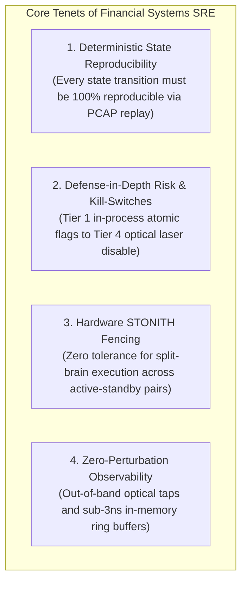

# Source Summary — Site Reliability Engineering at Scale for Financial Systems
**Category**: Site Reliability Engineering (SRE), Exchange Operations & High-Availability Topologies  
**Context**: Best Practices from Global Exchange Operators & Tier-1 Electronic Trading Firms

---

## Executive Summary & Core Thesis
*Site Reliability Engineering for Financial Systems* synthesizes the operational, architectural, and failure-domain principles required to operate mission-critical trading infrastructure. Unlike standard web SRE—where 99.9% availability allows for 43 minutes of downtime per month—**financial infrastructure mandates continuous zero-data-loss availability during trading hours, where a 5-second failure can destroy millions in capital or corrupt exchange state**.

This canon defines the operational doctrines of **Deterministic Replicated State Machines (RSM), non-bypassable pre-trade risk gates, automated hardware kill-switches, and zero-overhead telemetry**.

---

## Key Operational Doctrines & Topologies

### 1. The Financial Availability Matrix

| SRE Metric | Standard Web Architecture | Mission-Critical Financial Architecture |
| :--- | :--- | :--- |
| **Downtime Tolerance** | 99.9% – 99.99% (~4–43 mins/month) | **0 Seconds During Trading Hours (100% In-Session Availability)** |
| **Data Loss (RPO)** | Seconds to Minutes (Async replication) | **0 Messages / 0 Bytes (Strict Zero Data Loss)** |
| **Recovery Time (RTO)** | Seconds to Minutes (Failover spinup) | **<50 Microseconds (Hardware Heartbeat Unmasking)** |
| **Consensus Topology** | Distributed Multi-Node Raft / Paxos | **Deterministic Replicated State Machine (RSM) with Hardware Fencing** |

### 2. Multi-Tier Failure Containment
1. **In-Flight Order Isolation**: Gateways must maintain explicit in-flight token registries. If an exchange connection drops, all unacknowledged orders must be assumed open until reconciled via an exchange session sequence retransmission.
2. **Exchange-Side Cancel-on-Disconnect (COD)**: Never rely exclusively on client-side software to cancel orders during a disaster. Always mandate exchange-side COD heartbeats (2-second timeout) so the exchange matching engine purges resting quotes if the participant's link severs.
3. **Hardware STONITH (Shoot The Other Node In The Head)**: In dual-node Active-Standby deployments, the Standby must physically cut power or disable switch ports to the Primary before unmasking its own transmitter to prevent catastrophic Split-Brain double trading.

---

## Engineering Implications for Low-Latency Systems

1. **Continuous Automated Latency CI Gates**: Mandate that every software merge passes through an isolated bare-metal performance testbed verifying that $p50$ and $p99.9$ latency regressions are strictly under 10 nanoseconds.
2. **Post-Mortem Root Cause Analysis (RCA)**: Treat every production reject, microsecond latency spike, or unexpected failover as a critical incident. Conduct rigorous "5-Whys" post-mortems and enforce permanent, code-level regression assertions.
3. **Deterministic Disaster Simulation**: Regularly subject trading and exchange gateways to synthetic chaos tests—injecting 5% multicast packet loss, out-of-order sequence arrivals, and abrupt socket buffer fills—to verify automated recovery mechanisms.

---

## Related Notes
- [[13 - Reliability, Ops & Testing/Automated Kill Switches and Risk Circuit Breakers]]
- [[13 - Reliability, Ops & Testing/Disaster Recovery and High Availability Topologies]]
- [[13 - Reliability, Ops & Testing/Deterministic Replay and Packet Injection Testing]]
- [[13 - Reliability, Ops & Testing/Drill - 13 Post-Mortem of a Production Outage]]
- [[14 - Industry Map & Canon/MOC - 14 Industry Map & Canon]]
