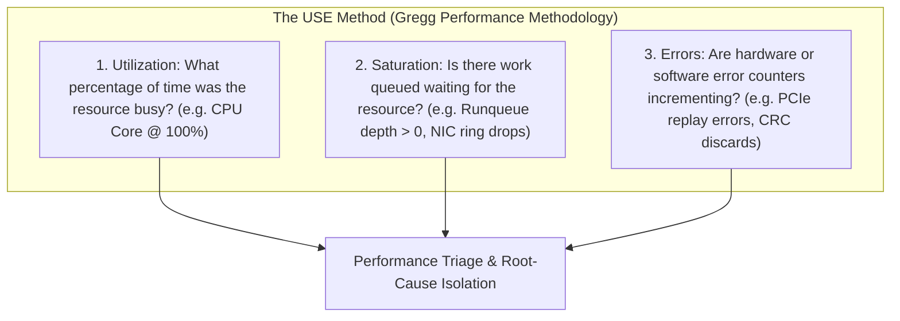

# Source Summary — Systems Performance: Enterprise and the Cloud (2nd Edition)
**Author**: Brendan Gregg (Distinguished Engineer at Intel, former Netflix & Sun Microsystems Performance Architect)  
**Publication**: Addison-Wesley Professional  
**Category**: Systems Engineering & Performance Profiling

---

## Executive Summary & Core Thesis
*Systems Performance* is the definitive modern treatise on operating system and hardware performance engineering. Gregg establishes rigorous, measurement-first methodologies—such as the **USE Method (Utilization, Saturation, Errors)**—to diagnose, benchmark, and eliminate latency bottlenecks across CPUs, memory architectures, storage subsystems, and kernel network stacks.

For a low-latency trading systems engineer, Gregg provides the diagnostic toolkit required to trace execution from hardware PMU performance counters through kernel scheduler interrupts down to individual instruction retirements.

---

## Key Methodologies & Architectural Principles

### 1. The USE Method (Resource Checklist)
For every hardware and software resource in the critical path (CPUs, Memory Buses, PCIe controllers, NIC descriptor rings), evaluate:
1. **Utilization**: Average time resource was active over a time window.
2. **Saturation**: Degree to which extra work is queued waiting for execution.
3. **Errors**: Count of error events (e.g., `ethtool -S` dropped frames, memory ECC corrections).

### 2. CPU Performance & Instruction Metrics
- **Instructions Per Cycle (IPC)**:
$$\text{IPC} = \frac{\text{Instructions Retired}}{\text{CPU Clock Cycles}}$$
  - Low IPC ($<1.0$ on modern superscalar CPUs) indicates the pipeline is **stalled on memory fetches (L3 cache misses, DRAM fetches)**.
  - High IPC ($>2.5$) indicates compute-bound, cache-hot execution.
- **Top-Down Microarchitecture Analysis (TMA)**:
  - Decomposes CPU pipeline execution slots into 4 primary categories: **Retiring, Bad Speculation (Branch Mispredictions), Frontend Bound (L1i / BTB stalls), and Backend Bound (Memory / Execution stalls)**.

### 3. Linux Profiling Toolchain
- **`perf` (Linux Performance Counters)**: Hardware event sampling via Intel PEBS and AMD IBS without application code modification.
- **Flamegraphs**: Visual hierarchical representation of profiled call stacks to instantly pinpoint CPU time sinks.
- **eBPF (Extended Berkeley Packet Filter)**: Programmable in-kernel bytecode for zero-overhead tracing of kernel tracepoints, TCP socket state changes, and scheduler latency.

---

## Engineering Implications for Low-Latency Systems

1. **Eliminating Scheduler Latency**: Gregg documents how Linux kernel scheduler ticks (`CONFIG_HZ`) inject involuntary context switches and CPU migration overhead. In low-latency trading, this mandates full core isolation (`isolcpus`, `nohz_full`, `rcu_nocbs`) and setting thread affinity (`pthread_setaffinity_np`) to lock trading loops to isolated physical cores.
2. **Hardware Counter Continuous Auditing**: Rather than relying on wall-clock time alone, low-latency CI pipelines must monitor hardware PMU counters (`perf stat -e instructions,cycles,cache-misses,branch-misses`) to detect microarchitectural regressions before deployment.
3. **Off-CPU Analysis**: When a process experiences latency spikes but CPU utilization remains low, the thread is blocked on an off-CPU event (e.g. page fault, lock contention, synchronous I/O, or hypervisor steal). Off-CPU analysis identifies the exact blocking stack trace.

---

## Related Notes
- [[05 - OS & Kernel Tuning/Kernel Boot Parameters for Core Isolation]]
- [[07 - Time & Measurement/CPU Timestamp Counter RDTSC Mechanics]]
- [[13 - Reliability, Ops & Testing/Latency Regression Testing in Continuous Integration]]
- [[13 - Reliability, Ops & Testing/Observability Without Perturbation]]
- [[14 - Industry Map & Canon/MOC - 14 Industry Map & Canon]]
