# Source Summary — The LMAX Disruptor: High Performance Alternative to Bounded Queues
**Authors**: Martin Thompson, Dave Farley, Michael Barker, Patricia Gee, and Adrian Colyer  
**Publication**: LMAX Technical Whitepaper (2011)  
**Category**: Mechanical Sympathy, Lock-Free Concurrency, Inter-Thread Messaging

---

## Executive Summary & Core Thesis
The LMAX Disruptor whitepaper revolutionized high-performance message processing architecture. LMAX sought to build an institutional-grade financial exchange processing 6 million orders per second with deterministic sub-millisecond latencies. They discovered that traditional concurrent architectures based on multi-threaded actor models, queues (`java.util.concurrent.ArrayBlockingQueue`), and lock-based synchronization collapsed under high throughput due to **cache coherence ping-pong, kernel context switches, and false sharing**.

Their breakthrough was **Mechanical Sympathy**—designing software to work in alignment with underlying CPU cache hardware. The result is the **Disruptor**: a pre-allocated circular ring buffer accessed via lock-free sequence barriers, single-writer invariants, and cache-line padding, eliminating locks, garbage collection pauses, and memory allocation from the critical path.

```mermaid
flowchart LR
    subgraph Producers ["Producers (Claiming Sequences)"]
        P1["Producer 1 (Sequencer)"]
    end

    subgraph RingBuffer ["Pre-Allocated Ring Buffer (Power of 2)"]
        direction TB
        RB0["Slot 0 [Cache Aligned]"]
        RB1["Slot 1 [Cache Aligned]"]
        RB2["Slot ... [Cache Aligned]"]
        RB3["Slot N-1 [Sequence Barrier]"]
    end

    subgraph Consumers ["Consumers (Pipelined Stage Dependency)"]
        C1["Journaler / Replicator\n(Seq Barrier C1)"]
        C2["Business Logic / Matching\n(Seq Barrier C2)"]
        C3["Marshaller / Gateway Out\n(Seq Barrier C3)"]
    end

    P1 -- "Claim slot & Commit Seq" --> RingBuffer
    RingBuffer --> C1
    C1 -- "C1 Seq >= C2" --> C2
    C2 -- "C2 Seq >= C3" --> C3
```

---

## Key Architectural Innovations

### 1. Zero Allocation & Pre-Allocated Ring Buffer
- A bounded circular array of pre-allocated event objects.
- Ring buffer size is strictly a power of two ($2^N$), allowing index calculation via bitwise AND instead of expensive division/modulo:
$$\text{Index} = \text{Sequence} \ \& \ (\text{Buffer Size} - 1)$$
- Memory for all slots is allocated at startup; producers never instantiate new objects on the critical path, avoiding memory fragmentation and runtime allocators.

### 2. Elimination of False Sharing via Cache Line Padding
- Modern CPUs load memory into 64-byte cache lines. If adjacent atomic sequence counters written by different cores share a 64-byte cache line, modifying one forces a MESI cache invalidation on the other (**False Sharing**).
- The Disruptor uses explicit 56–64 byte padding around sequence variables (`long p1, p2, p3, p4, p5, p6, p7; volatile long cursor; long p8, p9, p10, p11, p12, p13, p14;` or C++ `alignas(64)`), guaranteeing each atomic sequence occupies its own independent cache line.

### 3. Single-Writer Principle & Lock Elimination
- In its optimal configuration, only a single producer thread writes to the sequence cursor (`SingleProducerSequencer`).
- With only one writer, atomic Compare-And-Swap (`lock cmpxchg`) instructions are completely eliminated; updating the sequence requires only a light compiler memory barrier or store-release instruction (`mov` with store barrier on x86-64), running in $\sim 1\text{ nanosecond}$.

### 4. Sequence Barriers & Batching Under Load
- Consumers track producer sequences via `SequenceBarrier`.
- If a consumer falls slightly behind during burst load, the next barrier read returns the latest published sequence number ($k$), allowing the consumer to process all slots from its current sequence up to $k$ in a tight, cache-hot loop (**natural amortized batching**). Under peak load, latency remains stable while throughput scales.

---

## Engineering Implications for Low-Latency C++ Trading Systems

1. **Inter-Thread Communication (SPSC & SPMC)**: The Disruptor pattern is the foundational primitive for routing decoded market data packets from the network RX thread to the matching engine core and out to the risk engine.
2. **Deterministic Jitter Elimination**: Traditional blocking queues rely on OS condition variables (`futex` on Linux), inducing $1\text{ to }10\ \mu\text{s}$ context-switching jitter. Busy-spin wait strategies (`BusySpinWaitStrategy` using `_mm_pause()`) achieve sub-50 nanosecond handoffs.
3. **Core Pinning and NUMA Affinity**: Combining Disruptor ring buffers with thread pinning (`pthread_setaffinity_np`) to isolated cores on the same NUMA node keeps all cache transfers within local L3 / CPU interconnect.

---

## Related Notes
- [[15-Technical-Whitepapers/10-Seminal-Low-Latency-Systems-Papers/02-Lock-Free-and-Wait-Free-Algorithms]]
- [[CPU Cache Hierarchy and Line Alignment]]
- [[False Sharing and Cache Contention]]
- [[Lock-Free Ring Buffers SPSC and MPMC]]
- [[Deterministic Matching Engine Architecture]]
- [[14 - Industry Map & Canon/MOC - 14 Industry Map & Canon]]
