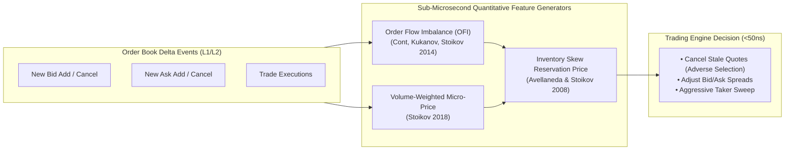

# Source Summary — The Microstructure of Financial Markets: Quantitative Foundations
**Authors**: Rama Cont (Professor of Mathematics, University of Oxford) & Sasha Stoikov (Senior Research Associate, Cornell Financial Engineering)  
**Publication**: Journal of Financial and Quantitative Analysis / Applied Mathematical Finance / SSRN  
**Category**: Quantitative Finance & High-Frequency Alpha Modeling

---

## Executive Summary & Core Thesis
The research papers of Rama Cont and Sasha Stoikov form the mathematical foundation for modern algorithmic market making and high-frequency feature engineering. They bridged empirical microstructure physics with stochastic optimal control, providing explicit, closed-form models for **Order Flow Imbalance (OFI), the Volume-Weighted Micro-Price, and optimal inventory-risk spread management (Avellaneda-Stoikov)**.

For a quantitative developer or trading systems engineer, Cont and Stoikov provide the exact linear and Markovian models used to compute sub-microsecond price discovery and alpha signals directly inside CPU registers and FPGA DSP slices.

---

## Key Mathematical Models & Formalisms

### 1. Order Flow Imbalance (OFI) (Cont, Kukanov & Stoikov 2014)
Measures the net accumulated change in supply and demand at the best quotes across consecutive market data ticks:
$$\text{OFI}_n = I_{\{P_B(n) \ge P_B(n-1)\}} q_B(n) - I_{\{P_B(n) \le P_B(n-1)\}} q_B(n-1) - I_{\{P_A(n) \le P_A(n-1)\}} q_A(n) + I_{\{P_A(n) \ge P_A(n-1)\}} q_A(n-1)$$

- **Linear Price Impact Law**:
$$\Delta P_n = \beta \cdot \text{OFI}_n + \epsilon_n$$
  - Proves that short-term price changes are a direct linear function of contemporaneous order flow imbalance.

### 2. The Volume-Weighted Micro-Price (Stoikov 2018)
Instead of using the simple Mid-Price ($P_{\text{mid}} = \frac{P_A + P_B}{2}$), the Micro-Price incorporates the queue depth imbalance:
$$I = \frac{Q_B - Q_A}{Q_B + Q_A} \in [-1, 1]$$
$$P_{\text{micro}} = P_B \cdot (1 - \omega(I, S)) + P_A \cdot \omega(I, S)$$
- When Bid size dominates ($Q_B \gg Q_A \implies I \to +1$), $P_{\text{micro}} \to P_A$, predicting that the next price change will be an upward tick.

### 3. The Avellaneda-Stoikov Optimal Market Making Model (2008)
Calculates the **Reservation (Indifference) Price ($r(s, q, t)$)** for a market maker holding net inventory $q$:
$$r(s, q, t) = s - q \cdot \gamma \cdot \sigma^2 \cdot (T - t)$$
- Where:
  - $s$: Current market mid-price.
  - $q$: Current net inventory position (positive = long, negative = short).
  - $\gamma$: Risk aversion parameter.
  - $\sigma^2$: Asset price volatility.
  - $T - t$: Remaining trading horizon.
- **Optimal Quoting Spreads**:
  - Long inventory ($q > 0$): Lower the reservation price ($r < s$), shifting both Bid and Ask downward to attract buyers and offload long risk.
  - Short inventory ($q < 0$): Raise the reservation price ($r > s$), shifting quotes upward to cover short risk.

---

## Engineering Implications for Low-Latency Systems

1. **Branchless Fixed-Point C++ Implementation**: The OFI and Micro-Price formulas require only integer additions, subtractions, and bit-shifts. In modern C++, they compile into branchless `CMOV` and vector instructions executing in **under 15 nanoseconds** without floating-point division.
2. **FPGA Single-Cycle DSP Implementation**: The reservation price $r(s, q, t)$ requires a single multiply-accumulate operation ($q \cdot (\gamma \sigma^2 \Delta t)$), which fits cleanly into a single **Xilinx UltraScale+ DSP48E2 slice executing in 1 clock cycle (3.1 ns)**.
3. **Queue-Aware Cancel Triggers**: When $I \to -0.9$ (Ask queue heavily builds while Bid queue collapses), the engine automatically fires an instantaneous cancel on its resting Bid quote to prevent adverse selection fill.

---

## Related Notes
- [[11 - Participant-Side Systems/Low-Latency Signal Generation and Feature Calculators]]
- [[01 - Market & Microstructure Fundamentals/Price Discovery and Microstructure Noise]]
- [[12 - FPGAs & Hardware Acceleration/FPGA Feed Handlers and Parsing Pipelines]]
- [[14 - Industry Map & Canon/Canonical Books, Papers, and Talks Index]]
- [[14 - Industry Map & Canon/MOC - 14 Industry Map & Canon]]
