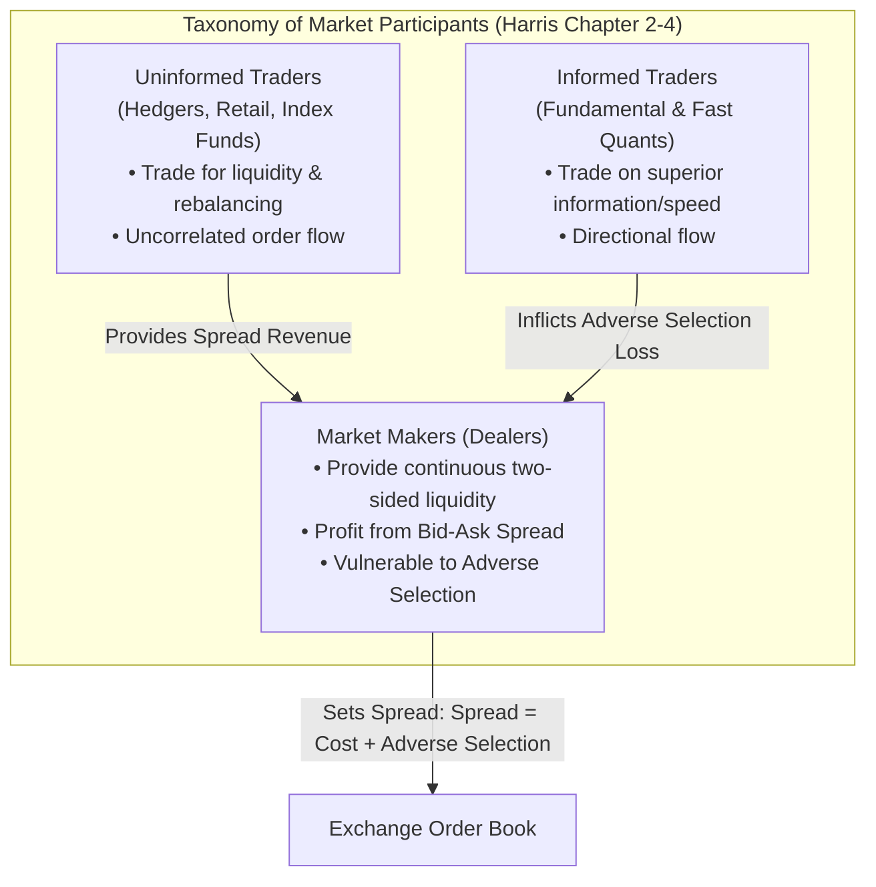

# Source Summary — Trading and Exchanges: Market Microstructure for Practitioners
**Author**: Larry Harris (Former Chief Economist of the SEC, Professor of Finance at USC)  
**Publication**: Oxford University Press  
**Category**: Market Microstructure & Market Design

---

## Executive Summary & Core Thesis
*Trading and Exchanges* is the universally acknowledged foundational textbook on market microstructure. Harris dissects why markets exist, how different participants interact, the physics of liquidity and transaction costs, and how rules (order types, priority, display, settlement) shape trader behavior. 

For a low-latency systems engineer, Harris provides the economic rationale behind every line of matching engine and trading gateway code: why queue priority matters, how informed traders extract value from uninformed traders, and why adverse selection forces market makers to demand a bid-ask spread.

---

## Key Concepts & Mathematical Formalisms

### 1. The Economics of the Bid-Ask Spread
Harris decomposes the bid-ask spread ($S = P_{\text{ask}} - P_{\text{bid}}$) into three distinct economic components:
$$S = \text{Order Processing Costs} + \text{Inventory Holding Costs} + \text{Adverse Selection Costs}$$

1. **Order Processing Costs**: Colocation fees, exchange port costs, clearing fees, hardware depreciation.
2. **Inventory Holding Costs**: Financing cost (cost of capital) and volatility risk of holding overnight or intraday net delta.
3. **Adverse Selection Costs**: The expected loss suffered by the market maker when trading against an informed participant who knows the asset is mispriced.

### 2. Trader Taxonomy & Information Asymmetry
- **Utilitarian / Uninformed Traders**: Trade to invest, borrow, hedge, or exchange currencies. Their order flow is noise; market makers profit by intermediating their flow.
- **Profit-Motivated Informed Traders**: Possess fundamental or speed-advantaged information. Trading against them is systematically unprofitable for market makers.
- **The Market Maker's Dilemma**: Dealers cannot distinguish informed from uninformed orders on arrival. Therefore, they must widen their spreads to ensure revenue from uninformed traders exceeds losses to informed traders:
$$\mathbb{E}[\text{Profit}] = Q_{\text{uninformed}} \times \left(\frac{S}{2}\right) - Q_{\text{informed}} \times \mathbb{E}[\text{Adverse Move}] \ge 0$$

### 3. Order Types and Priority Allocations
Harris provides a rigorous taxonomy of market execution instructions:
- **Price Priority**: The highest Bid and lowest Ask always take precedence over all other orders.
- **Time Priority (FIFO)**: Among orders at the same price, the earliest arriving order is filled first (the economic driver of the HFT latency race).
- **Size / Pro-Rata Priority**: Allocation proportional to displayed order size ($Allocation_i = \frac{Size_i}{\sum Size} \times MatchQty$).
- **Display Priority**: Displayed liquidity is filled before hidden/iceberg liquidity at the same price level.

---

## Engineering Implications for Low-Latency Systems

1. **Queue Position Value**: Because Price-Time priority guarantees first-fill rights to the oldest order, being at the head of the queue on a tick-constrained instrument (e.g. SPY with a \$0.01 tick) yields a near-zero adverse selection risk and 100% rebate capture. This justifies sub-microsecond FPGA execution to capture queue position on price-level transitions.
2. **Adverse Selection Minimization in Gateway Logic**: A market maker must process outbound cancel requests faster than external aggressive orders can hit the resting quote. If the exchange matching engine processes an external aggressive buy before the market maker's cancel, the market maker suffers immediate adverse selection.
3. **Matching Engine Determinism**: Exchanges must strictly enforce the priority rules defined in their regulatory rulebooks without introducing non-deterministic jitter between participant gateways.

---

## Related Notes
- [[01 - Market & Microstructure Fundamentals/Limit Order Book Mechanics]]
- [[01 - Market & Microstructure Fundamentals/Price Discovery and Microstructure Noise]]
- [[01 - Market & Microstructure Fundamentals/Order Types and Execution Semantics]]
- [[14 - Industry Map & Canon/The Quantitative Trading Firm Landscape]]
- [[14 - Industry Map & Canon/MOC - 14 Industry Map & Canon]]
