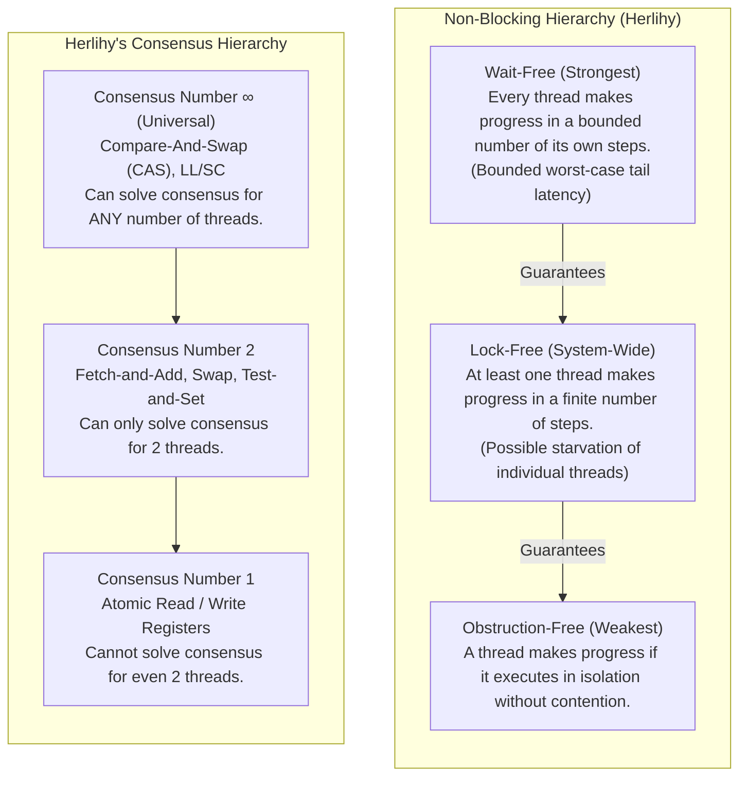

# Source Summary — Wait-Free Synchronization
**Author**: Maurice Herlihy (Professor of Computer Science, Brown University)  
**Publication**: ACM Transactions on Programming Languages and Systems (TOPLAS, 1991)  
**Category**: Concurrent Algorithms, Formal Theory, Lock-Free & Wait-Free Synchronization

---

## Executive Summary & Core Thesis
Maurice Herlihy's 1991 paper is the seminal mathematical foundation of concurrent, non-blocking data structures. Herlihy formally proved the fundamental limits of what hardware synchronization primitives can achieve, establishing the **Consensus Hierarchy** and defining the taxonomy of non-blocking progress guarantees: **Obstruction-Free, Lock-Free, and Wait-Free**.

Before Herlihy's work, engineers frequently attempted to implement lock-free concurrent queues or stacks using basic atomic operations like `Test-and-Set` or atomic `Fetch-and-Add`. Herlihy proved mathematically that atomic read/write registers and `Test-and-Set` have a consensus number of at most 2, meaning it is mathematically impossible to construct a lock-free or wait-free FIFO queue for 3 or more threads using them alone. Only primitives with an **infinite consensus number** ($\infty$), such as **Compare-And-Swap (CAS)** and **Load-Linked/Store-Conditional (LL/SC)**, are universal and capable of implementing arbitrary wait-free concurrent systems for any number of threads.

---

## The Consensus Number & Universal Construction

### 1. The Consensus Problem
The consensus problem requires $N$ asynchronous processes, each starting with an input value $v_i$, to agree on a single common output value $v \in \{v_1, \dots, v_N\}$.
- **Validity**: The decided value must be one of the thread inputs.
- **Consistency**: All threads that decide must decide the same value.
- **Wait-Freedom**: Every thread must terminate in a finite number of steps.

### 2. The Hierarchy Classification
- **Consensus Number 1**: Plain atomic reads and writes (`std::atomic<T>::load`, `store`). Herlihy proved FLP-style that no wait-free protocol can solve consensus for 2 threads using only read/write registers.
- **Consensus Number 2**: `Fetch-and-Add`, `Test-and-Set`, `Atomic Swap`. Can achieve wait-free consensus for $N=2$ threads, but mathematically impossible for $N \ge 3$.
- **Consensus Number $\infty$ (Universal Objects)**: `Compare-And-Swap` (x86 `lock cmpxchg`), `Load-Linked/Store-Conditional` (ARM `ldrex/strex`). Can solve consensus for an arbitrary number of threads ($N=\infty$).

### 3. Herlihy's Universal Construction
Herlihy proved a constructive theorem: **Any deterministic sequential object with a sequential specification can be transformed into an equivalent wait-free concurrent object using universal primitives (CAS).**

---

## Progress Guarantees Compared

| Guarantee | Worst-Case Execution Time (WCET) | Thread Starvation Possible? | Suitable for 99.99th Percentile SLA? | Mechanism |
| :--- | :---: | :---: | :---: | :---: |
| **Blocking / Locked** | $\infty$ (Deadlock/Priority Inversion risk) | Yes | **No** | Mutexes, Spinlocks |
| **Obstruction-Free** | Unbounded under contention | Yes | **No** | Backoff / Retries |
| **Lock-Free** | Unbounded for individual threads | Yes (Starvation) | **Conditional** (High average throughput) | CAS loops (`cmpxchg`) |
| **Wait-Free** | **Strictly Bounded $O(k)$ steps** | **No (Zero Starvation)** | **Yes (Ultra-Low-Latency Critical Path)** | Fast-path CAS + Helping Queue |

---

## Engineering Implications for Low-Latency C++ Trading Systems

1. **Wait-Free Progress for P99.99 Latency**: In high-frequency order routers and matching engines, lock-free CAS loops suffer from retry storms under high contention (e.g., non-farm payroll market events). Wait-free algorithms guarantee that every thread executes in $O(1)$ or $O(N)$ cycles regardless of what other threads are doing.
2. **Fast-Path / Slow-Path (Helping Schemes)**: High-performance wait-free designs implement a two-tier approach: a thread first attempts a fast-path CAS; if it fails $K$ times, it announces its operation in a shared array, and other threads help complete it before finishing their own operations.
3. **Single-Producer Single-Consumer (SPSC) Primitives**: Because SPSC ring buffers require coordination between only two threads without simultaneous write contention, they achieve wait-free $O(1)$ progress with pure consensus-1 load/store instructions without atomic bus-locking CAS!

---

## Related Notes
- [[15-Technical-Whitepapers/10-Seminal-Low-Latency-Systems-Papers/02-Lock-Free-and-Wait-Free-Algorithms]]
- [[Atomic Operations and Lock-Free Programming]]
- [[Lock-Free Ring Buffers SPSC and MPMC]]
- [[Deterministic Matching Engine Architecture]]
- [[14 - Industry Map & Canon/MOC - 14 Industry Map & Canon]]
