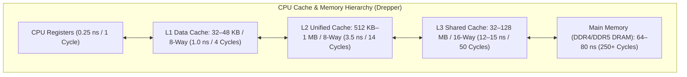

# Source Summary — What Every Programmer Should Know About Memory
**Author**: Ulrich Drepper (Lead Maintainer of GNU C Library `glibc`, Red Hat Engineer)  
**Publication**: Red Hat Technical Whitepaper (114 Pages)  
**Category**: Hardware Mechanical Sympathy & Computer Architecture

---

## Executive Summary & Core Thesis
Drepper's seminal 2007 paper is the foundational text on the physical and microarchitectural reality of computer memory systems. Drepper demonstrates that modern CPUs are not uniform execution engines, but rather **cache-hierarchical processors where memory access patterns dictate up to 95% of total program runtime**.

For an ultra-low-latency C++ trading engineer, Drepper explains the physics behind cache lines, MESI coherence invalidations, Translation Lookaside Buffers (TLBs), and HugePages—providing the exact rules for designing zero-overhead, cache-resident data structures.

---

## Key Hardware Concepts & Architecture

### 1. The 64-Byte Cache Line & Associativity
- **Cache Line Unit**: Data is never transferred from main memory to CPU in single bytes; it is transferred in discrete **64-byte chunks (Cache Lines)**.
- **Set Associativity**: Modern caches use $N$-way set associativity:
$$\text{Memory Address} \implies [\text{Tag} \mid \text{Set Index} \mid \text{Offset}]$$
  - If multiple hot variables map to the exact same **Set Index** (Cache Conflict), they continuously evict each other even if the rest of the cache is completely empty!

### 2. Cache Coherence Protocols (MESI & MOESI)
When multiple CPU cores access shared memory addresses:
- **Modified (`M`)**: Cache line is present only in current core and is dirty (must be written back to L3).
- **Exclusive (`E`)**: Cache line is present only in current core and is clean.
- **Shared (`S`)**: Cache line is present in multiple cores' caches (read-only).
- **Invalid (`I`)**: Cache line does not contain valid data.
- **Read-For-Ownership (RFO)**: When a core writes to a line in Shared state, it must broadcast an RFO request across the CPU bus to invalidate all other copies, incurring a **40 to 75 nanosecond pipeline stall**.

### 3. Virtual Memory & Translation Lookaside Buffers (TLB)
- Accessing a virtual memory address requires translating it to a physical page address via a 4-level or 5-level Page Table walk.
- The **Translation Lookaside Buffer (TLB)** caches recent translations.
- **HugePages (2MB / 1GB)**: Standard 4KB pages require 512 page table entries to cover 2MB of RAM, easily exhausting the 64-entry L1 dTLB. Using **2MB or 1GB HugePages** allows a single TLB entry to map massive memory regions, completely eliminating TLB miss latency spikes (10–30ns).

---

## Engineering Implications for Low-Latency Systems

1. **Cache-Conscious Data Layout**: Design structs so frequently accessed hot fields reside in the same 64-byte cache line, and separate independently written variables with `alignas(64)` to prevent false sharing.
2. **Sequential vs Random Memory Traversal**: Sequential array iteration allows the CPU's hardware stream prefetcher to load subsequent cache lines into L1 before the instruction executes ($0\text{ ns}$ effective stall). Pointer chasing in linked lists or trees creates dependent DRAM fetches ($>60\text{ ns}$ stall per node).
3. **Non-Temporal Stores (`_mm_stream_si128`)**: When writing large log buffers that will not be read immediately, non-temporal streaming stores bypass the L1/L2 cache hierarchy and write directly to write-combining buffers, preventing L1/L2 cache pollution for active trading state.

---

## Related Notes
- [[04 - Hardware Mechanical Sympathy/CPU Cache Hierarchy L1 L2 L3]]
- [[04 - Hardware Mechanical Sympathy/Cache Coherence Protocols MESI MOESI]]
- [[04 - Hardware Mechanical Sympathy/False Sharing and Cache Line Alignment]]
- [[04 - Hardware Mechanical Sympathy/TLB Mechanics and HugePages]]
- [[14 - Industry Map & Canon/MOC - 14 Industry Map & Canon]]
