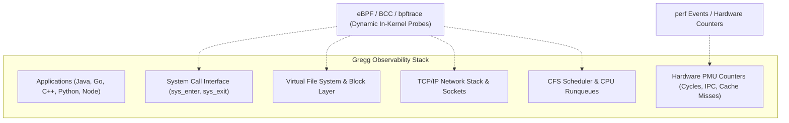

# Brendan Gregg Performance Canon

> **Author**: Brendan Gregg (Intel Fellow, formerly Lead Performance Architect at Netflix and Sun Microsystems)  
> **Scope**: 14 foundational technical whitepapers, conference treatises, and methodologies on Linux kernel performance, dynamic eBPF tracing, container analysis, and production SRE checklists.

---

## Executive Overview

Brendan Gregg revolutionized modern operating systems performance engineering by shifting the discipline from intuitive guesswork ("streetlamp anti-methodology") to **systematic, measurement-driven observability**. His papers introduce the industry-standard **USE Method**, pioneered **Flamegraphs**, and unlocked **eBPF (Extended Berkeley Packet Filter)** for safe, zero-overhead in-kernel programmability.



---

## The 14 Brendan Gregg Whitepapers Deep Dive

### 1. BPF: Tracing and More (2017)
- **Core Contribution**: Traces the transition of BPF from a network packet filter (cBPF, 1992) to a general-purpose in-kernel 64-bit virtual machine (eBPF) with 11 registers and JIT compilation.
- **Key Mechanism**: eBPF programs attach to **kprobes** (kernel dynamic probes), **kretprobes** (return probes), **uprobes** (user-space probes), and **tracepoints**. Data is aggregated in-kernel using BPF maps (hash maps, arrays, per-CPU histograms), preventing user/kernel context-switch overhead.
- **Production Takeaway**: Instead of dumping millions of raw events to user-space via `perf_event_open`, eBPF aggregates distributions in kernel memory, outputting only a 20-line histogram table.

### 2. Container Performance Analysis
- **Core Contribution**: Demystifies container performance by demonstrating that containers are **not lightweight virtual machines**, but isolated Linux processes governed by **cgroups (Control Groups)** and **namespaces**.
- **Key Bottlenecks**:
  - *CPU Throttling*: Hard enforcement of `cpu.cfs_quota_us` vs `cpu.cfs_period_us` causes latency spikes even when total host CPU is idle.
  - *Memory Reclaim*: Hitting `memory.limit_in_bytes` invokes the kernel out-of-memory (OOM) killer or triggers synchronous page reclaim.
  - *Resource Masking*: Traditional tools like `top` and `uptime` running inside a container read host-wide `/proc` counters rather than container-specific cgroup metrics.

### 3. From DTrace To Linux (2014)
- **Core Contribution**: Historical chronicle of porting dynamic instrumentation concepts from Solaris DTrace to the Linux kernel ecosystem.
- **Comparison**: Evaluates SystemTap, LTTng, ftrace, perf_events, and the emerging eBPF architecture. Concludes that eBPF with BCC provides the safety, speed, and standard upstream kernel integration required for high-security cloud production environments.

### 4. Linux 4.x Performance Using BPF Superpowers (2016)
- **Core Contribution**: Demonstrates the transformative performance tools introduced in the Linux 4.x kernel series (4.1 through 4.9), enabling programmable tracing without kernel crashes.
- **Breakthrough Tools Introduced**:
  - `execsnoop`: Traces short-lived transient process executions that escape `ps` polling.
  - `biolatency`: Displays block device I/O latency as a logarithmic histogram.
  - `ext4slower`: Identifies individual slow filesystem operations exceeding a millisecond threshold.
  - `offcputime`: Profiles the stack traces of threads when they are descheduled and sleeping.

### 5. Linux Performance Tools (2014 & 2015 Editions)
- **Core Contribution**: The definitive taxonomy of Linux performance observability tools categorized by subsystem:
  - *CPUs*: `uptime`, `mpstat -P ALL 1`, `pidstat 1`, `perf top`.
  - *Memory*: `free -m`, `vmstat 1`, `sar -B 1` (page paging), `numastat`.
  - *Storage / I/O*: `iostat -xz 1` (queue length, `%util`, await), `iotop`.
  - *Network*: `sar -n DEV 1`, `ss -s`, `ip -s link`, `nicstat`.
- **Latency Anti-Pattern**: Never rely on averages. Averages hide tail latency (P99, P99.9) caused by micro-bursts and lock contention.

### 6. Linux Performance Analysis New Tools and Old Secrets
- **Core Contribution**: Modernizing old UNIX diagnostic tricks with modern microarchitectural insights.
- **Old Secrets Rediscovered**:
  - Interrogating `/proc/interrupts` to find CPU core interrupt storm imbalances.
  - Using `/proc/sys/vm/drop_caches` responsibly for cold-cache benchmarking.
  - Reading `/proc/net/snmp` for TCP retransmissions, fast retransmits, and out-of-order packets.

### 7. Linux Profiling at Netflix (2015)
- **Core Contribution**: Case study of running continuous low-overhead profiling across tens of thousands of AWS EC2 cloud instances.
- **The Vector Architecture**: Building self-service web dashboards showing real-time CPU flame graphs generated via hardware PMU counters without user application recompilation.
- **Java on Linux**: Enabling Java stack symbol resolution with `perf-map-agent` to preserve frame pointers (`-XX:+PreserveFramePointer`), allowing `perf` to walk compiled JVM call frames.

### 8. Linux Systems Performance (2016)
- **Core Contribution**: Deep dive into hardware PMU (Performance Monitoring Unit) integration in Linux.
- **Instructions Per Cycle (IPC)**:
  $$\text{IPC} = \frac{\text{Instructions Retired}}{\text{CPU Cycles}}$$
  - $\text{IPC} < 1.0$: Memory-bound execution. The CPU is stalled waiting for DRAM or LLC (Last-Level Cache) misses.
  - $\text{IPC} > 2.0$: Compute-bound execution. The CPU is operating efficiently in L1/L2 caches.

### 9. Open Source Systems Performance (2013)
- **Core Contribution**: Philosophical framework for debugging complex open-source software stacks.
- **Methodology**: Treat the operating system, runtimes, libraries, and kernel as a single continuous execution hierarchy rather than isolated black boxes.

### 10. Performance Analysis: The USE Method (2012)
- **Core Contribution**: The most influential resource-triage methodology in modern systems engineering.
- **The Formula**: For **every resource** (CPU, memory, storage disk, network bus, PCIe controller), evaluate three metrics:
  1. **Utilization**: The percentage of time the resource was busy during a specific time window.
  2. **Saturation**: The degree to which the resource has extra work queued that cannot be serviced immediately (e.g., CPU run queue depth, disk request queues).
  3. **Errors**: The count of hardware or software error events (e.g., CRC errors, dropped frames, PCIe replays).

```text
+-------------------+----------------------+------------------------+---------------------+
| Resource          | Utilization Metric   | Saturation Metric      | Error Metric        |
+-------------------+----------------------+------------------------+---------------------+
| CPU               | %usr + %sys (mpstat) | Runqueue depth (vmstat)| Machine Check (MCE) |
| Memory (RAM)      | Used physical memory | Swap ins/outs, paging  | ECC memory errors   |
| Storage Disk      | %util (iostat -xz)   | avgqu-sz > 0           | Device I/O errors   |
| Network Interface | TX/RX bandwidth %    | Output queue drops     | ethtool -S CRC errs |
| PCIe Bus          | Bus bandwidth %      | Transaction queue wait | PCIe Replay errors  |
+-------------------+----------------------+------------------------+---------------------+
```

### 11. Performance Checklists for SREs (2016)
- **Core Contribution**: The **"First 60 Seconds"** standard triage command sequence for site reliability engineers responding to a production incident:
  ```bash
  uptime                      # Check 1, 5, 15 min load averages vs CPU core count
  dmesg | tail                # Inspect kernel ring buffer for OOM killer or drive errors
  vmstat 1 5                  # Check runqueue (r), blocked (b), and swap in/out (si/so)
  mpstat -P ALL 1 3           # Check core imbalance or single core pegged at 100%
  pidstat 1 3                 # Pinpoint top CPU-consuming processes and context switches
  iostat -xz 1 3              # Check disk throughput (r/s, w/s) and wait times (await, %util)
  free -m                     # Check available RAM and buffer/cache consumption
  sar -n DEV 1 3              # Check network interface throughput and packet drops
  sar -n TCP,ETCP 1 3         # Check TCP connection rates and retransmission counts
  top                         # High-level snapshot confirmation
  ```

### 12. Performance Methodologies for Production Systems (2013)
- **Core Contribution**: Taxonomy of anti-methodologies vs rigorous methodologies:
  - *Streetlamp Anti-Methodology*: Looking only where tools are easy to run (e.g., running `top` repeatedly because it is familiar).
  - *Blame-Someone-Else Anti-Methodology*: Guessing the bottleneck belongs to another team's component (e.g., blaming "the network" or "the database").
  - *Workload Characterization*: What is generating the load? Who is requesting it? What is the payload size?
  - *Drill-Down Analysis*: Profiling from high-level system calls down to individual cache lines.

### 13. System Performance (2013 Treatise)
- **Core Contribution**: Foundational textbook covering queueing theory (Little's Law: $L = \lambda W$), latency distributions, cache hierarchies, and kernel scheduler internals.

### 14. Performance Analysis Superpowers with Linux eBPF (2015)
- **Core Contribution**: Early showcase demonstrating how eBPF enables measuring sub-microsecond latency histograms inside the kernel without instrumenting application source code.

---

## Technical Interview & Production Cheatsheet

### Question 1: What is the difference between CPU Utilization and CPU Saturation?
- **Answer**: Utilization measures the percentage of time that a CPU core was actively executing instructions or kernel code over a time window. Saturation measures whether there is excess demand waiting for CPU execution that cannot be serviced immediately—indicated by the Linux scheduler run queue length (`r` column in `vmstat`) or threads in runnable state waiting for a CPU. A system can have 100% utilization with 0 saturation (running smoothly at capacity), or 60% utilization with high saturation (due to core pinning or CPU quota throttling).

### Question 2: Why are averages misleading in systems performance?
- **Answer**: Averages smooth out micro-bursts and spike phenomena. For instance, a 1-second interval average may show disk utilization at 20%, while in reality, a 50-millisecond storage flush locked the disk at 100% utilization, introducing an unobservable 45ms P99 latency spike to real-time client requests. Modern performance engineering mandates logarithmic histogram distributions and high-percentile analysis (P99, P99.9).

### Question 3: How does Off-CPU analysis differ from On-CPU profiling?
- **Answer**: On-CPU profiling samples the Instruction Pointer while a thread is executing on a physical CPU core (e.g., via `perf record -g`). Off-CPU analysis records the stack trace when a thread is descheduled and sleeping—identifying time spent waiting for lock acquisition (mutexes, futexes), synchronous disk I/O, network socket reads, or scheduler preemption.

---

## Related Guides
- [[Linux-Tracing-and-Instrumentation|Linux Tracing and Instrumentation]]
- [[../03-Memory-Architecture-and-Concurrency/Ulrich-Drepper-Memory-Architecture|Ulrich Drepper Memory Architecture]]
- [[../../12-Performance-Engineering/02-Profiling/profiling_guide|Performance Engineering: Profiling Guide]]
- [[../README|Technical Whitepapers Master MOC]]
