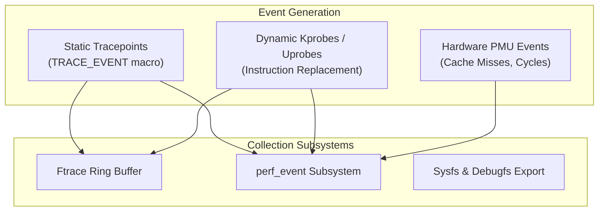

# Linux Tracing & Instrumentation Guide

> [!summary]
> A technical breakdown of three foundational papers on operating system instrumentation: Ian Munsie's treatise on Linux kernel instrumentation interfaces, Jörg Zinke's empirical study on the overhead of system call tracing mechanisms, and Harald König's practical guide to dissecting shell process execution via `strace`.

---

## 1. Linux Instrumentation (Ian Munsie, 2010)

### Architectural Context
Ian Munsie examines the evolution of Linux kernel tracing mechanisms from ad-hoc `printk` debugging to standardized, low-overhead kernel subsystems.



### Key Technical Mechanisms
1. **Static Tracepoints (`TRACE_EVENT`)**:
   - Hardcoded in the Linux kernel source at critical execution paths (e.g., `sched_switch`, `netif_receive_skb`).
   - When disabled, a static tracepoint incurs virtually zero overhead—implemented as a 5-byte NOP instruction that the kernel dynamically patches at runtime with a jump instruction when enabled.
2. **Kprobes (Kernel Dynamic Probes)**:
   - Allows attaching a probe to almost any arbitrary kernel instruction address.
   - Mechanism: Replaces the target instruction with a breakpoint instruction (`int3` on x86). When hit, the CPU saves register state, invokes the user-defined handler callback, executes the original instruction out-of-line, and resumes normal execution.
3. **Trace Buffer Mechanics**:
   - Uses lockless per-CPU circular memory ring buffers to eliminate cross-core cache invalidations and memory contention.

---

## 2. System Call Tracing Overhead (Jörg Zinke, 2009)

### The Problem: Diagnostic Perturbation (Heisenbugs)
When an engineer attaches a tracer to diagnose latency in a production system, the tracer itself modifies the timing and latency characteristics of the workload. Zinke provides rigorous empirical benchmarks quantifying the overhead of different tracing primitives.

### The Cost of `ptrace`
- Traditional debuggers (`gdb`) and tracers (`strace`) rely on the `ptrace(PTRACE_SYSCALL, ...)` system call.
- **Cost Analysis**:
  - For **every single system call**, the traced process must stop, context switch from user-space to kernel-space, transition to the tracing process, wake up the tracer, copy register state, context switch back, execute the syscall, and repeat the entire sequence upon syscall exit!
  - **Overhead**: In I/O-intensive workloads, `ptrace`-based tracing degrades execution throughput by **$200\%$ to $1,500\%$** ($2\times$ to $15\times$ slowdown).

### The In-Kernel Alternative (Kprobes & Tracepoints)
- Running instrumentation inside kernel space without waking user-space processes avoids context switches.
- **Overhead Comparison**:
  - `ptrace`: $\approx 2,000 \text{ to } 5,000\text{ nanoseconds}$ per event.
  - In-kernel tracepoint: $\approx 15 \text{ to } 35\text{ nanoseconds}$ per event.
  - In modern Linux (eBPF): $\approx 10 \text{ to } 25\text{ nanoseconds}$ per event.

---

## 3. Use "strace" to Understand Your Shell (Harald König, 2015)

### Core Thesis
The shell (Bash, Zsh) appears simple on the surface, but a single command execution invokes complex orchestration: fork-exec pipelines, subshell spawning, environment variable cloning, file descriptor redirections, and signal handling. König uses `strace` to reveal the exact system calls executed by common shell constructs.

### Practical Shell Mechanics Uncovered by `strace`

#### 1. Command Execution (`fork` vs `execve`)
```bash
strace -f -e trace=process bash -c "ls -l"
```
- Reveals the `clone()` or `fork()` invocation creating the child process PID, followed by `execve("/bin/ls", ["ls", "-l"], ...)` which wipes the address space and loads the ELF binary into memory.

#### 2. Pipe Buffering & File Descriptor Duping (`cmd1 | cmd2`)
```bash
strace -f -e trace=pipe,dup2,close,write,read bash -c "cat file | grep foo"
```
- Traces `pipe([3, 4])` creating a read end (fd 3) and write end (fd 4).
- Shows `dup2(4, 1)` redirecting stdout of `cat` to the pipe write end, and `dup2(3, 0)` redirecting stdin of `grep` to the pipe read end.

#### 3. Why `cd` Must Be a Shell Builtin
- If `cd` were an external binary (`/bin/cd`), running it would `fork()` a child process. The child would execute `chdir("/path")` and then exit, leaving the parent shell's working directory unchanged!
- Running `strace` confirms that builtins (`cd`, `export`, `alias`) execute `chdir()` directly within the parent process PID without `execve()`.

---

## Engineering Implications

1. **Never Run `strace` on High-Throughput Production Systems**: Because of `ptrace` context-switch penalties, running `strace -p <pid>` on a production database or high-frequency trading matching engine can cause instant client timeouts or queue saturation.
2. **Use eBPF for Production Tracing**: Use `bpftrace` or `perf trace` instead of `strace` for zero-overhead, non-disruptive production debugging:
   ```bash
   # Modern zero-overhead equivalent to strace:
   perf trace -p <PID>
   ```

---

## Related Notes
- [[Brendan-Gregg-Performance-Canon|Brendan Gregg Performance Canon]]
- [[../02-Operating-Systems-and-Kernels/Unix-and-Linux-Kernel-Foundations|UNIX and Linux Kernel Foundations]]
- [[../../12-Performance-Engineering/02-Profiling/profiling_guide|Performance Engineering: Profiling Guide]]
- [[../README|Technical Whitepapers Master MOC]]
