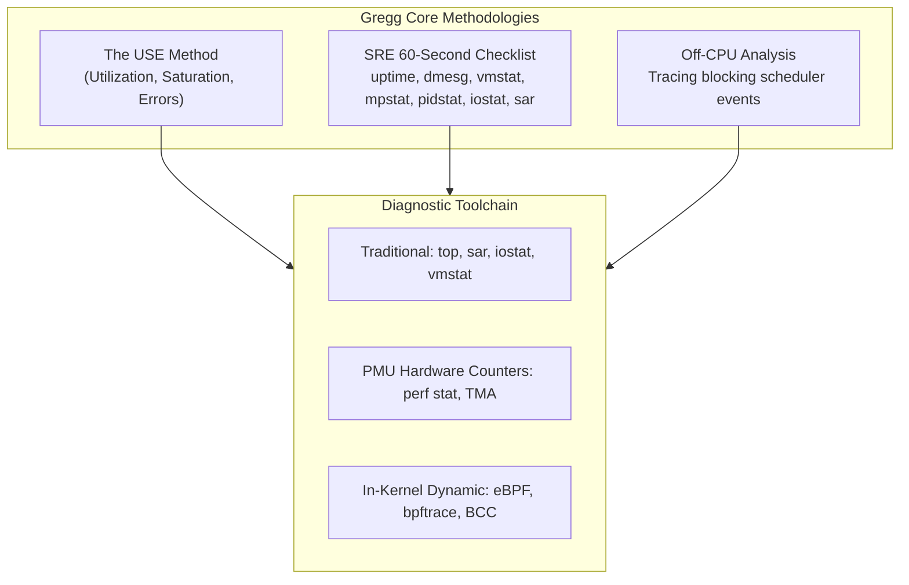

# Systems Performance, eBPF & Tracing

> [!summary]
> This domain covers the modern science of operating system and hardware performance engineering. Centered around the seminal works of **Brendan Gregg** (Intel, Netflix, Sun Microsystems) alongside foundational tracing research by Ian Munsie, Jörg Zinke, and Harald König, these whitepapers establish measurement-first methodologies to diagnose CPU, memory, storage, and network bottlenecks.

---

## Pillar Guide Index

1. **[[Brendan-Gregg-Performance-Canon|Brendan Gregg Performance Canon]]**
   - In-depth architectural synthesis of all 14 Brendan Gregg whitepapers:
     - *BPF: Tracing and More (2017)*
     - *Container Performance Analysis*
     - *From DTrace To Linux (2014)*
     - *Linux 4.x Performance Using BPF Superpowers (2016)*
     - *Linux Performance Tools (2014 & 2015)*
     - *Linux Performance Analysis New Tools and Old Secrets*
     - *Linux Profiling at Netflix (2015)*
     - *Linux Systems Performance (2016)*
     - *Open Source Systems Performance (2013)*
     - *Performance Analysis: The USE Method (2012)*
     - *Performance Checklists for SREs (2016)*
     - *Performance Methodologies for Production Systems (2013)*
     - *System Performance (2013)*
     - *Performance Analysis Superpowers with Linux eBPF (2015)*
2. **[[Linux-Tracing-and-Instrumentation|Linux Tracing & Instrumentation Guide]]**
   - *Linux Instrumentation (Ian Munsie, 2010)*: Kernel tracepoints, perf events, sysfs, and static probes.
   - *Use "strace" to Understand Your Shell (Harald König, 2015)*: Syscall inspection, file descriptors, pipes, signals.
   - *System call tracing overhead (Jörg Zinke, 2009)*: Measuring `ptrace` context-switch penalties vs zero-copy in-kernel probes.

---

## Core Performance Principles at a Glance

---

## Cross-Links
- [[../README|Technical Whitepapers Master MOC]]
- [[../../12-Performance-Engineering/02-Profiling/profiling_guide|12-Performance-Engineering: Profiling Guide]]
- [[../../14-Low-Latency-Systems/Sources/Systems Performance by Brendan Gregg|14-Low-Latency-Systems: Systems Performance Source Summary]]
