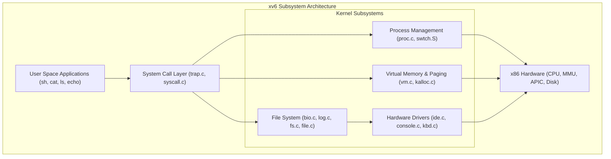

# Teaching Operating Systems: xv6 & OS From Scratch

> [!summary]
> A deep dive into the engineering foundations of operating systems through MIT's **xv6** teaching kernel and Nick Blundell's classic guide to constructing a functional x86 operating system from raw bootloader assembly to 32-bit protected mode.

---

## 1. xv6: A Simple, Unix-like Teaching Operating System (MIT, 2012)

### Authors & Origin
Created by Russ Cox, M. Frans Kaashoek, and Robert Morris at MIT. xv6 re-implements Dennis Ritchie and Ken Thompson's Sixth Edition Unix (v6, 1975) in clean ANSI C for multi-core x86 processors.



### Core Architecture & Key Source Files
1. **Process Representation (`proc.h`, `proc.c`)**:
   - Every process is represented by a `struct proc` tracking its state (`UNUSED`, `EMBRYO`, `SLEEPING`, `RUNNABLE`, `RUNNING`, `ZOMBIE`), page table pointer (`pde_t *pgdir`), kernel stack (`kstack`), open file descriptors (`struct file *ofile[NOFILE]`), and context (`struct context`).
2. **Context Switching in Pure Assembly (`swtch.S`)**:
   ```assembly
   # Context switch: swtch(struct context **old, struct context *new);
   # Saves caller-saved registers on current stack, switches %esp, pops new registers.
   .globl swtch
   swtch:
     movl 4(%esp), %eax     # Old context pointer
     movl 8(%esp), %edx     # New context pointer

     # Push current registers
     pushl %ebp
     pushl %ebx
     pushl %esi
     pushl %edi

     # Switch stack pointer
     movl %esp, (%eax)
     movl %edx, %esp

     # Restore new registers
     popl %edi
     popl %esi
     popl %ebx
     popl %ebp
     ret
   ```
3. **Two-Level x86 Paging (`vm.c`)**:
   - Implements 32-bit x86 paging using a **Page Directory** (1024 entries) and **Page Tables** (1024 entries of 4KB frames).
   - Maps virtual addresses above `0x80000000` (2GB) directly to physical memory for kernel execution, while user space occupies addresses `0` to `0x80000000`.
4. **Crash-Resistant Logging File System (`log.c`, `fs.c`)**:
   - Uses write-ahead journaling. Disk writes are buffered in a memory log, flushed contiguously to a disk journal header, and then committed to disk blocks. If a power failure occurs, the journal replays all completed transactions upon reboot.

---

## 2. Writing a Simple Operating System — From Scratch (Nick Blundell, 2010)

### The Boot Process Step-by-Step
Nick Blundell demystifies how a bare-metal computer transitions from BIOS firmware execution to a compiled C kernel.

```text
+-----------------------------------------------------------------------------------+
|                           THE PC BOOT PROCESS                                     |
+-----------------------------------------------------------------------------------+
| 1. Power-On Reset (POR): CPU starts in 16-Bit Real Mode at address 0xFFFF0.       |
| 2. BIOS loads the first 512-byte sector of the boot drive to address 0x7C00.       |
| 3. Signature Check: BIOS verifies that bytes 510 and 511 are 0x55 and 0xAA.       |
| 4. Bootloader executes, sets up the stack, and loads kernel code into memory.     |
| 5. Bootloader sets up the Global Descriptor Table (GDT) for 32-bit protected mode.|
| 6. Sets CR0 register bit 0 (PE = 1) to enable Protected Mode.                     |
| 7. Performs a FAR JUMP (jmp 0x08:init_pm) to flush the 16-bit pipeline.          |
| 8. Kernel main() function in C begins executing.                                  |
+-----------------------------------------------------------------------------------+
```

### Key Milestones Explained

#### 1. Real Mode vs 32-Bit Protected Mode
- **16-Bit Real Mode**:
  - Direct access to physical memory up to 1 MB ($2^{20}$ bytes) via segmented addressing:
    $$\text{Physical Address} = (\text{Segment} \times 16) + \text{Offset}$$
  - No memory protection, no virtual memory, no hardware security rings. Any process can overwrite the interrupt vector table (IVT) or BIOS memory.
- **32-Bit Protected Mode**:
  - Full 4 GB flat address space ($2^{32}$ bytes).
  - Memory protection enforced by hardware through the **Global Descriptor Table (GDT)**.
  - Enables Ring 0 (Supervisor) vs Ring 3 (User) privilege isolation.

#### 2. The Global Descriptor Table (GDT)
The GDT defines memory segments and their access permissions:
- **Code Segment Descriptor**: Base address (`0x0`), limit (`0xFFFFF`), Type (Execute/Read), Privilege Level (Ring 0), Granularity (4KB blocks $\to$ 4GB limit).
- **Data Segment Descriptor**: Base address (`0x0`), limit (`0xFFFFF`), Type (Read/Write), Privilege Level (Ring 0).

#### 3. Transitioning from Assembly to C
- The bootloader initializes the stack pointer (`mov esp, 0x90000`).
- Calls the C entry point function (`call kernel_main`).
- In C, writes directly to video memory at address `0xB8000` (VGA text mode buffer) to print characters to the display screen.

---

## Core Interview Takeaways

1. **Why does context switching need assembly?**
   - High-level languages like C cannot directly manipulate hardware CPU registers (e.g., `%esp`, `%eip`, `%cr3`). Saving the current thread's stack pointer and swapping it with the target thread's stack pointer requires exact register control (`push`, `mov`, `pop`).
2. **What role does CR3 play in virtual memory?**
   - The CPU's `CR3` control register holds the physical base address of the active process's top-level Page Directory. During a process context switch, writing a new physical address into `CR3` instantly swaps the virtual memory address space and flushes non-global TLB entries.

---

## Related Notes
- [[Unix-and-Linux-Kernel-Foundations|UNIX and Linux Kernel Foundations]]
- [[Windows-NT-Internals-Architecture|Windows NT Internals and Architecture]]
- [[../03-Memory-Architecture-and-Concurrency/Ulrich-Drepper-Memory-Architecture|Ulrich Drepper Memory Architecture]]
- [[../README|Technical Whitepapers Master MOC]]
