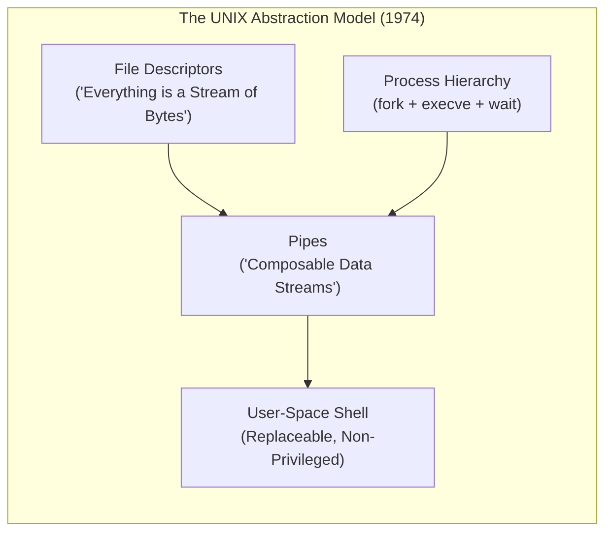

# UNIX & Linux Kernel Foundations

> [!summary]
> A technical breakdown of the seminal architectural papers defining UNIX and Linux: the 1974 foundational treatise by Dennis Ritchie and Ken Thompson, Michael K. Johnson's early kernel hacker's guide, Rusty Russell's classic rules of kernel concurrency, and the EuroSys 2016 paper on Linux multi-core scheduler bugs causing catastrophic core underutilization.

---

## 1. The UNIX Time-Sharing System (Dennis M. Ritchie & Ken Thompson, 1974)

**Source:** [open copy](https://www.nokia.com/bell-labs/about/dennis-m-ritchie/cacm.pdf)

### Historical & Engineering Significance
Published in *Communications of the ACM*, this paper introduced the fundamental abstractions that continue to govern modern computing 50+ years later. Ritchie and Thompson designed UNIX for the PDP-11 with three revolutionary goals: simplicity, elegance, and composability.



### Core Abstractions Defined
1. **The Hierarchical File System**:
   - Eliminated complex hardware-specific record access methods. Every file is simply an **unstructured linear sequence of bytes**.
   - Uniform naming: Devices, storage disks, and terminals appear in the file system namespace under `/dev`.
2. **Process Management**:
   - `fork()`: Creates an exact copy of the calling process address space.
   - `exec()`: Overlays a new executable image onto the current process address space.
   - Decoupling `fork` from `exec` allowed the parent shell to manipulate file descriptors (redirecting stdin/stdout/stderr) *between* the fork and the exec, birthing the UNIX pipeline.
3. **Remountable File Systems**: Mounting distinct physical storage volumes into a unified logical directory tree.

---

## 2. The Linux Kernel Hackers' Guide (Michael K. Johnson, 1995)

**Source:** [publisher page](https://tldp.org/LDP/khg/HyperNews/get/khg.html)

### Architectural Blueprint of Early Linux
Johnson's guide provided the first comprehensive documentation of the Linux monolithic kernel architecture (v1.2/v2.0):
- **Monolithic with Modular Extensibility**: All kernel subsystems (scheduler, virtual memory, network stack, filesystems) execute in a single shared supervisor address space (Ring 0), but support dynamic loading/unloading via Loadable Kernel Modules (LKMs).
- **Virtual File System (VFS)**: Introduced the four core C structs that define Linux storage:
  - `struct inode`: Represents a physical file on disk (metadata, permissions, blocks).
  - `struct dentry`: Represents a directory entry in the path cache (speeding up name lookups).
  - `struct file`: Represents an open file instance held by a process (file pointer offset, mode).
  - `struct super_block`: Represents an entire mounted filesystem instance.

---

## 3. Unreliable Guide To Hacking The Linux Kernel (Paul Rusty Russell, 2000)

**Source:** [publisher page](https://docs.kernel.org/kernel-hacking/hacking.html)

### Concurrency Rules in Kernel Space
Rusty Russell's humorous yet rigorous guide established the cardinal rules of Linux kernel programming:

1. **User Context vs Interrupt Context**:
   - *User Context* (`sys_read`, `ioctl`): The kernel is executing on behalf of a user process. It is **allowed to sleep**, allocate memory with `GFP_KERNEL`, and block on mutexes.
   - *Interrupt Context* (Hardware ISRs, SoftIRQs, Tasklets): Running asynchronously in response to hardware signals. **Never sleep! Never call `copy_from_user`! Never allocate memory that might block!**
2. **Locking Hierarchy**:
   - **Spinlocks**: Used when protecting data accessed in interrupt context. The CPU spins in a tight loop waiting for the lock. *Holding a spinlock disables kernel preemption on the local CPU.*
   - **Mutexes / Semaphores**: Used when the critical section may sleep or perform I/O.
3. **Safe Memory Copying**:
   - Kernel code must **never** directly dereference a user-space pointer (`char *user_buf`). The page might not be paged into RAM, or could belong to an attacker trying to crash the kernel.
   - Always use `copy_from_user()` and `copy_to_user()` - which handle page faults and MMU permission checks safely.

---

## 4. The Linux Scheduler: A Decade of Wasted Cores (EuroSys 2016)

**Source:** [open copy](https://people.ece.ubc.ca/sasha/papers/eurosys16-final29.pdf)

### The Discovery: Catastrophic Multi-Core CFS Bugs
Lozi, David, Thomas, et al. analyzed the Completely Fair Scheduler (CFS) on modern multi-socket NUMA machines (64+ cores) and discovered four major algorithmic design bugs causing threads to wait in run queues while dozens of CPU cores remained completely idle - leading to **slowdowns of up to $138\times$**!

```text
The 4 Major Linux Scheduler Bugs Documented:
1. The Group Imbalance Bug:
   - Load balancing operated at the level of scheduling domains rather than individual cores.
   - If a multi-core node had one high-weight task, the balancer assumed the node was fully loaded,
     leaving neighboring cores on that same node idle even when other nodes had starving threads!

2. The Scheduling Group Construction Bug:
   - On NUMA topologies, scheduling groups were constructed from the perspective of core 0.
   - Cores further away had incorrect distance metrics and failed to steal work across sockets.

3. The Overload-on-Wakeup Bug:
   - When a sleeping thread woke up, CFS checked a small subset of cores (e.g., local LLC domain).
   - If those cores were busy, it placed the thread on an overloaded core's queue rather than
     dispatching it to an idle core on another NUMA node.

4. The Missing Scheduling Domains Bug:
   - When cores were dynamically brought online or offline, scheduling domains were corrupted,
     permanently isolating cores from receiving migrated tasks.
```

### Production Implications for High-Performance Systems
- **Core Isolation (`isolcpus`)**: To avoid CFS scheduling anomalies in low-latency trading or high-throughput databases, engineers isolate critical cores from the Linux scheduler using boot parameters:
  ```bash
  isolcpus=2-15 nohz_full=2-15 rcu_nocbs=2-15
  ```
- **Thread Pinning**: Explicitly bind performance-critical threads to specific physical CPU cores using `pthread_setaffinity_np()`, completely bypassing dynamic CFS migration.

---

## Technical Interview Questions

### Question 1: What happens during `fork()` at the memory page table level?
- **Answer**: Modern operating systems use **Copy-On-Write (COW)**. Calling `fork()` does *not* duplicate physical RAM. Instead, the OS duplicates the page table entries of the parent, pointing the child's virtual pages to the exact same physical frames, and marks all writable pages as **Read-Only**. When either the parent or child attempts to write to a page, the CPU MMU generates a Page Fault exception. The OS kernel intercepts the fault, allocates a fresh physical frame, copies the 4KB page content, updates the faulting process's page table with write permissions, and resumes execution.

### Question 2: Why can't a kernel interrupt handler sleep?
- **Answer**: Interrupt handlers execute outside of any process context. Because there is no associated process control block (PCB / `struct task_struct`) to save and reschedule onto a run queue, the kernel scheduler has no mechanism to put an interrupt handler to sleep or wake it back up. Attempting to sleep or call blocking APIs inside an ISR results in a kernel panic.

---

## Related Notes
- [[OS-From-Scratch-and-Teaching-Kernels|Teaching Operating Systems: xv6 and From Scratch]]
- [[Windows-NT-Internals-Architecture|Windows NT Internals and Architecture]]
- [[../01-Systems-Performance-and-Tracing/Brendan-Gregg-Performance-Canon|Brendan Gregg Performance Canon]]
- [[../README|Technical Whitepapers Master MOC]]
