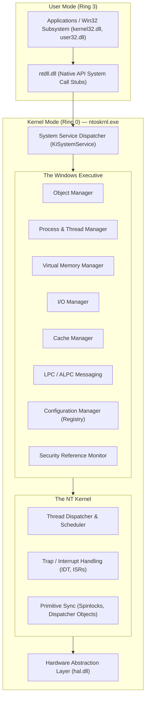
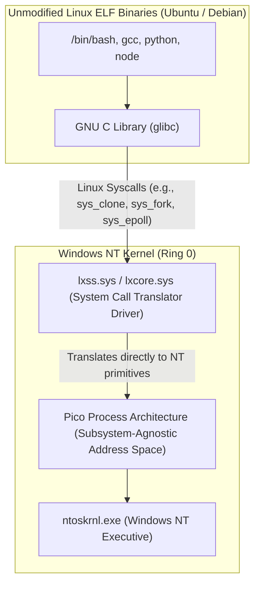

# Windows NT Internals & Architecture

> [!summary]
> A comprehensive architectural guide to the internal subsystems of the Windows NT operating system, synthesized from primary design notes by chief architect David N. Cutler, Mark Lucovsky's engineering chronicle, Dr. David B. Probert's 10-part kernel curriculum, WinDbg debugging guides, and Alex Ionescu's reverse engineering of Windows Subsystem for Linux (WSL1).

---

## 1. The Design Philosophy of Windows NT (Cutler & Lucovsky)

Designed in the late 1980s by **David N. Cutler** (creator of VMS at DEC) and **Mark Lucovsky**, Windows NT was built on four foundational pillars:
1. **Portability**: Abstracting hardware architecture behind a strict **Hardware Abstraction Layer (HAL)** (`hal.dll`), enabling NT to run unmodified on x86, MIPS, Alpha, and ARM.
2. **True Preemptive Multitasking**: 32 priority levels with dynamic boosting for GUI responsiveness and I/O completion.
3. **Enterprise Security**: Access Control Lists (ACLs), Security Descriptors, and the Security Reference Monitor (SRM) built into every kernel object.
4. **Subsystem Architecture**: The user sees subsystems (Win32, POSIX, OS/2) executing on top of a shared Native API (`Nt*` and `Zw*` system calls implemented in `ntoskrnl.exe`).

---

## 2. The 10 Subsystems of the NT Kernel (David B. Probert, Ph.D.)



### Breakdown of the Probert Kernel Curriculum:

#### 1. Traps, Interrupts & Exceptions
- **Interrupt Request Levels (IRQL)**: Hardware prioritization in Windows NT:
  - `PASSIVE_LEVEL (0)`: Normal thread execution. Paging is allowed.
  - `APC_LEVEL (1)`: Asynchronous Procedure Calls executed. Paging allowed.
  - `DISPATCH_LEVEL (2)`: Thread scheduler and DPCs (Deferred Procedure Calls). **Page faults forbidden! Paging out causes immediate BugCheck (BSOD 0x0A `IRQL_NOT_LESS_OR_EQUAL`).**
  - `DIRQL (3-26)`: Device Interrupt Service Routines.
  - `HIGH_LEVEL (31)`: Clock, Machine Check exceptions, profiling.

#### 2. Advanced Virtual Memory
- 64-bit address space (split between User and System spaces).
- **PFN Database (Page Frame Number)**: Tracks physical RAM frames across 8 states: Active, Standby, Modified, ModifiedNoWrite, Free, Zeroed, Bad, Transition.
- Working Set Trimming: Dynamically calculates working set sizes and trims cold pages to the Standby list.

#### 3. Cache Manager
- Operates on a **Virtual Block** level rather than physical disk blocks.
- Uses `CcCopyRead()` and `CcCopyWrite()` to map cached file streams directly into system virtual memory.
- Uses background Lazy Writers and Read-Ahead worker threads to saturate disk bandwidth smoothly.

#### 4. I/O Architecture & IRPs
- **I/O Request Packets (IRP)**: All I/O in NT is packet-driven.
- When an application calls `ReadFile()`, the I/O Manager allocates an IRP with an I/O Stack Location for each filter, class, and port driver in the device stack.
- Supports asynchronous, non-blocking I/O completion routines via **I/O Completion Ports (IOCP)**.

#### 5. Lightweight Procedure Calls (LPC / ALPC)
- High-performance inter-process communication mechanism optimized for client/server subsystems (e.g., communicating with `csrss.exe` or `lsass.exe`).
- Small messages ($<256$ bytes) copied directly across kernel ports; large payloads transferred via shared memory mapped sections.

#### 6. NTFS Architecture
- Metadata-driven journaling file system. Everything on NTFS is a file—including `$MFT` (Master File Table), `$LogFile` (transaction log), and `$Bitmap` (free cluster allocation).
- Uses transaction recovery logging to ensure file system consistency across crashes.

#### 7. NT Registry Implementation
- Implemented by the Configuration Manager.
- Organized hierarchically into **Hives** stored in binary disk format (`SYSTEM`, `SOFTWARE`, `SAM`).
- Memory allocated in 4KB **Bins** containing variable-size **Cells** (`nk` key cells, `vk` value cells).

#### 8. Object Manager
- Centralized tracking for kernel resources (Processes, Threads, Files, Mutexes, Events, Sections).
- Provides uniform object headers, reference counting, handle tables, and quota accounting.

#### 9. Synchronization Mechanisms
- **Dispatcher Objects**: Waitable objects in user/kernel space (Events, Mutexes, Semaphores, Timers, Threads). Can be in *Signaled* or *Nonsignaled* state.
- **Fast Mutexes & Pushlocks**: High-speed user/kernel hybrid primitives that acquire without entering kernel mode unless contention occurs.
- **Spinlocks**: Used exclusively at `IRQL >= DISPATCH_LEVEL` for multiprocessor hardware synchronization.

#### 10. Cutler's NT Alerts Design Note (1989)
- Defines the mechanics of alerting threads waiting in alertable states (`KeWaitForSingleObject(..., Alertable = TRUE)`) to execute queued Asynchronous Procedure Calls (APCs).

---

## 3. Kernel Debugging with WinDbg (Robert Kuster & MS Guide)

### Essential WinDbg Commands Cheatsheet

```text
!analyze -v            # Automated root-cause crash dump analysis (BSOD BugCheck triage)
lm                     # List loaded modules and symbol status (PDB matching)
.symfix; .reload       # Configure Microsoft Public Symbol Server and reload PDBs
!process 0 0           # Enumerate all running processes in the target kernel
!process <addr> 7      # Dump complete thread list and stack traces for a process
!thread <addr>         # Inspect thread state, wait reason, and IRQL
k, kp, kn              # Display call stack with frame numbers, parameters, and line numbers
!irp <addr>            # Inspect pending I/O Request Packet state and driver stack
!locks                 # Identify contended kernel resource locks and deadlocks
!vm                    # Dump system virtual memory, PFN statistics, and pool usage
!poolfind <Tag>        # Search non-paged and paged pools for memory leak pool tags
```

---

## 4. The Linux Kernel Hidden Inside Windows 10 (Alex Ionescu, 2016)

### Reverse Engineering WSL1 Architecture
Alex Ionescu's seminal research revealed how Microsoft built Windows Subsystem for Linux (WSL1) without running a Linux virtual machine:



- **Pico Processes & Pico Providers**: Microsoft introduced empty-container processes with no Windows PEB/TEB. Syscall dispatch was hooked by `lxcore.sys`, which implemented clean, direct translation of Linux syscalls into Windows NT executive APIs.
- **File System Translation**: WSL1 mapped Linux POSIX semantics (case sensitivity, permissions) over NTFS using file extended attributes (EA).

---

## Related Notes
- [[Unix-and-Linux-Kernel-Foundations|UNIX and Linux Kernel Foundations]]
- [[OS-From-Scratch-and-Teaching-Kernels|Teaching Operating Systems: xv6]]
- [[../03-Memory-Architecture-and-Concurrency/Ulrich-Drepper-Memory-Architecture|Ulrich Drepper Memory Architecture]]
- [[../README|Technical Whitepapers Master MOC]]
