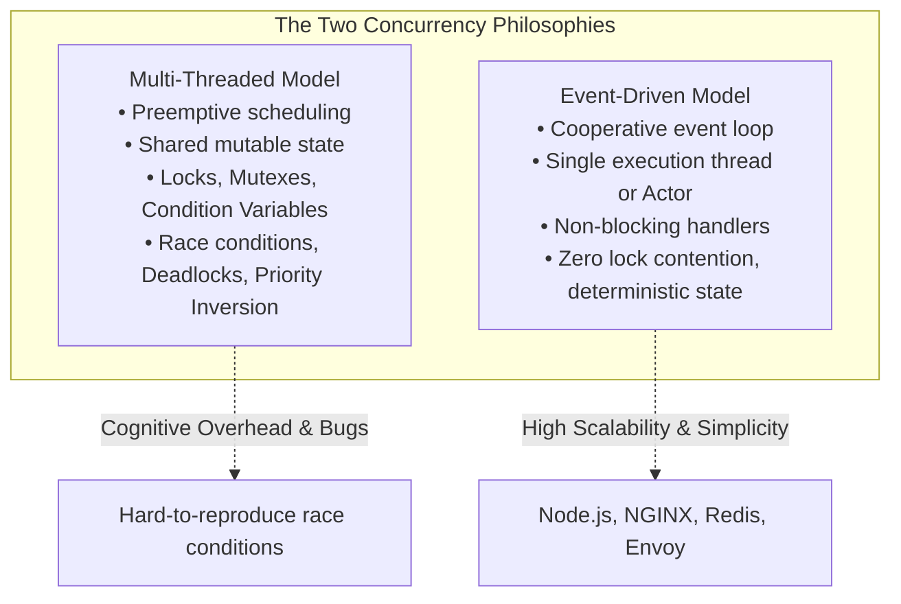

# Concurrency & Threading Debates

> [!summary]
> A critical examination of two seminal papers that shaped modern concurrent systems: John Ousterhout's 1995 warning against multi-threaded architectures in favor of event-driven models, and Elaine Cheong and Fred Reiss's 2000 research on lightweight Virtual Threads (user-level M:N threading runtimes).

---

## 1. Why Threads Are A Bad Idea (for most purposes) (John Ousterhout, 1995)

### Author & Context
John Ousterhout (creator of Tcl/Tk, Raft consensus algorithm, and RAMCloud) presented this seminal slide-deck paper arguing that multi-threading is fundamentally too complex and error-prone for general application programming.



### Ousterhout's Key Arguments
1. **Threads are too hard for most humans**:
   - Preemption means a context switch can occur between *any two CPU instructions*.
   - Writing thread-safe code requires defensive locking everywhere, creating deadlocks, live-locks, priority inversion, and race conditions.
2. **Synchronization destroys modularity**:
   - Locking protocols leak across abstraction layers. If Module A calls Module B while holding Lock 1, and Module B calls Module A while waiting on Lock 2, the system deadlocks.
3. **Performance myths**:
   - Developers assume threads make programs faster. In reality, thread synchronization overhead (kernel transitions, mutex contention, cache invalidations, context switching) often makes multi-threaded applications slower than single-threaded event loops for I/O-bound tasks!
4. **Where threads ARE appropriate**:
   - True CPU-bound parallel number crunching across multiple physical cores.
   - For all other tasks (especially network servers and GUIs), **event-driven programming with state machines is superior**.

---

## 2. Virtual Threads (Elaine Cheong & Fred Reiss, 2000)

### Architectural Context & Vision
Decades before Java 21 popularized Virtual Threads (Project Loom) or Go built goroutines, Cheong and Reiss explored how to combine the **intuitive synchronous programming model of threads** with the **scalability and performance of event loops**.

### The M:N Threading Architecture
- **1:1 Model (OS Native Threads)**:
  - Each application thread maps directly to an OS kernel thread (`pthread_create`).
  - *Limitation*: Heavy memory footprint (typically 1–8 MB stack per thread), high context switch overhead ($1–3\text{ \mu s}$). A system collapses when handling 100,000 threads.
- **M:N Model (Virtual Threads / Coroutines)**:
  - $M$ user-level virtual threads multiplexed onto $N$ physical OS worker threads ($M \gg N$).
  - *Mechanism*: Small dynamic stacks (starting at 1–2 KB). When a virtual thread performs a blocking I/O operation (e.g., reading a network socket), the user-level runtime intercepts the call, registers the socket with an OS poller (`epoll` / `kqueue`), and context switches to another runnable virtual thread **in user space without kernel intervention**.

```text
+-----------------------------------------------------------------------------------+
|                        M:N RUNTIME ARCHITECTURE                                   |
+-----------------------------------------------------------------------------------+
| Virtual Threads (M):  [Task 1]  [Task 2]  [Task 3]  [Task 4] ... [Task 100,000]   |
|                              \       |       /       /                            |
| User Runtime Scheduler:       [Work-Stealing Task Queue Pool]                     |
|                              /       |       \       \                            |
| Kernel Threads (N):        [CPU 0] [CPU 1] [CPU 2] [CPU 3]   (Matches Core Count) |
+-----------------------------------------------------------------------------------+
```

---

## Modern Systems Synthesis

| Feature | Kernel OS Threads (1:1) | Event-Driven Loops (Node/Redis) | Modern Virtual Threads (Go / Loom) |
| :--- | :--- | :--- | :--- |
| **Programming Style** | Synchronous, Blocking | Asynchronous, Callbacks / Promises | Synchronous, Blocking code style |
| **Concurrency Limit** | Low (~1,000–5,000) | Extreme (1,000,000+) | Extreme (1,000,000+) |
| **Stack Memory** | 1–8 MB fixed | Minimal (Call frame on heap) | 1–2 KB resizable |
| **Context Switch Overhead** | High (Kernel trap + TLB/registers) | Zero (Function call in loop) | Low (User-space register swap) |
| **Debugging Complexity**| High (Race conditions) | Moderate (Callback hell, async traces) | Low (Clean sequential stack traces) |

---

## Related Notes
- [[Ulrich-Drepper-Memory-Architecture|Ulrich Drepper Memory Architecture]]
- [[Data-Structures-and-Memory-Opt|Data Structures and Memory Optimization]]
- [[../01-Systems-Performance-and-Tracing/Brendan-Gregg-Performance-Canon|Brendan Gregg Performance Canon]]
- [[../README|Technical Whitepapers Master MOC]]
