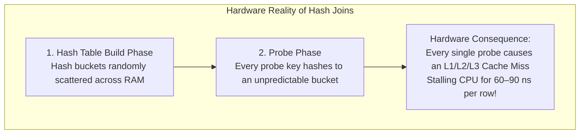
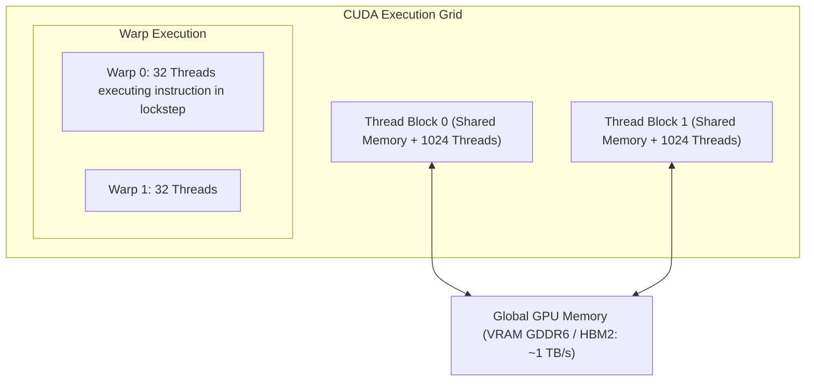

# Data Structures & Memory Optimization

> [!summary]
> An analysis of three specialized papers demonstrating how hardware microarchitecture dictates algorithmic efficiency: Manegold, Boncz, and Kersten's dissection of CPU and cache effects during database joins, Lee and Martel's evaluation of splay trees under skewed workloads, and Klaus Mueller's practical guide to GPGPU computing via CUDA.

---

## 1. What Happens During a Join: Dissecting CPU and Memory Optimization Effects (Manegold, Boncz, Kersten)

### The Database Problem
In classic database theory, join algorithms (Nested Loops, Sort-Merge, Hash Join) are analyzed purely by I/O cost (number of disk block reads). However, with multi-gigabyte main memory databases, queries execute entirely in RAM. The authors demonstrate that **main-memory database performance is bottlenecked by CPU cache misses and TLB thrashing rather than CPU cycles**.



### Radix Partitioned Hash Join (The Solution)
To eliminate random DRAM access, the authors propose **Radix-Cluster Hash Joins**:
1. Partition both relations into smaller sub-partitions using the lower bits of the hash key.
2. Ensure each sub-partition is small enough to **fit entirely inside the CPU's L2 cache** ($<512\text{ KB}$).
3. Join matching partitions in L2 cache: All hash table reads and writes hit cache lines, achieving **$3\times$ to $5\times$ speedups** over standard hash joins!

---

## 2. When to Use Splay Trees (Eric K. Lee & Charles U. Martel, 2007)

### Splay Trees vs Traditional Balanced Trees
A **Splay Tree** (invented by Sleator and Tarjan) is a self-adjusting binary search tree with no explicit balance information (unlike AVL or Red-Black trees). Every search, insertion, or deletion automatically moves the accessed node to the root via a series of tree rotations (**splay steps**: zig-zig, zig-zag).

```text
Amortized Complexity: O(log N) per operation
Worst-Case Single Operation: O(N) (Can degenerate into a linear chain temporarily)
```

### When Splay Trees Outperform AVL / Red-Black Trees
1. **Highly Skewed (Zipfian) Access Patterns**:
   - In 90/10 workloads (where $10\%$ of keys account for $90\%$ of lookups), splaying keeps the hot $10\%$ of nodes near the root of the tree.
   - Result: Frequent lookups execute in $O(1)$ time, residing permanently in L1/L2 CPU caches.
2. **Zero Metadata Overhead**:
   - Requires no balance factors (AVL) or color bits (Red-Black), reducing node memory size by $4–8$ bytes per element.

### When NOT to Use Splay Trees
- **Read-Only Concurrent Environments**: In a splay tree, even a simple lookup (`find`) mutates the tree structure by rotating nodes to the root. This prevents concurrent lock-free or read-locked parallel readers!
- **Strict Real-Time Latency (SLA) Constraints**: A worst-case single operation can take $O(N)$ time, causing an intolerable tail-latency spike in low-latency systems.

---

## 3. Using CUDA in Practice (Klaus Mueller)

### GPU Architecture: SIMT Parallelism
CPUs are optimized for ultra-low latency on single threads (large caches, branch predictors, out-of-order execution). GPUs are optimized for massive data parallelism, deploying thousands of smaller arithmetic logic units (ALUs) executing in lockstep via **Single Instruction, Multiple Threads (SIMT)**.



### Critical Rules for CUDA Performance

1. **Memory Coalescing**:
   - When all 32 threads in a Warp access contiguous 4-byte or 8-byte memory addresses, the hardware memory controller merges the 32 reads into a **single 128-byte memory transaction**.
   - If threads access strided or random memory addresses, the GPU must issue 32 separate serial memory requests, degrading memory throughput by up to $97\%$!
2. **Shared Memory Bank Conflicts**:
   - Shared memory on the GPU is organized into 32 separate 32-bit memory banks.
   - If two or more threads in a warp access different memory addresses within the **same bank**, the accesses are serialized (Bank Conflict).
3. **Warp Divergence**:
   - If a code branch contains `if (threadIdx.x % 2 == 0) { A(); } else { B(); }`, threads in the warp cannot take different execution paths simultaneously.
   - The warp serializes: All 32 threads execute `A()` (with odd threads disabled), and then all 32 execute `B()` (with even threads disabled), halving execution throughput.

---

## Related Notes
- [[Ulrich-Drepper-Memory-Architecture|Ulrich Drepper Memory Architecture]]
- [[Concurrency-and-Threading-Debates|Concurrency and Threading Debates]]
- [[../01-Systems-Performance-and-Tracing/Brendan-Gregg-Performance-Canon|Brendan Gregg Performance Canon]]
- [[../README|Technical Whitepapers Master MOC]]
