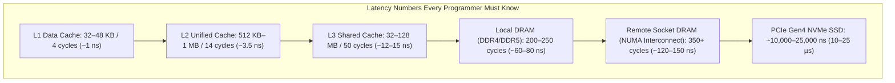

# Memory Architecture, CPU Microarchitecture & Concurrency

> [!summary]
> Software performance on modern computers is predominantly dictated by memory access latency rather than CPU ALU throughput. This domain covers Ulrich Drepper's 114-page masterwork on memory systems, the classic debate on thread scalability vs event-driven concurrency (Ousterhout vs Cheong/Reiss), and empirical studies on CPU cache effects during database joins, splay trees, and GPU acceleration.

---

## Pillar Guides

1. **[[Ulrich-Drepper-Memory-Architecture|Ulrich Drepper — What Every Programmer Should Know About Memory (2007)]]**
   - The definitive treatise on physical RAM, L1/L2/L3 CPU cache line indexing, set associativity, NUMA memory interconnects (QPI/UPI), Translation Lookaside Buffers (TLBs), and the MESI/MOESI cache coherence protocols.
2. **[[Concurrency-and-Threading-Debates|Concurrency & Threading Debates]]**
   - *Why Threads Are A Bad Idea (for most purposes) (John Ousterhout, 1995)*: Event-driven concurrency vs kernel threads, lock overhead, synchronization bugs.
   - *Virtual Threads (Elaine Cheong & Fred Reiss, 2000)*: User-level M:N thread scheduling, green threads, coroutines, and cooperative runtimes.
3. **[[Data-Structures-and-Memory-Opt|Data Structures & Memory Optimization]]**
   - *What Happens During a Join: Dissecting CPU and Memory Optimization Effects (Stefan Manegold, Peter Boncz, Martin L. Kersten)*: How hardware memory latencies dominate relational database join algorithms.
   - *When to use splay trees (Eric K. Lee & Charles U. Martel, 2007)*: Self-adjusting trees, locality of reference, and amortized complexity.
   - *Using CUDA in Practice (Klaus Mueller)*: GPU warp execution, memory coalescing, shared memory banks, and SIMT parallelism.

---

## Hardware Memory Latency Hierarchy

---

## Related Notes
- [[../README|Technical Whitepapers Master MOC]]
- [[../01-Systems-Performance-and-Tracing/Brendan-Gregg-Performance-Canon|Brendan Gregg Performance Canon]]
- [[../../12-Performance-Engineering/01-Cpu-Architecture/false_sharing|12-Performance-Engineering: False Sharing Demo]]
- [[../../14-Low-Latency-Systems/04 - Hardware Mechanical Sympathy/MOC - 04 Hardware Mechanical Sympathy|14-Low-Latency-Systems: Hardware Mechanical Sympathy]]
