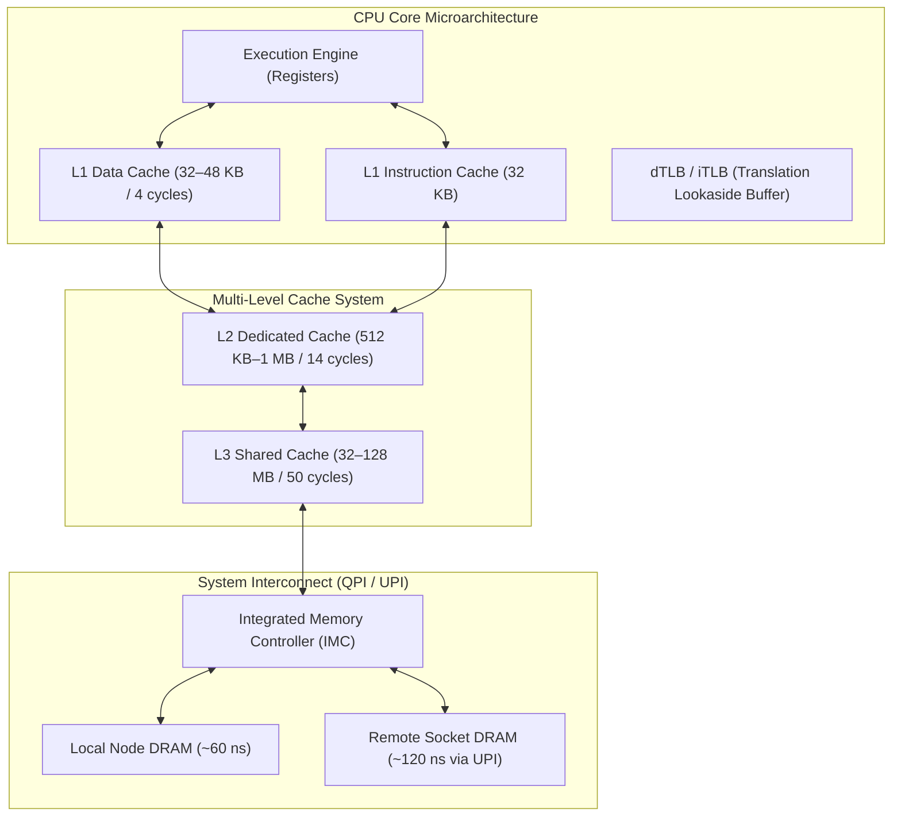

# Ulrich Drepper — What Every Programmer Should Know About Memory

> **Author**: Ulrich Drepper (Former Lead Maintainer of the GNU C Library `glibc`, Red Hat Engineer)  
> **Publication**: Red Hat Technical Whitepaper (114 Pages, 2007)  
> **Category**: Computer Architecture & Hardware Mechanical Sympathy

---

## Executive Summary & Core Thesis

Ulrich Drepper's masterwork is the definitive text on how modern CPU memory subsystems physically operate. Drepper proves that **CPU execution time is almost entirely governed by memory access latency rather than instruction count**. Modern CPUs operate at 3.5–5.0 GHz (a clock cycle every 0.2–0.3 nanoseconds), while dynamic RAM (DRAM) access requires 60–90 nanoseconds. A single cache miss incurs a **200 to 300 CPU cycle stall**.

To write high-performance code, developers must understand the hardware mechanisms that bridge this "Memory Wall": **Cache lines, Set Associativity, Cache Coherence (MESI/MOESI), Translation Lookaside Buffers (TLBs), NUMA topologies, and Hardware Prefetchers**.



---

## Core Architecture & Mechanisms

### 1. The 64-Byte Cache Line
- Data is transferred between DRAM and CPU caches strictly in discrete units of **64 bytes (Cache Lines)**.
- **Cache Alignment**: Placing an 8-byte variable across a 64-byte boundary splits it across two cache lines, requiring two separate memory transfers, increasing access latency by $100\%$.
- In C/C++, always align performance-critical structures:
  ```cpp
  struct alignas(64) OrderBookEntry {
      uint64_t order_id;
      uint32_t price;
      uint32_t quantity;
      char side;
  };
  ```

### 2. Cache Addressing & N-Way Set Associativity
Every memory address is broken down by the CPU hardware into three distinct bit fields:

$$\text{Virtual Address} \implies [\text{Tag Bits} \mid \text{Set Index Bits} \mid \text{Cache Line Offset (6 bits)}]$$

- **Set Index**: Selects the exact set where the line can reside.
- **Associativity**: An $N$-way associative cache allows up to $N$ lines to share the same set index.
- **Cache Conflict (Cache Thrashing)**: If an algorithm repeatedly accesses more than $N$ addresses that happen to hash to the *exact same set index*, the cache lines continuously evict each other, resulting in near-zero cache hits even if $95\%$ of the total cache capacity is empty!

### 3. Cache Coherence Protocols (MESI & MOESI)
When multiple CPU cores share data across L1/L2 caches, the hardware enforces cache coherence:
- **Modified (M)**: Line exists only in this core's cache; dirty (must be written back to L3).
- **Exclusive (E)**: Line exists only in this core's cache; clean (matches memory).
- **Shared (S)**: Line exists in multiple cores' caches; read-only.
- **Invalid (I)**: Line does not contain valid data.

#### The Cost of False Sharing:
- If Core 0 writes to Variable `A` and Core 1 writes to Variable `B`, and both `A` and `B` reside on the **same 64-byte cache line**, Core 0's write issues a **Read-For-Ownership (RFO)** request across the CPU interconnect.
- This forces the cache line in Core 1 to transition to **Invalid (I)**, stalling Core 1's pipeline for **40–80 ns**, despite Core 1 never accessing variable `A`!
- **Mitigation**: Pad independently modified variables with 64 bytes of spacing.

### 4. Translation Lookaside Buffers (TLBs) & HugePages
- Every virtual memory access requires translating a virtual page to a physical frame by traversing a 4-level or 5-level Page Table (PML4/PML5 $\to$ PDPT $\to$ PD $\to$ PT).
- A full page walk takes **4 dependent memory fetches ($>150\text{ ns}$ stall)**!
- The **TLB** caches recently translated pages (typically 64 entries in L1 dTLB).
- **HugePages (2MB / 1GB)**:
  - Standard 4KB pages: Mapping 2GB of RAM requires 524,288 TLB entries (overwhelming the TLB and triggering constant misses).
  - 2MB HugePages: Mapping 2GB requires only 1,024 entries.
  - 1GB HugePages: Mapping 2GB requires only 2 entries! HugePages eliminate TLB miss latency spikes entirely.

---

## Drepper's Optimization Rules for Software Engineers

1. **Sequential Array Traversal (Spatial Locality)**:
   - The CPU's hardware stream prefetcher detects linear strides and fetches subsequent cache lines into L1 *before* the instruction executes (effective memory latency $\approx 0\text{ ns}$).
   - Traversing matrices column-wise instead of row-wise destroys prefetcher prediction, incurring full DRAM latencies on every access.
2. **Eliminate Pointer Chasing (Linked Lists & Trees)**:
   - Modern linked lists and binary trees store nodes at random heap locations. Each node traversal depends on the previous pointer, serializing execution into repeated 60–80 ns stalls.
   - Replace linked lists with contiguous vectors (`std::vector`) or flat contiguous array pools.
3. **Non-Temporal Stores (`_mm_stream_si128`)**:
   - When writing a large buffer (e.g., logging network packets) that will not be read immediately, standard writes pollute L1/L2 caches, evicting active program state.
   - Non-temporal streaming stores bypass the cache hierarchy and write directly into write-combining buffers, protecting cache-resident hot data.

---

## Related Notes
- [[Concurrency-and-Threading-Debates|Concurrency and Threading Debates]]
- [[Data-Structures-and-Memory-Opt|Data Structures and Memory Optimization]]
- [12-Performance-Engineering: False Sharing Demo](../../12-Performance-Engineering/01-Cpu-Architecture/false_sharing.cpp)
- [[../01-Systems-Performance-and-Tracing/Brendan-Gregg-Performance-Canon|Brendan Gregg Performance Canon]]
- [[../README|Technical Whitepapers Master MOC]]
