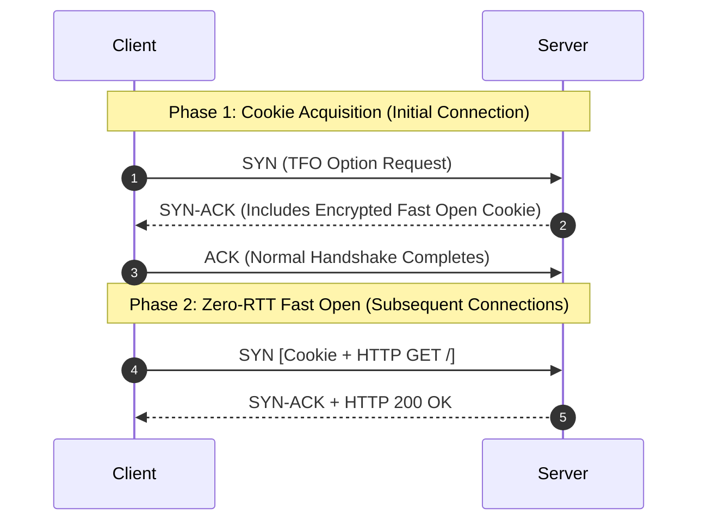

# High-Performance TCP & Networking

> [!summary]
> A technical breakdown of two seminal networking treatises: Google's **TCP Fast Open (TFO)** paper by Radhakrishnan et al., which eliminated the fundamental round-trip time penalty of TCP handshakes for web and distributed transactions, and Van Jacobson's foundational work on overcoming operating system network stack serialization bottlenecks.

---

## 1. TCP Fast Open (Radhakrishnan et al., 2011)

**Source:** [publisher page](https://research.google/pubs/tcp-fast-open/)

### The Latency Problem of the 3-Way Handshake
In traditional TCP, establishing a connection requires a full 3-way handshake before any application payload data can be exchanged:
1. Client sends `SYN`.
2. Server responds with `SYN-ACK`.
3. Client sends `ACK` along with the first HTTP request.

On high-bandwidth transcontinental or mobile links, the propagation delay (RTT) can be 50–150 milliseconds. For short web transfers (HTTP GET requests that fit into an initial congestion window), the handshake accounts for **$33\%$ to $50\%$ of the entire transaction latency**!

```text
Traditional TCP:
Client                                               Server
  |                                                     |
  | -------- SYN (No Data Allowed) -------------------> |
  | <------- SYN-ACK ---------------------------------- |  <-- 1 Full RTT Wasted!
  | -------- ACK + HTTP GET /index.html --------------> |
  | <------- HTTP 200 OK (Response Payload) ----------- |
```

### The TFO Mechanism & Cryptographic Cookie
TCP Fast Open allows data to be included **directly inside the initial SYN packet** on subsequent connections to the same server, achieving **0-RTT data exchange**.



### Preventing SYN Flood Amplification
- *Why not allow data in SYN packets for all clients?* An attacker could forge spoofed IP addresses and blast servers with massive data-bearing SYNs, weaponizing the server into an amplification reflector.
- *The TFO Defense*: The server issues a **Fast Open Cookie** (AES-128 encryption of the client's validated IP address using a secret server key).
- When a client sends data in a SYN, the server validates the cookie. If valid, the server processes the data immediately without waiting for the 3-way handshake to finish. If invalid or missing, it falls back to standard TCP.

---

## 2. Speeding up Networking (Van Jacobson & Bob Felderman, 2006)

**Source:** [open copy](http://www.lemis.com/grog/Documentation/vj/lca06vj.pdf)

### Author & Context
Van Jacobson (inventor of TCP Congestion Control, Traceroute, and Path MTU Discovery) analyzed why 10 Gbps and 40 Gbps networks failed to achieve wire speed on modern multi-core operating systems.

### The Bottleneck: OS Network Stack Serialization
Jacobson demonstrated that as network speeds increased by $1000\times$, operating system networking architectures remained frozen in the 1980s:
1. **Interrupt Storms**: Receiving packets triggers hardware interrupts that disrupt CPU execution pipelines and pollute L1/L2 caches.
2. **Buffer Allocation Overheads**: The kernel dynamically allocates and frees an `sk_buff` (socket buffer descriptor) for every single incoming packet, turning memory allocators into major contention bottlenecks.
3. **Multi-Queue Contention**: Multiple CPU cores locking shared kernel network queues to process incoming packets causes severe cache line bouncing.

### Van Jacobson's Blueprint: NetChannels & Polling
Jacobson proposed moving from an interrupt-driven model to a **lock-free polling channel model (NetChannels)**:
- Dedicate incoming packet descriptor rings directly to single CPU cores (precursor to modern **RSS: Receive Side Scaling** and **DPDK / AF_XDP** kernel bypass).
- Switch from hardware interrupts to high-speed batch polling under load (implemented in Linux as **NAPI: New API**).
- Zero-copy data paths where network interface card (NIC) DMA writes directly into application user-space ring buffers.

---

## Technical Interview Takeaways

1. **How does TCP Fast Open impact idempotent vs non-idempotent HTTP requests?**
   - Because a `SYN` packet can be retransmitted by the network layer if an ACK is delayed, any payload carried in a SYN could theoretically be executed multiple times on the server. Therefore, TFO should primarily be used for **idempotent requests (HTTP GET, HEAD)** unless application-level replay deduplication is implemented.
2. **How do modern systems achieve sub-microsecond networking?**
   - By eliminating kernel context switches entirely using **Kernel Bypass (DPDK, Solarflare OpenOnload, AF_XDP)**, polling NIC descriptor rings in user space, utilizing HugePages, and pinning dedicated polling threads to isolated physical cores.

---

## Related Notes
- [[Network-Diagnostics-and-DDoS|Network Diagnostics, DDoS and Firewalls]]
- [[../03-Memory-Architecture-and-Concurrency/Ulrich-Drepper-Memory-Architecture|Ulrich Drepper Memory Architecture]]
- [[../../01-CS-Foundations/Computer-Networks/README|CS Foundations: Computer Networks]]
- [[../README|Technical Whitepapers Master MOC]]
