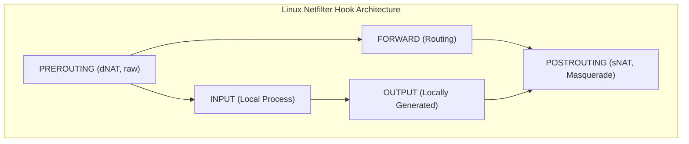

# Network Diagnostics, DDoS Mitigation & Firewalls

> [!summary]
> A technical breakdown of essential whitepapers on network diagnostics, packet-level TCP analysis, packet filtering architectures (Linux Iptables vs OpenBSD Packet Filter), and distributed denial-of-service (DDoS) mitigation strategies.

---

## 1. Using TCPDump, TCPTrace, & XPlot to Debug Network Problems (Jason Zurawski, 2013)

**Source:** [open copy](https://fasterdata.es.net/assets/Uploads/20131016-TCPDumpTracePlot.pdf)

### Packet-Level Diagnostics
When distributed applications experience mysterious throughput degradation on high-bandwidth links, application-level logs are insufficient. Zurawski demonstrates how to capture raw PCAP traffic and convert packet traces into visual time-sequence graphs.

```bash
# 1. High-speed packet capture without truncating payloads:
tcpdump -i eth0 -s 0 -w capture.pcap 'tcp port 443'

# 2. Process capture file through tcptrace:
tcptrace -S capture.pcap

# 3. Generate time-sequence xplot graphs:
tcptrace -T capture.pcap
xplot a2b_tsg.xpl
```

### Pathologies Revealed by Time-Sequence Graphs (TSG)
1. **Window Stalls (Receive Window Bottleneck)**:
   - The graph shows the sender's sequence line flatlining while the receiver's upper window advertisement drops to zero. Diagnoses inadequate socket buffer sizes (`SO_RCVBUF`, `tcp_rmem`).
2. **Packet Drops & Fast Retransmit**:
   - Visualized by three duplicate ACK tick marks at the same sequence number, immediately followed by retransmission.
3. **Out-of-Order Delivery (Multi-Path Jitter)**:
   - Packet sequence numbers arrive out of linear sequence, triggering unnecessary retransmissions and collapsing the TCP Congestion Window (CWND).

---

## 2. Open Source Firewall Tools: Iptables vs PF (Elvir Kuric)

**Source:** [open copy](https://ekuric.wordpress.com/wp-content/uploads/2011/07/pf_iptables.pdf)

### Architectural Comparison: Netfilter (Linux) vs Packet Filter (BSD)



| Dimension | Linux `iptables` / `nftables` | OpenBSD `PF` (Packet Filter) |
| :--- | :--- | :--- |
| **Architecture** | Netfilter hooks embedded throughout kernel IP stack | Centralized state engine integrated into BSD kernel |
| **Rule Evaluation** | First-match or Last-match depending on target (`ACCEPT`/`DROP`) | **Last-match-wins** by default (unless `quick` keyword used) |
| **State Tracking** | `conntrack` table in memory | Built-in stateful table (`keep state`) |
| **Configuration Syntax** | Procedural, verbose (`-A INPUT -p tcp --dport 22 -j ACCEPT`) | Declarative, human-readable (`pass in proto tcp to port 22`) |

---

## 3. DDoS Handbook & Tutorial (Krassimir Tzvetanov, 2015)

**Source:** [open copy](http://web.archive.org/web/20250109135717/https://archive.nanog.org/sites/default/files/tzvetanov_ddos.pdf)

### Taxonomy of Distributed Denial of Service Attacks

```text
+---------------------+-----------------------------------+------------------------------------+
| Attack Category     | Attack Mechanisms                 | Mitigation Strategy                |
+---------------------+-----------------------------------+------------------------------------+
| Volumetric Attacks  | • UDP Flood, ICMP Flood           | • BGP Anycast routing              |
| (Saturate Bandwidth)| • DNS / NTP Amplification (100x+) | • Upstream Cloud Scrubbing centers |
+---------------------+-----------------------------------+------------------------------------+
| Protocol Attacks    | • TCP SYN Flood                   | • SYN Cookies (syncookies = 1)     |
| (Saturate OS State) | • Ping of Death, Smurf attack     | • State table connection limits    |
+---------------------+-----------------------------------+------------------------------------+
| Application Attacks | • Slowloris (Slow HTTP headers)   | • Reverse Proxy buffers (NGINX)    |
| (Saturate App CPU)  | • HTTP POST body exhaustion       | • WAF, TLS fingerprinting, CAPTCHA |
+---------------------+-----------------------------------+------------------------------------+
```

### In-Depth Defense Mechanisms
1. **TCP SYN Cookies**:
   - Under a SYN flood, the server's connection listen backlog queue fills up, dropping legitimate connections.
   - Enabling `net.ipv4.tcp_syncookies = 1` stops allocating half-open socket structures in RAM. Instead, the server encodes connection parameters directly into the 32-bit initial sequence number (ISN) of the `SYN-ACK`. The connection is only allocated upon receiving the final `ACK`.
2. **BGP Anycast Routing**:
   - Announcing the same IP prefix from multiple geographically distributed datacenters splits a massive volumetric attack across dozens of global points-of-presence (PoPs), preventing any single uplink from being saturated.

---

## 4. Network Security Hardening Guide v1.2 (2017)

**Source:** [publisher page](https://www.hikvision.com/us-en/support/cybersecurity/cybersecurity-white-paper/network-security-hardening-guide/)

### Production Linux Kernel Network Hardening (`/etc/sysctl.d/99-network.conf`)

```ini
# Disable IP packet forwarding (unless acting as router)
net.ipv4.ip_forward = 0

# Enable TCP SYN Cookies for flood protection
net.ipv4.tcp_syncookies = 1

# Ignore ICMP echo broadcast requests (prevents Smurf attacks)
net.ipv4.icmp_echo_ignore_broadcasts = 1

# Disable Source Routing (prevents spoofed routing paths)
net.ipv4.conf.all.accept_source_route = 0
net.ipv4.conf.default.accept_source_route = 0

# Enable Reverse Path Filtering (prevents IP address spoofing)
net.ipv4.conf.all.rp_filter = 1
net.ipv4.conf.default.rp_filter = 1

# Ignore ICMP redirects (prevents MITM route alteration)
net.ipv4.conf.all.accept_redirects = 0
net.ipv4.conf.default.accept_redirects = 0
```

---

## Related Notes
- [[High-Performance-TCP-and-Networking|High-Performance TCP and Networking]]
- [[../06-Defensive-Security-and-Hardening/Linux-Operating-System-Hardening|Linux Operating System Hardening]]
- [[../../01-CS-Foundations/Computer-Networks/README|CS Foundations: Computer Networks]]
- [[../README|Technical Whitepapers Master MOC]]
