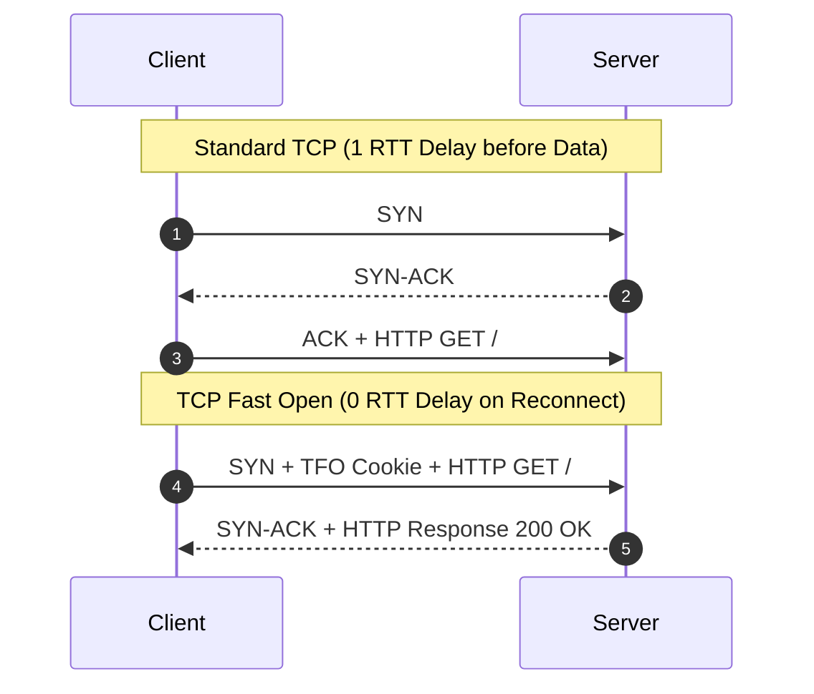

# Networking, TCP/IP & Network Diagnostics

> [!summary]
> In modern distributed and low-latency systems, the network is often the primary source of latency jitter and security exposure. This domain covers seminal research on optimizing the TCP/IP stack (TCP Fast Open, Van Jacobson's netchannels), deep-dive packet debugging (TCPDump, TCPTrace, XPlot), and defense-in-depth against DDoS and network intrusion (Iptables, PF, BGP, and network hardening).

---

## Pillar Guides

1. **[[High-Performance-TCP-and-Networking|High-Performance TCP & Networking]]**
   - *TCP Fast Open (Radhakrishnan, Cheng, Chu, Jain, Raghavan, 2011)*: Eliminating the 3-way handshake round-trip latency through cryptographic TFO cookies.
   - *Speeding up Networking (Van Jacobson & Bob Felderman, 2006)*: Redesigning operating system network stacks to eliminate lock contention, buffer copying, and software interrupts via polling channels.
2. **[[Network-Diagnostics-and-DDoS|Network Diagnostics, DDoS & Firewalls]]**
   - *Using TCPDump, TCPTrace, & XPlot to Debug Network Problems (Jason Zurawski, 2013)*: Visualizing TCP window dynamics, retransmissions, duplicate ACKs, and Congestion Window (CWND) stalls.
   - *Open source firewall tools Iptables and PF (Elvir Kuric)*: Linux Netfilter architecture vs OpenBSD Packet Filter stateful rules.
   - *Network Security Hardening Guide v1.2 (2017)*: Network infrastructure defense (SYN cookies, BGP filtering, ICMP rate limiting).
   - *DDoS Handbook (2015) & DDoS Tutorial (Krassimir Tzvetanov)*: Mitigating volumetric, protocol (SYN flood, amplification), and application-layer DDoS attacks.

---

## TCP Handshake Evolution

---

## Related Notes
- [[../README|Technical Whitepapers Master MOC]]
- [[../01-Systems-Performance-and-Tracing/README|Systems Performance and Tracing]]
- [[../../01-CS-Foundations/Computer-Networks/README|CS Foundations: Computer Networks]]
- [[../../14-Low-Latency-Systems/09 - Messaging & IPC/MOC - 09 Messaging & IPC|14-Low-Latency-Systems: Messaging & IPC]]
