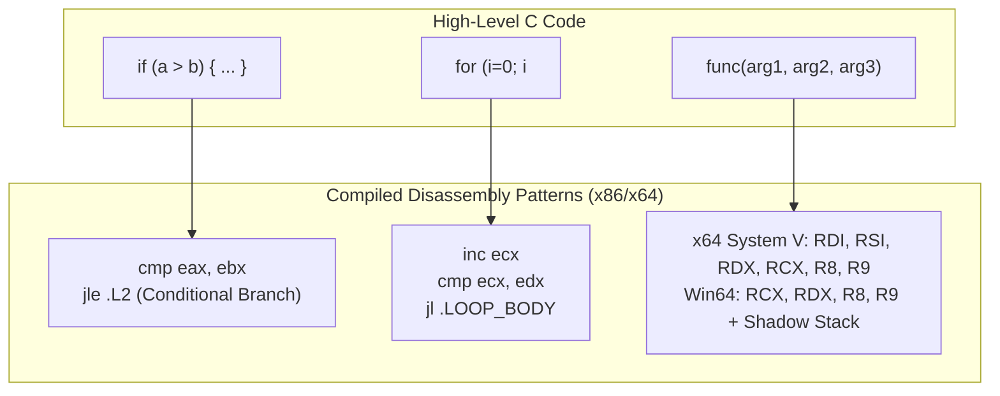
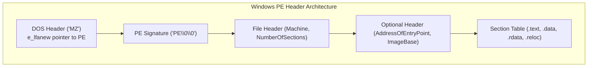

# Binary Exploitation & Reverse Engineering

> [!summary]
> A deep technical examination of binary reverse engineering and low-level software vulnerability research: Dennis Yurichev's decompilation textbook, Terry Bruce Gillette and Buchlovsky/Butcher's stack memory corruption mechanics, Konstantin Rozinov's PE binary infection techniques, and Felix Wilhelm's hardware-assisted kernel vulnerability discovery.

---

## 1. Reverse Engineering for Beginners (Dennis Yurichev, 2013)

### Scope & Method
Dennis Yurichev's book is the definitive practical manual for reading assembly and decompiling binary executables across x86, x64, and ARM. Rather than studying assembly in the abstract, Yurichev presents compiled C language constructs and examines their corresponding disassembled machine instructions under GCC, Clang, and MSVC.



### Critical Reverse Engineering Concepts
1. **Calling Conventions**:
   - *cdecl (x86 32-bit)*: Arguments pushed right-to-left onto the stack; caller cleans the stack pointer (`add esp, 12`).
   - *stdcall (Win32 API)*: Arguments pushed right-to-left; callee cleans the stack (`ret 12`).
   - *System V AMD64 ABI (Linux 64-bit)*: First 6 integer/pointer arguments passed in registers (`%rdi`, `%rsi`, `%rdx`, `%rcx`, `%r8`, `%r9`); remaining on stack.
   - *Microsoft x64 ABI*: First 4 arguments passed in `RCX`, `RDX`, `R8`, `R9` with a mandatory 32-byte caller-allocated "Shadow Space" (Home Space) on the stack.
2. **Stack Frame Setup & Epilogue**:
   ```assembly
   push ebp          ; Save old base pointer
   mov ebp, esp      ; Establish new stack frame
   sub esp, 0x40     ; Allocate 64 bytes for local variables
   ...               ; Function body
   mov esp, ebp      ; Deallocate local variables
   pop ebp           ; Restore caller's base pointer
   ret               ; Pop return address into EIP
   ```

---

## 2. Buffer Overflow Vulnerabilities (Gillette, 2002; Buchlovsky & Butcher)

### Stack Memory Corruption Mechanics
Stack-based buffer overflows occur when an application writes more data to a stack-allocated array than the buffer can hold without bounds checking (e.g., using `strcpy`, `gets`, `sprintf`).

```text
Stack Memory Layout (Grows Downwards from High Memory to Low Memory):
+-------------------------------------------------------+  High Address (0xFFFFFFFF)
| Function Arguments (arg2, arg1)                       |
+-------------------------------------------------------+
| Return Address (EIP of caller to resume execution)   |  <-- TARGET OF HIJACK
+-------------------------------------------------------+
| Saved Frame Pointer (EBP)                            |
+-------------------------------------------------------+
| Local Buffer: char buffer[64]                         |  <-- Overflow starts here!
+-------------------------------------------------------+
| Memory grows downwards v   Buffer writes upwards ^   |  Low Address (0x00000000)
+-------------------------------------------------------+
```

### Exploit Execution Flow
1. **Smashing the Stack**: The attacker inputs $64\text{ bytes (fill buffer)} + 4\text{ bytes (overwrite EBP)} + 4\text{ bytes (overwrite Return Address)}$.
2. **EIP Hijacking**: When the function executes `ret`, the CPU pops the attacker-controlled value into the **Extended Instruction Pointer (EIP)**.
3. **NOP Sled & Shellcode**: The overwritten EIP points to a sled of `0x90` (NOP) instructions preceding the injected assembly payload (shellcode) that invokes `/bin/sh` or spawns a reverse shell.

---

## 3. PE File Infection Techniques (Konstantin Rozinov)

### The Windows Portable Executable (PE) Format
Rozinov demonstrates how viruses and binary injectors modify compiled Windows `.exe` and `.dll` files to execute unauthorized code while preserving normal application functionality.



### Infection Methodologies
1. **Code Caves**: Unused padding bytes (null bytes) between sections left by compiler alignment (e.g., 512-byte section alignment). The injector inserts shellcode into the code cave and patches `AddressOfEntryPoint` in the Optional Header to jump to the cave.
2. **Adding a New Section**: Modifying `NumberOfSections` in the File Header, adding a new section header (e.g., `.evil`), extending the binary, and setting the section flags to `IMAGE_SCN_MEM_EXECUTE | IMAGE_SCN_MEM_READ | IMAGE_SCN_MEM_WRITE`.
3. **Restoring Execution Flow**: At the end of the injected shellcode, the payload saves registers and executes an unconditional jump (`jmp OriginalEntryPoint`) so the user never notices that the executable was infected.

---

## 4. Tracing Privileged Memory Accesses (Felix Wilhelm, 2015)

### Hypervisor-Assisted Vulnerability Hunting
Felix Wilhelm demonstrates using modern virtualization hardware (Intel VT-x, Extended Page Tables - EPT) to detect kernel vulnerabilities:
- Intercepts all privileged memory reads/writes between kernel space and user space.
- Automates detection of **Double Fetch vulnerabilities** (Time-of-Check to Time-of-Use / TOCTOU race conditions where the kernel reads a user-space value twice, allowing an attacker thread to modify it between check and execution).

---

## Modern Defenses (Mitigations)

| Exploitation Technique | Modern Operating System Mitigation |
| :--- | :--- |
| **Direct Shellcode Execution on Stack** | **NX / DEP (Data Execution Prevention)**: Marks stack and heap pages non-executable. |
| **Hardcoded Return Addresses** | **ASLR (Address Space Layout Randomization)**: Randomizes stack, heap, and library base addresses. |
| **Stack Smashed EIP Overwrites** | **Stack Canaries (`-fstack-protector`)**: Compiler places a random value before EBP; checks it prior to `ret`. |
| **Code Cave Injection in PE** | **Authenticode Code Signing & AppLocker**: Verifies cryptographic hash of PE before Windows loads it. |

---

## Related Notes
- [[Database-Exploitation-and-SQL-Injection|Database Exploitation and SQL Injection]]
- [[Vulnerability-Research-and-Web-Exploits|Vulnerability Research and Web Exploits]]
- [[../06-Defensive-Security-and-Hardening/Linux-Operating-System-Hardening|Linux Operating System Hardening]]
- [[../README|Technical Whitepapers Master MOC]]
