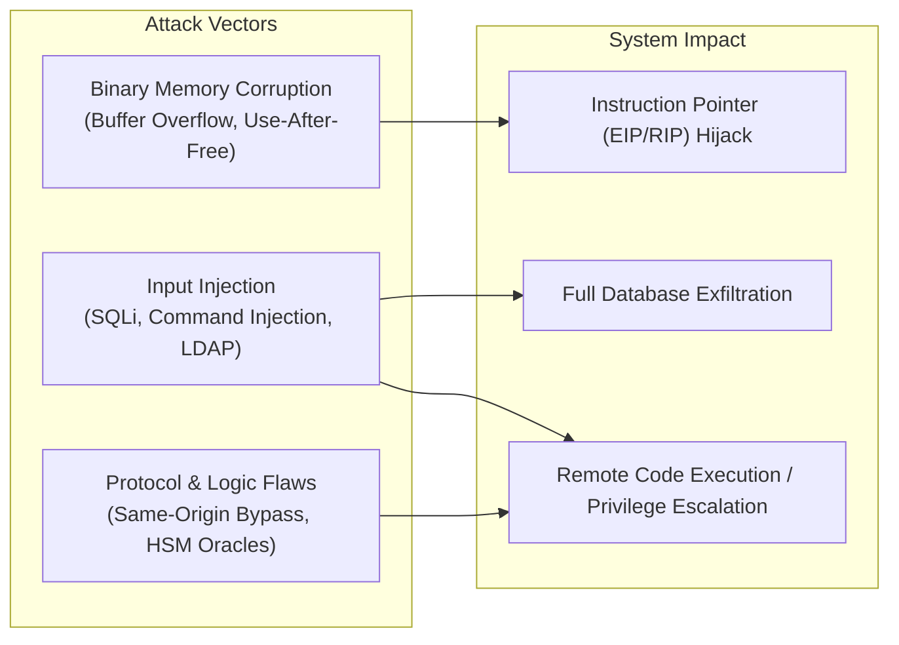

# Offensive Security, Exploitation & Vulnerability Research

> [!summary]
> To build secure, resilient software systems, engineers must understand the mechanics of memory corruption, binary reverse engineering, injection payloads, and adversary exploitation techniques. This domain curates seminal whitepapers on stack buffer overflows, PE binary infection, SQL injection methodologies, cryptographic PIN cracking, and network appliance exploitation.

---

## Pillar Guides

1. **[[Binary-Exploitation-and-Reverse-Eng|Binary Exploitation & Reverse Engineering]]**
   - *Reverse Engineering for Beginners (Dennis Yurichev, 2013)*: Comprehensive manual on assembly decompilation, calling conventions, and control-flow reconstruction.
   - *A Unique Examination of the Buffer Overflow Condition (Terry Bruce Gillette, 2002)*: Stack memory layouts, EIP hijacking, and shellcode mechanics.
   - *Buffer overflow vulnerabilities (Peter Buchlovsky & Adam Butcher)*: Format string vulnerabilities, heap corruption, off-by-one errors.
   - *PE File Infection Techniques (Konstantin Rozinov)*: Portable Executable structure, section injection, and code cave execution.
   - *Tracing Privileged Memory Accesses to Discover Software Vulnerabilities (Felix Wilhelm, 2015)*: Hardware-assisted hypervisor tracing for kernel vulnerability research.
2. **[[Database-Exploitation-and-SQL-Injection|Database Exploitation & SQL Injection]]**
   - *Advanced SQL Injection In SQL Server Applications (Chris Anley, 2002)*: Second-order SQLi, `xp_cmdshell` remote code execution, and stored procedure hijacking.
   - *Blindfolded SQL Injection (Ofer Maor & Amichai Shulman)*: Content inference, error reflection, and automated database schema extraction.
   - *Blind SQL Injection (Kevin Spett)*: Time-based blind SQLi (`WAITFOR DELAY`, `pg_sleep`) and boolean logic inference.
   - *Manipulating Microsoft SQL Server Using SQL Injection (Cesar Cerrudo)*: Privilege escalation from database user to Windows SYSTEM privileges.
3. **[[Vulnerability-Research-and-Web-Exploits|Vulnerability Research & Web Exploits]]**
   - *Decimalisation Table Attacks for PIN Cracking (Mike Bond & Piotr Zieliński)*: Mathematical oracle attacks against Hardware Security Modules (HSMs) in banking.
   - *The Return of Robin Hood vs Cisco ASA (Cedric Halbronn, 2018)*: Reverse engineering Cisco ASA firmware to achieve remote arbitrary code execution.
   - *Bypassing Same Origin Policy v1.0 (Simon Egli)*: CORS misconfigurations, iframe DOM manipulation, and cross-origin leakage vectors.
   - *Checklist for Penetration Testing (Mateus Felipe Tymburibá Ferreira, 2012)*: Structured penetration testing execution standard (PTES).

---

## The Exploit Mechanism Spectrum

---

## Related Notes
- [[../README|Technical Whitepapers Master MOC]]
- [[../06-Defensive-Security-and-Hardening/README|Defensive Security and Hardening]]
- [[../../11-Security-And-Cryptography/01-Common-Vulnerabilities/owasp_top_10|11-Security-And-Cryptography: OWASP Top 10]]
- [[../07-Polish-Technical-Papers-pl/Inzynieria-Wsteczna-i-Analiza-Kodu|Polish Papers: Inżynieria Wsteczna]]
