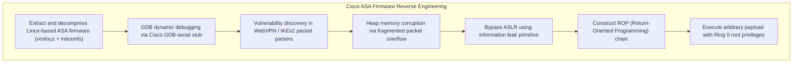

# Vulnerability Research & Web Exploits

> [!summary]
> An analysis of specialized offensive security and vulnerability research papers: Mike Bond and Piotr Zieliński's mathematical oracle attack on banking Hardware Security Modules (HSMs), Cedric Halbronn's binary reverse engineering of Cisco ASA network security appliances, Simon Egli's bypass vectors for the browser Same-Origin Policy, and Ferreira's structured penetration testing methodology.

---

## 1. Decimalisation Table Attacks for PIN Cracking (Bond & Zieliński)

### The Banking Problem: Hardware Security Modules
In global ATM and banking payment infrastructure, customer 4-digit PINs are never stored in software memory or databases. All PIN verification occurs inside tamper-resistant cryptographic physical chips called **Hardware Security Modules (HSM)**.

```text
The IBM 3624 PIN Generation Algorithm:
Account Number (PAN) + Master Key --> [DES Encryption] --> 16 Hexadecimal Digits (e.g., A4F1...)
Hex Digits --> [Decimalisation Table (Hex to Dec mapping)] --> Customer PIN (e.g., 0451)
```

### The Decimalisation Table Oracle Attack
Bond and Zieliński discovered a mathematical flaw in the HSM API interface:
- Bank bank operators can supply a custom **Decimalisation Table** to map hexadecimal nibbles (`0-F`) to decimal digits (`0-9`).
- By systematically feeding manipulated decimalisation tables that substitute target digits (e.g., replacing '0' with '1' and observing whether the transaction verification succeeds or fails), the HSM acts as an **oracle**.
- **Result**: An attacker with API access can recover a customer's secret 4-digit PIN in an average of **only 15 queries** instead of a brute-force search of 10,000 combinations!

---

## 2. The Return of Robin Hood vs Cisco ASA (Cedric Halbronn, 2018)

### Breaking Enterprise Perimeter Security
Cedric Halbronn demonstrated how firmware reverse engineering can turn a premier enterprise firewall - the **Cisco Adaptive Security Appliance (ASA)** - into an attack vector:



### Key Engineering Takeaway
Network appliances often rely on security-through-obscurity (proprietary firmware packaging). Modern reverse engineering tools (IDA Pro, Ghidra, custom QEMU emulators) easily unpack and audit appliance firmware, making memory-unsafe languages (C/C++) in network parsers vulnerable to memory corruption.

---

## 3. Bypassing Same Origin Policy (Simon Egli)

### The Browser Security Model
The **Same-Origin Policy (SOP)** is the foundational security boundary of the World Wide Web. Under SOP, scripts running on Origin A (`https://bank.com:443`) are strictly forbidden from reading the DOM, cookies, or HTTP response bodies of Origin B (`https://attacker.com:443`).

```text
Origin Definition: Tuple of (Scheme, Hostname, Port)
Matches:
  https://example.com/dir/page.html  AND  https://example.com/api/data  (Same Origin)
Fails:
  http://example.com/                (Different Scheme: http vs https)
  https://sub.example.com/           (Different Host: sub.example.com vs example.com)
  https://example.com:8080/          (Different Port: 8080 vs 443)
```

### Historical Bypass Vectors Analyzed by Egli
1. **CORS Misconfigurations (`Access-Control-Allow-Origin: *`)**:
   - Setting `Access-Control-Allow-Credentials: true` with wildcard origins or reflecting the attacker's `Origin` header verbatim allows cross-origin data theft via simple JavaScript `fetch()`.
2. **`document.domain` Relaxation**:
   - Subdomains setting `document.domain = "company.com"` allowed an XSS flaw on an untrusted marketing subdomain to hijack the main domain's session cookies.
3. **Cross-Site Script Inclusion (XSSI)**:
   - Dynamic JSON APIs that return arrays instead of objects can be included via `<script src="...">`, allowing an attacker to override prototype arrays and steal sensitive JSON data without CORS permissions.

---

## 4. Checklist for Penetration Testing (Mateus Ferreira, 2012)

### The Penetration Testing Execution Standard (PTES)
Ferreira documents the structured phases of professional security assessments:
1. **Pre-Engagement**: Scoping, rules of engagement, legal authorization.
2. **Intelligence Gathering (Reconnaissance)**: Passive DNS, whois, Shodan, Google Dorking.
3. **Threat Modeling & Vulnerability Analysis**: Port scanning (`nmap`), service banner identification, vulnerability correlation.
4. **Exploitation**: Weaponization while avoiding system destabilization or data loss.
5. **Post-Exploitation**: Privilege escalation, persistence, lateral network movement, business impact analysis.
6. **Reporting**: Executive summary, risk-rated vulnerability findings, remediation roadmaps.

---

## Related Notes
- [[Binary-Exploitation-and-Reverse-Eng|Binary Exploitation and Reverse Engineering]]
- [[Database-Exploitation-and-SQL-Injection|Database Exploitation and SQL Injection]]
- [[../06-Defensive-Security-and-Hardening/Application-and-Infrastructure-Sec|Application and Infrastructure Security]]
- [[../README|Technical Whitepapers Master MOC]]
