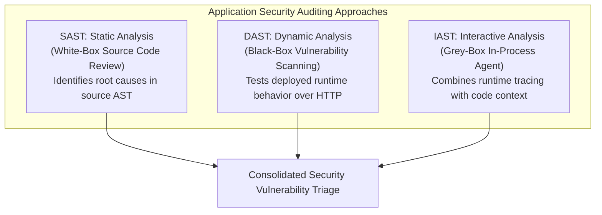

# Application & Infrastructure Security

> [!summary]
> A definitive engineering synthesis of industry standards for enterprise application security: the OWASP Application Security Verification Standard (ASVS), the OWASP Testing Guide v4, Robert Morella's application auditing methodologies, Ryan Barnett's CIS Apache web server benchmark, and Robert Bernier's architectural guide to total PostgreSQL security.

---

## 1. OWASP Application Security Verification Standard (ASVS 3.0.1)

### What is ASVS?
Unlike the OWASP Top 10 (which is an educational awareness list), the **ASVS** is a rigorous, testable specification defining the exact security controls required for modern applications across three maturity levels:

```text
+-----------------------+-------------------------------------------------------------+
| Verification Level    | Intended Application Scope                                  |
+-----------------------+-------------------------------------------------------------+
| Level 1: Opportunistic| Basic assurance. Automated penetration testing and code scan|
| (All Applications)    | defenses. Protects against low-effort, opportunistic attacks|
+-----------------------+-------------------------------------------------------------+
| Level 2: Standard     | Enterprise B2B/SaaS applications handling sensitive PII,    |
| (Default Recommended) | health data, or business transactions. Defends against      |
|                       | motivated attackers with access to application source code. |
+-----------------------+-------------------------------------------------------------+
| Level 3: Advanced     | Critical infrastructure, high-value financial systems, and  |
| (Military / Banking)  | defense applications. Requires formal threat modeling,      |
|                       | compartmentalization, and high-assurance architecture.      |
+-----------------------+-------------------------------------------------------------+
```

### Key ASVS Verification Categories
- **V2: Authentication**: Enforces multi-factor authentication (MFA), password salting (Argon2id, bcrypt), brute-force throttling, and secure session rotation.
- **V3: Session Management**: Requires `Secure`, `HttpOnly`, and `SameSite=Lax/Strict` cookie flags; absolute session timeouts; and invalidating tokens upon logout.
- **V4: Access Control**: Requires continuous authorization enforcement on every API endpoint (**Never rely on hidden UI buttons or client-side checks**).
- **V5: Malicious Input Handling**: Strictly mandates parameterized database queries, context-aware output encoding, and safe JSON/Protobuf parsers.

---

## 2. OWASP Testing Guide v4 & Application Auditing (Meucci, Muller, Morella)

### Auditing Methodologies Compared



### Step-by-Step Web Application Penetration Testing Workflow
1. **Information Gathering**: Fingerprinting web servers (`Server` headers, SSL ciphers), framework detection, finding hidden directories (`ffuf`, `dirsearch`).
2. **Configuration & Deployment Management**: Checking for exposed `.git` directories, backup files (`config.php.bak`), debug endpoints.
3. **Identity & Authentication Testing**: Testing password reset workflows, session fixation, credential stuffing vulnerabilities.
4. **Authorization Testing**: Testing for **Insecure Direct Object References (IDOR)** (e.g., changing `/api/users/1001` to `1002`).
5. **Business Logic Testing**: Testing race conditions in checkout workflows, parameter tampering (negative item counts), and privilege escalation.

---

## 3. Apache Web Server Security Configuration Benchmark (Ryan Barnett, CIS)

### Hardening Checklist for Production Web Servers

```apache
# Disable Apache signature and version banner disclosure
ServerTokens Prod
ServerSignature Off

# Disable Directory Browsing and Symbolic Link Following
<Directory />
    Options None
    AllowOverride None
    Require all denied
</Directory>

# Protect sensitive files (.ht*, .git, .env)
<FilesMatch "^\.(git|env|ht)">
    Require all denied
</FilesMatch>

# Enforce Modern TLS 1.2 / 1.3 Ciphers Only (Disable SSLv3, TLS 1.0, 1.1)
SSLProtocol all -SSLv3 -TLSv1 -TLSv1.1
SSLCipherSuite HIGH:!aNULL:!MD5:!3DES:!CAMELLIA
SSLHonorCipherOrder on

# Security Response Headers
Header always set X-Content-Type-Options "nosniff"
Header always set X-Frame-Options "DENY"
Header always set Referrer-Policy "strict-origin-when-cross-origin"
Header always set Content-Security-Policy "default-src 'self';"
Header always set Strict-Transport-Security "max-age=63072000; includeSubDomains; preload"
```

---

## 4. Total Security in PostgreSQL (Robert Bernier & Mark Wong)

### The Three Pillars of PostgreSQL Security
1. **Host-Based Authentication (`pg_hba.conf`)**:
   - Never use `trust` authentication on production networks!
   - Restrict connections to specific IP subnets and mandate `scram-sha-256` password hashing:
     ```text
     # TYPE  DATABASE  USER       ADDRESS          METHOD
     hostssl all       app_user   10.0.1.0/24      scram-sha-256
     ```
2. **Role-Based Access Control (RBAC)**:
   - Separate schema ownership from application runtime users:
     ```sql
     -- Create locked-down application role
     CREATE ROLE web_app WITH LOGIN PASSWORD 'SecureSecret!' NOSUPERUSER NOCREATEDB;
     GRANT CONNECT ON DATABASE prod_db TO web_app;
     GRANT USAGE ON SCHEMA public TO web_app;
     GRANT SELECT, INSERT, UPDATE, DELETE ON ALL TABLES IN SCHEMA public TO web_app;
     ```
3. **Row-Level Security (RLS)**:
   - PostgreSQL allows filtering table visibility at the database engine level based on session variables, preventing multi-tenant data leaks:
     ```sql
     ALTER TABLE tenant_data ENABLE ROW LEVEL SECURITY;
     CREATE POLICY tenant_isolation_policy ON tenant_data
         USING (tenant_id = current_setting('app.current_tenant_id')::uuid);
     ```

---

## Related Notes
- [[Linux-Operating-System-Hardening|Linux Operating System Hardening]]
- [[Container-and-Microservice-Security|Container and Microservice Security]]
- [[../05-Offensive-Security-and-Exploitation/Database-Exploitation-and-SQL-Injection|Database Exploitation and SQL Injection]]
- [[../../11-Security-And-Cryptography/01-Common-Vulnerabilities/owasp_top_10|11-Security-And-Cryptography: OWASP Top 10]]
- [[../README|Technical Whitepapers Master MOC]]
