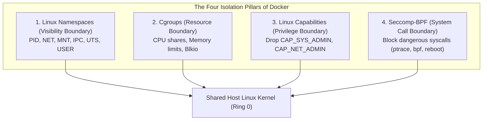
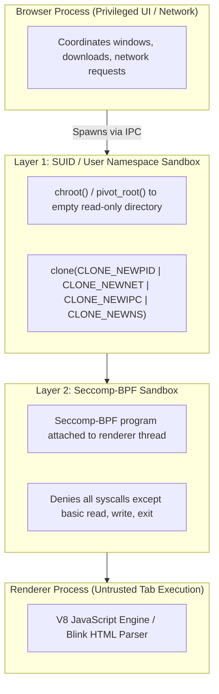

# Container & Microservice Security

> [!summary]
> An in-depth technical analysis of container isolation boundaries, microservice threat modeling, and client-side sandboxing: Aaron Grattafiori's seminal NCC Group research on Docker hardening, LXC container breakout mechanisms, and Pati Gallardo's architectural dissection of the multi-layer Linux Chromium sandbox.

---

## 1. Docker & High Security Microservices (Aaron Grattafiori, NCC Group, 2016)

### The Core Architectural Premise
Containers are **not security boundaries by default**. Unlike virtual machines (which utilize hardware-enforced CPU virtualization via Intel VT-x / AMD-V with separate guest kernels), all containers running on a host share the **single underlying Linux kernel**.



### Critical Hardening Guidelines for Production Containers

1. **Never Run Containers as Root (`USER 1000:1000`)**:
   - If root inside a container breaks out through a kernel vulnerability, it arrives on the host filesystem with full `root` (UID 0) privileges.
   - Use **User Namespaces (`userns-remap`)**: Maps container UID 0 to an unprivileged host UID (e.g., UID 100000).
2. **Drop All Capabilities & Add Only What Is Required**:
   ```bash
   docker run --cap-drop=ALL --cap-add=NET_BIND_SERVICE ...
   ```
   - Dropping `CAP_SYS_ADMIN` disables $90\%$ of container breakout exploits.
3. **Read-Only Root Filesystem**:
   ```bash
   docker run --read-only --tmpfs /tmp:rw,noexec,nosuid ...
   ```
   - Prevents an attacker from downloading web shells or malware binaries onto disk.
4. **Never Mount the Docker Socket (`/var/run/docker.sock`)**:
   - Mounting `docker.sock` inside a container gives the container root control over the host Docker daemon, allowing instant host compromise via:
     ```bash
     docker run -v /:/host_root alpine chroot /host_root
     ```

---

## 2. Container Breakout Vectors (NCC Group Research)

### Common Container Escape Mechanisms
1. **Privileged Mode (`--privileged`)**:
   - Disables all Seccomp filters, grants all Linux capabilities, and mounts all host `/dev` hardware devices into the container. An escape requires only mounting the host root disk:
     ```bash
     mkdir /mnt_host && mount /dev/sda1 /mnt_host
     ```
2. **Kernel Exploitation (`dirtycarrat`, `DirtyCOW`)**:
   - Because the container shares the host kernel, any local privilege escalation (LPE) kernel bug allows escaping the container's namespace directly into host Ring 0 memory.
3. **Sensitive Host Path Mounts (`/proc`, `/sys`)**:
   - Mounting `/proc/sys/kernel/core_pattern` allows an attacker to write a script path that the host kernel will execute with root privileges whenever any process crashes!

---

## 3. Linux Security and the Chromium Sandbox (Pati Gallardo, 2018)

### Architectural Marvel: The Multi-Layer Sandbox
Web browsers process hostile, untrusted JavaScript, HTML, and WebGL code downloaded from the internet. Chromium achieves near-impenetrable sandboxing on Linux by stacking multiple isolation mechanisms into a **Two-Layer Sandbox**:



### Why Seccomp-BPF is the Gold Standard
- The renderer process initializes its libraries, connects IPC pipes to the browser process, and then **locks its own jail door** by invoking `prctl(PR_SET_SECCOMP, SECCOMP_MODE_FILTER, ...)` with a custom BPF program.
- If a zero-day vulnerability compromises the V8 engine, any attempt by the shellcode to call `open()`, `execve()`, `socket()`, or `connect()` is immediately intercepted by the kernel and killed with `SIGSYS`. All disk and network operations must be requested via IPC through the browser broker process.

---

## Related Notes
- [[Linux-Operating-System-Hardening|Linux Operating System Hardening]]
- [[Application-and-Infrastructure-Sec|Application and Infrastructure Security]]
- [[../05-Offensive-Security-and-Exploitation/Binary-Exploitation-and-Reverse-Eng|Binary Exploitation and Reverse Engineering]]
- [[../README|Technical Whitepapers Master MOC]]
