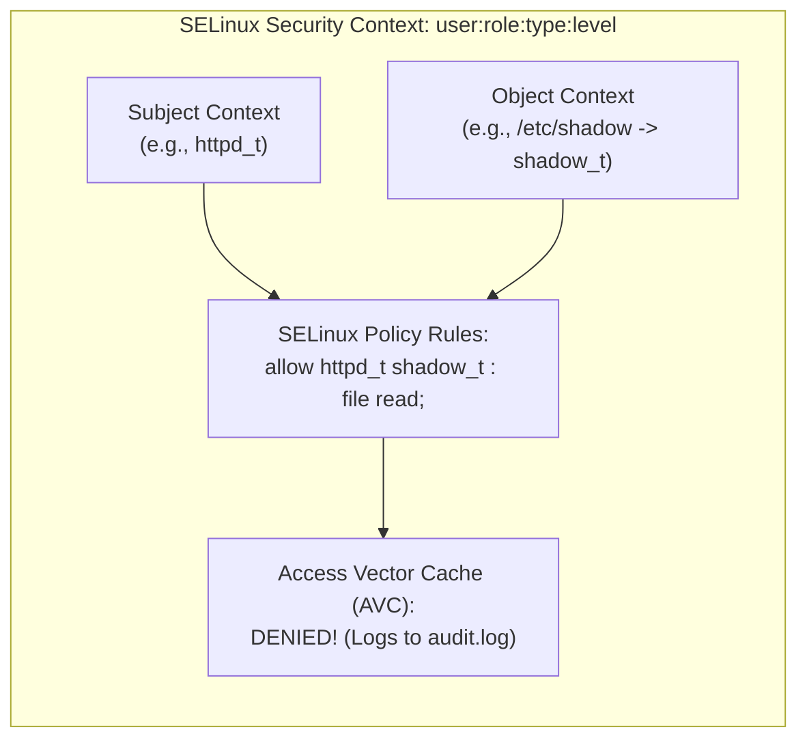

# Linux Operating System Hardening

> [!summary]
> A comprehensive architectural guide to enterprise Linux operating system hardening: Michael Boelen's security trilogy, Charalambous Glafkos's baseline configurations, Yves-Alexis Perez's kernel self-protection analysis, Martin Jõgi's compliance audit standard, and Luis Franco Marin's SELinux policy management framework.

---

## 1. The Michael Boelen Linux Security Trilogy (2016)

### Author & Context
Michael Boelen (creator of the open-source auditing tool **Lynis** and Rootkit Hunter / rkhunter) authored three foundational guides establishing modern Linux security practices:

### 1. *Linux Hardening*
- **Principle of Least Privilege & Attack Surface Reduction**:
  - Remove compilers (`gcc`), unneeded interpreters, and legacy networking services (`telnet`, `rsh`, `ftp`).
  - Partitioning strategy: Separate mount points for `/tmp`, `/var`, `/var/log`, `/var/tmp`, and `/home` with restrictive mount options:
    ```text
    /tmp      ext4    defaults,nodev,nosuid,noexec    0 0
    /var/log  ext4    defaults,nodev,nosuid           0 0
    ```
  - `noexec` prevents an attacker from executing downloaded binary payloads out of world-writable directories like `/tmp`.

### 2. *Linux Systems Compromised*
- **Post-Exploitation Incident Response & Forensics**:
  - Recognizing indicators of compromise (IoC): Unexplained CPU usage spikes, hidden processes, deleted binary executions (`/proc/<pid>/exe (deleted)`), modified system binaries.
  - Volatile memory capture (`LiME`) before touching disk state or rebooting.
  - Finding hidden network listeners via `ss -tlpn` and checking for rootkit hooking in `/etc/ld.so.preload`.

### 3. *Linux Security for Developers*
- Developers must design applications to run without root privileges:
  - **Linux Capabilities (`cap_set_proc`)**: Instead of running a web server as `root` to bind port 80/443, grant only `CAP_NET_BIND_SERVICE`.
  - Restrict system calls via **Seccomp** filters.

---

## 2. Hardened Kernels for Everyone (Yves-Alexis Perez, 2015)

### Evolution of Kernel Self-Protection
Historically, developers relied on out-of-tree patches like **grsecurity/PaX** for kernel defense. Perez traces the upstreaming of these mechanisms into mainline Linux through the **Kernel Self-Protection Project (KSPP)**:

```text
+-----------------------+-------------------------------------------------------------+
| Kernel Defense        | Security Objective                                          |
+-----------------------+-------------------------------------------------------------+
| KASLR                 | Kernel Address Space Layout Randomization: Randomizes       |
|                       | kernel code location in RAM on every boot, breaking ROP.    |
+-----------------------+-------------------------------------------------------------+
| SMEP & SMAP           | Supervisor Mode Execution / Access Prevention:              |
|                       | CPU hardware prevents Ring 0 kernel from executing code     |
|                       | or accessing data in Ring 3 user-space pages.               |
+-----------------------+-------------------------------------------------------------+
| Stack Canaries        | -fstack-protector-strong: Injects random guards into        |
|                       | kernel function frames to abort on buffer overflow.         |
+-----------------------+-------------------------------------------------------------+
| SLAB Freelist Random  | Randomizes heap slab freelists to thwart heap feng-shui.   |
+-----------------------+-------------------------------------------------------------+
| Module Signing        | CONFIG_MODULE_SIG_FORCE=y: Rejects loading any LKM driver   |
|                       | that lacks a valid cryptographic RSA signature.             |
+-----------------------+-------------------------------------------------------------+
```

---

## 3. SELinux Policy Management Framework (Luis Franco Marin, 2008)

### Mandatory Access Control (MAC) vs Discretionary Access Control (DAC)
- **DAC (Traditional UNIX)**: Based on User/Group/Other permissions (`chmod 777`). If a web server running as user `www-data` is compromised, the attacker can access any file readable by `www-data`.
- **MAC (SELinux)**: Enforces access rules regardless of user identity. Even if `root` executes a compromised daemon, SELinux prevents the daemon from accessing resources outside its strict security context!



### Core Commands Cheatsheet
```bash
getenforce                      # Check if SELinux is Enforcing, Permissive, or Disabled
setenforce 1                    # Switch dynamically to Enforcing mode
ls -Z /var/www/html             # View SELinux context labels (e.g., httpd_sys_content_t)
restorecon -Rv /var/www/html    # Restore default policy security contexts
ausearch -m avc -ts recent      # Inspect recent Access Vector Cache denials
audit2why < /var/log/audit/audit.log  # Human-readable explanation of SELinux blocks
```

---

## 4. Production Kernel Hardening Sysctl Baseline

The definitive sysctl configuration recommended across Glafkos, Boelen, and Jõgi:

```ini
# /etc/sysctl.d/50-security-hardening.conf

# Restrict dmesg access to root only (prevents kernel address leaks)
kernel.dmesg_restrict = 1

# Hide kernel symbol addresses in /proc/kallsyms
kernel.kptr_restrict = 2

# Disable unprivileged BPF execution (prevents speculative execution attacks)
kernel.unprivileged_bpf_disabled = 1

# Restrict ptrace scope (prevents process memory injection between users)
kernel.yama.ptrace_scope = 2

# Enable hard and soft link protections (prevents symlink race exploits)
fs.protected_hardlinks = 1
fs.protected_symlinks = 1

# Enable FIFO and regular file protection in sticky directories
fs.protected_fifos = 2
fs.protected_regular = 2

# Randomize virtual address space layout (ASLR)
kernel.randomize_va_space = 2
```

---

## Related Notes
- [[Container-and-Microservice-Security|Container and Microservice Security]]
- [[Application-and-Infrastructure-Sec|Application and Infrastructure Security]]
- [[../05-Offensive-Security-and-Exploitation/Binary-Exploitation-and-Reverse-Eng|Binary Exploitation and Reverse Engineering]]
- [[../README|Technical Whitepapers Master MOC]]
