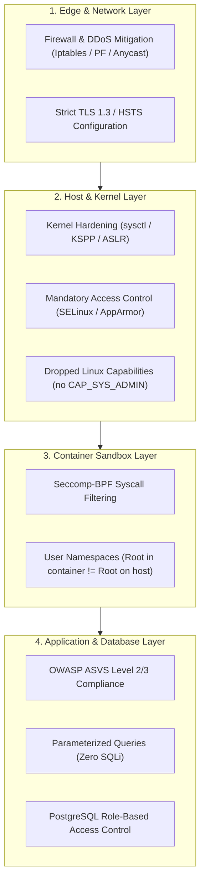

# Defensive Security, OS Hardening & Application Security

> [!summary]
> Defense-in-depth is the engineering practice of establishing layers of redundancy such that the failure of any single security control does not result in compromise. This domain covers seminal whitepapers on Linux operating system hardening, container isolation (Docker, LXC, Chromium sandboxing), and enterprise application verification standards (OWASP ASVS, Testing Guide v4, Apache benchmarks, and PostgreSQL total security).

---

## Pillar Guides

1. **[[Linux-Operating-System-Hardening|Linux Operating System Hardening]]**
   - *Michael Boelen Linux Security Trilogy (2016)*: Author of Lynis on *Linux Hardening*, *Linux Systems Compromised*, and *Linux Security for Developers*.
   - *Securing & Hardening Linux v1.0 (Charalambous Glafkos, 2007)*: Practical sysctl tuning, PAM controls, and file integrity monitoring.
   - *Hardened kernels for everyone (Yves-Alexis Perez, 2015)*: grsecurity/PaX innovations and the Linux Kernel Self-Protection Project (KSPP).
   - *Establishing, Implementing and Auditing Linux Hardening Standard (Martin Jõgi, 2017)*: Automated compliance auditing against CIS Benchmarks.
   - *SELinux Policy Management Framework for HIS (Luis Franco Marin, 2008)*: Mandatory Access Control (MAC) policies and Type Enforcement.
   - *A SysAdmin's Essential Guide to Linux Workstation Security* & *Linux Security Review (2015)*.
2. **[[Container-and-Microservice-Security|Container & Microservice Security]]**
   - *Docker and High Security Microservices (Aaron Grattafiori, NCC Group, 2016)*: Container threat modeling, dropping Linux capabilities, AppArmor, seccomp filters.
   - *LXC, Docker, Security (NCC Group Research)*: Container breakout vectors, shared kernel attack surfaces, and cgroup resource exhaustion.
   - *Linux Security and the Chromium Sandbox (Pati Gallardo, 2018)*: Architectural analysis of multi-layer sandboxing using user namespaces, chroot, and seccomp-bpf.
3. **[[Application-and-Infrastructure-Sec|Application & Infrastructure Security]]**
   - *OWASP Application Security Verification Standard (ASVS 3.0.1, 2016)*: The industry gold standard for software security requirements and verification levels (L1, L2, L3).
   - *OWASP Testing Guide v4 (Matteo Meucci & Andrew Muller)*: Comprehensive penetration testing methodology for web applications and APIs.
   - *Introduction to Application Security and OWASP Top 10 Risks (Ralph Durkee)*.
   - *Auditing Web Applications (Robert Morella, 2015)*: Static vs dynamic application security testing (SAST/DAST).
   - *Security Configuration Benchmark For Apache (Ryan Barnett, CIS, 2008)*: Hardening web servers, SSL ciphers, and mod_security rules.
   - *Total security in a PostgreSQL database (Robert Bernier, 2009)* & *PostgreSQL Portland Performance Practice Project (Mark Wong, 2009)*.

---

## Defense-in-Depth Architecture

---

## Related Notes
- [[../README|Technical Whitepapers Master MOC]]
- [[../05-Offensive-Security-and-Exploitation/README|Offensive Security and Exploitation]]
- [[../../11-Security-And-Cryptography/01-Common-Vulnerabilities/owasp_top_10|11-Security-And-Cryptography: OWASP Top 10]]
- [[../04-Networking-and-Protocols/Network-Diagnostics-and-DDoS|Network Diagnostics and DDoS]]
