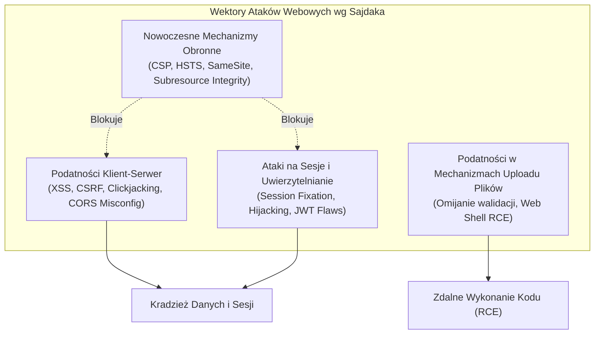

# Bezpieczeństwo Aplikacji WWW i Baz Danych

> [!summary]
> Kompleksowa analiza polskich publikacji z zakresu bezpieczeństwa systemów webowych: czteroczęściowy cykl monograficzny Michała Sajdaka (założyciela Sekurak.pl / Niebezpiecznik), techniki testów penetracyjnych aplikacji webowych (Leszek Miś), wstrzykiwanie SQL (Kluge et al.), programowanie defensywne (Kenny Kerr) oraz rekonesans za pomocą zaawansowanych operatorów Google (Michał Piotrowski).

---

## 1. Cykl Bezpieczeństwo Aplikacji WWW (Michał Sajdak, 2015–2017)

### Autor & Wpływ na Branżę
Michał Sajdak to jeden z czołowych polskich ekspertów ds. bezpieczeństwa IT. Jego cykl publikacji stanowił fundament edukacji polskich audytorów bezpieczeństwa i pentesterów.



### Kluczowe Wnioski z Poszczególnych Części:

#### 1. Podatności w Mechanizmach Uploadu Plików (2016)
- **Problem**: Aplikacje pozwalają użytkownikom na wgrywanie plików (np. awatarów, dokumentów PDF), lecz nie weryfikują ich poprawnie.
- **Wektory Omijania Walidacji**:
  - *Zaufanie do nagłówka `Content-Type`*: Klient może wysłać skrypt PHP z fałszywym nagłówkiem `Content-Type: image/jpeg`.
  - *Podwójne i alternatywne rozszerzenia*: Wykorzystanie konfiguracji serwera Apache obsługującego pliki `.phtml`, `.php5`, `.php.jpg`, lub sztuczki z bajtem null (`shell.php%00.jpg`).
  - *Brak wyłączenia wykonywania skryptów w katalogu docelowym*: Jeśli katalog `/uploads` pozwala na interpretację PHP, wgranie pliku `cmd.php` (`<?php system($_GET['c']); ?>`) daje natychmiastowe RCE.
- **Skuteczna Obrona**:
  - Zapisywanie wgrywanych plików na dedykowanym storage (np. Amazon S3 / dedykowany vhost bez interpretera języków).
  - Losowa zmiana nazwy pliku (hash UUID) i usunięcie rozszerzenia z punktu widzenia bezpośredniego serwowania.
  - Generowanie miniatur graficznych od nowa przy użyciu biblioteki ImageMagick / GD (usunięcie ukrytych payloadów EXIF).

#### 2. Mechanizmy Obronne Przeglądarek (2016–2017)
- **Content Security Policy (CSP)**: Nagłówek `Content-Security-Policy` drastycznie ogranicza wykonanie niezaufanego kodu JavaScript, blokując inline skrypty (`unsafe-inline`) i wymuszając ładowanie zasobów wyłącznie z zaufanych domen.
- **Flagi Ciasteczek**:
  - `HttpOnly`: Uniemożliwia odczyt ciasteczka przez JavaScript (`document.cookie`), chroniąc sesję w razie ataku XSS.
  - `Secure`: Wymusza przesyłanie ciasteczka wyłącznie przez szyfrowany kanał HTTPS.
  - `SameSite=Strict/Lax`: Blokuje dołączanie ciasteczek w żądaniach cross-site, całkowicie eliminując podatność CSRF (Cross-Site Request Forgery).

---

## 2. Metody Włamań: SQL Injection (Kluge, Łuksza, Mąkosa)

### Teoria i Praktyka Wstrzykiwania Kodu SQL
Autorzy przedstawiają formalną klasyfikację wstrzykiwań SQL:
1. **Classic SQLi (In-band)**: Odpowiedź serwera zawiera bezpośrednie wyniki zapytania. Wykorzystanie instrukcji `UNION SELECT` do dołączenia zawartości innych tabel bazodanowych (np. `SELECT username, password FROM users`).
2. **Error-based SQLi**: Wymuszenie błędu konwersji typów (np. próba rzutowania tekstu na liczbę całkowitą) w taki sposób, aby treść błędu zwróconego przez bazę ujawniła wrażliwe dane.
3. **Blind SQLi**: Brak bezpośrednich wyników i błędów; wnioskowanie oparte na analizie czasu odpowiedzi serwera (`pg_sleep`) lub odpowiedziach boolowskich.

---

## 3. Kodowanie Defensywne (Kenny Kerr)

### Zasady Tworzenia Bezpiecznego Oprogramowania
Kenny Kerr definiuje fundamenty programowania defensywnego:
- **Zasada Całkowitego Braku Zaufania do Danych Wejściowych**: Każdy parametr pochodzący z sieci (nagłówek HTTP, URL, ciało POST, ciasteczko) musi być traktowany jako potencjalnie wrogi payload.
- **Walidacja Typu "Biała Lista" (Whitelisting)**: Definiowanie dopuszczalnego zbioru znaków (np. wyłącznie cyfry dla ID) zamiast prób wycinania znaków zakazanych (Blacklisting), które zawsze da się ominąć za pomocą alternatywnego kodowania (URL encoding, Unicode, UTF-7).

---

## 4. Niebezpieczne Google - Google Dorking (Michał Piotrowski)

### Wykrywanie Informacji za Pomocą Zaawansowanych Zapytań
Michał Piotrowski demonstruje technikę Google Dorkingu do pasywnego rekonesansu podatnych systemów bez wysyłania pakietów bezpośrednio do celu:
```text
filetype:sql "INSERT INTO" "password"     # Poszukiwanie wycieków zrzutów baz danych
inurl:phpmyadmin/index.php                # Wyszukiwanie otwartych paneli phpMyAdmin
intitle:"index of" "backup"               # Katalogi z niezabezpieczonymi kopiami zapasowymi
ext:env "DB_PASSWORD"                     # Wyszukiwanie upublicznionych plików konfiguracyjnych
```

---

## Powiązane Opracowania
- [[../05-Offensive-Security-and-Exploitation/Database-Exploitation-and-SQL-Injection|Database Exploitation and SQL Injection]]
- [[../06-Defensive-Security-and-Hardening/Application-and-Infrastructure-Sec|Application and Infrastructure Security]]
- [[Bezpieczenstwo-Systemow-i-Sieci|Bezpieczeństwo Systemów i Sieci]]
- [[../README|Główny Indeks Whitepaperów]]
