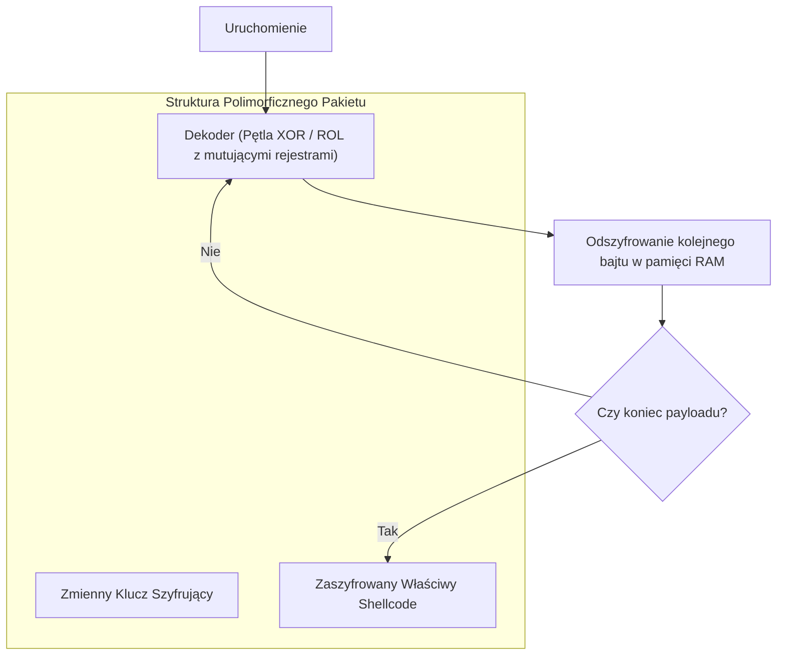

# Inżynieria Wsteczna i Analiza Kodu Wykonywalnego

> [!summary]
> Opracowanie techniczne analizujące 5 polskich publikacji z dziedziny inżynierii wstecznej (reverse engineering), deasemblacji formatów binarnych (PE/ELF), mechaniki trybu chronionego x86 oraz zaawansowanych technik konstrukcji i zaciemniania shellcode'ów (kody polimorficzne).

---

## 1. Szperając w Nagłówkach — Wstęp do Reverse Engineeringu (Wojciech Warpechowski, 2005)

### Budowa Plików Wykonywalnych (PE i ELF)
Warpechowski omawia wewnętrzną architekturę formatów binarnych i techniki ekstrakcji informacji z nagłówków bez uruchamiania kodu:
- **Format Portable Executable (PE)**:
  - Nagłówek DOS (`MZ`) $\to$ Wskaźnik `e_lfanew` $\to$ Sygnatura PE $\to$ File Header $\to$ Optional Header.
  - Tablica Importów (**IAT — Import Address Table**): Analiza importowanych funkcji API (np. `VirtualAlloc`, `WriteProcessMemory`, `CreateRemoteThread`) pozwala natychmiast określić intencje oprogramowania (np. techniki Process Hollowing).
  - Tablica Eksportów (**EAT**): Struktura eksportowanych symboli w bibliotekach DLL.
- **Format Executable and Linkable Format (ELF)**:
  - Nagłówek ELF (`\x7fELF`), identyfikator architektury (32/64-bit), endianness.
  - Tablica nagłówków sekcji (**Section Header Table**) vs Tablica nagłówków programu (**Program Header Table / Segments** używane przez loader jądra Linuksa).

---

## 2. Reverse Engineering — Analiza Dynamiczna Kodu ELF (Marek Janiczek)

### Techniki Analizy w Środowisku Linux
W przeciwieństwie do analizy statycznej (deasemblacja w IDA Pro / Ghidra), analiza dynamiczna bada zachowanie programu w czasie rzeczywistym:
1. **Śledzenie Wywołań Systemowych**: Wykorzystanie `strace` do podglądu interakcji z jądrem oraz `ltrace` do śledzenia wywołań bibliotek dynamicznych (`libc.so`).
2. **Pułapki Antydebugingowe (Anti-Debugging Tricks)**:
   - Sprawdzanie flagi `TracerPid` w `/proc/self/status`. Jeśli proces jest debugowany, `TracerPid > 0`.
   - Próba wywołania `ptrace(PTRACE_TRACEME, 0, 1, 0)`. Ponieważ proces może być śledzony tylko przez jeden debuger, próba ta zwróci błąd (`-1`), zdradzając obecność analityka.
   - Instrukcja `RDTSC`: Pomiar liczby cykli zegara CPU między dwoma punktami kodu. Jeśli różnica wynosi miliony cykli (spowodowane zatrzymaniem w debuggerze), kod zmienia ścieżkę wykonania lub kończy pracę.

---

## 3. Tryb Chroniony Mikroprocesorów x86 (Andrzej Stasiak)

### Architektura Ochrony Pamięci w x86
Stasiak szczegółowo wyjaśnia sprzętową mechanikę ochrony procesorów Intel x86:
- **Rejestry Segmentowe i Selektory**: W trybie chronionym rejestry `CS`, `DS`, `SS`, `ES` nie zawierają bezpośrednich adresów fizycznych, lecz **selektory segmentów** wskazujące na deskryptory w tablicy GDT (Global Descriptor Table) lub LDT (Local Descriptor Table).
- **Pierścienie Ochrony (Privilege Rings 0–3)**:
  - `Ring 0` (Supervisor): Pełen dostęp do instrukcji uprzywilejowanych (`cli`, `sti`, `in`, `out`, `lidt`).
  - `Ring 3` (User): Aplikacje użytkownika. Próba wykonania instrukcji uprzywilejowanej generuje wyjątek General Protection Fault (`#GP`).
- **Mechanizm Paginacji**: Włączenie bitu `PG` w rejestrze `CR0` uruchamia translację adresów liniowych na fizyczne z użyciem katalogu stron (**Page Directory**) i tablic stron (**Page Tables**).

---

## 4. Ewolucja Kodów Powłoki & Polimorficzny Szelkod (Itzik Kotler & Michał Piotrowski)

### Wyzwania w Tworzeniu Shellcode'u
Shellcode to ciąg instrukcji maszynowych wstrzykiwany do pamięci atakowanego procesu:
1. **Unikanie Znaków Null (`\x00`)**:
   - Funkcje operujące na łańcuchach znaków (`strcpy`, `strcat`, `sprintf`) traktują bajt `0x00` jako koniec ciągu, ucinając payload.
   - Zastępowanie instrukcji: Zamiast `mov eax, 0` stosuje się `xor eax, eax`. Zamiast `mov al, 5` używa się manipulacji rejestrem `eax` po wyzerowaniu.
2. **Samomodyfikujący się Kod i Pozycjonowanie**:
   - Shellcode nie zna adresu, pod którym wylądował w pamięci.
   - Sztuczka `JMP-CALL-POP` (lub `fnstenv` / `getpc`) pozwala na odczytanie aktualnego adresu z wierzchołka stosu do rejestru bazowego.

### Techniki Polimorficzne (Michał Piotrowski)
Aby ominąć sygnaturowe systemy detekcji włamań (NIDS / Snort) oraz antywirusy, autorzy stosują szyfrowanie polimorficzne:

- **Silnik Polimorficzny**: Przy każdym generowaniu payloadu silnik wstawia instrukcje śmieciowe (Junk code / NOP sled z instrukcji ekwiwalentnych jak `inc ecx; dec ecx`), losuje klucz XOR oraz podmienia używane rejestry, całkowicie zmieniając sygnaturę binarną pliku.

---

## Powiązane Opracowania
- [[Malware-Rootkity-i-Zagrozenia|Malware, Rootkity i Ptrace]]
- [[../05-Offensive-Security-and-Exploitation/Binary-Exploitation-and-Reverse-Eng|Binary Exploitation and Reverse Engineering]]
- [[../README|Główny Indeks Whitepaperów]]
