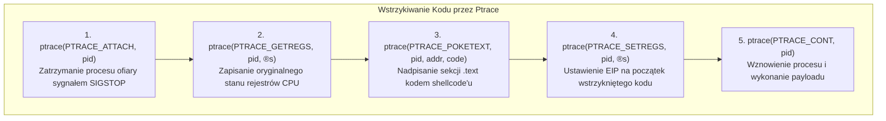

# Malware, Rootkity i Zaawansowane Zagrożenia

> [!summary]
> Opracowanie analizujące techniki tworzenia i analizy złośliwego oprogramowania w środowisku GNU/Linux: wstrzykiwanie kodu za pomocą mechanizmu `ptrace` (Stefan Klaas), tworzenie rootkitów jądra LKM i modyfikacja tablicy wywołań systemowych (Mariusz Burdach), automatyczna analiza behawioralna próbek (Rubén Santamarta) oraz klasyfikacja robaków i wirusów komputerowych.

---

## 1. Hakowanie Aplikacji: Rootkity i Ptrace (Stefan Klaas)

### Mechanizm `ptrace` jako Wektor Wstrzykiwania Kodu
Wywołanie systemowe `ptrace` służy do debugowania procesów, lecz może zostać wykorzystane przez atakującego posiadającego uprawnienia danego użytkownika do przejęcia kontroli nad działającymi procesami (User-Space Rootkits):



---

## 2. Własny Rootkit w GNU/Linuksie (Mariusz Burdach)

### Architektura Rootkitów Jądra (Loadable Kernel Modules - LKM)
Mariusz Burdach przedstawia konstrukcję rootkita działającego w przestrzeni jądra (Ring 0). Głównym celem takiego modułu jest **całkowita niewidzialność** w systemie:
1. **Ukrywanie Procesów**:
   - Odpięcie struktury `task_struct` ukrywanego procesu z dwukierunkowej listy powiązanej procesów jądra (`tasks.prev` i `tasks.next`), co powoduje, że polecenia `ps` oraz `top` go nie widzą.
2. **Podmienianie Tablicy Wywołań Systemowych (`sys_call_table`)**:
   - Wyłączenie ochrony zapisu stron jądra poprzez manipulację bitem `WP` (Write Protect) w rejestrze `CR0`:
     ```c
     write_cr0(read_cr0() & (~0x10000)); // Wyłączenie Write Protect
     original_sys_getdents = sys_call_table[__NR_getdents];
     sys_call_table[__NR_getdents] = hacked_sys_getdents; // Podmiana handlera
     write_cr0(read_cr0() | 0x10000);  // Przywrócenie ochrony
     ```
   - Przechwycone wywołanie `getdents` (odpowiedzialne za listowanie zawartości katalogów) filtruje pliki i katalogi zawierające zdefiniowany prefiks (np. `.rootkit_`), ukrywając je przed poleceniem `ls`.
3. **Ukrywanie Połączeń Sieciowych**:
   - Hooking funkcji warstwy `/proc/net/tcp` i `/proc/net/udp` w celu usuwania wpisów powiązanych z portami nasłuchującymi backdoorów.

---

## 3. Praktyczna Aplikacja do Analizy Malware (Rubén Santamarta)

### Automatyzacja Środowiska Sandbox
Santamarta przedstawia architekturę platformy do dynamicznej detonacji złośliwego oprogramowania:
- **Izolacja**: Wykorzystanie maszyn wirtualnych ze snapshotami pamięci RAM (QEMU / VMware).
- **Monitorowanie Wywołań API**: Wykorzystanie techniki API Hooking (Inline Hooking poprzez wstawianie skoku `JMP` na początku funkcji `kernel32.dll` / `ntdll.dll`).
- **Analiza Sieciowa**: Przekierowywanie całego ruchu DNS i HTTP do fałszywych serwisów (INetSim / FakeNet) w celu zarejestrowania adresów serwerów Command and Control (C2).

---

## 4. Taksonomia Zagrożeń: Robaki Sieciowe i Wirusy (Rudzki, Modzelewski)

```text
+-----------------------+-------------------------------------------------------------+
| Typ Zagrożenia        | Kluczowy Mechanizm Działania                                |
+-----------------------+-------------------------------------------------------------+
| Robaki Sieciowe       | Samoreplikacja bez udziału użytkownika. Skanowanie losowych |
| (Network Worms)       | podsieci IP, eksploitacja podatności w usługach sieciowych. |
+-----------------------+-------------------------------------------------------------+
| Wirusy Pasożytnicze   | Dopisują swój kod na początku, końcu lub w pustych przestrzeniach|
| (Parasitic Viruses)   | (code caves) istniejących plików binarnych (PE / ELF).      |
+-----------------------+-------------------------------------------------------------+
| Wirusy Boot-Sektorowe | Zastępują kod MBR (Master Boot Record) lub VBR dysku twardego|
|                       | w celu załadowania się do pamięci przed startem jądra OS.    |
+-----------------------+-------------------------------------------------------------+
```

---

## Metody Detekcji i Obrony

1. **Weryfikacja Podpisów Modułów (`CONFIG_MODULE_SIG_FORCE`)**:
   - Wymuszenie kryptograficznego sprawdzania każdego modułu ładowanego do jądra blokuje ładowanie nieautoryzowanych modułów LKM.
2. **Narzędzia Integralności Jądra**:
   - Stosowanie narzędzi `rkhunter`, `chkrootkit` oraz `AIDE` do weryfikacji sum kontrolnych SHA-256 binariów systemowych oraz badania poprawności tablicy syscalli.

---

## Powiązane Opracowania
- [[Inzynieria-Wsteczna-i-Analiza-Kodu|Inżynieria Wsteczna i Analiza Kodu]]
- [[Bezpieczenstwo-Systemow-i-Sieci|Bezpieczeństwo Systemów i Sieci]]
- [[../06-Defensive-Security-and-Hardening/Linux-Operating-System-Hardening|Linux Operating System Hardening]]
- [[../README|Główny Indeks Whitepaperów]]
