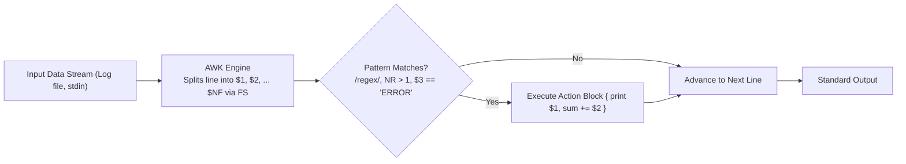

# Developer Tooling & SysAdmin Practices

> [!summary]
> A technical breakdown of classic developer productivity and systems administration texts: the seminal Bell Labs treatise on the AWK programming language by Aho, Kernighan, and Weinberg, Vincent Jousse's ergonomics guide to modal text editing in Vim, UpGuard's blueprint for the DevOps toolchain, and SysAdmin Magazine's production automation patterns.

---

## 1. The AWK Programming Language (Aho, Kernighan, Weinberg, 1988)

### Authors & Origin
Written by the creators of AWK—**Alfred Aho** (Aho-Corasick, Dragon Book), **Brian Kernighan** (K&R C, Unix programming environment), and **Peter Weinberg**. AWK was designed at Bell Labs as a data-driven pattern-action language tailored for high-speed textual stream processing.



### Core Architecture & Key Concepts
1. **The Pattern-Action Paradigm**:
   ```awk
   pattern { action }
   ```
   If pattern is omitted, action applies to all lines. If action is omitted, matching lines are printed verbatim.
2. **Built-in Variables**:
   - `$0`: Entire input record (line).
   - `$1, $2, ... $NF`: Fields within the record (split by `FS`, default whitespace).
   - `NF`: Number of fields in the current record.
   - `NR`: Current input record number (line count).
   - `FS` / `OFS`: Input and Output Field Separators.
3. **Associative Arrays (Hash Maps by Default)**:
   - AWK pioneered built-in associative arrays indexed by arbitrary strings.
   - *Example: Top 10 IP addresses in an NGINX access log*:
     ```awk
     awk '{ count[$1]++ } END { for (ip in count) print count[ip], ip }' access.log | sort -rn | head -n 10
     ```

---

## 2. Vim for Humans (Vincent Jousse, 2015)

### The Philosophy of Modal Text Editing
Vincent Jousse argues that software engineers spend **$80\%$ of their time reading and navigating code, and only $20\%$ typing new text**. Traditional modeless editors treat every keystroke as an insertion, requiring awkward multi-key finger contortions (`Ctrl+Alt+Shift+...`).

Vim separates editing into distinct modes:
- **Normal Mode**: Every key on the home row is a navigation or editing verb.
- **Insert Mode**: Typing raw text.
- **Visual Mode**: Highlighting blocks of text.
- **Command Mode (`:`)**: File operations, global search-and-replace, buffer management.

```text
The Grammar of Vim:  [Verb] + [Modifier] + [Noun]
Examples:
  d (delete)  +  i (inside)  +  ( (parentheses)  -->  di(   (Delete contents inside parens)
  c (change)  +  a (around)  +  " (quote)        -->  ca"   (Replace quote and its contents)
  y (yank)    +  t (to)      +  ; (semicolon)    -->  yt;   (Copy up to semicolon)
```

---

## 3. The DevOps Toolchain (UpGuard Engineering)

### Moving from Manual Administration to Infrastructure as Code
The UpGuard paper outlines the structural transition of IT infrastructure from artisanal server administration to automated, immutable pipelines:
1. **Source Control as Single Source of Truth**: All infrastructure configurations (Terraform, Ansible, Kubernetes manifests) reside in Git.
2. **Continuous Integration & Automated Validation**: Every commit triggers syntax linting, security vulnerability scanning, and unit testing prior to staging deployment.
3. **Configuration Drift Detection**: Continuous reconciliation comparing live server state against declared Git state to prevent untracked manual changes.

---

## 4. SysAdmin Magazine: Production Automation Patterns (2016)

### Essential Production Triage Scripts
Key patterns documented in the 2016 SysAdmin compilation:
- **Finding Orphaned Background Processes**:
  ```bash
  ps -ef | awk '$3 == 1 { print $0 }'   # Processes whose PPID is 1 (adopted by init/systemd)
  ```
- **Automated Open File Descriptor Auditing**:
  ```bash
  lsof +L1                              # List unlinked files held open in memory (hidden disk leaks)
  ```
- **Real-Time Log Ingestion with Alerting**:
  ```bash
  tail -Fn0 /var/log/secure | awk '/Failed password/ { print strftime("%Y-%m-%d %H:%M:%S"), $0; fflush() }'
  ```

---

## Related Notes
- [[../01-Systems-Performance-and-Tracing/Linux-Tracing-and-Instrumentation|Linux Tracing and Instrumentation]]
- [[../06-Defensive-Security-and-Hardening/Linux-Operating-System-Hardening|Linux Operating System Hardening]]
- [[../README|Technical Whitepapers Master MOC]]
