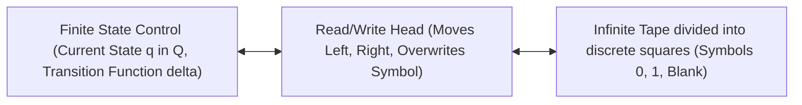
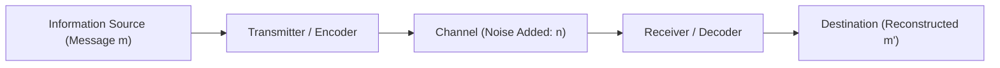
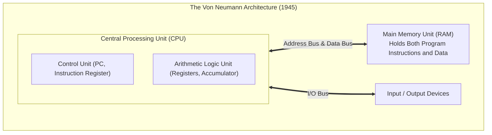

# Foundations of Computation & Information Theory

> [!summary]
> A deep technical breakdown of the four foundational papers that created the discipline of computer science: Alan Turing's mathematical model of universal computation and undecidability, Claude Shannon's creation of Information Theory, John von Neumann's blueprint for stored-program digital computers, and Edsger Dijkstra's invention of semaphores and layered operating system architecture.

---

## 1. On Computable Numbers (Alan Turing, 1936)

### Historical & Mathematical Significance
Published in 1936 in the *Proceedings of the London Mathematical Society*, Alan Turing sought to answer David Hilbert's *Entscheidungsproblem* (the Decision Problem): Is there a mechanical procedure by which the truth or falsity of any mathematical proposition can be decided?

To answer this, Turing invented the abstract mathematical model of a computing machine—now known as the **Turing Machine (TM)**.

### The Universal Turing Machine ($U$)
- Turing proved that there exists a single **Universal Turing Machine ($U$)** that can simulate any arbitrary Turing machine $M$ when provided with the encoded description of $M$ (its program) and input $w$ on its tape:
  $$U(\langle M, w \rangle) = M(w)$$
- **Engineering Legacy**: This is the theoretical proof that general-purpose computers are possible. Instead of building specialized hardware for each specific task, a single fixed hardware machine can execute any computable function simply by loading software instructions into memory.

### The Halting Problem & Undecidability
Turing proved that computation has fundamental limits:
- **The Halting Problem ($A_{\text{TM}}$)**: Can a program $H(P, x)$ decide whether an arbitrary program $P$ halts on input $x$?
- **Proof by Diagonalization (Contradiction)**:
  - Construct machine $D$ that takes program $\langle P \rangle$ as input:
    - Run $H(\langle P \rangle, \langle P \rangle)$.
    - If $H$ says $P$ halts, $D$ loops forever.
    - If $H$ says $P$ does not halt, $D$ halts immediately.
  - Now evaluate $D$ on its own description: $D(\langle D \rangle)$.
    - If $D$ halts, $H$ reported that $D$ does not halt (contradiction).
    - If $D$ loops forever, $H$ reported that $D$ halts (contradiction).
- **Conclusion**: $H$ cannot exist. The Halting Problem is **undecidable**.

---

## 2. A Mathematical Theory of Communication (Claude Shannon, 1948)

### Founding Information Theory
Published in the *Bell System Technical Journal*, Claude Shannon created the mathematics of modern digital communication. Before Shannon, communications engineering was an analog discipline concerned with signal voltages and vacuum tubes. Shannon showed that all information—voice, text, images, video—can be represented as **discrete binary digits (Bits)**.

### Core Mathematical Formulations

#### 1. Information Entropy ($H$)
Shannon quantified the average amount of information (uncertainty) contained in an event or random variable $X$:

$$H(X) = - \sum_{i=1}^n P(x_i) \log_2 P(x_i) \quad \text{(measured in Bits)}$$

- If an event is guaranteed ($P=1$), it conveys $0$ bits of information.
- A fair coin toss conveys exactly $1$ bit of information: $-(0.5 \log_2 0.5 + 0.5 \log_2 0.5) = 1.0\text{ bit}$.

#### 2. Shannon's Source Coding Theorem (Lossless Compression)
- Establishes that data cannot be compressed into fewer bits than the source entropy $H(X)$ without losing information. It sets the absolute theoretical limit for algorithms like Huffman coding, LZ77, and Gzip.

#### 3. Shannon-Hartley Theorem (Channel Capacity)
The maximum rate $C$ at which error-free data can be transmitted over a communication channel of bandwidth $B$ (in Hertz) with signal-to-noise ratio $\text{SNR}$:

$$C = B \log_2 \left(1 + \frac{S}{N}\right) \quad \text{(Bits per second)}$$

- Proves that as long as the transmission rate $R < C$, there exist error-correcting codes (e.g., Reed-Solomon, LDPC) that allow transmission with arbitrarily low error probabilities, even across noisy wireless and optical channels!

---

## 3. First Draft of a Report on the EDVAC (John von Neumann, 1945)

### The Stored-Program Architecture
Prior to 1945, computers like ENIAC were reprogrammed manually by rewiring physical patch cords and switches. John von Neumann proposed storing **both program instructions and data in the same physical memory unit**.

### The Von Neumann Bottleneck
- Because instructions and data share the same physical bus, the CPU cannot read an instruction and read/write data simultaneously.
- **Modern Consequence**: The speed discrepancy between CPU processing speed and memory bus bandwidth is known as the **Von Neumann Bottleneck / Memory Wall**, necessitating multi-level CPU caches (L1, L2, L3) to keep the execution pipeline fed.

---

## 4. The Structure of the "THE"-Multiprogramming System (Edsger Dijkstra, 1968)

### Invention of Modern Synchronization & Layered Systems
Edsger W. Dijkstra built the "THE" multiprogramming operating system at the Technische Hogeschool Eindhoven, establishing two revolutionary concepts:

#### 1. The Semaphore ($P$ and $V$)
Dijkstra invented the first mathematically sound synchronization primitive for coordinating concurrent threads without busy-waiting:
- $P(S)$ (from Dutch *proberen*, to test): Decrements semaphore $S$. If $S < 0$, the calling thread is blocked and queued.
- $V(S)$ (from Dutch *verhogen*, to increment): Increments semaphore $S$. If $S \le 0$, one blocked thread from the queue is awakened.

#### 2. Hierarchical Layered Architecture
Dijkstra proved that operating systems must be designed as nested concentric layers where Layer $N$ depends strictly on Layer $N-1$:
- *Layer 0*: Hardware CPU dispatching, timer interrupts, and multiprogramming.
- *Layer 1*: Memory allocation and page drum backing store.
- *Layer 2*: Communication between console and operators.
- *Layer 3*: I/O buffering for peripheral devices.
- *Layer 4*: User programs.
- *Layer 5*: The human operator.

---

## Related Notes
- [[02-Distributed-Systems-and-Consensus|Distributed Systems and Consensus Mechanics]]
- [[../10-Seminal-Low-Latency-Systems-Papers/01-Memory-Models-and-Hardware-Coherence|Memory Models and Hardware Coherence]]
- [[../03-Memory-Architecture-and-Concurrency/Ulrich-Drepper-Memory-Architecture|Ulrich Drepper Memory Architecture]]
- [[README|Seminal Computer Science Papers MOC]]
