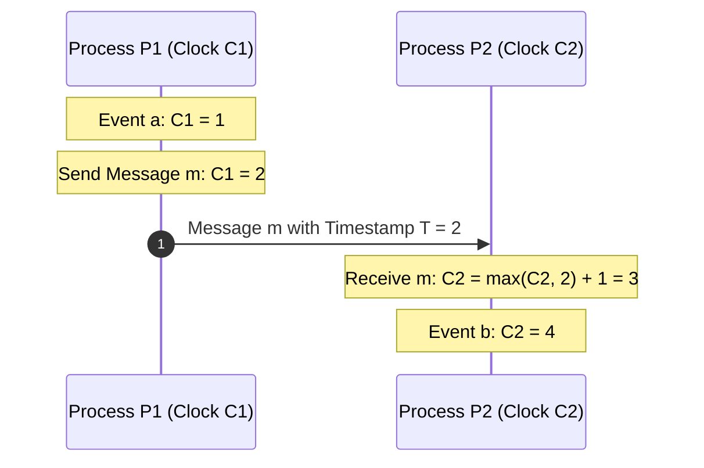
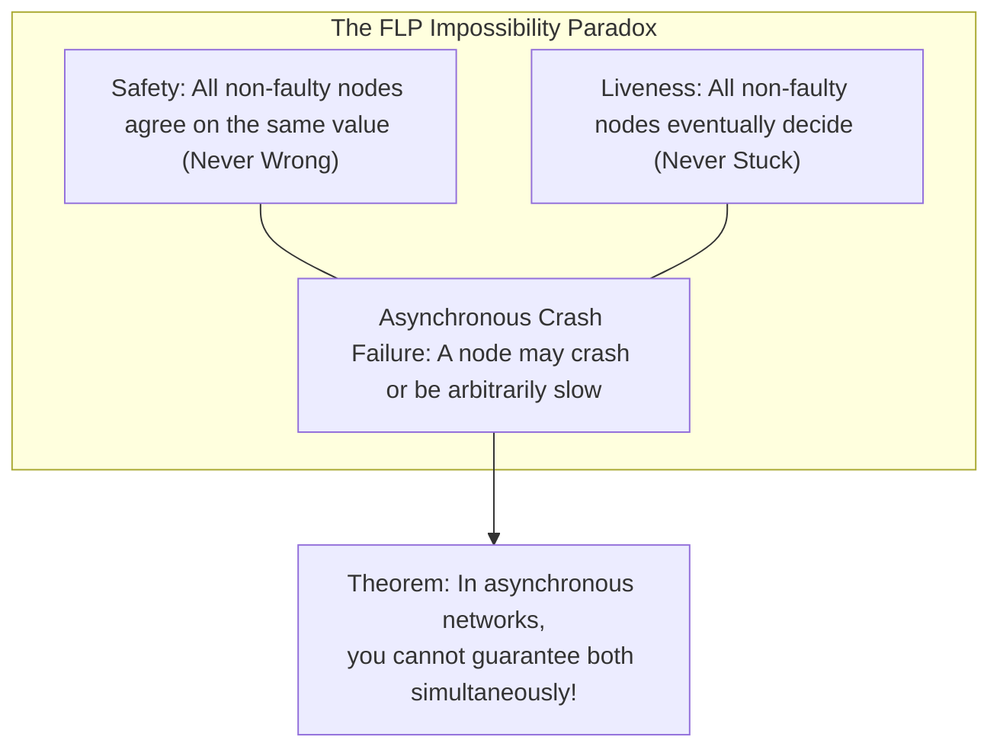
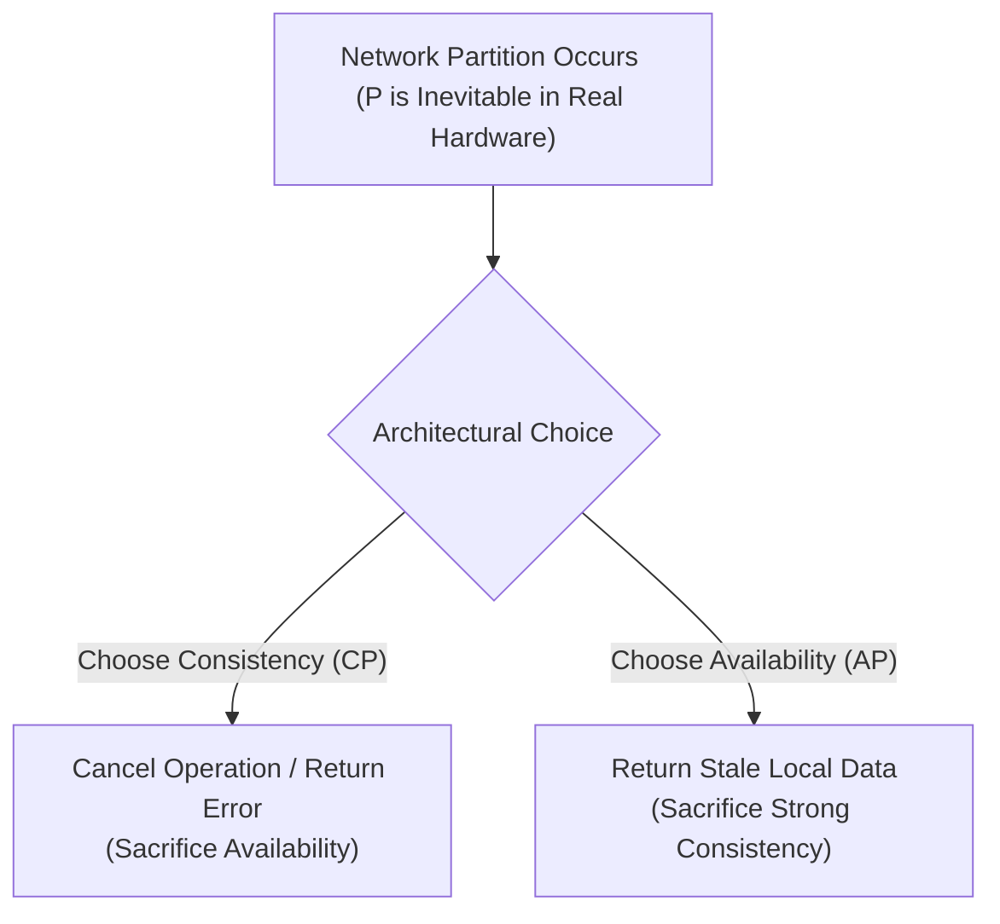

# Distributed Systems & Consensus Mechanics

> [!summary]
> The foundational research papers that govern distributed computing: Leslie Lamport's logical clocks and happens-before relationship, the Byzantine Generals problem, the FLP impossibility theorem, Paxos, Raft, and the formal proof of Brewer's CAP theorem.

---

## 1. Time, Clocks, and the Ordering of Events in a Distributed System (Leslie Lamport, 1978)

### Core Thesis
Published in *Communications of the ACM*, this is the single most cited paper in computer science. Lamport demonstrates that in a distributed system, **physical time cannot be relied upon to order events** due to relativity and clock drift. Instead, time must be modeled as a **partial order** based on causality.

### The "Happens-Before" Relation ($\to$)
The relation $\to$ on the set of events is defined by three rules:
1. If $a$ and $b$ are events in the same process, and $a$ comes before $b$, then $a \to b$.
2. If $a$ is the sending of a message by one process and $b$ is its receipt by another process, then $a \to b$.
3. If $a \to b$ and $b \to c$, then $a \to c$ (Transitivity).

Two distinct events $a$ and $b$ are **concurrent** ($a \parallel b$) if neither $a \to b$ nor $b \to a$.



### Lamport Logical Clocks Algorithm
Each process $P_i$ maintains a scalar integer clock $C_i$:
- Before executing an internal event, $P_i$ increments $C_i$: $C_i \leftarrow C_i + 1$.
- When sending message $m$, $P_i$ includes timestamp $T_m = C_i$.
- Upon receiving message $m$ with timestamp $T_m$, $P_j$ updates its clock:
  $$C_j \leftarrow \max(C_j, T_m) + 1$$
- **State Machine Replication**: By breaking ties with unique process IDs ($C_i, i$), Lamport created the first algorithm for **deterministic total ordering**, birthing replicated state machines (RSMs).

---

## 2. The Byzantine Generals Problem (Lamport, Shostak, Pease, 1982)

### The Problem: Arbitrary & Malicious Faults
Divisions of the Byzantine army surround an enemy city. Generals must agree on a common battle plan: **Attack** or **Retreat**. However, some generals may be traitors trying to prevent consensus by sending conflicting messages to different generals.

```text
The 3m + 1 Bound Theorem:
In an asynchronous system with oral (unauthenticated) messages, consensus CANNOT
be reached if the number of traitorous nodes m is greater than or equal to n/3.
To tolerate m Byzantine traitors, there must be at least 3m + 1 total nodes!
Example: To tolerate 1 traitor, you need at least 4 nodes (3 * 1 + 1 = 4).
```

### Solutions:
1. **Oral Messages ($OM(m)$)**: Recursive voting requiring $m+1$ rounds of communication across $3m+1$ nodes.
2. **Signed Messages ($SM(m)$)**: Using digital cryptographic signatures (where traitors cannot forge signatures), consensus can be reached with only **$m + 2$** nodes!

---

## 3. FLP Impossibility Theorem (Fischer, Lynch, Paterson, 1985)

### The Theorem
Published in the *Journal of the ACM* and awarded the Dijkstra Prize, the FLP theorem proves a profound mathematical truth:

> **In an asynchronous network, no deterministic consensus protocol can guarantee both Safety and Liveness in the presence of even a SINGLE unannounced crash failure.**



### How Practical Systems Evade FLP
Practical consensus protocols (Paxos, Raft) **guarantee Safety unconditionally** (they never produce conflicting split-brain decisions), but rely on **partially synchronous assumptions** (randomized timers, heartbeats) to guarantee Liveness in practice.

---

## 4. Paxos & Raft Consensus Compared

| Dimension | Paxos (Lamport, 1998/2001) | Raft (Ongaro & Ousterhout, 2014) |
| :--- | :--- | :--- |
| **Primary Design Goal** | Minimal mathematical formulation | Understandability & operational simplicity |
| **Core Abstraction** | Independent Single-Degree Consensus instances | Continuous Replicated Log with explicit Leader |
| **Phases** | Phase 1 (Prepare/Promise) $\to$ Phase 2 (Accept/Accepted) | Leader Election $\to$ AppendEntries (Log Replication) |
| **Leader Role** | Weak leader (proposer can change anytime) | Strong leader (logs only flow from leader to followers) |
| **Log Gaps** | Can commit entries with gaps (out-of-order) | Strict prefix property (log never has committed holes) |

---

## 5. The CAP Theorem (Eric Brewer, 2000; Gilbert & Lynch, 2002)

### The Formal Proof
In any distributed data store, three properties are in tension:
1. **Consistency (C)**: Every read receives the most recent write or an error (Linearizability).
2. **Availability (A)**: Every non-failing node returns a non-error response for every request (no timeouts).
3. **Partition Tolerance (P)**: The system continues to operate despite network partitions (dropped/delayed packets).



- **Theorem**: Because network partitions ($P$) cannot be avoided in physical networks (severed fiber cables, switch failures), a distributed system must choose between **Consistency ($CP$)** (e.g., Raft, Spanner, Zookeeper) or **Availability ($AP$)** (e.g., Dynamo, Cassandra).

---

## Related Notes
- [[03-Cloud-Infrastructure-and-Big-Data|Cloud Infrastructure and Big Data Foundations]]
- [[04-Databases-and-Transaction-Processing|Databases and Transaction Processing]]
- [08-Distinguished-Engineering: Raft Consensus](../../08-Distinguished-Engineering/02-Distributed-Systems-Internals/raft_consensus.py)
- [[README|Seminal Computer Science Papers MOC]]
