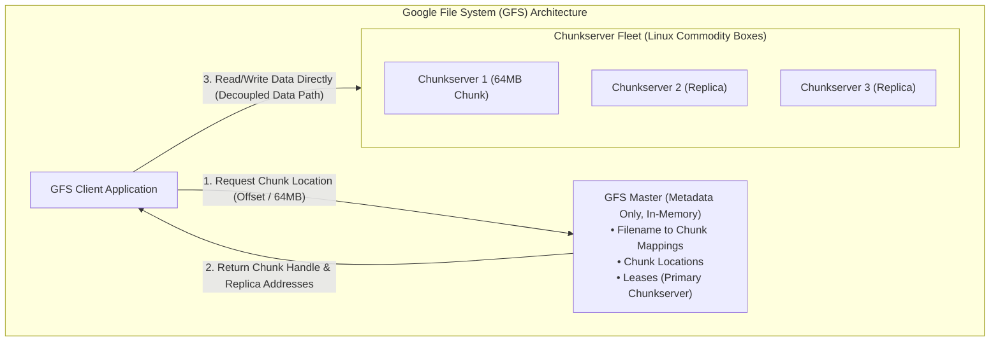
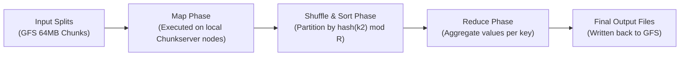

# Cloud Infrastructure & Big Data Foundations

> [!summary]
> The architectural treatises that birthed the modern cloud and big data computing era: Google's foundational trilogy (GFS, MapReduce, Bigtable), Amazon's Dynamo decentralized key-value store, and UC Berkeley's Apache Spark Resilient Distributed Datasets (RDDs).

---

## 1. The Google File System (GFS) (Ghemawat et al., 2003)

### Core Architectural Shift
Traditional file systems (POSIX, NFS) were built under the assumption that hardware components are highly reliable. Google flipped this assumption: **Component failures are the norm rather than the exception**. GFS was designed to run across thousands of cheap commodity machines that fail daily.



### Key Design Innovations
1. **Separation of Control Flow from Data Flow**:
   - The master handles only metadata lookups. The client caches chunk locations and streams multi-megabyte payloads directly to/from chunkservers, preventing the master from becoming a network bottleneck.
2. **Large 64 MB Chunk Size**:
   - Reduces master metadata memory footprint (every 64MB chunk requires only $\approx 64$ bytes of metadata in master RAM).
   - Minimizes client-master network round-trips.
3. **Optimized for Append Operations**:
   - Instead of random overwrites, GFS optimized for concurrent atomic appends (`record_append`), supporting parallel web crawlers and log processing.

---

## 2. MapReduce: Simplified Data Processing (Dean & Ghemawat, 2004)

### The Abstraction
Jeffrey Dean and Sanjay Ghemawat extracted the functional programming primitives `map` and `reduce` to hide the brutal complexity of distributed execution (parallelization, fault tolerance, data distribution, and load balancing):

$$\text{Map}: (k_1, v_1) \implies \text{list}(k_2, v_2)$$

$$\text{Reduce}: (k_2, \text{list}(v_2)) \implies \text{list}(v_3)$$



### Fault Tolerance & Straggler Mitigation
- **Worker Failure**: The Master re-executes map tasks assigned to failed workers because their intermediate outputs were stored on local disks.
- **Backup Tasks (Speculative Execution)**: When a MapReduce job nears completion, the master launches backup copies of remaining in-progress tasks ("stragglers" slowed down by failing hard drives or bad network links). Whichever finishes first commits its output, slashing total job completion times by $30–50\%$.

---

## 3. Bigtable: Distributed Structured Storage (Chang et al., 2006)

### Data Model
Bigtable defined the NoSQL wide-column database model. It is a **sparse, distributed, persistent, multidimensional sorted map**:

$$\text{(row:string, column:string, time:int64)} \implies \text{string}$$

- **Row Keys**: Arbitrary strings (up to 64 KB). Rows are lexicographically sorted. Range scans over contiguous row keys are fast.
- **SSTable (Sorted String Table)**: Immutable, ordered key-value files stored on GFS.
- **LSM-Tree Architecture**:
  1. Writes append sequentially to a commit log (WAL) on GFS.
  2. Mutations are inserted into an in-memory sorted buffer called **MemTable**.
  3. When MemTable reaches capacity, it flushes to GFS as an immutable **SSTable**.
  4. Background compactions merge overlapping SSTables and purge deleted entries.

---

## 4. Dynamo: Amazon's Highly Available Key-Value Store (DeCandia et al., 2007)

### Design Philosophy: High Availability Above All
Amazon designed Dynamo to power the shopping cart service. If a node fails, dropping an item from a shopping cart causes lost revenue. Therefore, Dynamo sacrificed strong consistency in favor of **$99.9\%$ SLA availability and sub-10ms response times**.

```text
+-----------------------+-------------------------------------------------------------+
| Problem               | Dynamo Technique                                            |
+-----------------------+-------------------------------------------------------------+
| Partitioning          | Consistent Hashing with Virtual Nodes (Balances load)       |
| High Availability     | Sloppy Quorums and Hinted Handoff (Writes succeed anywhere) |
| Conflict Resolution   | Vector Clocks with client-side reconciliation               |
| Failure Recovery      | Anti-entropy using Merkle Trees (Minimizes data sync transfer)|
| Membership & Failure  | Decentralized Gossip-based protocol                         |
+-----------------------+-------------------------------------------------------------+
```

### The $N, R, W$ Quorum System
- $N$: Number of replicas for each key.
- $R$: Number of replicas that must respond to a read request.
- $W$: Number of replicas that must acknowledge a write request.
- If **$R + W > N$**, the system guarantees strong read-your-writes consistency.
- Dynamo chose **$R + W \le N$** (e.g., $N=3, R=2, W=2$), enabling writes to succeed even during network partitions.

---

## 5. Resilient Distributed Datasets (Apache Spark) (Zaharia et al., 2012)

### Overcoming MapReduce's I/O Bottleneck
MapReduce was slow for iterative algorithms (machine learning gradient descent, PageRank) because every iteration had to read from and write back to disk (GFS/HDFS).

Matei Zaharia created **Resilient Distributed Datasets (RDDs)**:
- **Fault-Tolerant In-Memory Objects**: Data partitions are cached in worker RAM across a cluster.
- **Lineage Graphs**: Instead of replicating data in RAM across multiple machines, an RDD remembers the graph of deterministic transformations (`map`, `filter`, `join`) used to build it. If a worker node crashes, Spark reconstructs only the lost partition by replaying its lineage!

---

## Related Notes
- [[02-Distributed-Systems-and-Consensus|Distributed Systems and Consensus Mechanics]]
- [[04-Databases-and-Transaction-Processing|Databases and Transaction Processing]]
- [08-Distinguished-Engineering: Consistent Hashing](../../08-Distinguished-Engineering/02-Distributed-Systems-Internals/consistent_hashing.py)
- [08-Distinguished-Engineering: LSM Tree](../../08-Distinguished-Engineering/03-Database-Internals/lsm_tree.cpp)
- [[README|Seminal Computer Science Papers MOC]]
