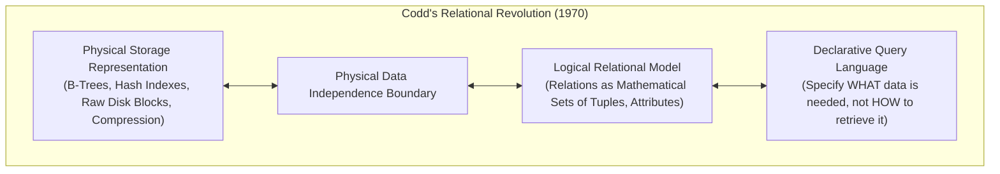
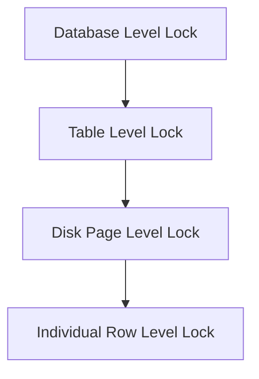
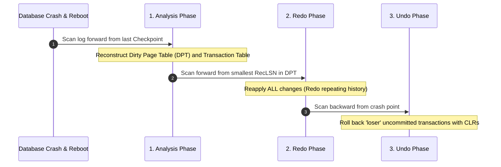

# Databases & Transaction Processing

> [!summary]
> A technical breakdown of the three foundational research papers that established relational databases and modern transaction management: Edgar F. Codd's 1970 mathematical relational model, Jim Gray's formulation of ACID properties and hierarchical locking, and C. Mohan's ARIES write-ahead logging algorithm.

---

## 1. A Relational Model of Data for Large Shared Data Banks (Edgar F. Codd, 1970)

**Source:** [open copy](https://www.seas.upenn.edu/~zives/03f/cis550/codd.pdf)

### Historical Paradigm Shift
Before Codd's 1970 paper in *Communications of the ACM*, databases were hierarchical (IMS) or network-based (CODASYL). Developers wrote programs that navigated hardcoded physical memory pointers (e.g., "get child of record 42"). If an index was modified or a record was reshuffled on disk, every application program in the company broke.



### Core Innovations
1. **Mathematical Relations**: Data is organized into $N$-ary relations (tables) consisting of sets of tuples (rows) with named attributes (columns).
2. **Relational Algebra**: Defined formal mathematical operators: Selection ($\sigma$), Projection ($\pi$), Cartesian Product ($\times$), Set Difference ($-$), and Join ($\bowtie$).
3. **Normalization**: Introduced First, Second, and Third Normal Forms (1NF, 2NF, 3NF) to mathematically eliminate data redundancy and update/delete anomalies.

---

## 2. Granularity of Locks & Degrees of Consistency (Jim Gray et al., 1976)

**Source:** [open copy](http://jimgray.azurewebsites.net/papers/granularity%20of%20locks%20and%20degrees%20of%20consistency%20RJ%201654.pdf)

### Defining ACID & Multi-Granularity Locking
Jim Gray (Turing Award laureate) defined how to coordinate concurrent transactions across shared database records without data corruption.

```text
The ACID Properties:
• Atomicity:   All changes in a transaction occur, or none do (All-or-Nothing).
• Consistency: A transaction transforms the database from one valid state to another.
• Isolation:   Intermediate states of a transaction are invisible to concurrent transactions.
• Durability:  Once committed, the changes survive system crashes and power failures.
```

### Multiple Granularity Locking (MGL)
Locking an entire database prevents concurrent transactions; locking individual rows introduces millions of lock manager entries. Gray invented **Intention Locks** to allow hierarchical locking:



#### Lock Compatibility Matrix:
- **Shared (S)**: Read permission.
- **Exclusive (X)**: Write permission.
- **Intention Shared (IS)**: Intends to acquire S locks down the hierarchy.
- **Intention Exclusive (IX)**: Intends to acquire X locks down the hierarchy.
- **Shared Intention Exclusive (SIX)**: Reads entire table, writes specific rows.

### Strict Two-Phase Locking (Strict 2PL)
- **Phase 1 (Growing)**: Transaction acquires locks; releases none.
- **Phase 2 (Shrinking)**: Transaction releases all locks at once upon COMMIT or ABORT.
- **Guarantee**: Guarantees **Serializability** (the gold standard of transaction isolation).

---

## 3. ARIES: A Transaction Recovery Method (C. Mohan et al., IBM, 1992)

**Source:** [open copy](https://cs.stanford.edu/people/chrismre/cs345/rl/aries.pdf)

### The Recovery Problem
If a database crashes mid-transaction (e.g., power loss), some committed transactions may still reside only in volatile memory buffers, while uncommitted active transactions may have already modified disk blocks.

### The ARIES Algorithm (Algorithm for Recovery and Isolation Exploiting Semantics)
ARIES is implemented by virtually all modern relational engines (PostgreSQL, MySQL InnoDB, SQL Server, Oracle). It relies on three fundamental principles:
1. **Write-Ahead Logging (WAL)**: An in-memory page cannot be flushed to disk until its corresponding log record has been synchronously flushed to persistent storage.
2. **Repeating History during Redo**: Upon restart, ARIES reconstructs the exact state of the system up to the instant of the crash.
3. **Logging Changes during Undo (Compensation Log Records - CLRs)**: When rolling back active uncommitted transactions, ARIES logs CLRs so that if the system crashes *during recovery*, it never repeats undone work.



---

## Related Notes
- [[02-Distributed-Systems-and-Consensus|Distributed Systems and Consensus Mechanics]]
- [[03-Cloud-Infrastructure-and-Big-Data|Cloud Infrastructure and Big Data Foundations]]
- [08-Distinguished-Engineering: Write-Ahead Log (WAL)](../../08-Distinguished-Engineering/03-Database-Internals/wal.cpp)
- [[README|Seminal Computer Science Papers MOC]]
