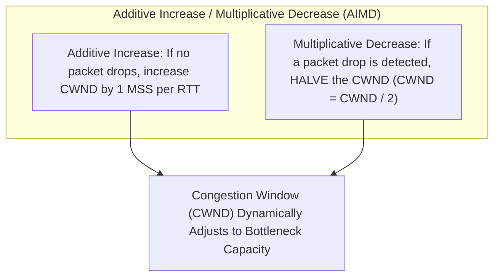

# Internet Architecture & End-to-End Systems

> [!summary]
> The architectural treatises that designed the global Internet: Vinton Cerf and Robert Kahn's invention of TCP/IP, Saltzer, Reed, and Clark's End-to-End principle, Van Jacobson's congestion avoidance algorithms that rescued the Internet from collapse, and Butler Lampson's pragmatic systems design hints.

---

## 1. A Protocol for Packet Network Intercommunication (Cerf & Kahn, 1974)

**Source:** [open copy](https://www.cs.princeton.edu/courses/archive/fall06/cos561/papers/cerf74.pdf)

### The Birth of the Internet
Published in *IEEE Transactions on Communications*, Vint Cerf and Bob Kahn designed the architecture to connect disparate, incompatible packet networks (ARPANET, SATNET, PRNET) into a unified **Inter-net**.


### Foundational Principles
1. **The Gateway (Router) Abstraction**: Routers simply inspect the IP destination address and forward uninterpreted datagrams. They maintain **no per-connection state**, ensuring extreme resilience if an intermediate router crashes.
2. **Byte-Stream Sequence Numbering**: Every transmitted octet (byte) of payload data is assigned a continuous 32-bit sequence number, enabling reassembly of fragmented, out-of-order packets.
3. **Sliding Window Flow Control**: Dynamically regulates transmission rates to prevent faster senders from overflowing slower receivers.

---

## 2. End-to-End Arguments in System Design (Saltzer, Reed, Clark, 1984)

**Source:** [open copy](https://web.mit.edu/Saltzer/www/publications/endtoend/endtoend.pdf)

### The Philosophical Rule of System Architecture
Saltzer, Reed, and Clark formulated the single most influential design principle in networking and distributed systems:

> **"The function in question can completely and correctly be implemented only with the knowledge and help of the application standing at the end points of the communication system. Therefore, providing that questioned function as a feature of the communication system itself is not possible."**

```text
The Classic File Transfer Example:
Scenario: Transferring a file from Host A's disk across 5 routers to Host B's disk.
Attempted Optimization: Make every network link 100% reliable with hop-by-hop error checks.
Why it Fails: Even if all network links are 100% reliable, data can still be corrupted by:
  1. A faulty memory bit inside Router 3's buffer.
  2. A buggy filesystem driver on Host B.
  3. A disk sector write failure on Host B.
Conclusion: Host A and Host B MUST perform an end-to-end checksum verification anyway!
Therefore, making intermediate network hops complex and 'reliable' is redundant and wasteful.
```

### Modern Engineering Application
- The Internet core is intentionally kept **dumb, simple, and fast** (stateless best-effort IP forwarding), while intelligence, reliability, and security (TCP retransmission, TLS encryption) reside exclusively at the **smart endpoints**.

---

## 3. Congestion Avoidance and Control (Van Jacobson & Karels, 1988)

**Source:** [open copy](https://ee.lbl.gov/papers/congavoid.pdf)

### Rescuing the Internet from Congestion Collapse
In 1986, the Internet suffered a catastrophic collapse: Throughput on the 400-mile link between LBL and UC Berkeley dropped from 32 Kbps to **40 bps ($1000\times$ degradation)** due to packet drops and synchronized retransmission storms. Van Jacobson introduced four algorithms that saved the Internet:



### The 4 Algorithms:
1. **Slow Start**: Probes available network bandwidth exponentially by doubling `CWND` every RTT until hitting `ssthresh`.
2. **Congestion Avoidance**: Linear probing via Additive Increase.
3. **Fast Retransmit**: When a sender receives **3 duplicate ACKs**, it retransmits the missing segment immediately without waiting for the retransmission timer to expire.
4. **Jacobson's RTT Estimator**: Measures round-trip variance ($RTTVAR$) to calculate an accurate Retransmission Timeout ($RTO = SRTT + 4 \times RTTVAR$), preventing spurious retransmissions.

---

## 4. Hints for Computer System Design (Butler Lampson, 1983)

**Source:** [open copy](https://bwlampson.site/33-Hints/Acrobat.pdf)

### Wisdom of a Turing Award Laureate
Butler Lampson (Xerox PARC pioneer, architect of Alto and Ethernet) codified 30+ years of engineering experience into practical maxims:

- **"Keep it simple"**: Do not hide power behind complex abstractions.
- **"Separate policy from mechanism"**: Build mechanisms that do not dictate how they are used (e.g., Linux capabilities vs root-or-nothing).
- **"Split resources in a fixed way rather than sharing them"**: Sharing requires coordination and locks; partitioning eliminates contention entirely (precursor to modern NUMA core isolation).
- **"Make it fast rather than general or powerful"**: An efficient primitive can be composed into complex behavior; a slow general framework can never be optimized.
- **"Use hints"**: A hint is information that can speed up execution if correct, but causes no harm if wrong (e.g., routing tables, hardware branch predictors).

---

## Related Notes
- [[01-Foundations-and-Information-Theory|Foundations and Information Theory]]
- [[02-Distributed-Systems-and-Consensus|Distributed Systems and Consensus Mechanics]]
- [[../04-Networking-and-Protocols/High-Performance-TCP-and-Networking|High-Performance TCP and Networking]]
- [[README|Seminal Computer Science Papers MOC]]
