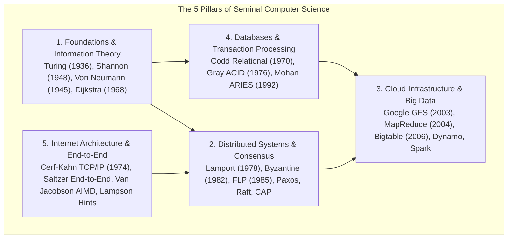

# Seminal Computer Science Papers Canon

> [!summary]
> The intellectual bedrock of computing. These 20 seminal research papers defined the fundamental abstractions of computer science: computability, information entropy, stored-program execution, distributed consensus, ACID transactions, relational databases, internetworking, and large-scale cloud infrastructure.

---

## The 5 Pillars of Foundational CS Papers

---

## Detailed Study Guides

### 1. [[01-Foundations-and-Information-Theory|Foundations of Computation & Information Theory]]
- **Alan Turing (1936)** - *On Computable Numbers, with an Application to the Entscheidungsproblem*: The mathematical invention of the Universal Turing Machine, the limits of computation, and the proof of the Halting Problem ($H(P, x)$ is undecidable).
- **Claude Shannon (1948)** - *A Mathematical Theory of Communication*: Founding of Information Theory, defining the **Bit**, source entropy ($H(X) = -\sum p(x) \log_2 p(x)$), noiseless coding theorem, and noisy channel capacity ($C = B \log_2 (1 + \text{SNR})$).
- **John von Neumann (1945)** - *First Draft of a Report on the EDVAC*: Definition of stored-program computer architecture (Central Processing Unit, Control Unit, Arithmetic Logic Unit, Memory, and I/O bus).
- **Edsger W. Dijkstra (1968)** - *The Structure of the "THE"-Multiprogramming System*: Invention of semaphores ($P$ and $V$ operations), cooperating sequential processes, and hierarchical layered OS design.

### 2. [[02-Distributed-Systems-and-Consensus|Distributed Systems & Consensus Mechanics]]
- **Leslie Lamport (1978)** - *Time, Clocks, and the Ordering of Events in a Distributed System*: Logical clocks, the partial order "happens-before" ($\to$) relation, state machine replication, and total ordering in asynchronous systems.
- **Leslie Lamport, Robert Shostak, Marshall Pease (1982)** - *The Byzantine Generals Problem*: Agreement in the presence of arbitrary malicious failures; formal proof that consensus is impossible with fewer than $3m + 1$ generals without signatures.
- **Fischer, Lynch, Paterson (1985)** - *Impossibility of Distributed Consensus with One Faulty Process (FLP Impossibility)*: Proof that no deterministic asynchronous consensus protocol can guarantee safety and liveness with even a single crash failure.
- **Leslie Lamport (1998 / 2001)** - *Paxos Made Simple*: Two-phase consensus (Prepare/Promise, Accept/Accepted) for fault-tolerant state machine replication.
- **Diego Ongaro & John Ousterhout (2014)** - *In Search of an Understandable Consensus Algorithm (Raft)*: Deconstructed consensus into Leader Election, Log Replication, and Safety.
- **Eric Brewer (2000) & Gilbert / Lynch (2002)** - *The CAP Theorem*: Formal proof that a distributed data store can simultaneously provide at most two of Consistency, Availability, and Partition Tolerance.

### 3. [[03-Cloud-Infrastructure-and-Big-Data|Cloud Infrastructure & Big Data Foundations]]
- **Sanjay Ghemawat et al. (Google, 2003)** - *The Google File System (GFS)*: Master-chunkserver architecture optimized for multi-gigabyte files, sequential appends, and commodity hardware failure tolerance.
- **Jeffrey Dean & Sanjay Ghemawat (Google, 2004)** - *MapReduce: Simplified Data Processing on Large Clusters*: Functional programming abstraction (`map` and `reduce`) over distributed commodity clusters with automatic fault tolerance.
- **Fay Chang et al. (Google, 2006)** - *Bigtable: A Distributed Storage System for Structured Data*: Sparse, distributed, multi-dimensional sorted map indexed by row key, column key, and timestamp; built over GFS and SSTables.
- **Giuseppe DeCandia et al. (Amazon, 2007)** - *Dynamo: Amazon's Highly Available Key-value Store*: Eventual consistency, consistent hashing with virtual nodes, vector clocks for conflict resolution, sloppy quorums, and hinted handoff.
- **Matei Zaharia et al. (UC Berkeley, 2012)** - *Resilient Distributed Datasets (Apache Spark)*: In-memory fault-tolerant cluster computing via lineage graphs and coarse-grained transformations.

### 4. [[04-Databases-and-Transaction-Processing|Databases & Transaction Processing]]
- **Edgar F. Codd (IBM, 1970)** - *A Relational Model of Data for Large Shared Data Banks*: Mathematical relational algebra, relations as sets of tuples, data independence from physical storage representation.
- **Jim Gray et al. (1976)** - *Granularity of Locks and Degrees of Consistency in a Shared Data Base*: The formulation of the **ACID** properties, hierarchical intention locks (IS, IX, SIX), and Degrees of Consistency (Read Uncommitted to Serializable).
- **C. Mohan et al. (IBM, 1992)** - *ARIES: A Transaction Recovery Method Supporting Fine-Granularity Locking Using Write-Ahead Logging*: The standard algorithm for database crash recovery: Analysis, Redo (repeating history), and Undo (rolling back uncommitted transactions) using Log Sequence Numbers (LSNs).

### 5. [[05-Internet-Architecture-and-End-to-End|Internet Architecture & End-to-End Systems]]
- **Vinton Cerf & Robert Kahn (1974)** - *A Protocol for Packet Network Intercommunication*: The invention of TCP/IP, host-to-host process addressing, sequence numbering, and gateway packet routing.
- **Jerome Saltzer, David Reed, David Clark (1984)** - *End-to-End Arguments in System Design*: The philosophical rule governing network protocol design: functionality should be placed at the end hosts unless complete and correct implementation can be guaranteed inside the communication network.
- **Van Jacobson & Michael J. Karels (1988)** - *Congestion Avoidance and Control*: Saving the Internet from congestion collapse via Additive Increase / Multiplicative Decrease (AIMD), Slow Start, and Jacobson's RTT estimation algorithm.
- **Butler Lampson (1983)** - *Hints for Computer System Design*: Pragmatic aphorisms and architectural principles: "Keep it simple", "Separate policy from mechanism", "Make it fast rather than general".

---

## Related Notes
- [[../README|Technical Whitepapers Master MOC]]
- [[../10-Seminal-Low-Latency-Systems-Papers/README|Seminal Low-Latency Systems Papers MOC]]
- [08-Distinguished-Engineering: Raft Consensus](../../08-Distinguished-Engineering/02-Distributed-Systems-Internals/raft_consensus.py)
- [08-Distinguished-Engineering: Consistent Hashing](../../08-Distinguished-Engineering/02-Distributed-Systems-Internals/consistent_hashing.py)
