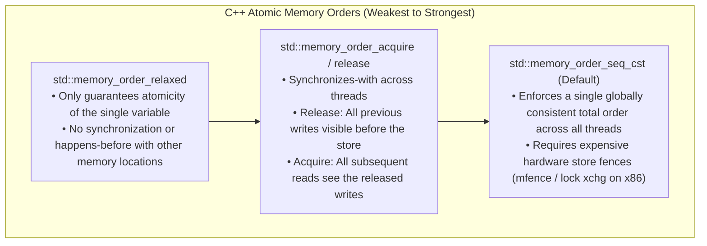
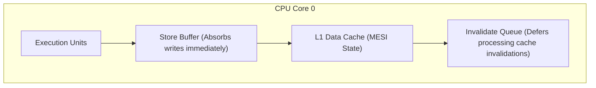

# Memory Models & Hardware Coherence

> [!summary]
> A deep technical breakdown of the papers that define low-level hardware memory ordering: Boehm and Adve's foundation of the modern C++ concurrency memory model, Paul McKenney's guide to CPU store buffers, invalidate queues, and hardware memory barriers, and Wulf & McKee's formulation of the Memory Wall.

---

## 1. Foundations of the C++ Concurrency Memory Model (Boehm & Adve, 2008)

### Why C++ Needed a Memory Model
Prior to C++11, C and C++ were single-threaded languages in the eyes of the ISO standard. Compilers assumed threads did not exist and performed optimizations that broke multi-threaded execution (e.g., hoisting stores out of loops, register caching across thread boundaries, introducing speculative stores).

Hans Boehm and Sarita Adve established the **Sequential Consistency for Data-Race-Free Programs (SC-DRF)** guarantee:
- If a program has no data races (concurrent conflicting accesses to the same memory location where at least one is a write, without synchronization), the execution appears to execute in a simple sequential interleaving of thread actions.



### Acquire-Release Semantics in Low-Latency SPSC Queues
In a Single-Producer Single-Consumer (SPSC) lock-free ring buffer:
```cpp
// Producer thread writes data, then releases the write index:
buffer[tail] = payload;
tail.store(next_tail, std::memory_order_release); // Prevents compiler/hardware from moving buffer writes AFTER tail store

// Consumer thread acquires the tail index, then reads data:
if (tail.load(std::memory_order_acquire) != head) { // Prevents compiler/hardware from reading buffer BEFORE tail check
    Payload data = buffer[head];
}
```

---

## 2. Memory Barriers: A Hardware View for Software Hackers (Paul E. McKenney, 2010)

### Why CPUs Reorder Memory Operations
Modern superscalar out-of-order CPUs (x86, ARM, POWER) include hardware performance buffers that cause apparent reordering:



### Hardware Components Explained:
1. **Store Buffers**:
   - When a core writes to memory, waiting for the cache line to transition to Modified (`M`) state takes 40–80 ns.
   - To avoid stalling, the CPU places the write into a small, ultra-fast **Store Buffer** and continues executing subsequent instructions.
   - **Store Forwarding**: If the local core immediately reads the address it just wrote, it loads it directly from its own store buffer. *However, other CPU cores cannot see the store buffer until it flushes to L1 cache!*
2. **Invalidate Queues**:
   - When a core receives a cache invalidation request from another core, acknowledging it immediately would stall if the local cache is busy.
   - The core places the invalidation into an **Invalidate Queue** and sends an instant acknowledgment. The line is not actually invalidated until the queue is drained.
3. **Hardware Memory Barriers**:
   - **Write Barrier (`smp_wmb()` / `sfence`)**: Flushes the local store buffer before executing subsequent writes.
   - **Read Barrier (`smp_rmb()` / `lfence`)**: Drains the local invalidate queue before executing subsequent reads.
   - **Full Barrier (`smp_mb()` / `mfence`)**: Stalls execution until both store buffers and invalidate queues are completely synchronized.

---

## 3. Hitting the Memory Wall (Wm. A. Wulf & Sally A. McKee, 1995)

### The Exponential Divergence
Wulf and McKee formulated the mathematical relationship between processor speed improvements ($\approx 60–80\%$ annual growth in the 1990s) and DRAM access latency improvements ($\approx 7\%$ annual growth):

$$\text{Latency Gap} = \frac{\text{CPU Clock Frequency}}{\text{DRAM Cycle Latency}} \propto (1.6)^t / (1.07)^t$$

- **The Wall**: As clock speeds increased, every memory reference that missed cache began taking hundreds of clock cycles, shifting the primary bottleneck of systems engineering entirely to **cache residency, memory layout, and prefetching**.

---

## Related Notes
- [[02-Lock-Free-and-Wait-Free-Algorithms|Lock-Free and Wait-Free Algorithms]]
- [[../03-Memory-Architecture-and-Concurrency/Ulrich-Drepper-Memory-Architecture|Ulrich Drepper Memory Architecture]]
- [[../../14-Low-Latency-Systems/08 - Low-Latency Programming/C++ Memory Model and Memory Orders|14-Low-Latency-Systems: C++ Memory Model]]
- [[README|Seminal Low-Latency Systems Papers MOC]]
