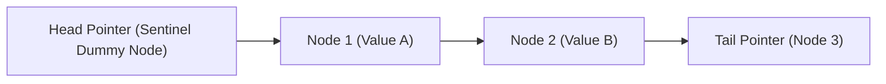
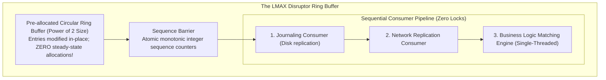

# Lock-Free & Wait-Free Algorithms

> [!summary]
> The canonical papers establishing non-blocking synchronization: Maurice Herlihy's consensus hierarchy and wait-free universal construction, the Michael-Scott non-blocking queue, the Treiber stack, the LMAX Disruptor ring buffer architecture, and Linux kernel Read-Copy Update (RCU).

---

## 1. Wait-Free Synchronization (Maurice Herlihy, 1991)

### Non-Blocking Definitions
Published in *ACM TOPLAS*, Maurice Herlihy established the rigorous definitions that categorize concurrent data structures:

```text
+---------------------+-------------------------------------------------------------+
| Category            | Formal Guarantee                                            |
+---------------------+-------------------------------------------------------------+
| Obstruction-Free    | A thread makes progress if it executes in isolation without |
| (Weakest)           | contention from competing threads.                          |
+---------------------+-------------------------------------------------------------+
| Lock-Free           | At least ONE thread in the system is guaranteed to make     |
| (System Progress)   | progress in a finite number of steps (Starvation possible). |
+---------------------+-------------------------------------------------------------+
| Wait-Free           | EVERY thread is guaranteed to complete its operation in a   |
| (Strongest SLA)     | bounded number of steps, regardless of other threads' speed.|
+---------------------+-------------------------------------------------------------+
```

### The Consensus Hierarchy
Herlihy proved that hardware atomic instructions have different computational power, measured by their **Consensus Number** (the maximum number of threads that can reach consensus using only that primitive and read/write registers):
- **Consensus Number 1**: Atomic read/write registers. Cannot solve consensus even for 2 threads!
- **Consensus Number 2**: `Test-and-Set`, `Fetch-and-Add`, Swap. Can solve consensus for at most 2 threads.
- **Consensus Number $\infty$**: **Compare-and-Swap (CAS)** and **Load-Linked / Store-Conditional (LL/SC)**. Can solve consensus for any arbitrary number of threads!

---

## 2. The Michael-Scott Non-Blocking Queue (Michael & Scott, 1996)

### The Canonical Multi-Producer Multi-Consumer (MPMC) Queue
Maged Michael and Michael Scott designed the standard linked-list lock-free FIFO queue using single-word CAS.



### Key Innovations
1. **Sentinel Dummy Node**: Ensures the queue is never truly empty, decoupling enqueue operations on `Tail` from dequeue operations on `Head`.
2. **Helping Mechanism**: If Thread A attempts an enqueue and notices that `Tail->next != NULL` (because Thread B was preempted midway through an insertion), Thread A **helps** advance `Tail` via CAS before proceeding with its own enqueue!
3. **ABA Problem Mitigation**: Solved using tagged pointers / double-word CAS (`CMPXCHG16B` on x86-64), pairing the 64-bit memory pointer with a 64-bit monotonic sequence counter.

---

## 3. The Treiber Lock-Free Stack (R. Kent Treiber, 1986)

### Implementation
```cpp
template <typename T>
class TreiberStack {
    struct Node {
        T data;
        Node* next;
        Node(T val) : data(val), next(nullptr) {}
    };
    std::atomic<Node*> head{nullptr};

public:
    void push(T val) {
        Node* new_node = new Node(val);
        do {
            new_node->next = head.load(std::memory_order_relaxed);
        } while (!head.compare_exchange_weak(new_node->next, new_node,
                                            std::memory_order_release,
                                            std::memory_order_relaxed));
    }
};
```
- A simple, elegant stack. Susceptible to the **ABA Problem** on `pop()` unless paired with epoch-based reclamation, hazard pointers, or generation counters.

---

## 4. The LMAX Disruptor Architecture (Martin Thompson et al., 2011)

### Mechanical Sympathy in Electronic Trading
Built by LMAX to power a financial exchange processing **6,000,000 orders per second with under 100-nanosecond latency**, Thompson et al. proved that standard queues (`java.util.concurrent.ArrayBlockingQueue`) destroy performance due to **lock contention and cache false sharing**.



### Core Architectural Pillars
1. **Zero Garbage Collection / Allocation**: The ring buffer is pre-allocated with pre-populated event objects at startup. Hot trading loops mutate fields in place.
2. **Cache Line Padding**: Sequence counters are padded with 56 dummy bytes (`long p1, p2, p3, p4, p5, p6, p7`) to ensure they reside alone on their own 64-byte cache line, completely eliminating false sharing.
3. **Power-of-Two Masking**: Calculating slot index uses bitwise AND (`sequence & (capacity - 1)`) instead of slow integer modulo division (`%`), saving 10–20 CPU cycles per event.

---

## 5. Read-Copy Update (RCU) (Paul E. McKenney, 1998)

### Zero-Cost Reads in Operating Systems
RCU is a synchronization mechanism used across thousands of subsystems in the Linux kernel:
- **Readers**: Execute completely lock-free without atomics, memory bus locks, or cache line modifications ($0\text{ ns}$ read overhead!).
- **Writers**: When modifying a data structure, the writer allocates a fresh copy, updates it, and swaps the pointer atomically.
- **Grace Period**: The writer waits until all existing readers have finished their read-side critical sections (a "quiescent state") before freeing the old memory.

---

## Related Notes
- [[01-Memory-Models-and-Hardware-Coherence|Memory Models and Hardware Coherence]]
- [[03-Kernel-Bypass-and-Sub-Microsecond-IO|Kernel-Bypass and Sub-Microsecond I/O]]
- [[../../14-Low-Latency-Systems/08 - Low-Latency Programming/Lock-Free SPSC Ring Buffer Design|14-Low-Latency-Systems: SPSC Ring Buffer]]
- [[../../14-Low-Latency-Systems/09 - Messaging & IPC/The LMAX Disruptor Architecture|14-Low-Latency-Systems: Disruptor Source]]
- [[README|Seminal Low-Latency Systems Papers MOC]]
